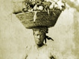

  
[Intangible Textual Heritage](../../index)  [Africa](../index) 
[Index](index)  [Previous](das08)  [Next](das10) 

------------------------------------------------------------------------

  
*Drums and Shadows*, by Georgia Writer's Project, \[1940\], at
Intangible Textual Heritage

------------------------------------------------------------------------

p. 29

# Frogtown and Currytown

Within the western limits of Savannah are Frogtown and Currytown,
through which flows Musgrove Creek, narrow and sluggish, on its way from
"Big Ogeechee" to the red Savannah River. These are two poor
communities, as can be seen from the paintless little houses on dirt
streets that often lack sidewalks. With the canal cutting the center of
the district, there is scant space for gardens; but in spite of this,
there are small patches of earth green with collards and turnips, and
almost every "stoop" is decorated with a row of plants in tins of
assorted dimensions.

During week days, with many persons away at work in other sections of
the city, it is mostly the old who are found at home. Grandmothers and
grandfathers "mind" the small children while the mothers work out.

One old woman, Anna Miller, [1](#fn_30) had
lived most of her youth on a Butler Island plantation, where some of the
older workers had occupied the same cabins given to them before
emancipation.

"Sebral ub dem hans wuz bery ole people," said Anna Miller. "Dey speak a
funny language an none ub duh res ub us couldn hahdly unuhstan a wud dey
say. Dey hab special name fuh all kine uh ting, but duh only ting I kin
membuh is dat dey call a watuh bucket a 'juba haltuh'."

We found here, too, that in certain households certain foods are
considered to bring bad luck.

p. 30

"I dohn eat peanuts," Millie McKen [1](#fn_31)
told us, "an I dohn let a soul in muh fambly eat em."

"Can you tell us why?" we queried, but she only shook her head.

"All I know is dat dey's bad luck. I foun dat out, an I wohn leh one
come in muh house."

Handicraft objects in this section were more numerous than in many of
the other communities. We found a most unusual brush [2](#fn_32) made from the
palmetto. [45a](das26.htm#xref_45a) It was about four inches in length
and two inches wide; both bristles and back had been made from a single
piece of the rough fiber of the palmetto bark, spliced into splinters on
one surface to form the bristles.

The work of two wood carvers was brought to our attention. One of the
carvers [3](#fn_33) made a specialty of small
wooden figures. He showed us several full length human figures, two or
three busts mounted on square blocks of wood, and two oddly shaped
objects, each with mask-like features carved on one
surface. [41i](das26.htm#xref_41i) When we remarked on the originality
of his work and its symmetry of design, he said simply, "I jis picked it
up wen I wuzn wukin."

The other carver [4](#fn_34) had made several
nondescript figures, but we were chiefly interested in two linked wooden
chains. One of these, which had an attached box with a ball enclosed,
was similar to a chain previously shown us by another man in the
community. Each man had cut his chain with all its details from a single
block of wood. [70f](das26.htm#xref_70f),  [70h](das26.htm#xref_70h)

In Frogtown and Currytown there is intense interest shown in witches,
spirits, and conjure. Personal experiences were related to us by several
old residents, who had come in contact with supernatural elements.

Old Henry Gamble [5](#fn_35) told us that he has
been accustomed to "seein tings" since childhood. Particularly on rainy
nights ghosts appear to him. He said, "Sometimes dey float right at muh
side. [59](das26.htm#xref_59) Ise use tuh um now an it's jis lak natchul
people

p. 31

tuh me. Yuh kin skeah witches an ghos ef yuh make a cross mahk. Dis will
stop um frum followin yuh."

Seventy-five year old Henry Bates [1](#fn_36)
readily acknowledged a belief in the supernatural. "I done seen all kine
ub strange ting happen in muh lifetime. Yuh wahn me tuh tell yuh bout
some uh dem ting, missus?

"One night I finished eatin dinnuh. Den I walk tuh duh kitchen doe. I
see a strange man comin down duh road; he wuz twenty yahds away. I tun
muh head tuh look in duh house an wen uh look back he done disappeahed.
I know he mustuh been a ghos. [59](das26.htm#xref_59)

"Anudduh time I heah a knock on duh doe. I heah it tree times. Bam! Bam!
Bam! Wen muh dog heah dat knock, he holluh lak he wuz sked tuh det. I
git up an go tuh duh doe an muh haiah riz up on muh head. Wen uh gits
tuh duh doe, uh see sumpm as big as a cow, only it look lak a
dog. [54](das26.htm#xref_54) Den it vanish lak a shadduh.

"One night muh wife an me git ready tuh go tuh bed. We fasten duh doe an
winduh. Attuh a time we heah a noise. Den we heah a click. Duh winduh
come open jis lak somebody open it. I strike a match an uh see a big
yulluh cat walkin long side duh bed. It hab a face jis lak a pusson. It
go right out duh winduh.

"I fine out latuh dat duh cat wuz a witch. [68](das26.htm#xref_68)
Witches is jis livin people wut bin sole tuh duh debil. Lots uh nights I
kin feel em ridin me. Jis duh udduh day I wuz sittin in a cheah an I
dozed off tuh sleep. All at once a hag jump on me an staht ridin
me. [69](das26.htm#xref_69)

"Wen I wuz a boy I heah lots uh stories bout people flyin. Some folks
brung obuh frum Africa could fly off aw disappeah anytime dey wanted
tuh. I alluz belieb dat story. I know folks right now dat kin make duh
spirits uh dead people come back. [56](das26.htm#xref_56)

"Wen I wuz jis growin up I knowd a boy dat hab a strange powuh. Eben ef
he wuzn wid duh udduh boys he could tell each one wut he bin
doin. [22a](das26.htm#xref_22a),  [22e](das26.htm#xref_22e) One day
attuh we grown up he say dat he could bring back folks dat hab lef town
an gone away.

p. 32

"Now deah wuz a uhmun whose huzbun hab lef uh. Dis uhmun wuz jis frettin
uhsef tuh det. Muh frien go tuh uh an say 'I will cause yuh huzbun tuh
come back tuh yuh. I will chahge yuh ten dolluhs. Yuh needn pay me till
he come back but ef yuh dohn pay me den, he wohn stay.'

"In a week's time duh uhmun's huzbun wuz back. He stay home till he die.
Duh uhmun pay muh frien in piece payments till she pay im duh ten
dolluhs."

Living in a dirt lane on the fringe of Currytown is Chloe West [1](#fn_37) who was born at White Bluff and cannot
remember her exact age. She told us that she frequently sees
ghosts [59](das26.htm#xref_59) and that a spirit warns her when anything
out of the ordinary is about to happen. [22a](das26.htm#xref_22a),
 [22e](das26.htm#xref_22e)

"One time I wuz; bodduhed by duh folks nex doe wut wuz tryin tuh cunjuh
me. Somebody tell me tuh git some hot watuh an tro it wen I heah duh
noise. Jis as I git duh watuh hot, duh spirit ub a wite uhmun I use tuh
wuk fuh peahed an tell me tuh pray an duh witches would go way. Attuh
she spoke, duh witches went out an nebuh did bodduh me since. Duh
witches wuz two men. One ub um went crazy an duh poeleece foun duh udduh
one out in duh woods. He died in duh po house.

"One night I heah a noise at muh winduh. A voice say, 'Chloe, dohn go
neah duh winduh.' I stop a minute, den uh go tuh duh winduh. Some kine
uh powduh wuz trone in muh face dat bline me. [8b](das26.htm#xref_8b)
Den duh voice tell me tuh wash muh face quick in karisene. I do dat an
duh blineness leab me.

"Anudduh time duh uhmun wut lib nex doe want me tuh moob an she git a
cunjuh bag an bury it unduh muh step.", Duh spirit wahn me agen an tell
me a man would fine duh cunjuh fuh me. Duh nex day Doctuh Johnson, a
root man, [48](das26.htm#xref_48) come by. He say sumpm wuz laid down
fuh me an he would take it up fuh fifty cent. I paid him duh money. He
come back dat night, dig unduh muh steps, an take out a bunl. It hab
some dut an some haiah [10](das26.htm#xref_10) an sulphuh in it. Doctuh
Johnson say it wuz grabe yahd dut. [9](das26.htm#xref_9) Bin a long time
since I bin bodduhed but uh sho belieb in all dem tings.

p. 33

"Duh fus time I ebuh see ghos wuz long yeahs back. Once wen I wuz young
an receivin compny, deah wuz two men comin tuh see me. I lak one man duh
bes an duh udduh man wuz jealous. Well, duh jealous man die. Aftuh dat
many a time uh see a shadduh lak him come right up tuh muh doe an
disappeah. One night be come, stretch he ahm cross duh doe, an say jis
as plain as anyting in a big loud voice, 'Is dat udduh man still comin
roun yuh?' I wuz sked stiff."

D. C. Kelsey, [1](#fn_38) who has been blind for
six years, told us that conjure had caused the loss of his sight.

"An I ain had duh money tuh git nobody tuh tun dis ting back on duh one
dat put it on me," he complained.

He looked pleased when a piece of money was placed in his hand. When we
asked why he blew on the coin, he smiled slowly. "Dat make mo luck.
It'll hep me tuh git mo. Yuh know, a root man, he wohn take money out
yuh ban. He tell yuh tuh put it on duh table aw duh shef."

We encouraged him to continue on the subject of root men.

"Dey kin fix yuh wid mos anyting," Kelsey said. "Duh chinch bug is use a
lot an Ise sked ub em. I wouldn put muh han on dem ting fuh ten dolluhs.
I hab a sistuh name Ida Walker wut wuz fix wid candy. She ate duh candy
an den uh ahm swell up an tun blue. Yuh could see lill animals runnin up
an down uh ahm. She got a root doctuh name Sherman. Soons he look at it,
he know wut it wuz. He come Toosday an he gie uh a rub tuh use, and he
say tuh rub down an he would come back Friday. Wen he come, duh tings
all done come intuh duh finguhs. He tuk a basin wid some wome watuh, an
he put muh sistuh han in it. Den he ketch hol uh duh han an duh tings
run out in duh watuh. Dey wuz puppy dogs,

"He ax uh did she want em tuh go back weah dey come frum, an she say
yes. So he say he know duh man wut sen em, an he went tuh duh winduh an
tro duh watuh wid duh puppy dogs in it in duh direction uh duh man house
an say, 'Go.' One week latuh duh man wuz in he fiel ploughin an he

p. 34

drop duh. plough an fall down. Wen duh. people git tuh im, all he could
say wuz, 'Dis is my wuk. Dis is my wuk.' He went plumb crazy an died,
but muh sistuh got well an fine. She lib neah Millen now."

------------------------------------------------------------------------

### Footnotes

[29:1](das09.htm#fr_30) Anna Miller, 1018 Cuyler
Street, Currytown.

[30:1](das09.htm#fr_31) Millie McKen, 409 West
Duffy Street, Currytown.

[30:2](das09.htm#fr_32) Made by and property of
Professor Redmond, Park Avenue and West Broad Street, Currytown.

[30:3](das09.htm#fr_33) Jerome Carter, 445
Jefferson Street, Frogtown.

[30:4](das09.htm#fr_34) Preston Coleman, 532
Charles Street, Frogtown.

[30:5](das09.htm#fr_35) Henry Gamble, 519 West
Broad Street, Currytown.

[31:1](das09.htm#fr_36) Henry Bates, 1118 West
Waldbury Street, Currytown.

[32:1](das09.htm#fr_37) Chloe West, 623 West
Waldburg Lane.

[33:1](das09.htm#fr_38) D. C. Kelsey, 521 West
Gaston Street, Frogtown.

------------------------------------------------------------------------

[Next: Springfield](das10)

