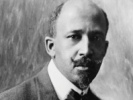

  
[Intangible Textual Heritage](../../index)  [Africa](../index) 
[Index](index)  [Previous](dbn13)  [Next](dbn15) 

------------------------------------------------------------------------

[Buy this Book at
Amazon.com](https://www.amazon.com/exec/obidos/ASIN/0486414434/internetsacredte)

------------------------------------------------------------------------

  
*The Negro*, by W.E.B. Du Bois, \[1915\], at Intangible Textual Heritage

------------------------------------------------------------------------

p. 139

# XII    THE NEGRO PROBLEMS

It is impossible to separate the population of the world accurately by
race, since that is no scientific criterion by which to divide races. If
we divide the world, however, roughly into African Negroes and Negroids,
European whites, and Asiatic and American brown and yellow peoples, we
have approximately 150,000,000 Negroes, 500,000,000 whites, and
900,000,000 yellow and brown peoples. Of the 150,000,000 Negroes,
121,000,000 live in Africa, 27,000,000 [1](#fn_109) in the new world, and 2,000,000 in Asia.

What is to be the future relation of the Negro race to the rest of the
world? The visitor from Altruria might see here no peculiar problem. He
would expect the Negro race to develop along the lines of other human
races. In Africa his economic and political development would restore
and eventually outrun the ancient glories of Egypt, Ethiopia, and
Yoruba; overseas the West Indies would become a new and nobler Africa,
built in the very pathway of the new highway of commerce between East
and West-the real sea route to India; while in the United States a large
part of its citizenship (showing for perhaps centuries their dark
descent, but nevertheless equal sharers of and contributors to the
civilization of the West) would be the descendants of the wretched
victims of the seventeenth, eighteenth, and nineteenth century slave
trade.

This natural assumption of a stranger finds, however, lodging in the
minds of few present-day thinkers. On the contrary, such an outcome is
usually dismissed summarily. Most persons have accepted that tacit but
clear modern philosophy which assigns to the white race alone the
hegemony of the world and assumes that other races, and particularly the
Negro race, will either be content to serve the

p. 140

interests of the whites or die out before their all-conquering march.
This philosophy is the child of the African slave trade and of the
expansion of Europe during the nineteenth century.

The Negro slave trade was the first step in modern world commerce,
followed by the modern theory of colonial expansion. Slaves as an
article of commerce were shipped as long as the traffic paid. When the
Americas had enough black laborers for their immediate demand, the moral
action of the eighteenth century had a chance to make its faint voice
heard.

The moral repugnance was powerfully reënforced by the revolt of the
slaves in the West Indies and South America, and by the fact that North
America early began to regard itself as the seat of advanced ideas in
politics, religion, and humanity.

Finally European capital began to find better investments than slave
shipping and flew to them. These better investments were the fruit of
the new industrial revolution of the nineteenth century, with its
factory system; they were also in part the result of the cheapened price
of gold and silver, brought about by slavery and the slave trade to the
new world. Commodities other than gold, and commodities capable of
manufacture and exploitation in Europe out of materials furnishable by
America, became enhanced in value; the bottom fell out of the commercial
slave trade and its suppression became possible.

The middle of the nineteenth century saw the beginning of the rise of
the modern working class. By means of political power the laborers
slowly but surely began to demand a larger share in the profiting
industry. In the United States their demand bade fair to be halted by
the competition of slave labor. The labor vote, therefore, first
confined slavery to limits in which it could not live, and when the
slave power sought to exceed these territorial limits, it was suddenly
and unintentionally abolished.

As the emancipation of millions of dark workers took place in the West
Indies, North and South America, and parts of Africa at this time, it
was natural to assume that the uplift of this working class lay along
the same paths with that of European and American whites. This was the
*first* suggested solution of the Negro problem. Consequently these
Negroes received partial enfranchisement, the beginnings of education,
and some of the elementary rights of wage earners and property holders,
while the independence of Liberia and Hayti was recognized. However,
long before they were strong

p. 141

enough to assert the rights thus granted or to gather intelligence
enough for proper group leadership, the new colonialism of the later
nineteenth and twentieth centuries began to dawn. The new colonial
theory transferred the reign of commercial privilege and extraordinary
profit from the exploitation of the European working class to the
exploitation of backward races under the political domination of Europe.
For the purpose of carrying out this idea the European and white
American working class was practically invited to share in this new
exploitation, and particularly were flattered by popular appeals to
their inherent superiority to "Dagoes," "Chinks," "Japs," and "Niggers."

This tendency was strengthened by the fact that the new colonial
expansion centered in Africa. Thus in 1875 something less than one-tenth
of Africa was under nominal European control, but the Franco-Prussian
War and the exploration of the Congo led to new and fateful things.
Germany desired economic expansion and, being shut out from America by
the Monroe Doctrine, turned to Africa. France, humiliated in war,
dreamed of an African empire from the Atlantic to the Red Sea. Italy
became ambitious for Tripoli and Abyssinia. Great Britain began to take
new interest in her African realm, but found herself largely checkmated
by the jealousy of all Europe. Portugal sought to make good her ancient
claim to the larger part of the whole southern peninsula. It was Leopold
of Belgium who started to make the exploration and civilization of
Africa an international movement. This project failed, and the Congo
Free State became in time simply a Belgian colony. While the project was
under discussion, the international scramble for Africa began. As a
result the Berlin Conference and subsequent wars and treaties gave Great
Britain control of 2,101,411 square miles of African territory, in
addition to Egypt and the Egyptian Sudan with 1,600,000 square miles.
This includes South Africa, Bechuanaland and Rhodesia, East Africa,
Uganda and Zanzibar, Nigeria, and British West Africa. The French hold
4,106,950 square miles, including nearly all North Africa (except
Tripoli) west of the Niger valley and Libyan Desert, and touching the
Atlantic at four points. To this is added the Island of Madagascar. The
Germans have 910,150 square [miles](errata.htm#2), principally in
Southeast and South-west Africa and the Kamerun. The Portuguese retain
787,500 square miles in Southeast and Southwest Africa. The Belgians
have 900,000 square miles, while Liberia (43,000 square miles) and
Abyssinia (350,000 square

p. 142

miles) are independent. The Italians have about 600,000 square miles and
the Spanish less than 100,000 square miles.

This partition of Africa brought revision of the ideas of Negro uplift.
Why was it necessary, the European investors argued, to push a continent
of black workers along the paths of social uplift by education,
trades-unionism, property holding, and the electoral franchise when the
workers desired no change, and the rate of European profit would suffer?

There quickly arose then the *second* suggestion for settling the Negro
problem. It called for the virtual enslavement of natives in certain
industries, as rubber and ivory collecting in the Belgian Congo, cocoa
raising in Portuguese Angola, and diamond mining in South Africa. This
new slavery or "forced" labor was stoutly defended as a necessary
foundation for implanting modern industry in a barbarous land; but its
likeness to slavery was too clear and it has been modified, but not
wholly abolished.

The *third* attempted solution of the Negro sought the result of the
second by less direct methods. Negroes in Africa, the West Indies, and
America were to be forced to work by land monopoly, taxation, and little
or no education. In this way a docile industrial class working for low
wages, and not intelligent enough to unite in labor unions, was to be
developed. The peonage systems in parts of the United States and the
labor systems of many of the African colonies of Great Britain an
Germany illustrate this phase of solution. [1](#fn_110) It is also illustrated in many of the
West Indian islands where we have a predominant Negro population, and
this population freed from slavery and partially enfranchised. Land and
capital, however, have for the most part been so managed and monopolized
that the black peasantry have been reduced to straits to earn a living
in one of the richest parts of the world. The problem is now going to be
intensified when the world's commerce begins to sweep through the Panama
Canal.

All these solutions and methods, however, run directly counter to modern
philanthropy, and have to be carried on with a certain concealment

p. 143

and half-hypocrisy which is not only distasteful in itself, but always
liable to be discovered and exposed by some liberal or religious
movement of the masses of men and suddenly overthrown. These solutions
are, therefore, gradually merging into a fourth solution, which is
to-day very popular. This solution says: Negroes differ from whites in
their inherent genius and stage of development. Their development must
not, therefore, be sought along European lines, but along their own
native lines. Consequently the effort is made to-day in British Nigeria,
in the French Congo and Sudan, in Uganda and Rhodesia to leave so far as
possible the outward structure of native life intact; the king or chief
reigns, the popular assemblies meet and act, the native courts
adjudicate, and native social and family life and religion prevail. All
this, however, is subject to the veto and command of a European
magistracy supported by a native army with European officers. The
advantage of this method is that on its face it carries no clue to its
real working. Indeed it can always point to certain undoubted
advantages: the abolition of the slave trade, the suppression of war and
feud, the encouragement of peaceful industry. On the other hand, back of
practically all these experiments stands the economic motive--the
determination to use the organization, the land, and the people, not for
their own benefit, but for the benefit of white Europe. For this reason
education is seldom encouraged, Modern religious ideas are carefully
limited, sound political development is sternly frowned upon, and
industry is degraded and changed to the demands of European markets. The
most ruthless class of white mercantile exploiters is allowed large
liberty, if not a free hand, and protected by a concerted attempt to
deify white men as such in the eyes of the native and in their own
imagination. [1](#fn_111)

White missionary societies are spending perhaps as much as five million
dollars a year in Africa and accomplishing much good, but at the same
time white merchants are sending at least twenty million dollars' worth
of European liquor into Africa each year, and the debauchery of the
almost unrestricted rum traffic goes far to neutralize missionary
effort.

Under this last mentioned solution of the Negro problems we

p. 144

 

  [  
Click to enlarge](img/14400.jpg)  
Distribution of Negro Blood, Ancient and Modern  

 

p. 145

may put the attempts at the segregation of Negroes and mulattoes in the
United States and to some extent in the West Indies. Ostensibly this is
"separation" of the races in society, civil rights, etc. In practice it
is the subordination of colored people of all grades under white
tutelage, and their separation as far as possible from contact with
civilization in dwelling place, in education, and in public life.

On the other hand the economic significance of the Negro to-day is
tremendous. Black Africa to-day exports annually nearly two hundred
million dollars' worth of goods, and its economic development has
scarcely begun. The black West Indies export nearly one hundred million
dollars' worth of goods; to this must be added the labor value of
Negroes in South Africa, Egypt, the West Indies, North, Central, and
South America, where the result is blended in the common output of many
races. The economic foundation of the Negro problem can easily be seen
to be a matter of many hundreds of millions to-day, and ready to rise to
the billions tomorrow.

Such figures and facts give some slight idea of the economic meaning of
the Negro to-day as a worker and industrial factor. "Tropical Africa and
its peoples are being brought more irrevocably every year into the
vortex of the economic influences that sway the western world." [1](#fn_112)

What do Negroes themselves think of these their problems and the
attitude of the world toward them? First and most significant, they are
thinking. There is as yet no great single centralizing of thought or
unification of opinion, but there are centers which are growing larger
and larger and touching edges. The most significant centers of this new
thinking are, perhaps naturally, outside Africa and in America: in the
United States and in the West Indies; this is followed by South Africa
and West Africa and then, more vaguely, by South America, with faint
beginnings in East Central Africa, Nigeria, and the Sudan.

The Pan-African movement when it comes will not, however, be merely a
narrow racial propaganda. Already the more far-seeing Negroes sense the
coming unities: a unity of the working classes everywhere, a unity of
the colored races, a new unity of men. The proposed economic solution of
the Negro problem in Africa and America has turned the thoughts of
Negroes toward a realization of the fact that the modern white laborer
of Europe and America has

p. 146

the key to the serfdom of black folk, in his support of militarism and
colonial expansion. He is beginning to say to these workingmen that, so
long as black laborers are slaves, white laborers cannot be free.
Already there are signs in South Africa and the United States of the
beginning of understanding between the two classes.

In a conscious sense of unity among colored races there is to-day only a
growing interest. There is slowly arising not only a curiously strong
brotherhood of Negro blood throughout the world, but the common cause of
the darker races against the intolerable assumptions and insults of
Europeans has already found expression. Most men in this world are
colored. A belief in humanity means a belief in colored men. The future
world will, in all reasonable probability, be what colored men make it.
In order for this colored world to come into its heritage, must the
earth again be drenched in the blood of fighting, snarling human beasts,
or will Reason and Good Will prevail? That such may be true, the
character of the Negro race is the best and greatest hope; for in its
normal condition it is at once the strongest and gentlest of the races
of men: "Semper novi quid ex Africa!"

------------------------------------------------------------------------

### Footnotes

[139:1](dbn14.htm#fr_109) Sir Harry Johnston
estimates 135,000,000 Negroes, of whom 24,591,000 live in America. See
*Inter-Racial Problems*, p. 335.

[142:1](dbn14.htm#fr_110) The South African
natives, in an appeal to the English Parliament, show in an astonishing
way the confiscation o their land by the English. They say that in the
Union of South Africa 1,250,000 whites own 264,000,000 acres of land,
while the 4,500,000 natives have only 21,000,000 acres. On top of this
the Union Parliament has passed a law making even the future purchase of
land by Negroes illegal save in restricted areas!

[143:1](dbn14.htm#fr_111) The traveler Glave
writes in the *Century Magazine* (LIII, 913): "Formerly \[in the Congo
Free State\] an ordinary white man was merely called 'bwana' or
'Mzunga'; now the merest insect of a pale face earns the tide of 'bwana
Mkubwa' \[big master\]."

[145:1](dbn14.htm#fr_112) E. D. Morel, in the
*Nineteenth Century*.

------------------------------------------------------------------------

[Next: Suggestions For Further Reading](dbn15)

