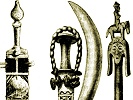

  
[Intangible Textual Heritage](../../index)  [Africa](../index) 
[Index](index)  [Previous](fjo48) 

------------------------------------------------------------------------

[Buy this Book on
Kindle](https://www.amazon.com/exec/obidos/ASIN/B003C1R142/internetsacredte)

------------------------------------------------------------------------

  
*Notes on the Folklore of the Fjort*, by Richard Edward Dennett,
\[1898\], at Intangible Textual Heritage

------------------------------------------------------------------------

# THE SONG OF HUNGER.

1\. Xissanga e Buali bi koka mti  
2. Muanyali ba nlainbili xikamvu  
3. Xinkatu nkatu manyouga  
4. Lembe li Ngongo ngeia tubanga  
5. Tubanga minu i lembo  
6. Xilunga o Quillo bi koka mti  
7. Xilunga uaka xi nanu  
8. Nzala nguli yalla tanta  
9. Ndevo nkunda mbongo  
10. Bemvena madungo masina mbinda  
11. Zimvula zi Maloango ziaku zimani  
12. Xilumbu mfuafua minu kuxibota.

1\. *Xissanga*, a province of Loango; *e*, and; *Buali*, another
province of Loango; *bi*, they; *koka*, drag; *mti*, a tree.

Explanation.-In these provinces the people are dying of hunger, and are
therefore making new farms in the Fjort way, clearing forest and
dragging about the trees as a sort of rough ploughing.

2 & 3. *Muanyali*, proper name meaning the first stage of pregnancy; *ba
nlainbili*, cooked; *xikamvu*, large basket used for carrying food;
*Xinkatu*, mat on which food is served; *nkatu*, mat; *manyonga*, to
feel bitterly in one's heart.

Muanyali gets a large basket and a mat of the large kind, and cooked
food, and is angry that the basket and the mat are all right, the food
is properly cooked, but there is not enough. This is a common African
way of indirectly saying disagreeable things or telling you what they
dislike in a thing. "This is right," they say," and that is right; " and
they expect you to know what is wantiug. It is as if they set you a
subtraction sum: given the total, you deduct what is praised, and the
difference is what is disliked. If you don't arrive at it, you are a
fool, and it is no use talking to you.

4 & 5. *Lembe* (the name given to a wife married according to the rites
of Lemba, *i.e.*, the wife, properly so called, who binds herself not to
survive her husband), the wife of Muanyali; *li ngongo* (a large
fisli-eating bird-a pelican), proper name, *ngeia*, thou; *tubanga*,
talk; *minu*, I; *lembo*, cease.

Muanyali's wife, Lembo, asks her father, Mr. Pelican, to explain to her
husband why she has not been able to send him more food. She says to her
father: "You talk to him about it; I cease from telling him." That is,
it is no good my telling him, he thinks I could send more if I chose.
Then off goes Pelican to his son-in-law, and says:

6 & 7. *Xilunya e Quillo bi koka mti*, Xilunga and Quillo are dying of
hunger (details explained above); *Xilunga*, a province of Loango;
*uaka*, now; *xi nanu*, is far away.

I think this means: "We who live in Quillo (a province of Loango) can
get nothing, even if we go to Xilunga, because that is famine-stricken
too." I know, *xi nanu*, far away, is often used as a description of a
place not worth going to.

8\. *Nzala*, through; *nguli*, mother; *yalla*, hunger; *tanta*, pain.

"The thought of the hungered mother pains them." Pelican throws this
observation in, meaning Xilunga and Quillo grieve for their hungering
mothers.

9\. *Ndevo*, beard; *nkunda*, elephant's tail; *mbongo*, money.

I think Pelican throws out a suggestion that a man named Ndevo nkunda is
a rich man, and should be asked for aid; "money," of course, not being
necessarily coin, but possibly in this case food.

10\. *Bemvena*, efficiunt; *madungo*, testiculos tumefactos; *masina*,
fundum; *mbinda*, cucurbitæ.

Mulieres viros ita elephantiasi afficiunt, ut testiculi ventri cucurbitæ
similes fiunt. (A statement not made in the interest of medical
knowledge, but connected in the Affican mind with the rainfall, and
having a definite bearing on what falls.) Pelican is still speaking.

11\. *Zimvula*, rain; *zi Maloango*, as in the days of Maloango;
*ziaku*, they; *zimani*, are finished.

"Now we no longer get the rains we had in the days of Maloango."

12\. *Xilumbu*, day; *mafuafua*; die; *minu*, I; *kuxi bota*, to be
well.

"I shall be well cared for the day I die;" I shall be well buried. That
is, I wish I were dead. This is the final lament of poor Pelican.
