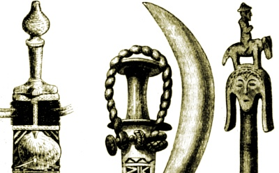

  
[Intangible Textual Heritage](../../index)  [Africa](../index) 

------------------------------------------------------------------------

[Buy this Book on
Kindle](https://www.amazon.com/exec/obidos/ASIN/B003C1R142/internetsacredte)

------------------------------------------------------------------------

<table width="75%">
<colgroup>
<col style="width: 50%" />
<col style="width: 50%" />
</colgroup>
<tbody>
<tr class="odd">
<td width="50%" data-valign="TOP"></td>
<td width="50%" data-valign="CENTER"><h1 id="notes-on-the-folklore-of-the-fjort" data-align="CENTER">Notes on the Folklore of the Fjort</h1>
<h3 id="by-richard-edward-dennett" data-align="CENTER">by Richard Edward Dennett,</h3>
<h4 id="section" data-align="CENTER">[1898]</h4></td>
</tr>
</tbody>
</table>

------------------------------------------------------------------------

[Contents](#contents)    [Start Reading](fjo00)    [Text
\[Zipped\]](fjo.txt.gz)

------------------------------------------------------------------------

Richard Edward Dennett was an English trader who worked out of what is
today the Republic of the Congo in West Africa. He wrote extensively on
the anthropology of the West Africans, including this book which
recounts the folklore, particularly as it pertains to animals, of the
region. This is a key source for West African folklore and story
telling.

------------------------------------------------------------------------

 [Title Page](fjo00)  
[Preface.](fjo01)  
[Contents](fjo02)  
[Introduction](fjo03)  
[I. The Folklore Of The Fjort.](fjo04)  
[II. How A Native Story Is Told.](fjo05)  
[III. How The Wives Restored Their Husband To Life.](fjo06)  
[IV. How Nsassi (Gazelle) Got Married.](fjo07)  
[V. The Vanishing Wife.](fjo08)  
[VI. Another Vanishing Wife.](fjo09)  
[VII. The Jealous Wife.](fjo10)  
[VIII. Ngomba's Balloon.](fjo11)  
[IX. The Wicked Husband.](fjo12)  
[X. The Wonderful Child.](fjo13)  
[XI. How Kengi Lost Her Child.](fjo14)  
[XII. The Twin Brothers.](fjo15)  
[XIII. The Younger Brother Who Knew More Than The Elder.](fjo16)  
[XIV. The Chimpanzee And Gorilla.](fjo17)  
[XV. The Antelope And The Leopard.](fjo18)  
[XVI. How The Spider Won And Lost Nzambi's Daughter.](fjo19)  
[XVII. The Turtle And The Man.](fjo20)  
[XVIII. Killing A Leopard.](fjo21)  
[XIX. The Gazelle And The Leopard.](fjo22)  
[XX. The Wild Cat And The Gazelle.](fjo23)  
[XXI. The Crafty Woman Overreaches Herself.](fjo24)  
[XXII. How The Fetish Sunga Punished My Great-Uncle's Twin Brother,
Basa.](fjo25)  
[XXIII. The Rabbit And The Antelope.](fjo26)  
[XXIV. The Fight Between The Two Fetishes, Lifuma And
Chimpukela.](fjo27)  
[XXV. The Fetish Of Chilunga.](fjo28)  
[XXVI. The Leopard And The Crocodile.](fjo29)  
[XXVII. Why Some Men Are White And Others Black.](fjo30)  
[XXVIII. The Bird-Messengers.](fjo31)  
[XXIX. Nzambi Mpungu's Ambassador.](fjo32)  
[XXX. Why The Crocodile Does Not Eat The Hen.](fjo33)  
[XXXI. The Three Brothers.](fjo34)  
[XXXII. Death And Burial Of The Fjort.](fjo35)  
[APPENDIX I: Nzambi.](fjo36)  
[About Nzambi.](fjo37)  
[Nzambi's Daughter And Her Slave.](fjo38)  
[Nkissism.](fjo39)  
[Nkissinsi.](fjo40)  
[Palavers.](fjo41)  
[The Story Of A Partnership.](fjo42)  
[The Danger In Words.](fjo43)  
[Appendix II: Fjort Songs.](fjo44)  
[The Song Of Life.](fjo45)  
[Song Of The Burial Of The Fjort Prince.](fjo46)  
[The Song Of The Snake.](fjo47)  
[The Song Of Loango Women.](fjo48)  
[The Song Of Hunger.](fjo49)  
