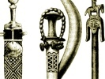

  
[Intangible Textual Heritage](../../index)  [Africa](../index) 
[Index](index)  [Previous](fsn33)  [Next](fsn35) 

------------------------------------------------------------------------

[Buy this Book on
Kindle](https://www.amazon.com/exec/obidos/ASIN/B003C1R0HU/internetsacredte)

------------------------------------------------------------------------

  
*Folk Stories From Southern Nigeria*, by Elphinstone Dayrell, \[1910\],
at Intangible Textual Heritage

------------------------------------------------------------------------

# XXXII. The Lucky Fisherman

IN the olden days there were no hooks or casting nets, so that when the
natives wanted to catch fish they made baskets and set traps at the
river side.

One man named Akon Obo, who was very poor, began to make baskets and
traps out of bamboo palm, and then when the river went down he used to
take his traps to a pool and set them baited with palm-nuts. In the
night the big fish used to smell the palm-nuts and go into the trap,
when at once the door would fall down, and in the morning Akon Obo would
go and take the fish out. He was very successful in his fishing, and
used to sell the fish in the market for plenty of money. When he could
afford to pay the dowry he married a woman named Eyong, a native of
Okuni, and had three children by her, but he still continued his
fishing. The eldest son was called Odey, the second Yambi, and the third
Atuk. These three boys, when they grew up, helped their father with his
fishing, and he gradually became wealthy and bought plenty of slaves. At
last he joined the Egbo society, and became one of the chiefs of the
town. Even after he became a chief, he and his sons still continued to
fish.

One day, when he was crossing the river in a small dug-out canoe, a
tornado came on very suddenly and the canoe capsized, drowning the
chief, When his sons heard of the death of their father, they wanted to
go and drown themselves also, but they were persuaded not to by the
people. After searching for two days, they found the dead body some
distance down the river, and brought it back to the town. They then
called their company together to play, dance, and sing for twelve days,
in accordance with their native custom, and much palm wine was drunk.

When the play was finished, they took their father's body to a
hollowed-out cavern, and placed two live slaves with it, one holding a
native lamp of palm-oil, and the other holding a matchet. They were both
tied up, so that they could not escape, and were left there to keep
watch over the dead chief, until they died of starvation.

When the cave was covered in, the sons called the chiefs together, and
they played Egbo\[1\] for seven days, which used up a lot of their late
father's money. When the play was over, the chiefs were surprised at the
amount of money which the sons had been able to spend on the funeral of
their father, as they knew how poor he had been as a young man. They
therefore called him the lucky fisherman.

\[1. The Egbo society would meet together and would be provided with
palm wine and food, as much as they could eat and drink, which
frequently cost a lot of money. Dancing and singing would also be kept
up and a band would play, consisting of drums made of hollowed-out
trunks of trees, beaten with two pieces of soft wood, native made bells
and rattles made of basket work, with stones inside, the bottom
consisting of hard dried skin, and covered all over with long streamers
of fibre. Other drums are also played by hand; these are made out of
hollow wood, covered at one end with dried skin, the other end being
left open. The drummer usually sits on two of these drums, which have a
different note, one being a deep sound, and the other slightly higher.\]

 

------------------------------------------------------------------------

[Next: XXXIII. The Orphan Boy and the Magic Stone](fsn35)

