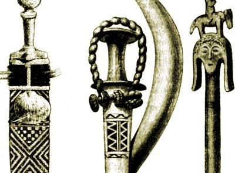

  
[Intangible Textual Heritage](../../index)  [Africa](../index) 

------------------------------------------------------------------------

[Buy this Book on
Kindle](https://www.amazon.com/exec/obidos/ASIN/B003C1R0HU/internetsacredte)

------------------------------------------------------------------------

<table width="75%">
<colgroup>
<col style="width: 50%" />
<col style="width: 50%" />
</colgroup>
<tbody>
<tr class="odd">
<td width="50%" data-valign="TOP"></td>
<td width="50%" data-valign="CENTER">Folk Stories From Southern Nigeria
<h2 id="by-elphinstone-dayrell" data-align="CENTER">by Elphinstone Dayrell</h2>
<h5 id="with-an-introduction-by-andrew-lang" data-align="CENTER">With an Introduction by Andrew Lang</h5>

[1910]
</td>
</tr>
</tbody>
</table>

------------------------------------------------------------------------

[Contents](#contents)    [Start Reading](fsn00)    [Text
\[Zipped\]](fsn.txt.gz)

------------------------------------------------------------------------

This is one of the important collections of African folklore published
under the Andrew Lang imprint. The tales, replete with African wisdom
stories and animal fables is one of the best.--J.B. Hare

------------------------------------------------------------------------

[Title Page](fsn00)  
[Contents](fsn01)  
[Introduction](fsn02)  
[I. The Tortise with a Pretty Daughter](fsn03)  
[II. How a Hunter obtained Money from his Friends the Leopard, Goat,
Bush Cat, and Cock, and how he got out of repaying them](fsn04)  
[III. The Woman with Two Skins](fsn05)  
[IV. The King's Magic Drum](fsn06)  
[V. Ituen and the King's Wife](fsn07)  
[VI. Of the Pretty Stranger who Killed the King](fsn08)  
[VII. Why the Bat flies by Night](fsn09)  
[VIII. The Disobedient Daughter who Married a Skull](fsn10)  
[IX. The King who Married the Cock's Daughter](fsn11)  
[X. The Woman, the Ape, and the Child](fsn12)  
[XI. The Fish and the Leopard's Wife; or, Why the Fish lives in the
Water](fsn13)  
[XII. Why the Bat is Ashamed to be seen in the Daytime](fsn14)  
[XIII. Why the Worms Live Underneath the Ground](fsn15)  
[XIV. The Elephant and the Tortoise; or, Why the Worms are Blind and why
the Elephant has Small Eyes](fsn16)  
[XV. Why a Hawk kills Chickens](fsn17)  
[XVI. Why the Sun and the Moon live in the Sky](fsn18)  
[XVII. Why the Flies Bother the Cows](fsn19)  
[XVIII. Why the Cat kills Rats](fsn20)  
[XIX. The Story of the Lightning and the Thunder](fsn21)  
[XX. Why the Bush Cow and the Elephant are bad Friends](fsn22)  
[XXI. The Cock who caused a Fight between two Towns](fsn23)  
[XXII. The Affair of the Hippopotamus and the Tortoise; or, Why the
Hippopotamus lives in the Water](fsn24)  
[XXIII. Why Dead People are Buried](fsn25)  
[XXIV. Of the Fat Woman who Melted Away](fsn26)  
[XXV. Concerning the Leopard, the Squirrel, and the Tortoise](fsn27)  
[XXVI. Why the Moon Waxes and Wanes](fsn28)  
[XXVII. The Story of the Leopard, the Tortoise, and the Bush
Rat](fsn29)  
[XXVIII. The King and the Ju Ju Tree](fsn30)  
[XXIX. How the Tortoise overcame the Elephant and the
Hippopotamus](fsn31)  
[XXX. Of the Pretty Girl and the Seven Jealous Women](fsn32)  
[XXXI. How the Cannibals drove the People from Insofan Mountain to the
Cross River (Ikom)](fsn33)  
[XXXII. The Lucky Fisherman](fsn34)  
[XXXIII. The Orphan Boy and the Magic Stone](fsn35)  
[XXXIV. The Slave Girl who tried to Kill her Mistress](fsn36)  
[XXXV. The King and the 'Nsiat Bird](fsn37)  
[XXXVI. Concerning the Fate of Essido and his Evil Companions](fsn38)  
[XXXVII. Concerning the Hawk and the Owl](fsn39)  
[XXXVIII. The Story of the Drummer and the Alligators](fsn40)  
[XXXIX. The 'Nsasak Bird and the Odudu Bird](fsn41)  
[XL. The Election of the King Bird (the black and-white Fishing
Eagle)](fsn42)  
