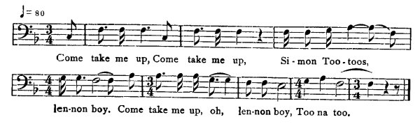

[Intangible Textual Heritage](../../index)  [Africa](../index) 
[Index](index)  [Previous](jas065)  [Next](jas067)   
 [\[Note\]](jas066n) [\[Supplementary Note\]](jas066n1)

------------------------------------------------------------------------

### 66. Simon Tootoos.

Thomas White, Maroon Town, Cock-pit country.

Der was once a woman dat have a child. Him name was Simon Tootoos. De
mudder him was a church woman, an' him used to send de boy to church;
and after, de mudder come an'

{p. 72}

die. An' when de mudder die, he take de world upon his head. And Simon
Tootoos mek colbon\[1\] and set it on Sunday day, and he go to wood on
Sunday to go and search his colbon. And when he go to catch him bird, he
catch a snake in de colbon. When he go to raise up de colbon an' fin' it
was a snake, him leave it. An de snake answer to him,

  
Come take me up, Come take me up, Si-mon Too-toos,  
len-non boy. Come take me up, ob, len-non boy, Too na too.

It was his dead mudder cause de snake to sing like dat. And when he go
to leave--

"Come back you' colbon, come back you colbon.  
Simon Tootoos, lennon boy,  
    Come back you' colbon, O lennon boy!  
    Too na too!"

make him come an' tek him up carry him come back to yard. And him put
him down--

"Come 'tretch me out, come 'tretch me out,  
Simon Tootoos, lennon boy,  
    Come 'tretch me out, O lennon boy!  
    Too na too!"

And stretch him out and cut him neck.--

"Come wash your pot, come wash your pot,  
Simon Tootoos, lennon boy,  
    Come wash your pot,  
    O lennon boy! Too na too!"

And wash de pot. And cut him up an' put in de pot, an' he set it on de
fire, mak up him fire under him, and him start boiling. After it start
boiling, it boil until it tell him to season in skelion\[2\]. When it
boil, it tells, him to come down pot off de fire. So

"Come wash you' plate, come wash you' plate,  
Simon Tootoos, lennon boy,  
    Come wash you' plate, O lennon boy!  
    Too na too!"

He wash de plate.

\[1. A trap.

2\. A cooking-pot.\]

{p. 73}

"Come clean you' knife, come clean you' knife,  
Simon Tootoos, lennon boy,  
    Come clean you' knife, O lennon boy!  
    Too na too!"

He clean him knife.

"Come lay you' table, come lay you' table,  
Simon Tootoos, lennon boy!  
    Come lay you' table, O lennon boy!  
    Too na too!"

He lay him table. An' say,

"Come pick me out, come pick me out,  
Simon Tootoos, lennon boy,  
    Come pick me out, O lennon boy!  
    Too na too!"

And pick him out.

"Come lay me on table, come lay me on table,  
Simon Tootoos, lennon boy,  
    Come lay me on table, O lennon boy!  
    Too na too!"

Put him on table.

"Come draw you' chair, come draw you' chair,  
Simon Tootoos, lennon boy,  
    Come draw you' chair, O lennon boy!  
    Too na too!"

He draw him chair.

"Come eat me now, come eat me now,  
Simon Tootoos, lennon boy!  
    Come eat me now, O lennon boy!  
    Too na too!"

He eat him dead mother now.

"Come call you' grave-digger, come call you' grave-digger,  
Simon Tootoos, lennon boy,  
    Come call you' grave-digger, O lennon boy!  
    Too na too!

"Come call you carpenter, come call you' carpenter,  
Simon Tootoos, lennon boy,  
    Come call you' carpenter, O lennon boy!  
    Too na too!"

As him eating done--

"Come say you' prayer, come say you' prayer,  
Simon Tootoos, lennon boy,  
    Come say you' prayer, O lennon boy!  
    Too na too!

{p. 74}

"Come go to you' bed, come go to you' bed,  
Simon Tootoos, lennon boy,  
    Come go to you' bed, O lennon boy!  
    Too na too!"

After him go to him bed, him mudder come out of him belly; an' dat was
de las' of Simon Tootoos.

------------------------------------------------------------------------

[Next: 67. The Tree-wife.](jas067)
