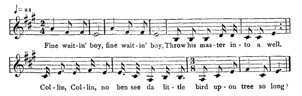
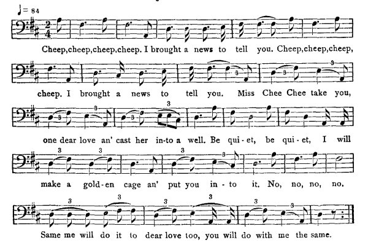

[Intangible Textual Heritage](../../index)  [Africa](../index) 
[Index](index)  [Previous](jas072)  [Next](jas074)   
 [\[Note\]](jas073n)

------------------------------------------------------------------------

### 73. The Singing Bird.

##### a. Fine Waiting Boy.

Alfred Williams, Maroon Town.

A gentleman have him servant, and one day he said to de servant,
"Collin, go an' look about de horse harness my buggy." An' Collin go an'
harness him master horse an' put in de buggy. Well, him master drive on
an' him drive on till him get to a well; an' de master said, "I want
some water." An' Collin said, "Massa, der's a well is down before. An'
he an' Collin come out de buggy against de well-side, an' meanwhile de
massa sit against de well-side, Collin pitch him master in de well. An'
Collin tu'n back an' go on half way wid de buggy, an' when he get home
de missus ask him, "Where is de master?" an' Collin said, "He goin' pay
a visit an' comin' to-morrow; de buggy goin' meet him," Collin go de day
wild de buggy. When he went back, de missus said, "Where is de master?"
He said, "Go to pay a visit, won't be back till to-morrow." When Collin
gone, de nex' servant in de yard say,

{p. 84}

"Missus, hear what little bird singing?" Missus come to de doorway an'
listen, an' hear de little bird whistling,\[1\]

  
Fine wait-in' boy, fine wait-in' boy, Throw his mas-ter in to a well.  
Col-lin, Col-lin, no ben see da lit-tle bird up-on tree so long?

When de missus hear de little bird singing so, couldn't understand,
called a sensible person understand de bird. An' go search de well, fin'
de master body, an' go tak Collin hang him.

##### b. The Golden Cage.

William Harris, Maggotty,

A king had a daughter. He had two servants who did not like the
daughter. One day the two servants were going to the well for water and
the daughter said she wanted to go with them. And they catch the little
girl and cast her in the well. Three days after, the little girl went
home to her father an' the father catch the two servants and throw

*them* in the well. And he get his child and thus end the story.

  
Cheep, cheep, cheep, cheep. I brought a news to tell you.  
Cheep, cheep, cheep, cheep. I brought a news to tell you.  
Miss Chee Chee take you, one dear love an' cast her in-to a well.  
Be qui-et, be qui-et, I will make a gold-en cage an' put you in to it.  
No, no, no, no.  
Same me will do it to dear love too, you will do with me the same.

\[1. Sung by Mrs. Williams.\]

{p. 85}

------------------------------------------------------------------------

[Next: 74. Two Sisters.](jas074)
