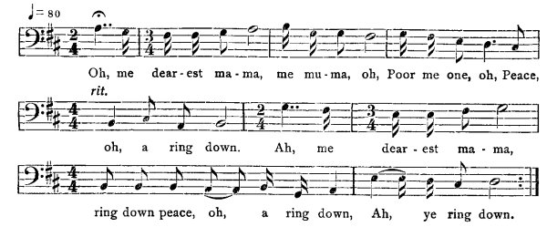

[Intangible Textual Heritage](../../index)  [Africa](../index) 
[Index](index)  [Previous](jas079)  [Next](jas081)   
 [\[Note\]](jas080n)

------------------------------------------------------------------------

### 80. The Witch and the Grain of Peas.

Thomas White, Maroon Town.

It was a man were married to a woman first and he had one child wid de
first woman he were married to. An' de first woman dat he married to
dead an' he go married to anodder one; an' de girl has to call her
"mudder-in-law." An' de mudder-in-law doesn't like de daughter-in-law.
An' one day de mudder-in-law go to him field, gone work. In de morning
she wash some peas an' put on de peas on fire an' went away to ground.
An' de daughter-in-law doesn't live at dis house, live in house by
herself. An' de daughter-in-law come deh, ketch de daughter, louse and
comb him hair. At de same time de mudder-in-law is Old Witch, know dat
de daughter-in-law come to house. So as she was gwine away de eb'ning,
de daughter said, "Look yeah, sister, mamma put on some peas on de fire;
why don' you tek one grain of de peas?" An' she open de pot an' tek out
one grain of de peas. An' when de Old Witch woman know dat de
daughter-in-law tek out one grain of de peas, shet put up de hoe an'
went from ground an' come back to house an' tek down de pot an' tu'n out
all de peas in bowl, an' she couple eb'ry grain of de peas until she
fin' one don' have a match. And said to child, "Look yeah! you' sister
come to-day?"--"No, never come to-day!"--"Yes, don' control me, for I
see at de grain dat you' sister come an' tek out one grain from de pot."
An' gwine to swear him at de river to drown her because she tek de peas.
An' she say, "If you don' eat my peas

{p. 94}

to-day you won' drownded, but if you eat my peas you will drownded." So
de girl took up de song,--

  
Oh, me dear-est ma-ma, me mu-ma, oh,  
Poor me one, oh, Peace, oh, a ring down.  
Ah, me dear-est ma-ma, ring down peace, oh, a ring down,  
Ah, ye ring down.

And at de said time, de young girl had a sweetheart outside name of
William. An' William mamma heard de song 'pon de ribber-side and send
away to carpenter-shop an' tell William heard his girl singing quite
mournful on ribber-side. An' him go up on lime-tree an' pick four lime
an' gwine a fowl-nest an' tek four fowl-egg an' gwine a turkey-nest an'
tek four turkey-egg an' tek four marble, an' call de girl an' put her
before him. An' William an' de girl mudder-in-law come to a battle at de
ribber-side an' William kill de woman. An' he put de girl before him an'
carry her home an' marry her.

------------------------------------------------------------------------

[Next: 81. Bosen Corner.](jas081)
