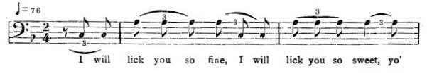
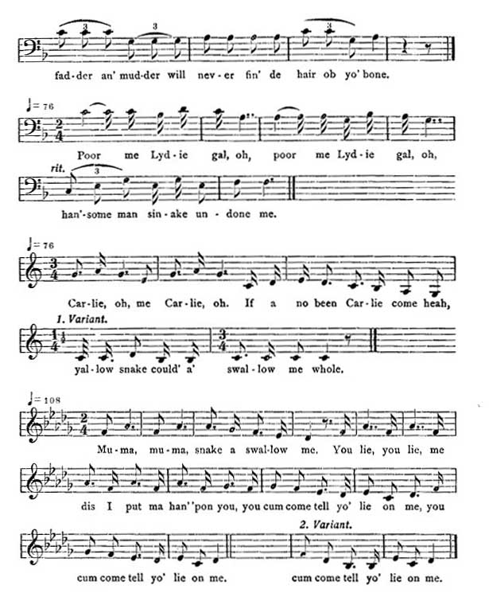

[Intangible Textual Heritage](../../index)  [Africa](../index) 
[Index](index)  [Previous](jas085)  [Next](jas087)   
 [\[Note\]](jas086n)

------------------------------------------------------------------------

### 86. The Girls who married the Devil.

##### a. The Devil-husband.

William Forbes, Dry River, Cock-pit country.

There was two sister an they had a yawzy brudder who de two sister
didn't care about. They was faderless and mudderless. An' see a man come
to court de two sister to carry dem away; an' de man tek dem into de
boat to carry home, an' de little yawzy boy tu'n a cockroach an' get
into de boat. An' when deh get home, de house-maid tell de two girl,
"Wha' you follow dis man come heah now? He is Devil!" An' de Devil tell
de house-maid dat she mus' feed dem well, an' de little boy come out of
de boat.

Well, deh had a big cock a de yard, an' de house-maid said, "I gwine to
sen' you home into de boat." An' t'row out a bag o' corn gi' de cock,
say, "When him fe eat it done, de boat will catch home". So de cock
commence to eat de corn--

"Hock kaluck kum ka tum swallow!  
Hock kaluck kum ka tum swallow!"

knock him wing bap bap bap bap! After he knock him wing, he crow--

"Ko ko re ko!  
Massa han'some wife gone!"

Devil didn't hear him, crow again

"Ko ko re ko!  
Massa han'some wife gone!"

{p. 106}

Devil hear now; as he hear, he come--

"Zin-ge-lay, wid dem run come,  
Zin-ge-lay, wid dem jump come,  
Zin-ge-lay, wid dem walk fas'!"

So de boat name "John Studee." As he run into de yard, stamp him foot
an' said, "John Studee!" An' stamp again, "John Studee-ee-e!" So de boat
tu'n right back wid de two girl an' de little boy. An' as dey mos' come,
de little boy tu'n cockroach again; go in garden. Devil didn't see him.

Nex' day mo'nin', Devil go back in fiel' put up de two girl again. De
maid t'row out a bag o' corn an' a bag o' rice. Same t'ing happen. Las'
day when him gone, de maid t'row out a bag o' corn, a bag o' rice an' a
bag o' barley. An' after him t'row, de cock commence to eat--

"Hock kaluck kum ka tum swallow!  
Hock kaluck kum ka tum swallow!"

After dem bag o' corn, tu'n upon rice now--

"Hock kaluck kum ka tum swallow!  
Hock kaluck kum ka tum swallow!"

An' de rice he eat now, tu'n upon de barley

"Hock kaluck kum ka tum swallow!  
Hock kaluck kum ka turn swallow!"

Eat off de t'ree bag, time de girl catch home; leave de boat at de
shore-side. De cock clap him wing--

"Plop plop plop plop  
Massa han'some wife gone!"

As Devil hear, him come--

"Zin-ge-lay, wid dem run come,  
Zin-ge-lay, wid dem jump come,  
Zin-ge-lay, wid dem walk fas'!"

As he come, 'tamp him foot an' say, "John Studee-e!" De boat t'un right
back come home. If it wasn't fo' dat little yawzy boy, de Devil will
kill 'em.

##### b. The Snake-husband.

Emilina Dodd, Lacovia.

A woman have a daughter, oftentimes engaged and wouldn't marry, said
that the gentlemen weren't to her sort; until one day

{p. 107}

she see a well-dressed gentleman, came and proposed to her. But she has
a brother was an Old Witch, told her that man was a snake. She said the
man was too well-dressed to be a snake, but the brother was going home
with them under the carriage as a lizard. The first place, as he was
going on, somebody ask, "Mr. Snake, I beg you give me my collar," and
the next, "Mr. Snake, I beg you give me my jacket," and so on until he
show himself plain as a snake.

When they get home, he lock her up wanting to kill her, but couldn't
kill her without the thing called "bump." Go out in the yard looking for
it. After them gone, the mother-in-law said, "Me daughter, dis man you
marry going to kill you because he is a bad man and he marry a wife
already and kill her and he gwine to kill you too. I would let you go,
but him have one cock, him so chat!" So she threw a barrel of wheat an'
a barrel of corn. When the cock was picking it up he say, "I don' care a
damn, I will nyam an' talk!" sing,--

"Ko ko re kom on do!  
Girl gone, him no gone,  
Ko ko re ko kom on do!"

Then they throw a double quantity. The cock pick it up an' sing,--

"Ko ko re ko kom on do!  
Girl gone, him no gone,  
Ko ko re ko kom on do!"

Then Snake come from the wood while the brother was taking her on the
water. Snake overtake her, take her home again and lock her in, go back
in the wood again in search of "bump." And mother-in-law throw a double
quantity of wheat and corn. Cock say again, "I don't care a damn, I will
nyam an' talk!" The cock eatey all and sing,--

"Ko ko re kom on do!  
Girl gone, him no gone,  
Ko ko re ko kom on do!"

So when Snake come out from the wood, he couldn't get her again because
she was near on land. So he went back home an' tek a stick an' lick the
mother-in-law on the head, kill her.

(The following songs are taken from other versions of the Snake-husband
story.)

  
I will lick you so fine, I will lick you so sweet, yo' {p. 108}  
  
fad -der an' mud-der will nev-er fin' de hair ob yo' bone.  
Poor me Lyd-ie gal, oh, poor me Lyd-ie gal, oh,  
han'-some man sin-ake un-done me.

Car-lie, oh, me Car-lie, oh. If a no been Car-lie come heah,  
yal-low snake could' a' swal-low me whole.

Mu-ma, mu-ma, snake a swal-low me.  
You lie, you lie, me dis I put ma han' 'pon you,  
you cum come tell yo' lie on me,  
you cum come tell yo' lie on me.  
cum come tell yo' lie on me.

------------------------------------------------------------------------

[Next: 87. Bull as Bridegroom.](jas087)
