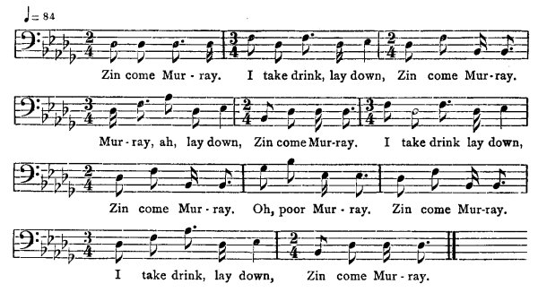

[Intangible Textual Heritage](../../index)  [Africa](../index) 
[Index](index)  [Previous](jas139)  [Next](jas141) 

------------------------------------------------------------------------

### 140. In Come Murray.

William Forbes, Dry River, Cock-pit country.

It was said when you go you see a man going to play dat Nansi story. Get
anodder wid a pint a water, den him gwine to turn a drunkard, begin to
totter, say, "Tiger, tiger, lie down"--

  
Zin come Mur-ray. I take drink, lay down, Zin come Mur-ray.  
Mur-ray, ah, lay down, Zin come Mur-ray. I take drink lay down,  
Zin come Mur-ray. Oh, poor Mur-ray. Zin come Mur-ray.  
I take drink, lay down, Zin come Mur-ray.

------------------------------------------------------------------------

[Next: 141. Tacoomah makes a Dance.](jas141)
