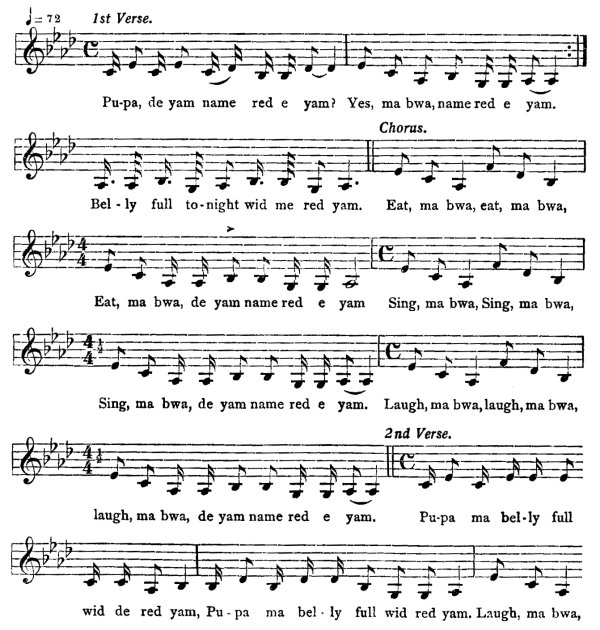
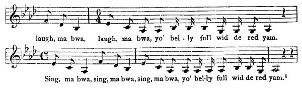
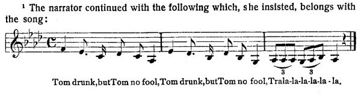

[Intangible Textual Heritage](../../index)  [Africa](../index) 
[Index](index)  [Previous](jas142)  [Next](jas144)   
 [\[Note\]](jas143n)

------------------------------------------------------------------------

### 143. Red Yam.

Mary Jane Roden, Brownstown, St. Ann.

Anansi and Tacoomah have two little boy. So Anansi go to him ground, he
have a yam name of 'red yam'. So when he carry home de yam, if de two
little boy don' tell him de name of de yam, don' give 'em no dinner, So
one night de little boy say, (dance to the fiddle and drum),

"Poor me bwoy, papa no gi' me no dinner!  
It I don' know de yam name, papa no gi' me no dinner!  
Poor me bwoy, me go fe dead fe hungry, da la!"

{p. 174}

Another day papa go to ground. So the little boy follow him go right
outside a bush, go set for him. When him coming back he fall down, say,
"Now me little red yam mash up!" So when him come home an' said to the
little boy, "Come, me pickney, pupa come an' if you tell me de name of
dis yam to-night, I goin' to give you a good supper," the little boy
say,

"T'ank God, me know him name,  
T'ank God, me know him name,  
T'ank God, me know him name!"

"Come, now, tell me!"

"Ai! red yam, t'ank God a red yam!"

(dance and play the fiddle and drum).

When the papa boil the dinner, give him a big dinner fe him call the
name. When he eat the big dinner the papa gi' him the night, boy sing,

  
1st Verse.

Pu-pa, de yam name red e yam?  
Yes, ma bwa, name red e yam.  
Bel-ly full to-night wid me red yam.

Chorus,

Eat, ma bwa, eat, ma bwa,  
Eat, ma bwa, de yam name red e yam  
Sing, ma bwa,  
Sing, ma bwa,  
Sing, ma bwa, de yam name red e yam.  
Laugh, ma bwa, laugh, ma bwa, laugh, ma bwa,  
de yam name red e yam.

2nd Verse.

Pu-pa ma bel-ly full wid de red yam,  
Pu-pa ma bel-ly full wid red yam.  
Laugh, ma bwa, {p. 175}  
  
laugh, ma bwa, laugh, ma bwa,  
yo' bel-ly full wid de red yam.  
Sing, ma bwa, sing, ma bwa, sing, ma bwa,  
yo' bel-ly full wid de red yam.\[1\]

\[1. The narrator continued with the following which, she insisted,
belongs with the song:

  
Tom drunk, but Tom no fool, Tom drunk, but Tom no fool,
Trala-la-la-la-la-la.

This last measure may be repeated at will, or the whole three about Tom.
The oftener it is sung, the sweeter the song, in Mother Roden's opinion
and in that of many others.

This singer was most uncertain; in intonation, repetitions, etc. she
varied exceedingly and agreed that any way the song was repeated to her
by the transcriber was correct, no matter how It was sung. The
transcriber, therefore, will not vouch for these three tunes. The old
woman is a cripple and can neither read nor write. H. R.\]

------------------------------------------------------------------------

[Next: 144. Guzzah Man.](jas144)
