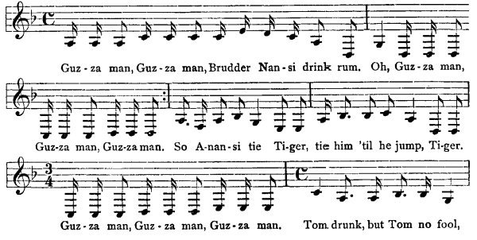
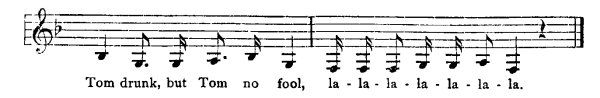

[Intangible Textual Heritage](../../index)  [Africa](../index) 
[Index](index)  [Previous](jas143)  [Next](jas145) 

------------------------------------------------------------------------

### 144. Guzzah Man.

Mary Jane Roden, Brownstown, St. Ann.

One day Tacoomah, Monkey and Baboon were driving a truck with rum to the
wharf fe master. When they were going, Anansi said to Tacoomah they have
a dance an' they invite Monkey an' Baboon to the dance. An' while they
was dancing, Anansi an' Tacoomah go t'ief t'ree puncheon of rum from
Monkey an' Baboon, come back to the dance, see Monkey an' Baboon was
dancing. Anansi say,

  
Guz-za man, Guz-za man, Brudder Nan-si drink rum. Oh, Guz-za man,  
Guz-za man, Guz-za man. So A-nan-si tie Ti-ger, tie him 'til he jump,
Ti-ger.  
Guz-za man, Guz-za man, Guz-za man. Tom drunk, but Tom no fool, {p.
176}  
  
Tom drunk, but Tom no fool, la la-la-la-la-la-la.

{p. 176}

------------------------------------------------------------------------

[Next: 145. Fowl and Pretty Poll.](jas145)
