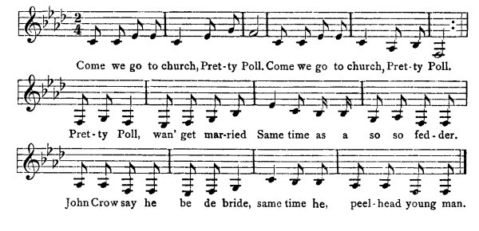

[Intangible Textual Heritage](../../index)  [Africa](../index) 
[Index](index)  [Previous](jas144)  [Next](jas146)   
 [\[Note\]](jas145n)

------------------------------------------------------------------------

### 145. Fowl and Pretty Poll.\[1\]

Mary Jane Roden, Brownstown, St. Ann.

Fowl invite Pretty Poll to chapel, den Pretty Poll said to Fowl, "Kyan't
go to chapel for me soso fedder." Poll said to Kyan-crow, "Make go to
chapel." Kyan-crow said to Pretty Poll him kyan't to go chapel for him
peel-head young man.

  
Come we go to church, Pret-ty Poll.  
Come we go to church, Pret-ty Poll.  
Pret-ty Poll, wan' get mar-ried  
Same time as a so so fed-der.  
John Crow say he be de bride, same time he, peel-head young man.

\[1. Jamaica negroes speak of the groom at a wedding as "the bride."\]

------------------------------------------------------------------------

[Next: 146. The Cumbolo.](jas146)
