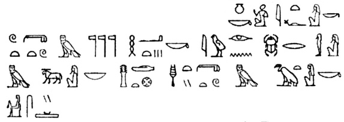
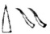

  
[Intangible Textual Heritage](../../index)  [Africa](../index) 
[Index](index)  [Previous](kn000)  [Next](kn002) 

------------------------------------------------------------------------

  
*The Kebra Nagast*, by E.A.W. Budge, \[1922\], at Intangible Textual
Heritage

------------------------------------------------------------------------

p. vii

### PREFACE

THIS volume contains a complete English translation of the famous
Ethiopian work, The "Kebra Nagast,"
*i.e.* the "Glory of the Kings \[of Ethiopia\]." This work has been held
in peculiar honour in Abyssinia for several centuries, and throughout
that country it has been, and still is, venerated by the people as
containing the final proof of their descent from the Hebrew Patriarchs,
and of the kinship of their kings of the Solomonic line with Christ, the
Son of God. The importance of the book, both for the kings and the
people of Abyssinia, is clearly shown by the letter that King John of
Ethiopia wrote to the late Lord Granville in August, 1872. The king
says: "There is a book called 'Kivera Negust' which contains the Law of
the whole of Ethiopia, and the names of the Shûms \[*i.e.* Chiefs\], and
Churches, and Provinces are in this book. I pray you find out who has
got this book, and send it to me, for in my country my people will not
obey my orders without it." (See *infra*, [p.
xxvii](kn004.htm#page_xxvii).) The first summary of the contents of the
Kebra Nagast was published by Bruce as
far back as 1813, but little interest was roused by his somewhat bald
précis. And, in spite of the labours of Prætorius, Bezold, and Hugues le
Roux, the contents of the work are still practically unknown to the
general reader in England. It is hoped that the translation given in the
following pages will be of use to those who have not the time or
opportunity for perusing the Ethiopic original.

The Kebra Nagast is a great storehouse of
legends and traditions, some historical and some of a purely folk-lore

p. viii

character, derived from the Old Testament and the later Rabbinic
writings, and from Egyptian (both pagan and Christian), Arabian, and
Ethiopian sources. Of the early history of the compilation and its
maker, and of its subsequent editors we know nothing, but the principal
groundwork of its earliest form was the traditions that were current in
Syria, Palestine, Arabia, and Egypt during the first four centuries of
the Christian era. Weighing carefully all that has been written by
Dillmann, Trump, Zotenberg, Wright, and Bezold, and taking into account
the probabilities of the matter, it seems to me that we shall not be far
wrong if we assign the composition of the earliest form of the Kebra Nagast to the sixth century A.D. Its
compiler was probably a Coptic priest, for the books he used were
writings that were accepted by the Coptic Church. Whether he lived in
Egypt, or in Aksûm, or in some other part of Ethiopia matters little,
but the colophons of the extant Ethiopic MSS. of the Kebra Nagast suggest that he wrote in Coptic.

In the succeeding centuries, probably as a result of the widespread
conquests of Muḥammad and his Khalîfahs, the Coptic text was in whole or
part translated into Arabic, and during the process of translation many
additions were made to it, chiefly from Arabic sources. Last of all this
Arabic version was translated into Ethiopic, and proper names underwent
curious transformations in the process. According to the colophons of
the MSS. in the British Museum, Oxford, and Paris, the Arabic
translation was made from the Coptic in the 409th "year of mercy," when
Gabra Masḳal, commonly known as Lâlîbalâ, was reigning over Ethiopia,
*i.e.* between A.D. 1314 and 1344. And the same authorities say that the
Ethiopic translation was made subsequently by one Isaac, of whom nothing
is known save that he was an enthusiastic Christian visionary and
patriot. His

p. ix

knowledge of history and chronology was defective, and his comparative
philology is unusually peculiar, even for the period in which he lived.

In the colophons Isaac says: "I have toiled much for the glory of the
kingdom of Ethiopia, and for the going forth (manifestation?) of the
heavenly Zion, and for the glory of the King of Ethiopia." These word,
throw some light upon Isaac's motive in translating the book, and supply
the reason for his devoted labour. He firmly believed: 1. That the
lawful kings of Ethiopia were descended from Solomon, King of Israel. 2.
That the Tabernacle of the Law of God, *i.e.* the Ark of the Covenant,
had been brought from Jerusalem to Aksûm by Menyelek, Solomon's
firstborn son, according to the Ethiopians. 3. That the God of Israel
had transferred His place of abode on earth from Jerusalem to Aksûm
(Aksum), the ecclesiastical and political capital of Ethiopia. The means
employed by Menyelek for obtaining possession of the Ark of the Covenant
did not disturb Isaac's conscience in the least, nay he gloried in them,
for manifestly Menyelek was performing the Will of God in removing the
tabernacle of Zion from Jerusalem. God, according to Isaac, was
satisfied that the Jews were unworthy to be custodians of the Ark
wherein His Presence was, and the Ark wished to depart. Ethiopia had
stretched out her hands to God (Psalm lxviii, 31), and He went to her,
with the Ark, to preside over Menyelek's kingdom, which was established
in accordance with the commands that He had given to Moses and the
prophets and priests of Israel.

It will be remembered that the line of kings founded by Solomon
continued to reign even after the Ethiopians became Christians under the
teaching of Frumentius and Adesius, the slaves of the merchant Meropius,
and that the line continued unbroken until the tenth century of our era.
Isaac knew that God then permitted

p. x

the line to be broken, and allowed the Zâguê kings to reign over
Ethiopia until the reign of Yĕkûnô ’Amlâk, who restored the Solomonic
line in 1270, and he makes no attempt to justify God's action in this
matter, or to explain it. We learn, however, from the first section of
the colophon, that he wondered why God had neglected to have the Arabic
version of the Kebra Nagast translated
into the "speech of Abyssinia" at an earlier date, and why ’Abu’l-‘Izz
and ’Abu’l-Faraj, who made the Arabic translation from the Coptic, did
not make a rendering into Ethiopic also. In the explanation which he
attempts to give, he reminds us that the Arabic translation appeared
whilst the Zâguê kings were still reigning. As the Kebra Nagast was written to glorify the
Solomonic line of kings, and its editors and translators regarded the
Zâguê kings not only as non-Israelites, but as "transgressors of the
Law,'' the appearance of a translation of it in the vernacular whilst
the Zâguê were still on the throne would be followed by the torture and
death of its producers, and the destruction of their work.

There is extant in Ethiopian literature a legend to the effect that when
God made Adam He placed in his body a "Pearl," which He intended should
pass from it into the bodies of a series of holy men, one after the
other, until the appointed time when it should enter the body of
Ḥannâ, [1](#fn_0) and form the substance of her
daughter the Virgin Mary. Now this "Pearl" passed through the body of
Solomon, an ancestor of Christ, and Christ and Menyelek, the son of
Solomon by the Queen of Sheba, were sons of Solomon, and according to
Ethiopian ideas they were akin to each other. But Christ was the Son of
God, and, therefore, being the kinsman of Christ, Menyelek was divine.
And Isaac the Ethiopian, holding

p. xi

this view, maintains in the Kebra Nagast
that the kings of Ethiopia who were descended from Menyelek were of
divine origin, and that their words and deeds were those of gods.

Now the idea of the divine origin of kings in Ethiopia, the Sûdân, and
Egypt, is very old, and it appears to have been indigenous. According to
a legend given in the Westcar Papyrus in Berlin, three of the great
kings of the Vth dynasty in Egypt were the sons of the god Rā by Ruṭṭeṭ,
the wife of Rāuser, high priest of Rā, and before the close of that
dynasty every king called himself "son of Rā." Many a king of Egypt
states in his inscriptions that he reigned "in the egg," *i.e.* before
he was born, and we are to understand that the egg was deposited in his
mother by the form of the Sun-god, who was his father. Some of the
sovereigns of the XVIIIth dynasty, certainly those who were the nominees
of the priests of Åmen, were declared to be the actual children of Åmen,
and to be of his substance. On the walls of the famous temple which the
architect Senmut built for Queen Ḥatshepsut in Western Thebes, there is
a series of bas-reliefs in which the god Åmen is seen companying with
the mother of that Queen, and Ḥatshepsut regarded herself as Åmen's
daughter. In the temple of Luxor there are bas-reliefs of a similar
character, and the god Åmen is seen occupying the couch of the queen who
became by him the mother of Åmenḥetep III. This king was so thoroughly,
convinced of his divine origin that he caused an effigy of himself to be
sculptured on the walls of the temple of Sûlb in the Egyptian Sûdân,
together with the figures of the great gods of Egypt. In fact he shared
the worship of the people with the gods and goddesses of Egypt. Rameses
the Great was held to be the son of the god Ptaḥ-Tanen, and in the
inscription on a stele at Abu Simbel this god,

p. xii

in addressing the king, says: "I am thy father. Thy members were
begotten as \[are those of\] the gods. I took the form of the Ram, the
Lord of Ṭeṭ (Mendes), I companied with thy august mother"   [1](#fn_1)

A thousand years later a story arose in Egypt to the effect that
Alexander the Great was the son of the god Åmen of Egypt, and
Alexander's councillors promptly took advantage of it to forward the
fortunes of their lord. If, they argued, Alexander is the son of Åmen,
he is the lawful king of Egypt, and the Egyptians must acknowledge him
as their king. But it was necessary for their purpose that Åmen should
acknowledge Alexander as his son, and they therefore took him to the
Oasis of Sîwah in the Libyan Desert, and presented him to the god Åmen
of Libya. The god admitted that Alexander was his son, the priesthood of
Åmen accepted the declaration of their god, the Egyptians believed that
the holy blood of Åmen flowed in Alexander's veins, and as a result he
became the king of the South and the North, and Governor of the Domain
of Horus without striking a blow. The native novelists and
story-tellers, *e.g.* the Pseudo Callisthenes, declared that when
Nectanebus II, the last native king of Egypt, fled from Egypt he went to
Macedon, where he established himself as a magician. Here he became
acquainted with Queen Olympias, who wished to find out from him if

p. xiii

her husband, Philip, intended to put her away. An intimacy sprang up
between Nectanebus and Olympia, and he appeared to the queen one night
in the form of the god Åmen of Libya, arrayed in all the attributes of
the god, and begot Alexander the Great. Tradition transferred the horns
of Åmen to Alexander, and ancient Arab writers call Alexander
"Dhu’l-Ḳarnên," *i.e.* "provided with two horns," a title that
translates exactly one of the titles of Åmen, "Sepṭ ābui"  .

Isaac, the editor and translator of the Kebra
Nagast, and his fellow countrymen saw nothing strange in the fact
that Mâkĕdâ, the virgin queen of Saba, gave herself to Solomon, for she
believed him to be of divine origin, and he was to her as a god.
Moreover, he was the custodian of the "Heavenly Zion, the Tabernacle of
the Law of God," whence he obtained daily the renewal of his divinity,
and power, and authority. The Tabernacle of the Law had much in common
with the arks or divine tabernacles of the Babylonians and Egyptians,
which formed the places of abode of figures of gods or their most
characteristic emblems. The ark of Bel, the great god of Babylon,
contained a figure of the god, and the king visited it ceremonially once
a year, and sued with tears for forgiveness, and grasped the hand or
hands of the sacred figure. The chamber in which the figure abode was
believed to have been built by the gods. On high days and holy days the
ark was carried by the priests in procession. In Egypt the arks of the
gods were kept in chambers specially constructed for the purpose, and
the figures of the gods were seated on thrones inside them. These arks
were placed upon sledges or in boats and were carried by the priests in
procession on great days of festival or on solemn days. We know from the
inscriptions that the ark of Åmen was provided with doors that were kept
bolted and

p. xiv

sealed. On certain occasions the king had the right to break these seals
and unbolt the doors, and look upon the face of the god. Thus, after his
conquest of Egypt, the Nubian king Piānkhi went to visit Rā in his
sanctuary near Heliopolis. He was received by the Kherḥeb priest, who
prayed that the fiends might have no power over him. Having arrayed
himself in the sacred seṭeb garment, and been censed and asperged,
Piānkhi ascended the steps leading to the ark of Rā and stood there
alone. He broke the seal, drew the bolts, threw open the doors and
looked upon the face of Rā. Having adored the Māṭet and Sektet Boats he
drew together the doors and sealed them with his seal. In this way
Piānkhi was recognized by Rā as the king of all Egypt. It is not clear
whether it was a figure of Rā or the holy benben stone, the symbol of
the god, which Piānkhi looked upon. Many of the sacred arks of Egypt
contained no figures of gods, but only objects symbolic of them; in the
temples of Osiris the arks contained portions of the body of this god.

The Ark of the Law which Menyelek covered and stole from the Temple of
Jerusalem was probably a copy of that made by Moses, and to all intents
and purposes it was a rectangular box, made of hard wood plated with
gold, and measuring about four feet long, two feet six inches wide, and
two feet six inches deep. It was provided with a cover upon which rested
the Mercy seat and figures of the Cherubim. In the Kebra Nagast no mention is made of the Mercy
seat and the Cherubim, but we read there that Moses made a case in shape
like the "belly of a ship," and in this the Two Tables of the Law were
placed. To the Ethiopians this case symbolized the Virgin Mary; the case
made by Moses carried the Word in stone, and Mary carried the Word
Incarnate. It cannot be assumed that the Ark stolen by Menyelek was
carried in a sacred boat like an Egyptian

p. xv

shrine, even though the "belly of a ship" is mentioned in connection
with it. In several chapters of the Kebra
Nagast the "chariot of the Tabernacle of the Law" is mentioned, a
fact which suggests that in later days at least the sacred box was
provided with a carriage or sledge. History is silent as to the place
where the Tabernacle of the Law was finally deposited, but Ethiopian
tradition asserts that it survived all the troubles and disasters that
fell upon the Abyssinians in their wars with the Muslims, and that it
was preserved at Aksûm until comparatively recent times.

In the short introduction that follows I have given a sketch of the
literary history of the Kebra Nagast,
with references to the authorities on the subject, and I have made an
abstract of its contents in narrative form which will, I hope, be
useful. A full discussion of every portion of the work, with extracts
giving the original texts of the authorities used and quoted by Isaac
the scribe, would fill another volume, and the cost of printing, paper,
and binding is now so great that the idea of producing such a book has
been abandoned. A translation of the Arabic text describing how the
Kingdom of David was transferred from Jerusalem to Ethiopia has been
added, for this interesting document is practically unknown in England.
The pictures of events described in the Old and New Testaments, given in
this book, are taken from Ethiopic MSS. in the British Museum; they show
as nothing else can the religious beliefs and traditions of the
Ethiopians, and at the same time they serve as examples of the drawings
and designs with which they illustrated their manuscripts. Nearly all of
them depict Scriptural events described or referred to in the Kebra Nagast.

------------------------------------------------------------------------

### Footnotes

[x:1](kn001.htm#fr_0) See the *History of Ḥannâ*,
edited and translated by myself, in *Lady Meux MSS*. 2–5, p. 164.

[xii:1](kn001.htm#fr_1) *Trans. Soc. Bibl.
Arch.*, vol. vii, plate facing p. 119, ll. 3 and 4 (ed. Naville).

------------------------------------------------------------------------

[Next: Contents](kn002)

