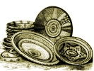

  
[Intangible Textual Heritage](../../index)  [Africa](../index) 
[Index](index)  [Next](mind01) 

------------------------------------------------------------------------

  
*At the Back of the Black Man's Mind*, by Richard Edward Dennett,
\[1906\], at Intangible Textual Heritage

------------------------------------------------------------------------

# AT THE BACK OF THE BLACK MAN'S MIND

#### OR

#### NOTES ON THE KINGLY OFFICE IN WEST AFRICA

## R. E. DENNETT

#### \[1906\]

 

# PREFACE

THE object of this little work is twofold. In the first place I wish to
show that, concurrent with fetishism or Jujuism, there is in Africa a
religion giving us a much higher conception of God than is generally
acknowledged by writers on African modes of thought. And, in the second
place, I am anxious to make clear the vital importance of the kingly
office to the African communities.  
This concurrence of fetishism and a higher religion is nothing new, and
as our knowledge of primitive and degenerate people increases it will
probably be found to be quite common, if not the rule. "Traces of
ancestor worship and fetishism have in all ages been found among the
Israelites, especially among those of the northern kingdom; this is
abundantly proved," writes Professor Fr. Hommel in his *Ancient Hebrew
Tradition Illustrated by the Monuments*, by various passages in the Old
Testament literature, but it is no more an argument against the
concurrent existence of a higher conception of the Deity than the
numerous superstitious customs and ideas still prevalent among the lower
orders of almost every civilised country of the present day are
arguments against the existence and practical results of Christianity."

The lasting effect of missionary effort in Africa must depend to a very
great extent on the grasp the missionaries are capable of obtaining of
this higher conception of God which the natives of Africa in my opinion
undoubtedly have, and the use they may make of it in manifesting God to
them as the one and only true God, and not merely the white man's God.

The work of the government of the natives must also be greatly
simplified if once the importance of the kingly office is recognised.
Their higher conception of God cannot be separated from the kingly
office, for the king is priest as well. Rotten and degenerate as an
African kingdom may have become, its only hope of regeneration rests in
the purification of the kingly office and of the ancient system of
government attached to it. I say ancient advisedly, because it seems to
me that during the last few centuries Africa has been having a very bad
time of it, and anarchy and usurpation have been busy upsetting older
and purer customs. The disorganisation of the indigenous political
fabric gives so great an opening for political adventurers of a cunning
type to step in that the government of the country through the natives.,
on so-called native lines, becomes almost an impossibility for a foreign
government.

However humble this contribution to the better understanding of the
working of the African mind may be, it is hoped that it may be accepted
as an attempt to uplift those who are not already above personal and
petty prejudices to the possibility of crediting the Africans with
thoughts, concerning their religious and political system, comparable to
any that may have been handed down to themselves by their own ancestors.

In giving to this work the title of *At the Back of the Black Man's
Mind*, I rather wish to imply that I should like to get there than to
assert that I have actually solved all the problems that lie concealed
there. If I have not succeeded, at any rate this study of the kingly
office in West Africa will at least, I hope, draw attention to this
matter and throw so much light upon it as may guide others to more
complete success in the near hereafter.

Things are moving now in West Africa, and a greater number of people are
taking an intelligent interest in the country since the late Miss M. H.
Kingsley's great books first drew crowds of her admirers to study
African problems. Miss Kingsley used to say that West Africa wanted
advertising, and she advertised it, and created a public for us. And
this should be remembered by those who, coming after her, when our
knowledge of the country has ripened, are apt to lay stress upon trivial
errors in detail, forgetting the vast amount of general information she
gave to the world about the country. How tireless she was in encouraging
others less gifted than herself to add their mites of knowledge to her
large collection of facts many can testify, the writer among the rest.
It is only right and natural, therefore, that he should in the first
place wish to record his sense of gratitude to her and her memory.

In the second place he desires to place on record his sense of
obligation and thanks to the African Society, the Anthropological
Institute, and the Folklore Society for having in the first place
published in their journals parts of the following notes, and for now
giving him permission to reprint them in book form.

He is also grateful to Mr. Cowan, of the firm of Messrs. A. Miller
Brother and Co., and to Dr. A. G. Christian and Mr. M. H. Hughes for
allowing him to reproduce many photographs of Benin City and people
taken in the first place by them.

Finally, he thanks Mr. N. W. Thomas, the anthropologist (and here his
readers will possibly also join him), for having cut out a lot of
irrelevant matter and so reduced the present volume to a handy and
readable size. When the writer thinks of his patience in wading through
the MS., and his forbearance in leaving what remains of it, he feels
that nothing that he can say or write will adequately express his
gratitude.

TO MY FATHER  
THE REV. R. DENNETT, D.C.L.

# CONTENTS

CHAPTER I LUANGO AND THE BAVILI  
CHAPTER II ELECTION OF A KING IN THE KONGO  
CHAPTER III CORONATION OF A KING IN THE KONGO  
CHAPTER IV COURTS OF MALUANGO AND MAMBOMA  
CHAPTER V LAW  
CHAPTER VI MEASURES, SIGNS, AND SYMBOLS  
CHAPTER VII BAVILI PSYCHOLOGY  
CHAPTER VIII NDONGOISM  
CHAPTER IX NKICI-ISM  
CHAPTER X BAVILI PHILOSOPHY  
CHAPTER XI BIBILA, THE PHILOSOPHY OF THE GROVES  
CHAPTER XII SACRED LANDS AND RIVERS  
CHAPTER XIII SACRED TREES  
CHAPTER XIV THE OMENS  
CHAPTER XV SACRED ANIMALS  
CHAPTER XVI NZAMBI (GOD), THE WORD NKICI, AND THE BAKICI BACI  
CHAPTER XVII THE BINI  
CHAPTER XVIII BENIN DISTRICTS  
CHAPTER XIX BINI CUSTOMS  
CHAPTER XX MORE CUSTOMS  
CHAPTER XXI TRACES OF NKICI-ISM AMONG THE BINI  
CHAPTER XXII THE PHILOSOPHY AT THE BACK OF THE BLACK MAN'S MIND IN TABLE
FORM  
CHAPTER XXIII CONCLUSION  
APPENDIX

It may happen that we shall have to revise entirely our view of the
Black races, and regard those who now exist as the decadent
representatives of an almost forgotten era, rather than as the embryonic
possibility of an era yet to come.

FLORA L. SHAW, in A Tropical Dependency.

------------------------------------------------------------------------

[Next: Chapter 1. Luango and the Bavili](mind01)

