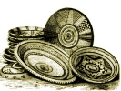
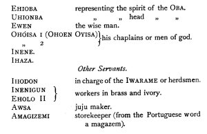
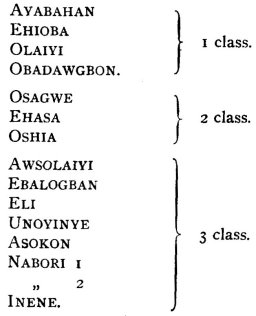
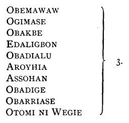
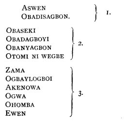
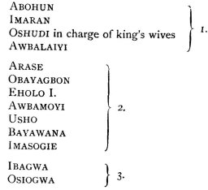

  
[Intangible Textual Heritage](../../index)  [Africa](../index) 
[Index](index)  [Previous](mind16)  [Next](mind18) 

------------------------------------------------------------------------

  
*At the Back of the Black Man's Mind*, by Richard Edward Dennett,
\[1906\], at Intangible Textual Heritage

------------------------------------------------------------------------

# CHAPTER XVII

# THE BINI

King and Constitution. -Native Ideas.-The Queen Mother and the King-His
Attendants. -Viceroys. -The War Chief. -Officers. -Titles of the OB.A.

ALL have heard of the massacre of Consul Philips and his unlucky
companions while on their way to Benin City, and also of the cleverly
managed expedition under Adrniral Rawson, sent by H.M. Government to
punish the King of Benin for his treachery, so that these notes scarcely
need. any introductory remarks so far as the place is concerned. Those
who take a deeper interest in all that has been written and said about
Benin must read *Great Benin* by Ling Roth, or the *Antiquities of Benin
City* by the late General Pitt Rivers, etc.

The few notes that I have been enabled to gather directly from the
natives of these parts may perhaps serve to further illustrate some of
the subjects touched upon by my predecessors- in this field, and to show
that what Mr. Ling Roth calls *jujuism* in reality corresponds to
Nkici-ism and the higher religion of the Kongo rather than to Ndongoism.

As to the natives themselves it is quite inconceivable how they could
have acted in the barbarous way they are said to have done a few years
ago, for they seem to the writer to be a peculiarly happy and pleasant
people to dwell among. The present UNWAGWE'S grandfather was killed by
the OBA for refusing to join in the expedition against Consul Philips,
and it was only under great compunction that old EZOME or OJUMO was
forced to join at the last moment, so that perhaps it was more as a duty
than anything else that the people joined in this disastrous march
against an unarmed and would-be friend.

Politically H.B.M. Government has preserved as much as possible of the
native form of government, and the country is virtually governed on
native lines by the so-called Benin City chiefs (who for the most part
were the OBA'S tax-gatherers).

But all Europeans must suffer from the want of knowledge of what "native
lines really are," and if the natives are not governed more nearly on
their own lines than at present it is generally because a few
self-seeking natives, always to be found in the beginning of changes,
are apt to wilfully misguide the white man where those lines oppose
their own personal interests.

The public spirit of the chiefs in this district, however, is very
remarkable, and little by little as the European's knowledge and
accumulation of facts increase, great things are to be expected,
especially if Benin City is to be as lucky in the future as it has been
in the past in its Residents and District Commissioners.

H.B.M. Government has a great opportunity of studying the constitution
of a really African native state in the Kingdom of Benin, and if its
officers continue to be of the right sort and the susceptibilities of
the chiefs are not ruffled by the thoughtless action of one of the rough
overbearing "I'm your conqueror" class of men there is every chance of
our having in Benin City a very perfect model of how an African state
can be governed by a European government.. On the other hand, if the
susceptibilities of these now public-spirited chiefs are injured by our
riding rough-shod over what they consider most sacred, *i.e.* their
religion, their form of goverment, the integrity of their kingdom,
bounded as it is by their sacred rivers, they will draw in their horns,
as it were, and we shall never be able to help them again to govern
their country on intelligent and non-barbaric lines. And if it is
possible to obtain such a working model it will become an excellent
school for those officers who may be destined to reduce chaos into
something like order in countries like those of IJAWS and SOBOS, where
at present no form of government (save the village form) appears to
exist.

The words of that great lady, Mary Kingsley, so interested in the
welfare of the Africans, keep on reminding us of our duty in this
matter, where she says-"I cannot avoid thinking that before you cast
yourself in a whole-hearted way into developing anything you should have
a knowledge of the nature of the thing as it is on scientific lines."

As in the formation of most African governments, there is a link with
the past in the Bini constitution.

The Queen mother, IOBA, has her residence just outside the walls of
Benin city, at a place called SHELU, on the YIRA, or north road. As the
dowager Queen she maintains a Court of her own composed of-

1\. AMOMA, her so-called wife.

2\. AMADA, her naked boys.

3\. The chiefs fulfilling the offices of IWEBO (equity), IWASE (medicine
men), IWEGWE (Commons), and IBIWE (Lords). We will explain these four
offices when we consider them under the King.

IOBA had the right to sacrifice human beings.

It is said that, accompanied by four pairs\[1\] of chiefs, one of the
six sons of AWYAW, called BINI by the Yoruba historians, came to Benin
city by the YIRA road, through SHELU, and asked CIGIFA\[2\] for a place
where he might reside. CIGIFA is said to have given this son of AWYAW
that part of the city that he and his people had vacated owing to
sickness. After a time this prince declared that the smell of the place
disgusted him, that he could not speak the language of the EFA, and that
he purposed leaving them. This he did by the UDO road, returning thereby
to UHE or IFE, the sacred capital of the YORUBA. But before leaving he
informed CIGIFA that a certain daughter of OGIEGAW was in child to him
if they wished to put anyone in his place. This son was called EWEKA
(because he clasped or joined the two people together). He was the first
OBA of the Bini, and the present deposed OBA Overami traces his ascent
to him.

\[1. EZOMO - EDOHAN.

IHOLO - OLOTTO.

OLIHA - INE.

ERO - ELEMA.

2\. They say that he found OGIFA accompanied by AZELE and OGIAMI
accompanied by IHELIGO.

OGI'FA=OGTE the king of EFA the people.\]

The OBA'S throne or chair was placed on a platform of mud three steps
above the ordinary level of the ground; this throne was called EKETE.

The OBA'S official dress was of beads and composed of

1\. ERUIVIE bead crown.

2\. ODIGBA broad collar.

3\. EWIVIE bead coat.

4\. ERUHAN skirt.

5\. EGWUNBAW bracelets.

6\. EGWONWE anklets.

7\. EBE a flat kind of knife in his right hand.

8\. ERIGO a two-forked instrument in his left hand.

But you have seen representations of him in brasswork (see Plate VIII,
Fig. 3, *Antiquities of Benin City*), so that further description of him
is unnecessary.

Neither need I dwell on his atrocious despotism, which finally brought
him to ruin, and disposed H.M. Government to place the people of this
kingdom under its protection.

The OBA'S immediate attendants may be recognised by the custom of
wearing their back hair divided by three partings, a custom they enjoyed
with the OBA and IOBA. Their names were as follows and their title
OGBON:-

 

 

The sons of the OBA were, and are still called OBIOBA, and of these the
eldest is entitled EDAIKIN, and had his residence between the SHELU and
IKPOBA roads. The other sons were sent out as viceroys to govern
different districts or collection of towns, and became known as OGI'CI.

Thus we have these OGI'CI (or viceroys who were succeeded by their sons)
still ruling over the districts which were once given to the CIBIOBA, in
the same way as in the Kongo.

In the case of the present deposed OBA CIVERAMI, EGWABASIMI should be
the EDAIKIN and OSWALELE is an OBIOBA. The daughters of OVERAMi are
EBAHABUKUN, OMONO, and GRINYAMI. These women may choose their own
husbands, and when widows may cohabit with whom they like. The children
of these daughters are called EKÃIWI.

The chief CISULA is the EKÃIWI of ADOLO, Overami's predecessor.

There are six great chiefs who may represent the OBA in one or other of
his six great estates; they are Ezomo (called also Ojumo), ERU (called
AIRO and ARO), OLIHA, EDAIKIN, OGIFA, IYASE.

Ezomo in the popular parlance of travellers in Africa is the "great war
chief," but as a matter of fact he combined with his office as head of
the war department an office nearly equivalent in a primitive kind of
fashion to that of the Lord Chancellor as head of the Court of Equity.
Among his followers was the famous general OLUGBOSHERI, who led the
troops against and massacred Consul Philips' expedition on its way to
Benin city. This office of general is hereditary, and OLUGBOSHERI'S son
under the OBA's reglime would have succeeded to his father's position.
Ezomo was the only great chief who gloried in a "court" similar to that
of IOBA, that is to say he was followed by his chiefs and followers
under the offices of IWEBO, IWEGWE, IBIWE, and IWASE. ERU\[1\] was a
great judge a kind of Lord Chief justice with all the policemen at his
call. OLIHA must have been a kind of Archbishop of Canterbury,

\[1. ERU is spoken of as ARO or AIRO.\]

as he crowned the king. The above three great chiefs had the right to
sacrifice human beings.

EDAIKIN, as the eldest son, represents the state and medicine men
outside the compound of the OBA.

OGIFA\[1\] is said to represent all the people. He is the direct
descendant of the OCIFA who was in the city when the son of AWYAW first
came. He may be said to hold an office some, what like that of the
Speaker of the House of Commons. He used to call the people together for
great palavers, etc.

All the above great chiefs are succeeded by their sons in their offices.

IYASE\[1\] or IYASERI is head of the nobles or EGA-IBU such as IHASA,
ESAWN, ESOGBAN, and many others. He had three immediate followers
CISUMA, ESOGBAN, and ESAWN. He could pick men out of the different
classes of chiefs and make them EGÃIBU. IHASA, for instance, was serving
under UNWAGWE, the chief of the IWEBO, and was thus ennobled or made an
EGÃIBU by IYASE. IYASE is not succeeded by his son, but is chosen by the
OBA from one of the great chiefs of the kingdom. He was also regent on
the OBA'S death or during his absence.

All these foregoing six viceroys were paramount without the compound of
the OBA, but within that enclosure the heads of the following six
offices were paramount:-

The six great offices in the OBA'S compound were the IWEBO, ABIOGBE,
IHOGBWI, IWASE, IWEGWE, and IBIHE, representing in a primitive fashion,
equity, justice, Church, State, Commons and Lords. Each of these offices
was filled by a pair of great chiefs and their followers, who were of
four grades more or less according to their wealth.

1\. Those who could sacrifice one cow to their father and one to their
mother.

2\. Those who could sacrifice one cow to their father and a goat to
their mother.

3\. Those who could sacrifice goats.

4\. The rest who could sacrifice fowls.

\[1. These two chiefs had the right of sacrificing one cow to their
father and one cow to their mother.\]

The office of Iwebo was in the hands Of UNWAGWÉ and ELIBO\[1\]. When OBA
made father, it was UNWAGWÉ who brought him the cowries (IGO) to be
sprinkled with chalk, and the beads that were washed in the blood of the
human beings sacrificed. These two chiefs also acted as arbitrators
within the compound of the OBA. Some of their followers were as under:

 

ABIOGBE.-This office is in the hands of \[1\] OKAIBOGA 1 and OKAIWAGGA 2
and their follower OKADOGIRA 3. All land questions were in their hands,
and it was OKAIBOGA who conducted the sons of the OBA to the different
countries where they were destined to act as viceroys. Until H.B.M.
Government took over this protectorate this chief used to receive yearly
presents from the viceroys thus inducted. The above pair were in charge
of the policemen called OKOW.

IHOGBWI.-This was the office of sacrificers and was in the hands of
IHAMA 1 (whose son succeeded him in office) and SIGHURE 2, with their
assistant, LEGAMA 3.

IWASE.-This was the office of the learned doctors and

\[1. The numbers after the names of these officers mark their class.\]

medicine men, and it was held by the pair, IGWESIBO 3 and OGIEMESE 3.
Their followers were:-

 

 

The two chiefs at the head of the office of IWEGWE were ISIRI and
BAZILU. These chiefs and their followers had to look after the household
or the common wealth of all. Under them were the OKA, or headmen. They
used to go, with the OBA to his farm at harvest time by the HUMIDUMU
(headquarters) road, and help in the "play" that was there enacted. Some
of the great IWEGWE were as under:-

 

The office of IBIHE was confided to the care of INE (YAMO) and
OBAZWAIYI. They had to keep the OBA supplied with wives and slaves, and
were, generally speaking overlords. Their followers were

 

 

All these chiefs had the right to wear the broad bead collar called
ODIGBA.

They were not succeeded in office by their sons, but if the sons were
wealthy they had the first refusal of the office. Their offspring
belonged to the class in which their fathers served. Thus all children
of the chiefs under the office IBIWE were IBIWE, and so on. The OBA,
however, took people out of one class and put them into the other.

No one could approach the OBA save through one of these chiefs,and all
tribute (IDIGWE) was paid to the King through them. They received for
their trouble 25 per cent. of the whole amount brought in. These
tribute-receiving chiefs were called NOTWEYEBO. Each of them had boys of
their own in the towns thus paying tribute, and they were called
OKUSHUEBO.

The OBA's ambassador was called OKAWBA.

The BINI kingdom then was governed by the OBA through six offices by two
kinds of chiefs, *i.e.*, pro-kings without the walls of his compound,
and six pairs of chiefs acting as assessors within the compound. So
that, bereft of attendants and followers, the constitution (EVIUMBA) of
the Bini government resolves itself into the following formula:

The OBA as head of six departments (represented at times by the six
pro-kings).

Six pairs of assessors representing six offices.

The titles under which we hear of the OBA of the BINI spoken about are:-

OBADUDUDU, perhaps the Oba of Heaven, the name of the supreme goddess
among the yoruba ODUDUA.

ENONYAGBON, the lord of the earth.

AGBAGE LO GI' OLUKUN, the offspring of OLUKUN that we all want to see.

OGIE NO GBOMA ADENUWUIGHOMA, slayer of men who do not want to die.

AKPOLPOLO, the biggest one.

ELIMIDU, the oro whip.

OBA, emperor.

ADIMILA O SAKEJI, second to God.

Thus among the Bini, as among the Bavili, we have two great courts,
first, the OBA ruling in person under six great titles, helped by his
twelve assessors, and second, the twelve under the regent IYASE or
IYASERI and the pro-kings. If, then, the writer is correct in believing
that this form of government among the Bavili is the product of
NKICIISM, which includes the seasons, we may expect to find traces of
this philosophy among the Bini.

------------------------------------------------------------------------

[Next: Chapter 18. Benin Districts](mind18)

