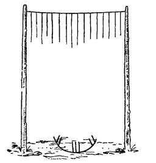
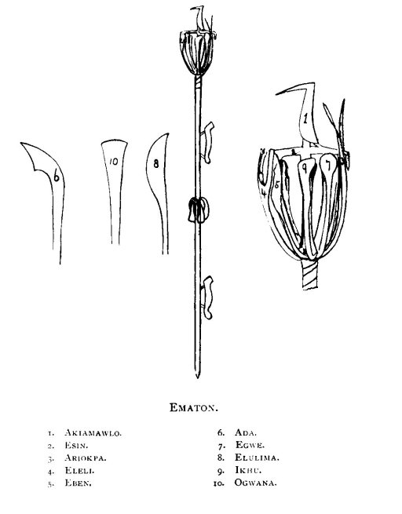
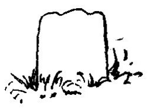
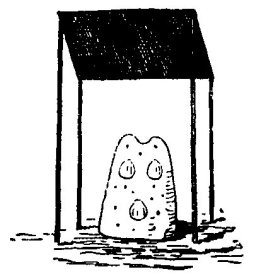
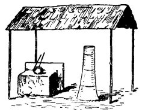
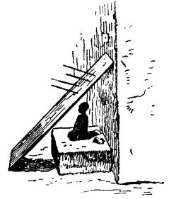

  
[Intangible Textual Heritage](../../index)  [Africa](../index) 
[Index](index)  [Previous](mind18)  [Next](mind20) 

------------------------------------------------------------------------

  
*At the Back of the Black Man's Mind*, by Richard Edward Dennett,
\[1906\], at Intangible Textual Heritage

------------------------------------------------------------------------

# CHAPTER XIX

# BINI CUSTOMS

Some Bini Fetishes or Jujus.-EMATON. -The Phallic Pillar, God and the
Devil. - Marriage Customs.-Secret Societies.

THE Bini call a wizard AZE but the Jakri word is OLOTCHO which is not
very different from the word used by the BAVILI, *i.e.*, NDOTCHI. A
person accused of witchcraft is given the bark of the INYI pounded up
together with water. If the accused vomits he is considered innocent, if
he does not the poison generally kills him, and his guilt is thus
proved.

The drum language does not appear to exist much north of Old Calabar,
and the Bini will tell me nothing about it.

When the OBA makes father (Ezimi) the big thick looking drum beaten in
the father's house is called EKUN ALWERA.

Then the musicians carry:-

<table data-border="0" width="638">
<colgroup>
<col style="width: 33%" />
<col style="width: 33%" />
<col style="width: 33%" />
</colgroup>
<tbody>
<tr class="odd">
<td data-valign="TOP" width="33%">
Two long drums
</td>
<td data-valign="TOP" width="33%">
called IDAN
</td>
<td data-valign="TOP" width="33%">
tum tum
</td>
</tr>
<tr class="even">
<td data-valign="TOP" width="33%">
One small     "
</td>
<td data-valign="TOP" width="33%">
    "   UKE
</td>
<td data-valign="TOP" width="33%">
short drum like 
ours in shape.
</td>
</tr>
<tr class="odd">
<td data-valign="TOP" width="33%">
One medium     "
</td>
<td data-valign="TOP" width="33%">
    "   IGEGAN
</td>
<td data-valign="TOP" width="33%">
"     "
</td>
</tr>
<tr class="even">
<td data-valign="TOP" width="33%">
One large     "
</td>
<td data-valign="TOP" width="33%">
    "   IMIGAN
</td>
<td data-valign="TOP" width="33%">
"     "
</td>
</tr>
</tbody>
</table>

Road jujus are called MWIHEYO.

|                         |            |
|-------------------------|------------|
| Cowries represent the   | EBAMI AKE  |
| A big stone  "      "   | OKWHAIHE   |
| Pebbles        "      " | OVIA       |
| A spoilt gun  "      "  | OGUN (war) |

 

And when the people hear or notice that a road has a MWIHEYO put on it
they talk of the road as ULAWMA.

Osun are Jujus to which certain Doctors or Obos are attached.

Some times as you are marching you will notice a bunch of leaves tied
together fastened to a branch of a tree, this they call ESHU SHU, which
might be translated little devil, and may be the origin of the word JUJU
used here much as the word fetish is south of the equator.

A fence made of Kola saplings, planted four or five feet apart, tied
together with native string, screens a tree with a

 

OMEY, entrance to AROVIA, a grove sacred to OVIA, Similar to MABILI in
the Congo, with chalk marks as above in half circle on the ground in
front of entrance.

piece of cloth wrapt round it, and bottles, wood, and cones of chalk at
its root is called EKEJI.

OMEHU is a tree found near most villages with a collection of ant-hills
heaped about its roots. They say this is to make women bear children.

At IGUSALA there is a double IKHIMI tree growing behind a nicely kept
fence, with a strip of cloth round it. Between its buttresses are a pot
of water, a drinking cup, shells, the bark of a tree, AWAWA (spoon bill)
and goats' heads, and nearly round its base are seats for people to sit
upon. While under a little shed, upon a wooden grill, rest great lumps
of EKWHA (a kind of pudding made of the bean-like seeds of a tree) being
smoked by a fire underneath them.

In the forest between ADENYOBA and ITE is a sacred stone called OKUTA.

On the Sapoba road there is a tree with the usual mound of earth and
cowries in front of it, planted they say to mark the place where the top
of Ezomo's ladder fell. The story goes that this great war chief heard
it thunder and wanted to know what enemy of the Oba's it was who
evidently wished to fight him, so he built a ladder to reac:h up to the
heavens. When he and all his people were on the ladder and just

 

OMEHU, ant-hills placed at foot of tree near any village.

getting at the home of thunder, it gave way, and the top end of it fell
where the tree is growing, about three miles from Ezomo's house.

Near to these sacred spots you will often find pots of water and cups,
or yams or bananas, with the price in cowries against the cup or the
food to be sold. I have never known these silent markets abused.

The people swear by licking and touching stones, iron, cowries, bits of
twisted rope, and the crushed dried leaves of a plant, asking these
things to kill them if they are not telling the truth. These swear jujus
are called EKHWAÏ, and there is generally an EKHWAÏ in connection with
an CISUN.

The only fetishes into which nails, etc., are driven which the writer
has noticed are two very old ones preserved in the temple to
OLUKUN.\[1\]

The EMATON (the thing you keep on digging) is a very important CISUN
among the BINI, quite a number were found stuck into the ground near to
the King's palace.

 

The EMATON (Pl. XVII) is an iron staff ornamented with two figures of
the chameleon, the signs of wisdom, one just above and one below four
leaf-like figures pointing downwards representing AJA, or that knowledge
of medicines and lore supposed to be taught to man by the fairies who
take certain people into the bush for this purpose. Then opposed to the
AJA at the top of the staff is a bunch of figures surmounted by the
representation of a horse and a bird.

This bird they call the AKIAMAWLO, which translated means-There existed
previously the continued state of the living thou and him.

The figure of the horse bearing the bird stretches across the circle of
figures to points between the two prongs of two figures. They call this
ESIN (the act of exposing to sight). The figure marked 3 on the sketch
represents the two tail feathers of the bird called ARIOKPA (the first
one who sees). This bird is also called IFE or love, and IFE is, as you
know, a town in Yoruba land, from which all people are said to have
Come. (Can this mean that the BINI believe themselves to be the children
of the spirit of light and love?)

The above, like Mawalala, stand outside the formula.

Category 1. Figure 8 is meant to represent that semicircular knife which
is used to separate the skin from the body of the yam and is called
ELULIMA, the act of having to keep on boring (the Bavili look upon the
sky as solid, and so do the Bini, in the sense that a roof is solid).
This semicircular knife, then, conveys the idea of " the heavens."

Category 2. Figure 7 represents the flat round hoe with which they hoe
the earth, and they call this figure EGWE, the act of being.

\[1. See OLUKUN.\]

Category 3. Figure 10 represents the axe OGWANA (the relative in law of
OGUN, the Yoruba "power" presiding over implements of war and hunting).
The story says that an old lady who would cut wood on their first day
(=Sunday) was banished to the moon. OGUN =blacksmith who by the help of
fire makes his implements.

Category 4. Figure 9 represents the machet called IKHU (the act of
cutting up the dead wood, which is a motion).

Category 5. Figure 5 represents the flat (fish-knife-like) knife that
the Oba of Benin used to carry in one hand. It was held upwards towards
the heavens when the King made a prayer of supplication, and is called
EBEN, connected with the word EBAW, sacrifice or offering, and the Dove.
I am not at present able to associate this knife with harvest.

Category 6. Figure 6 represents the knife used by the Oba to slay men or
animals for sacrifice, and it is called ADA (one who propagates) This
certainly entails suffering. And finally we come to the two-pronged
figure joined as it were to IFE, which is called ELELI (the witness who
speaks).

Thus was the Oba as God's representative on earth reminded of his
descent from God through IFE, and so did the EMATON convey to all who
chose to look at it that man is of spirit, body, and mind, and that
there are three distinct kinds of knowledge, *i.e.* that which he
receives directly from God, that which he obtains from his animal
nature, and that which he is taught by the elf AJA.

## THE PILLARS IKO (MEETING) AND OYISA (GOD).

At a town called EBIYAWMALO, which I visited in company with Dr. A. G.
Christian, we noticed a pillar (PI. XVIII) in

 

Pillar, or IKO, in front of meeting-house at EBIYAWMALO.

front of the native Court-house, and the chief told us that it was
called IKO (a meeting).

Not far from here we noticed a hollow pillar under a small shed, and the
chief of the place called that IKO also. This

 

A hollow clay pillar, IKO, at OKPWEBO, with three Achatena shells
inserted in it.

pillar was of red sun-dried mud, and three shells were fixed in the mud
on the side of the pillar exposed to our view.

Then at ADENYOBA near the OVIA river there is an altar

 

Pillar, called OYISA, and altar with IKHURE sticks and pot of water on
it at ADENYOBA.

to OYISA placed under a shed, by the side of which is an ornamented
whitewashed pillar or IKO.

In the bush near to the village called OVA there is a stunted

 

Squat pillar at OVA, called ADAMBI, said to be female.

squat kind of pillar which they call ADAMBI and described as a woman
"Juju."

Then at OWO, in the Oba's Palace yard, I noticed a pillar, and the king
called it OROBALE (which might be translated the husbands' ward).

Then, proceeding farther away from the sea into the KUKURUKU country at
ISULE, the Conservator and self noticed a triune pillar under a little
shed, the figures being back to back and those of two males and a
female. This the Chief called BABATCHIGIDDI (or earthenware image of the
father).

But shortly after this we entered the village of IÄIU, and. on the stone
plateau near to the chiefs house our attention was drawn to three
grass-capped figures (Pl. XVIII*b*), two being of solid clay, while the
third was simply formed of two upright sticks with a grass cap on it.
These figures the chief called ESHI, which was interpreted as being
equivalent to the Bini word Esu or ESHU (Devil). On the other hand,
three fig-trees growing out of platforms of loose stones collected
together close to these figures they called OYISA or God.

At ATEYI there is a figure standing on a platform outside a

 

A small wooden figure and two pieces of ironstone outside wall of house
on a clay platform with a board with pieces of iron driven into it in
front of it. The figure is called ESHU, and represents the Devil.

house, by the side of which are two pieces of ironstone, and they called
this figure ESHU.

Then all juju houses have an altar to ESU outside, while those whose
houses own the "Juju" AWLOMILA (a small basin containing the nut
IVIAWNOMILA in a piece of cloth) may also have an altar to ESU outside
their houses.

They say that OYISA is a trinity composed Of OYISA or

|                     |                              |
|---------------------|------------------------------|
| O'SA'LUGIMAIYI\[1\] | the King of us all on earth. |
| O'SA'LUBWA          | who made us to be.           |
| O'SA'LOGODWA        | the queenly mortar of being. |

And that he had a son called ESU, or ESHU who is also a trinity composed
of

|        |                                   |
|--------|-----------------------------------|
| ESHU   | the Devil connected with mystery. |
| OLUKUN | the teacher.                      |
| OGYUWU | the King or Queen of Death.       |

When OSALUBWA was making man he left him in an unfinished state: Esu
came along and finished him according to his ideas. OSALUBWA returned,
and was much annoyed, and banished Esu to the east, where the Sun comes
from (ANIMINIHIA MIVI).

From this it will be noted that while trees symbolise the triune God the
Creator, the pillars represent the so-called Devil or procreator in
three parts also.

## MARRIAGE.

There appear to be two kinds of marriages among the Bini.

Among the upper classes the children are betrothed by their parents from
infancy. The present may be a nominal one, such as four kolas, three
cowries, and some palm wine, or it may be more.

The man is supposed to keep on giving the child betrothed to him
presents until she is grown up; he also makes her parents gifts. The
seduction of such a betrothed girl is heavily punished. On the other
hand, among the poor the girl is not necessarily betrothed, and a man
may seduce her without legal punishment.

The man may refuse to marry his betrothed, and then he

\[1. =Ogie x Oyisa x Lugimaiyi

royal self     god       earth.\]

has the right to give her in marriage to anyone, unless she is of noble
family, when she can only be given to a free man.

The girl may not refuse to marry the man to whom she is betrothed, or
his chosen representative; but the father may at any time refuse to give
his daughter to her betrothed, when he has to refund to him all the
presents the would-be husband has given to her and her parents.

When his wife conceives the husband gives her a cock to sacrifice.

The son marries his deceased father's wives, who have not borne children
to him.

After the birth of a child, the father gives the mother another name;
the child also will give her mother a name, a friend will also name her,
and so one often hears a person spoken of by two or three names.

Very few women in this country are true to their husbands, many of them
having at least one lover. When a child is born the woman does not
declare who its father is until her husband is dead. Many women live
openly with their lovers; the great majority of cases in court are for
return of wife, and many women prefer to go to prison than to return to
their legal husbands.

Often on the roads one passes a small tree planted by the side of the
road, near where are chalk marks and a mound of earth, cowries, yams,
and plaintains. This tree has been planted in memory of the fact that
some woman or other has brought forth a child on that spot.

## SECRET SOCIETIES.

The object that most of the secret societies round about Benin seem to
have had at heart was to check the despotism of the rulers of the
people, but often the ruler himself became a member of the society, and
thus as its leader secured its services in furthering his own despotic
ideas.

The Beni call their society IGWOMORI, and it is said that while still a
prince the late OBA OVERAMI became a member of it. The first crime this
society committed was on the death of OBA ADOLO and crowning of OVERAMI,
and, at the latter's suggestion, to execute all the late ADOLO'S
councillors. OVERAMI then placed many of the IGWOMORI, sons of the
lately executed councillors, in their fathers' place.

The secret society of the ISHAN people played a great part in defending
the Benin City chief ABOHON and other refugees after the British had
taken Benin City in 1897-8.

There are secret societies at OWOO and AKWE.

The SOBO Society is called OTRADA, that at IFON, OTU, while we have only
just had a sad experience of the influence of the EKEMEKU, or the Silent
Ones, in the hinterland of ASABA.

In an interesting article, dated May 13, in the West African Mail, Mr.
Hughes, an earnest student of African customs, writes:

"The EKEMEKU Society has for long been in existence. The aim and idea of
its establishment was-

"1st. To settle any tribal differences amicably.

"2nd. To uphold the law and institution of their countries according to
rights of usage.

"3rd. To prevent any oppression by their kings and chiefs.

"Of late the EKEMEKU Society has become composed for the most part of
the younger and more lawless elements, who hold their meetings at night,
who work by secret methods, and who are a continual source of terror to
the more peaceful natives, whom they compel by threats of death to
contribute to their society."

On page 65 of Great Benin, Mr. C. Punch is made to say:

"I should imagine the Bini would have the ORO fetish, etc. The Bini call
this whip ELIMIDU, and it was given to the OKIASON (OKERISON) by the
OBA. From the season IHAW to IGWE, men desirous of obtaining a title
roamed about armed with an iron instrument, by means of which they
endeavoured to kill seven or fourteen people. As witness of their
prowess they presented the OBA with the dried breasts of the women and
the dried penis of the men they had killed. With these parts of the
slain men and women the OBA is said to have made certain medicine for
fetish purposes. To give these "braves" a fair chance to accomplish
their task, the OBA made the chiefs bring all their people to dance in
his compound every night. The "braves" ran a great chance of being
killed themselves, for it was known that they were about, and naturally
the people kept their eyes open. Should one of these aspirers to the
rank of nobility be killed by the man attacked, the latter took
possession of his dried trophies, and continued the process of killing
on his own account.

If a person attacked by one of these people had the presence of mind to
cry out the words OGED' EGBOMA AYAN AKPWOKA WAW GAPOKAI (something to
the effect that plantains do not kill a man in the day time) it was a
matter of honour not to kill him.

The noise of chain and brass anklets as a woman ran away was also a
life-saving sign.

When these men had presented the OBA with these parts of seven or
fourteen persons the OBA gave them the coral necklace, bracelets, and
anklets as a sign that they had become OKIASON; IDUN OHOGBI was their
chief, and they lived in OBAYAGBON's quarter.

------------------------------------------------------------------------

[Next: Chapter 20. More Customs](mind20)

