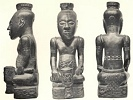

  
[Intangible Textual Heritage](../../index)  [Africa](../index) 
[Index](index)  [Previous](ram14)  [Next](ram16) 

------------------------------------------------------------------------

[Buy this Book at
Amazon.com](https://www.amazon.com/exec/obidos/ASIN/0837115507/internetsacredte)

------------------------------------------------------------------------

  
*Religion and Myth*, by James Macdonald, \[1883\], at Intangible Textual
Heritage

------------------------------------------------------------------------

p. 204

### CHAPTER XIII

##### COURTESIES OF LIFE—DRESS

A more savoury subject than public
morality is courtesy, which in Africa is all that could be desired.
Hospitality hardly knows any bounds, and the chief who receives a
stranger as his guest treats him with courtesy and kindness. Many
chiefs, on the great caravan routes, are now demoralised quite, and
demand blackmail as one enters their territory, a demand sure to be
repeated as he leaves. Man in the early days of the world regarded his
neighbour as having a claim upon him, and in the age of hunting, food,
while it lasted, was practically common property. To this day in times
of great scarcity food is hardly ever stored up by families for their
own use; they share it with their more needy neighbours. They reason in
this way:—The gods are good to men. They give them their food. They
watch over the actions of their children, and as the fathers, who are
now above, were good and kind to the stranger and the poor, it is their
will that their children should obey custom. The whole of the past is
wrapped in a halo of glory which myth weaves round it, and each man
feels that he falls short of the ideal life if the stranger leaves his
house hungry or empty-handed. When the native bards

p. 205

sing the praises of the mighty dead, their deeds of valour occupy a
secondary place, as if that were the necessary accompaniment of
hospitality and the courtesies of life to the hungry wayfarer.

The king, as the father of his people, is responsible for village
hospitality, and by a kind of fiscal arrangement he levies a tax for
this purpose on those of his people best able to bear a burden. His acts
of kindness to strangers are representative acts, and any failure on his
part is a disgrace to the tribe. [\*](#fn_199)
I remember once visiting a man of some local standing. He sent me a fowl
for my supper, and the councillor who brought it seemed to be ashamed of
his commission. Little was said, but I felt the reception I met with did
not promise success to my mission. I was mistaken. After the clatter of
tongues by the camp fire ceased and all was still, the door of the hut I
occupied was cautiously opened, and the councillor who had brought the
fowl entered. In a low whisper he said, "Here is meat," at the same time
taking a whole sheep's carcase from a young man who accompanied him. I
asked what it meant; and the old man's reply I shall never forget, "It
is," he said "nothing. You have bought it. Brandy has killed my chief."
Here was loyalty; loyalty to a chief whose whole soul was in strong
drink, to the neglect of all the functions of royalty. He, as a
councillor, could not offer to do what his chief neglected, but his
sense of honour, and particularly the honour of his chief and tribe,
prompted him to do by stealth what he felt was necessary to uphold
ancient tradition, though

p. 206

by doing it he put his neck in some danger. Very pathetic too were his
words, Brandy has killed my chief." The chief had not changed; had not
neglected the stranger; did not forget the honour of his tribe. No. He
was dead, that was all, and for his dead chief this loyal man did the
courtesies of hospitality.

Philosophers and traditional theologians never weary of discussing the
savage's moral sense and his innate ideas of right and wrong. They find
it difficult to agree as to whether conscience is an inherent faculty,
uniform in its manifestations among all classes and conditions of men,
or an education of the moral sense which is capable of development
according to man's stage of progress. I am not a philosopher nor a
professed theologian. I am simply an observer of facts as these are met
with every day in Savagedom. But as an observer I have often puzzled
over the philosopher's right and wrong, and the ideas attached to these
terms; over his uniform manifestations, and the theologian's sweeping
generalisations regarding all classes and conditions of men. I have
wondered whether the philosopher's ideas of right and wrong are based on
our Western conceptions—saturated as we have been by centuries of
Christian ethics—of a well-ordered state and social system, or whether
he would admit the Mosaic code as a correct expression of the innate
ideas of right and wrong among the Jews at that time. And if so, whether
conscience as such, apart from education, can have anything to say to
such questions as arise about a plurality of wives, for example? I

p. 207

have asked in vain if the traditional theologian would admit within the
sphere of men acting according to their conscience, those who give their
property, their subjects, and even their children to propitiate gods
which to us are purely imaginary? Or whether we must regard them as
wilfully violating the most sacred instincts of human nature in
obedience to requirements which their sense of right and wrong calls
vanity? Here again one asks, and asks in vain. No light is offered, or
it is deeper than the mirk.

The one thing of which I am certain is this:—That these African races,
whose religion we have been studying, not only profess their faith in
its doctrines but really regulate their conduct by them, and that down
to the minutest details of life. Their philosophy may be crude, but it
is a philosophy. Nor is it altogether a false philosophy. It is the
premises that are wrong, not the conclusion. It is their want of
knowledge, not their lack of moral purpose. Their religion may be worse
than none, but it is the form of it and the channels in which it runs
which vitiate it, for the sincerity of the worshippers is infinitely
more real than that of men who meet in Christian temples or worship God
by proxy. The code of ethics practised by primitive man may shock our
sensibilities, but he has reached it slowly, painfully, and prayerfully
notwithstanding. To him religion is no pastime with which to amuse
himself, but a matter of the most terrible reality; a matter on which
depends his present fortune and his future place among the ancestors.
Does he bring his women

p. 208

to market? He knows no better way, and must observe the prescribed rule
for his own protection and theirs. Is his slain enemy's heart found in
his broth pot? This is not necessarily for love of human flesh, but to
give him qualities which will ensure his own and his tribe's safety in
war. Cannibalism I regard as a late development relatively; a taste
acquired in times of famine when men died like sheep and were devoured
by their famished companions. This opinion I base on the partial
distribution of the practice and its entire absence among most of the
older races with which we have, in recent times, been brought into
contact. For example:—

The Monbutto have no domestic animals, except dogs, and they are among
the most pronounced cannibals in Africa. Such a people would suffer
terribly if the crops failed even for a single season, and a succession
of bad harvests would reduce them to actual starvation. What more
natural than that this practice should have originated during a period
of dire distress and want, and so became a national habit almost
unconsciously. Stanley's forest cannibals seem, so far as we know, to
depend entirely on vegetable substances for food. To them a few seasons
of drought might mean extermination if they did not resort to human
carrion. Abnormal developments do not belong to the ordinary progress of
thought as I have attempted to trace it; and the acts to which necessity
has driven civilised men should warn us against hasty conclusions.
Especially should it warn us against assuming that cannibalism

p. 209

was derived from any system of philosophy rather than from necessity and
dire distress.

When primitive men walk abroad in nature's robes, and women adorn
themselves with a tail of grass behind their backs as their sole garment
after the manner of the Baris, [\*](#fn_200) we
are shocked at their immodesty, and cry out that they must be devoid of
all sense of morality. This is exactly what a Monbutto mother would say
to her daughter, if she appeared arrayed in the ample loin cloth worn by
her brother rather than in her own bit of leaf attached lightly to her
girdle. These are nature's own children doing nature's own bidding. They
are advancing by steps so slow as to be imperceptible, by the same road
by which our ancestors travelled thousands of years ago. They are at a
stage of development now corresponding to that of the remote ancestors
of the Ancient Greeks. To the primitive European, as to the primitive
African, a simple code of morals was not only sufficient, it was
complete, wise, and good; the will of the gods. Only as he advanced did
his moral perceptions grow, and so too will the primitive African's;
only let not the European expect too much, or look for permanent good on
a large scale from a precocious and abnormal development of an
individual here and there. Such individuals may do something within the
sphere of their personal influence to raise their fellow countrymen. But
only when new conceptions come to permeate the mass of the people, and
the new philosophy commends itself as true for all classes, can

p. 210

there be a general upward movement. Such movements, when permanent, are
by way of evolution rather than revolution.

We are far from exhausting the religious aspect of custom and myth when
we have disposed of public morals and the relation of the sexes.
Religion enters into the prosecution of the industrial arts and even the
amusements of life. The hunter has his religious rites which he performs
before he enters the forest, and after he kills the first animal of the
chase. His return from a successful expedition must be signalised by
performing ceremonial acts. Even the manner of carrying home the game is
prescribed by ritual.

When iron ore is dug and smelted, the smith must observe certain rules
and conform to the necessary religious observances. [\*](#fn_201) His forge must be placed at a distance
from the village dwellings, and no one dare approach at the critical
moment when the molten metal begins to flow, except those versed in the
mysteries of the art. [†](#fn_202) The fire
used to cook first-fruits must not be kindled by a vulgar brand snatched
from the domestic hearth, but must be sacred fire made by the magician
in the time-honoured way. [‡](#fn_203) While
the crops are growing and before the feast of first-fruits is held, no
forest tree may be cut, as that would be to wound the spirit of
vegetation, which, to primitive man, would be equivalent to wounding the
god.

The sanctity of fire I have touched upon only incidentally, but in
connection with it there is an

p. 211

elaborate ritual and endless restrictions. Fire as such is venerated. To
kindle fire in an enemy's country during war is to invite sunshine and
prosperity on one's foes. The sun is regarded as the father of fire. The
moon too has her votaries and the devil dances of the Damaras are
usually observed when the moon is full. So too the moon dances of West
Africa, where their devil-houses are roofed with human skulls. [\*](#fn_204) Dances before engaging in war are held
during moonlight, and must not be neglected on pain of defeat and dire
calamity. These and a thousand other minute observances enter into the
daily religious life of the African, as they do into that of all
primitive peoples. And the curious thing is, not that they resemble
customs once common among civilised men, for the human mind in its
search for knowledge works by the same methods in all lands, but that so
much of what is ancient, dating back far beyond historic time, should
survive among the nations of Europe.

A number of the observances referred to have been illustrated by
survivals in civilised countries. These could be multiplied almost
indefinitely. Even the Pondomise law forbidding the cutting of green
wood while the crops are growing, has, or had recently, its
corresponding custom in the remote Highlands of Scotland. I recollect
hearing a Gaelic rhyme which enumerated the trees which might not be cut
after "the opening of the leaf." The mountain ash, if to be used as a
talisman, must be cut "while the leaf is in the bud." The willow must

p. 212

not be touched "after April day." I have no means of recovering the
rhyme, but the woman who used to repeat it declared that in her younger
days its directions were always observed by "wise people," but were now
neglected by "a generation whose end was near." The worthy matron had
the reputation of "knowing more than others."

Another custom which survived in Scotland till within the last seventy
years, and which was doubtless a survival from very early times, was the
Tein egin or forced fire. This was kindled on Mayday, and each villager,
all domestic fires having been extinguished the previous evening,
received a brand from the sacred pile with which to kindle their
domestic hearths. Men who had failed to pay their debts, or had been
guilty of notorious acts of meanness were refused the sacred fire, and
this was equivalent to expulsion from one's club. It was for the time
social ostracism. Nor were our Highlanders ignorant of trial by ordeal.
They tied their witches hand and foot, after which they tossed them into
a pond. If they floated they were taken out as the oracle proclaimed
their innocence, but those of them who sank were allowed to drown. No
farther trial was needed, for the ordeal never lied. So, too, the Felata
of West Africa ascertains if the king's death was caused by his own
wives by giving each member of the harem a dose of poison. These same
Felata women, should they see the Juju or great fetish, when carried in
procession, had such accidents as occasionally happen to pregnant
mothers, and became sterile from that time. A similar fate

p. 213

happened to Highland women who saw the fairy bull. Blood brotherhood,
which is so common in Africa, bears a close resemblance to foster
brotherhood as between the heir to the chieftainship and the clansman
with whom he was reared. But to enumerate more of such minor customs
would be tedious. Their general tendency is all in one direction, and
goes to show how slow is the process of evolution through which
religious thought must pass before it reaches the higher conception of
one supreme God, and the substitution of a single Incarnation, revealing
the will of God to man, for the multitude of prophets who claim to hold
converse with the unseen. From the ranks of these prophets, as the order
recedes from its original ideal and purpose, men arise who strike into
new paths and lead their fellows into the light of a higher conception
of human life and the destiny that awaits humanity.

------------------------------------------------------------------------

### Footnotes

[205:\*](ram15.htm#fr_199) J. Sutton, M.S.
notes.

[209:\*](ram15.htm#fr_200) Felkin.

[210:\*](ram15.htm#fr_201) Myer,
*Killimanjaro*.

[210:†](ram15.htm#fr_202) G. M. Theal.

[210:‡](ram15.htm#fr_203) J. Sutton, MS. notes.

[211:\*](ram15.htm#fr_204) Waddell.

------------------------------------------------------------------------

[Next: Chapter XIV. Reforms](ram16)
