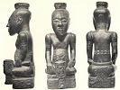

  
[Intangible Textual Heritage](../../index)  [Africa](../index) 
[Index](index)  [Previous](ram16) 

------------------------------------------------------------------------

[Buy this Book at
Amazon.com](https://www.amazon.com/exec/obidos/ASIN/0837115507/internetsacredte)

------------------------------------------------------------------------

  
*Religion and Myth*, by James Macdonald, \[1883\], at Intangible Textual
Heritage

------------------------------------------------------------------------

p. 235

### INDEX

Abyssinia, priest of Alfai,
[17](ram03.htm#page_17); Paganism in, [42](ram05.htm#page_42)

Accra, king's father's spirit causes earthquakes,
[177](ram12.htm#page_177); consequent sacrifices,
[178](ram12.htm#page_178)

Acts of worship, [184](ram13.htm#page_184)

Africans regulate conduct by faith, [207](ram15.htm#page_207)

Alfai, priest of, [17](ram03.htm#page_17), [18](ram03.htm#page_18)

Ancestors, worship of, [36](ram05.htm#page_36)

Animals, sacred, making compact by, [179](ram12.htm#page_179)

Ashantee, annual festivals of, [76](ram06.htm#page_76); messengers to
spirit land, [77](ram06.htm#page_77); dances and abrogation of law,
[78](ram06.htm#page_78)

Athens, [2](ram03.htm#page_2)

Australians, [9](ram03.htm#page_9)

Austrian, [9](ram03.htm#page_9)

 

Balaam, [100](ram08.htm#page_100)

Babylonia, temporary king crucified, [61](ram06.htm#page_61)

Bacchus worship, [47](ram05.htm#page_47) Balac,
[100](ram08.htm#page_100)

Balder, death of, [56](ram05.htm#page_56)

Bantama, festival, [79](ram06.htm#page_79); mausoleum of kings,
[79](ram06.htm#page_79); messages to spirit land,
[80](ram06.htm#page_80)

Baralongs, subjects, persons the king's, [14](ram03.htm#page_14);
oracles, [163](ram11.htm#page_163)

Barber's art, its dangers, [94](ram07.htm#page_94)

Bards sing of valour, [204](ram15.htm#page_204)

Baris, no clothing, [209](ram15.htm#page_209)

Bavaria, tree worship, [41](ram05.htm#page_41)

Bechuanas, [6](ram03.htm#page_6); religion, [38](ram05.htm#page_38)

Bedouins, fighting wind, [9](ram03.htm#page_9)

Bible, [224](ram16.htm#page_224)

Black art, votaries cast no shadow, [30](ram04.htm#page_30)

Bodio, house of sanctuary, [177](ram12.htm#page_177)

Bongo, expulsion of demons, [124](ram09.htm#page_124); oracle,
[163](ram11.htm#page_163)

Borgie, mermaid of, [191](ram13.htm#page_191)

Brahmanism, [167](ram11.htm#page_167)

Breton, fighting wind, [9](ram03.htm#page_9)

Brüd's bed, making, [141](ram10.htm#page_141)

Buddhism, [167](ram11.htm#page_167)

Bulgarians, making rain, [ix](ram02.htm#page_ix)

Bullfights, [137](ram10.htm#page_137)

Bullom, oracles, [162](ram11.htm#page_162)

Burmah, woman's position, [196](ram14.htm#page_196)

 

Calicut, king killed every
[twelfth](errata.htm#1) year, [29](ram04.htm#page_29)

Cannibalism, acquired taste, [208](ram15.htm#page_208)

Cattle-killing, mania, [69](ram06.htm#page_69)

Ceremonial, purity, [90](ram07.htm#page_90)

p. 236

Chief, loyalty to, [205](ram15.htm#page_205)

Circumcision, [44](ram05.htm#page_44); not performed with knife,
[46](ram05.htm#page_46), [90](ram07.htm#page_90)

Clothing, influence of, [219](ram16.htm#page_219)

Corn spirit, killed, [144](ram10.htm#page_144)

Corp Creadh, [3](ram03.htm#page_3), [4](ram03.htm#page_4)

Courtesies, [204](ram15.htm#page_204)

 

Dahomey, king's name not mentioned,
[14](ram03.htm#page_14); priest descends to lower regions,
[81](ram06.htm#page_81); king enters lower world in state,
[82](ram06.htm#page_82); demons driven out wholesale,
[105](ram08.htm#page_105); bestowing wives, [183](ram13.htm#page_183)

Dakota, gods of mortal, [96](ram07.htm#page_96)

Dances, moon, [42](ram05.htm#page_42); Ashantee,
[76](ram06.htm#page_76); warrior, [138](ram10.htm#page_138)

Death and sleep same, [34](ram05.htm#page_34)

Deification of king, [6](ram03.htm#page_6)

Demons, enter animals, [102](ram08.htm#page_102), expelled by magicians,
[102](ram08.htm#page_102); by guile, [103](ram08.htm#page_103)

Devils, doctrine of, [81](ram06.htm#page_81); "laid,"
[108](ram08.htm#page_108); "raised," [109](ram08.htm#page_109); driven
out by girls, [111](ram08.htm#page_111); incarnate,
[116](ram09.htm#page_116); water, [218](ram16.htm#page_218)

Divine man, killed to prevent loss of god spirit,
[28](ram04.htm#page_28)

Diviner, incantations, fear of, [161](ram11.htm#page_161)

Dinka, guarding against evils, [86](ram07.htm#page_86); expel demons by
guile, [103](ram08.htm#page_103) Doctor, witch,
[118](ram09.htm#page_118); rain, to

Dodola, [11](ram03.htm#page_11)

Dongolowa belle, how sought in marriage, [174](ram12.htm#page_174)

Dream, Kaffir, [65](ram06.htm#page_65)

Dress, Monbutto, [209](ram15.htm#page_209)

Drinking, King Chop, [178](ram12.htm#page_178)

Druids, Midsummer fires, [57](ram05.htm#page_57)

 

Egbo, concealed in an ark,
[25](ram04.htm#page_25)

Engai, creator of men, [13](ram03.htm#page_13)

Ergamenes, killed priests, [29](ram04.htm#page_29)

Executioners, how they procure sacrificial victims,
[75](ram06.htm#page_75)

 

Fairies, [130](ram09.htm#page_130)

Fecundity, [6](ram03.htm#page_6); goddess of, [42](ram05.htm#page_42)

Festivals, yam, [136](ram10.htm#page_136); Pondo,
[136](ram10.htm#page_136)

Fetish, human skulls, [47](ram05.htm#page_47); power,
[49](ram05.htm#page_49)

Finns, girls drive out devil, [111](ram08.htm#page_111)

Fire, sacred, not kindled, [211](ram15.htm#page_211)

Fladda, [9](ram03.htm#page_9)

Funerals, mock, cheating the devil, [155](ram11.htm#page_155); Congo,
Uganda, killing of wives, [156](ram11.htm#page_156)

 

Gallas, kill the king every eight years,
[26](ram04.htm#page_26); priests, snake mother of men,
[40](ram05.htm#page_40); sacrifices, [41](ram05.htm#page_41) sacred
animals, [42](ram05.htm#page_42); gods, [42](ram05.htm#page_42); expel
demons by horse-whipping, [104](ram08.htm#page_104)

Gingane, high priest, [14](ram03.htm#page_14)

God man, [229](ram16.htm#page_229)

Gods, compounding with, [71](ram06.htm#page_71)

Gomba, sacrifice paraded, [76](ram06.htm#page_76)

Gondokoro, food bewitched, [87](ram07.htm#page_87)

Gowane marriage, [219](ram16.htm#page_219)

Grass, king, [41](ram05.htm#page_41)

Greece, [1](ram03.htm#page_1); house-building, [35](ram05.htm#page_35)

Greeks, [11](ram03.htm#page_11); legend, [197](ram14.htm#page_197);
ruled thought, [227](ram16.htm#page_227)

Guilds, secret, [158](ram11.htm#page_158); priestly,
[159](ram11.htm#page_159)

p. 237

Ham, [232](ram16.htm#page_232)

Hannah, her prayer, [73](ram06.htm#page_73)

Harvest festivals, maiden,
[140](ram10.htm#page_140)-[143](ram10.htm#page_143)

Head, sanctity of, [93](ram07.htm#page_93); sanctity of hair,
[94](ram07.htm#page_94)

Headless Hugh, story of, [187](ram13.htm#page_187)

Hebrews, prophets of, [150](ram11.htm#page_150)

Hili, river spirit, calls souls, [35](ram05.htm#page_35)

Hlubies, [10](ram03.htm#page_10)

Hos, customs, [138](ram10.htm#page_138)

Hospitality, king responsible for, [205](ram15.htm#page_205)

Hottentots, [9](ram03.htm#page_9); sacrifices, [117](ram09.htm#page_117)

Hunt, [5](ram03.htm#page_5)

 

Incanti, river spirit,
[35](ram05.htm#page_35)

Incarnation, of founders of religion, [167](ram11.htm#page_167)

Inferno, descent to, [81](ram06.htm#page_81)

Iron, its dangers, [90](ram07.htm#page_90); utility,
[91](ram07.htm#page_91); smelting, [210](ram15.htm#page_210)

 

Jaggas, king of, divine,
[13](ram03.htm#page_13); spit on guests, [176](ram12.htm#page_176)

Jews, building temple, [91](ram07.htm#page_91); sacred books,
[226](ram16.htm#page_226)

 

Kaffir, [6](ram03.htm#page_6),
[9](ram03.htm#page_9); dreams, [65](ram06.htm#page_65)

Kangomba, god of Mount Socki, [133](ram09.htm#page_133)

Kanjangeyerne, [73](ram06.htm#page_73)

Khonds, [40](ram05.htm#page_40)

Killimanjaro, [14](ram03.htm#page_14); witchcraft,
[86](ram07.htm#page_86)

King, [2](ram03.htm#page_2); divine monarchs, [17](ram03.htm#page_17);
delicacy of organism, [20](ram04.htm#page_20); refusing divinity,
[26](ram04.htm#page_26)

King-priest, [3](ram03.htm#page_3); temporary, [32](ram04.htm#page_32)

Kings, departmental, [17](ram03.htm#page_17); of fire and water,
[18](ram03.htm#page_18)

Kordufan marriages, [201](ram14.htm#page_201)

Kra, kings’ spies or souls, [131](ram09.htm#page_131)

Kuda Lubare, head wife of great harems, [73](ram06.htm#page_73)

 

Labour, [222](ram16.htm#page_222); love
of, [223](ram16.htm#page_223)

Lakonga, succession law, [16](ram03.htm#page_16)

Lamech, [91](ram07.htm#page_91); defied taboo, [99](ram08.htm#page_99)

Laongo, king worshipped called God, [16](ram03.htm#page_16); his
restrictions, [25](ram04.htm#page_25); may not be seen eating,
[87](ram07.htm#page_87)

Lightning, doctor of, [149](ram11.htm#page_149)

Lithuania, tree worship, [41](ram05.htm#page_41)

Loch Aline, [5](ram03.htm#page_5)

Loma, God of Bongo, [50](ram05.htm#page_50)

Lubare, [11](ram03.htm#page_11); person possessed by Makusa,
[15](ram03.htm#page_15); offerings to, [74](ram06.htm#page_74)

Luck, [5](ram03.htm#page_5)

 

Magic, [8](ram03.htm#page_8); roots,
[123](ram09.htm#page_123)

Magician, [78](ram06.htm#page_78); Manganga can soar in air, detect by
divination, [177](ram12.htm#page_177)

Maiden, Scottish, [140](ram10.htm#page_140); Lochaber,
[141](ram10.htm#page_141); Dantiz, [142](ram10.htm#page_142); Bavaria,
[143](ram10.htm#page_143)

Makusa, spirit of Nyanza, [15](ram03.htm#page_15)

Man-god, [3](ram03.htm#page_3); sacrificed, [62](ram06.htm#page_62);
substitution, [63](ram06.htm#page_63)

Mariners, [8](ram03.htm#page_8)

Marriage, earth, [40](ram05.htm#page_40); [Dongolowa](errata.htm#2),
[174](ram12.htm#page_174); Kordufan, [201](ram14.htm#page_201); price of
wives, [203](ram14.htm#page_203)

May-pole, a survival, [51](ram05.htm#page_51); ceremonies,
[60](ram05.htm#page_60)

p. 238

Men of hide, devil bought, [193](ram13.htm#page_193)

Meriah, sacrifice to Tari, [51](ram05.htm#page_51); how offered,
[52](ram05.htm#page_52)

Mermaid, descendant of, [191](ram13.htm#page_191)

Mikado, descent of, [21](ram04.htm#page_21); sanctity of clothes,
[88](ram07.htm#page_88); of food, [89](ram07.htm#page_89); not to touch
ground, [196](ram14.htm#page_196)

Ministers, prejudice against, [170](ram11.htm#page_170)

Mirrors, dread of, [35](ram05.htm#page_35)

Mitto, burial, signs, [195](ram14.htm#page_195)

Mlungu, [50](ram05.htm#page_50); ancestor, god,
[132](ram09.htm#page_132)

Monbuttu, king divine, [12](ram03.htm#page_12); women aggressive,
[199](ram14.htm#page_199); no domestic animals, cannibalism,
[208](ram15.htm#page_208)

Morality, [201](ram14.htm#page_201)

Morema, Bechuana god, cunning, [38](ram05.htm#page_38)

Moreo, king of, [150](ram11.htm#page_150)

Moses, teaching, [228](ram16.htm#page_228)

Mtesa, his ancestors’ tombs, [74](ram06.htm#page_74); his generosity,
[200](ram14.htm#page_200)

Muansa, earth divinity, [43](ram05.htm#page_43)

Murder, compounding for, [71](ram06.htm#page_71)

 

Nanna, wife of Balder,
[56](ram05.htm#page_56)

Nende, [73](ram06.htm#page_73)

Neptune, [9](ram03.htm#page_9)

New Briton, [8](ram03.htm#page_8)

New Zealand, superstition of, [87](ram07.htm#page_87)

Niam-Niam, no religion, [125](ram09.htm#page_125); burial custom,
[175](ram12.htm#page_175)

Niass, [5](ram03.htm#page_5)

 

Old Town, king's soul kept in grove,
[178](ram12.htm#page_178); devotion, [185](ram13.htm#page_185)

Omens, Zulu, Wagogo, [70](ram06.htm#page_70)

Oracles, Bongo, Bullom, [162](ram11.htm#page_162); Gallas, Baralong,
Wayao, [163](ram11.htm#page_163)

Ordeal, trial by, [123](ram09.htm#page_123)-[126](ram09.htm#page_126)

Ovaons, tree worship, earth marriage, [41](ram05.htm#page_41)

 

Palaver, witch, woman, sauce,
[126](ram09.htm#page_126)

Perthshire, messages to spirit land, [80](ram06.htm#page_80)

Peruvians, [139](ram10.htm#page_139)

Pig, [5](ram03.htm#page_5)

Pondo, abrogation of law, [78](ram06.htm#page_78); festivals,
[136](ram10.htm#page_136)

Priest, [7](ram03.htm#page_7)

Prophetess, detective of wizards, [122](ram09.htm#page_122); Wanika,
[176](ram12.htm#page_176); may direct Lubare, [199](ram14.htm#page_199)

Prophets, God-possessed, [65](ram06.htm#page_65); ghostly counsellers,
[66](ram06.htm#page_66); growth of order, [146](ram11.htm#page_146);
rivalry, [148](ram11.htm#page_148); functions,
[148](ram11.htm#page_148); Jewish, [150](ram11.htm#page_150); false,
[150](ram11.htm#page_150); foretelling events,
[153](ram11.htm#page_153), [160](ram11.htm#page_160); practising augury,
[154](ram11.htm#page_154); duty to dead, [154](ram11.htm#page_154); wise
men of nation, [169](ram11.htm#page_169); prejudice against,
[170](ram11.htm#page_170)

Purra, processions of, [13](ram03.htm#page_13)

 

Queen, spring, of Bohemia,
[59](ram05.htm#page_59)

 

Rab, Galla custom,
[26](ram04.htm#page_26)

Rain-doctor, [10](ram03.htm#page_10); Servian, [11](ram03.htm#page_11)

Rat hair, [6](ram03.htm#page_6); banning rats, [84](ram07.htm#page_84)

Reforms, works, blankets, Bibles, [215](ram16.htm#page_215)

Religion, [1](ram03.htm#page_1); none, [125](ram09.htm#page_125); acts
of, [126](ram09.htm#page_126); ordinary life, [181](ram13.htm#page_181)

Rice, mother, Peruvian, [139](ram10.htm#page_139)

Rome, [2](ram03.htm#page_2)

Roots, magic, [123](ram09.htm#page_123)

p. 239

Ross-shire, rag on branch bans evil from water,
[112](ram08.htm#page_112)

Ruhea, little leaf man of, [59](ram05.htm#page_59)

Russia, [10](ram03.htm#page_10)

 

Sacred Animals, [38](ram05.htm#page_38)

Sacred horn, [182](ram13.htm#page_182)

Sacrifice, human. [39](ram05.htm#page_39); animal,
[66](ram06.htm#page_66); thank-offering, [67](ram06.htm#page_67); Gomba,
[76](ram06.htm#page_76); Hottentot, [117](ram09.htm#page_117)

Samson, [189](ram13.htm#page_189)

Savage, [6](ram03.htm#page_6), [11](ram03.htm#page_11)

Second sight, [153](ram11.htm#page_153)

Senjero, women only sold as slaves, [39](ram05.htm#page_39); iron
pillar, [39](ram05.htm#page_39); slave drowning, [45](ram05.htm#page_45)

Servians, rain-making, [11](ram03.htm#page_11)

Shark Point, king of, secluded, [23](ram04.htm#page_23)

Shoa, worship of king of, [14](ram03.htm#page_14)

Shony, Celtic god, [58](ram05.htm#page_58)

Siamese, [195](ram14.htm#page_195)

Sleep and death same, [34](ram05.htm#page_34)

Sogomoso, heir secluded, [196](ram14.htm#page_196)

Sorcery, expulsion of soul, [36](ram05.htm#page_36)

Soul, stolen or strayed, [28](ram04.htm#page_28),
[35](ram05.htm#page_35); journeying, [34](ram05.htm#page_34); selling,
[36](ram05.htm#page_36); expulsion, [36](ram05.htm#page_36); danger of,
[185](ram13.htm#page_185): safe keeping, [186](ram13.htm#page_186); in
pearl, [188](ram13.htm#page_188); in parrot, [189](ram13.htm#page_189);
in egg, [189](ram13.htm#page_189)

South Sea islander, [2](ram03.htm#page_2), [5](ram03.htm#page_5)

Spirits, worship of, [36](ram05.htm#page_36); inhabiting rivers,
[37](ram05.htm#page_37); evil, [37](ram05.htm#page_37)

St. Paul, [230](ram16.htm#page_230)

Stimulant, [217](ram16.htm#page_217)

Substitutes, sought by kings, [31](ram04.htm#page_31)

Swazies, [10](ram03.htm#page_10)

Sympathetic magic, [3](ram03.htm#page_3), [4](ram03.htm#page_4),
[6](ram03.htm#page_6)

 

Talisman, for witchcraft,
[130](ram09.htm#page_130)

Tari, goddess of Khonds, [51](ram05.htm#page_51)

Tein egin, customs connected with, [212](ram15.htm#page_212)

Theft, prevention, [42](ram05.htm#page_42)

Thieves, [6](ram03.htm#page_6); disguises, [37](ram05.htm#page_37)

Thunder, [7](ram03.htm#page_7)

Toad-day, [50](ram05.htm#page_50)

Tornado, [7](ram03.htm#page_7)

Totems, [38](ram05.htm#page_38), [190](ram13.htm#page_190)

Tradition, persistency of, [170](ram11.htm#page_170)

Transformation to animals, [127](ram09.htm#page_127)

Trees may not be cut, [210](ram15.htm#page_210); customs of Scotland,
[215](ram16.htm#page_215)

Trial by ordeal, [123](ram09.htm#page_123), [126](ram09.htm#page_126)

Tyrolese legend, [197](ram14.htm#page_197)

 

Uganda, funerals,
[156](ram11.htm#page_156); succession, [157](ram11.htm#page_157)

Unyoro, king killed by his wives, [29](ram04.htm#page_29); claimants
fight for succession, [175](ram12.htm#page_175)

Urine, [7](ram03.htm#page_7)

 

Vedic, religion,
[167](ram11.htm#page_167)

 

Waganda, omens,
[154](ram11.htm#page_154); clothing, [219](ram16.htm#page_219)

Wagogo, [11](ram03.htm#page_11); omens, [72](ram06.htm#page_72)

p. 240

Wahunga, killing councillors to accompany dead chief, burying wife
alive, [156](ram11.htm#page_156)

Wakamba, steal brides, [176](ram12.htm#page_176)

Waneka, expel devils by music, [104](ram08.htm#page_104); arrival at
manhood, [176](ram12.htm#page_176); prophetess,
[176](ram12.htm#page_176); entering council, [178](ram12.htm#page_178)

Wanyoro, bewitched by footmarks, [87](ram07.htm#page_87)

War, enemies’ heart eaten, [68](ram06.htm#page_68); odour of sacrifice
inhaled by gods, [69](ram06.htm#page_69)

Warrior, dance, [138](ram10.htm#page_138)

Water, red, [128](ram09.htm#page_128); bitter, [129](ram09.htm#page_129)

Wathen, Druid offerings, [57](ram05.htm#page_57)

Wayao, oracles, [163](ram11.htm#page_163)

Wazeramas, expel demons by music, [103](ram08.htm#page_103)

Witchcraft, causing death, [70](ram06.htm#page_70); punishment,
[70](ram06.htm#page_70); dangers of, [84](ram07.htm#page_84)

Witches, [8](ram03.htm#page_8); who were? [115](ram09.htm#page_115);
doctors, [118](ram09.htm#page_118); palaver, [126](ram09.htm#page_126);
trial, [212](ram15.htm#page_212)

Wizard, [9](ram03.htm#page_9); discovered, [115](ram09.htm#page_115),
[120](ram09.htm#page_120)

Woman, palaver, [126](ram09.htm#page_126), [194](ram14.htm#page_194);
regents, war doctor, may represent god-life, [195](ram14.htm#page_195);
danger of blood, [196](ram14.htm#page_196)

Work, panacea for ills, [217](ram16.htm#page_217)

 

Yam Festivals, Ashantee,
[136](ram10.htm#page_136); laws abrogated, [140](ram10.htm#page_140)

Yatuk, [8](ram03.htm#page_8)

Yoruba, evil spirits kept outside gates, [86](ram07.htm#page_86)

 

Zenana, [202](ram14.htm#page_202)

Zulus, [10](ram03.htm#page_10); subjects’ persons the king's,
[14](ram03.htm#page_14); dread of reflecting surfaces,
[35](ram05.htm#page_35); omens, [72](ram06.htm#page_72); girls,
[196](ram14.htm#page_196)

 
