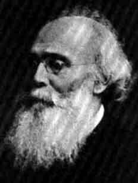

[Sacred-Texts](../../index) [African](../index)

------------------------------------------------------------------------

<table width="75%">
<colgroup>
<col style="width: 50%" />
<col style="width: 50%" />
</colgroup>
<tbody>
<tr class="odd">
<td style="text-align: center;" rowspan="4"> 
REV. HENRY CALLAWAY</td>
<td><h1 id="the-religious-system-of-the-amazulu" data-align="center">The Religious System of the Amazulu</h1></td>
</tr>
<tr class="even">
<td><h3 id="by-henry-callaway" data-align="center">by Henry Callaway</h3></td>
</tr>
<tr class="odd">
<td><h5 id="springvale-natal-1870" data-align="center">[Springvale, Natal, 1870]</h5></td>
</tr>
<tr class="even">
<td><h6 id="reduced-to-html-by-christopher-m.-weimer-march-2003" data-align="center">{reduced to HTML by Christopher M. Weimer, March 2003}</h6></td>
</tr>
</tbody>
</table>

------------------------------------------------------------------------

[note to the hypertext transcription](note)  
[Title Page](rsa00)  
   

Part I: [UNKULUNKULU](rsa01) (OR, THE TRADITION OF
CREATION AS EXISTING AMONG THE AMAZULU AND OTHER TRIBES OF SOUTH
AFRICA.)  
 [APPENDIX. ADDITIONAL NOTES.](rsa02)  
 [UTIKXO.](rsa03)  
 [THE LORD OF HEAVEN.](rsa04)  
 [NOTE.](rsa05)  
   

Part II: [AMATONGO](rsa06) (OR, ANCESTOR WORSHIP.)  
 [DREAMS, &c.](rsa07)  
 [INKOSAZANA.](rsa08)  
   

Part III: [IZINYANGA ZOKUBULA](rsa09) (OR,
DIVINERS.)  
 [HEAVEN-DOCTORS, &c.](rsa10)  
   

Part IV: [ABATAKATI](rsa11) (OR, MEDICAL MAGIC, AND
WITCHCRAFT.)  
