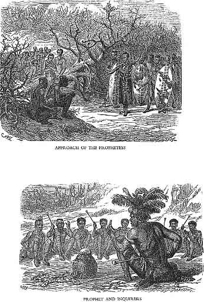

[Sacred-Texts](../../index) [African](../index) [Index](index) [Previous](rsa05) [Next](rsa07)

------------------------------------------------------------------------

p. 129

## AMATONGO; OR, ANCESTOR WORSHIP.

------------------------------------------------------------------------

> MEN say they possessed Amatongo as soon as
> they came into being. id="page_129_fr_1">[1](#page_129_note_1) When they came into
> being, men already spoke of there being Amatongo; and hence they too
> knew that they existed. It is not something which as soon as they were
> born they saw to be Amatongo.
>
>  It is not something which came into being immediately after men,
> which when they saw they said, "Those are Amatongo." They saw cattle
> indeed, which came into being, and said, "Those are cattle," they
> having come into being immediately id="page_129_fr_2">[2](#page_129_note_2) after themselves. It
> is evident that we are not speaking of the origin of the first  id="page_130">p. 130 man: when we say the origin of men we
> speak of those who came after him, for the standing of the first man
> is unknown. So we, who came into being when men who preceded us
> already spoke of there being Amatongo, say, "We came into being
> possessed of them."
>
>  All the first men, then, spoke of the Amatongo; and they told those
> who came into being after them, as soon as they came into being, that
> there are Amatongo. And further in the beginning, as soon as they came
> into being, they had doctors id="page_130_fr_3">[3](#page_130_note_3) who taught them that
> there are Amatongo. And so they said that the Amatongo were
> created[4](#page_130_note_4) by the
> first man, who said, "There are Amatongo who are snakes." The first
> man is Umvelinqangi, Unkulunkulu. And thus all nations knew of the
> Amatongo. There was not a single nation which said, "We people of such
> a country have no Itongo."
>
>  All nations worshipped the Amatongo, because Umvelinqangi  id="page_131">p. 131 commanded them to do so, saying, "You see,
> then,[5](#page_131_note_5) I tell you
> about the Amatongo, that you may worship them. I tell you about
> divining Izinyanga, id="page_131_fr_6">[6](#page_131_note_6) that you may enquire
> of them, and they tell you when a man has been made ill by the
> Amatongo; they shall hear the Itongo declaring that he has been made
> ill by the Amatongo."
>
>  So all nations used to think when they were about to attack an army,
> that they should be assisted by the Itongo; and although they were
> killed by the army, the friends of those who were killed said, "The
> Itongo of our people has turned its back on us." They asked, "How is
> it that all our people have at length come to an end, and not one man
> come back from the army?"
>
>  If there is one who has escaped, he says, "As for me I escaped I know
> not how. The Amatongo had decreed that we should all die; one man id="page_131_fr_7">[7](#page_131_note_7) would not assent; when
> we were destroyed by the enemy, where was he I wonder? I escaped I
> know not how; I no longer expected to be saved, when I saw all our
> people destroyed."
>
> p. 132
>
>  At first the people say, "The Amatongo of our people are good for
> nothing! Why has the whole village perished in the fight? So many men
> as there were! Our whole army destroyed by the enemy! How did it
> happen that they turned the back on so many? How is it that they never
> mentioned any thing to us that we might understand why they were
> angry? Have they at last destroyed the whole village? has it come
> utterly to an end? Where had the Itongo who saved So-and-so gone? Why
> was he not among the other Amatongo?" Those who weep for the dead say
> thus.
>
>  And those who died in the fight will now become Amatongo.
>
>  And those who escaped, whose national Amatongo looked on them and
> saved them, say, "We have been saved by the Amadhlozi of our people."
> When they come back from the army, they sacrifice cattle to the
> Amatongo; they return thanks because they think they have saved them;
> they pour the gall of the sacrifices on their bodies, saying, "Let the
> Amatongo be bright and white, and not dark, that they may save us on
> another occasion. " They return thanks with glad hearts.
>
>  And there is funeral lamentation p. 133
> where they have lost their people; they say, their Idhlozi is dark. At
> length they sacrifice, that if perchance their chief lead them again
> to attack the enemy, the Amatongo of their people may have no cause of
> complaint, because they have made amends to them, and made them
> bright; and now when they reach the enemy they know what they have
> done, and say, "Can it be, since we have made amends to the Amadhlozi,
> that they will say we have wronged them by anything?" When they see
> the enemy with which they are about to fight, they remember the
> Amadhlozi, and think of what they have done for them, by sacrificing
> to them that they may be propitious; they see that in their hearts,
> and know that they have made amends to the Amadhlozi of their people,
> and that though they die they cannot say there is any thing of which
> the Amadhlozi have reason to complain.
>
>  So truly they are very brave, saying, "The Amatongo will turn their
> backs on us without cause." For when they go to the enemy they say,
> "The Amadhlozi of our people go with us;" and so they fight with the
> enemy. And if their Amadhlozi are white and do not allow them to die,
> and they kill on their side only, then they see that their Amadhlozi
> go with p. 134 them. But on the part of
> those who are conquered, those who survive say, "We have no Amadhlozi.
> Why have we died utterly? Why have our Amadhlozi been conquered by the
> Amadhlozi of other people?" For those who have not died say, "The
> Amadhlozi of So-and-so have been conquered by the Amadhlozi of our
> tribe."
>
>  Thus it is with black men; they did not come into being when it was
> said, "There are no Amatongo." They came into being when it was
> already said, "There are Amatongo." But we do not know why the man
> which first came into being said, "There are Amatongo." Was there ever
> a man who whilst living said he was a snake? For we too do not
> understand why Umvelinqangi said, "The Idhlozi is a snake." For a man
> dies having no tail; and even we in that respect do not believe in a
> snake; for if a man is asleep, and dreams of a snake, he awakes
> immediately and starts; but if he dream of a dead man, he speaks with
> him of affairs in a dream; but if he dream of a snake, he does not
> talk with it; he starts. For my part, I say there are no Amadhlozi
> with tails. And we say Umvelinqangi made a mistake when he said,
> "People are snakes." For old men, when we ask why it  id="page_135">p. 135 is said that the Amadhlozi are snakes,
> say, "Because they are Amadhlozi." And we ask saying, "Just tell us if
> dead men have tails." They are puzzled there, and cannot tell us. And
> so we say, "O, how is it that you do not tell us whether the Amadhlozi
> are snakes?" So they repeat the same words; they are puzzled and do
> not tell us, that we may understand. We understand if they say, "The
> Amadhlozi are in snakes;" we do not understand if they say, "The snake
> is an Idhlozi."
>
> ------------------------------------------------------------------------
>
> *Ukwaba equivalent to Create.*
>
> JUST as when the Lord said, "Let there be
> light," and there was light in accordance with the word of the Lord;
> we say, "The light was created \[abiwa\] by the Lord." So the people
> say, "The Amatongo were created \[abiwa\] by Umvelinqangi." So they
> say, "The first man created \[aba\] the Amatongo, that is, he gave
> them being." They say, "All things were made by the first man,
> Unkulunkulu; they were made by him;" for ukwabiwa and ukwenziwa has
> one meaning.
>
>  We then, who come into being at the present time, now say,  id="page_136">p. 136 "Black men are mistaken. Why do they say
> that they do not know Umvelinqangi? The people who know are the
> missionaries, who speak of the commandments of the Lord. We hear His
> name, and that of His Son. We do not know who the first man was; this
> only we hear, that Unkulunkulu is one with Umvelinqangi; not knowing
> who was the father of Unkulunkulu.
>
>  But since the white men came and the missionaries we have heard it
> said that there is God. We cannot understand what the black men say,
> for there is no one who tells us that Unkulunkulu first came into
> being, and what was his wife's name, and that he had a son. But we
> hear the missionaries say that Jesus is the son of God. We do not
> understand what the black men say. We say, "They are mistaken. Why do
> they tell us about Unkulunkulu? We hear them say that he created all
> the black nations; but we do not hear of the place where he created
> them."
>
>  So we do not understand what these people mean, when they say we were
> made by Unkulunkulu, Umvelinqangi. He is called Umvelinqangi for no
> other reason but because he came into being first  id="page_137">p. 137 immediately before men. id="page_137_fr_8">[8](#page_137_note_8) So they say, "He
> shouted saying, 'Let men come forth; let all things come forth,—both
> dogs and cattle, and grasshoppers, and trees and grass.'" But we could
> never understand in our hearts when we heard them say that all things
> were made by Unkulunkulu; and did not hear the name of the river where
> Unkulunkulu broke off the nations which he created \[aba\].
>
>  We say this matter about Unkulunkulu is a vain thing. They wandered
> with folly as a companion. We do not know a single thing that was
> created by Unkulunkulu. As soon as we were born they told us we were
> made by Unkulunkulu. We say, it is a vain thing. There is no truth in
> it; for there are none who say, they know the place where Unkulunkulu
> broke off the people.
>
>  We say we understand the white men,—the true accounts of the Lord
> which are in books. We say, "Behold the men who speak the truth, when
> they say, 'The Lord is.'" And even now the Lord is. And we too say
> that from our birth it was said, the Lord is; He is in heaven; that
> is, p. 138 God. We do not understand the
> account of Unkulunkulu; it is not easily understood; it is a mere
> fable. For although they say, Unkulunkulu sent a chameleon to go and
> tell the nations of men that men were not to die; and that after the
> chameleon he sent a lizard to tell men that they were to die; and the
> lizard arrived first and said that men must die. The chameleon
> forsooth loitered at a bush of ubukwebezane, until the lizard came
> back again, and the chameleon which was sent first had not yet
> arrived, stopping to eat the ubukwebezane. And when it came to men it
> said, "Unkulunkulu says that men are not to die." And when the
> chameleon had made this proclamation, men refused to listen, and said,
> "We have received the word of the lizard; what you now say is vain;
> the word which we have received is that of the lizard, which came and
> said, 'Unkulunkulu says, Man must die.' That is the word which we have
> accepted. We do not understand the matter, Chameleon, of which you
> speak." We thus say, Teacher, that these are false accounts; the tale
> is not real. Men were made by the Lord. We ask how could Unkulunkulu
> send animals whieh creep on their bellies, to take a message to man?
> We say they are deceived.
>
> p. 139
>
>  We do not know the place where Umvelinqangi gave men being, that they
> might have life. Neither can we any more than our fathers understand
> this matter; and the ancients who are dead died without knowing the
> country where Unkulunkulu created men that they might have life; and
> the old people who are still living do not say they know the country
> where Unkulunkulu created men; and they too want to be told about the
> creation of the nations by Unkulunkulu. Other Onkulunkulu of those
> nations are not heard of, whom their own Unkulunkulu did not
> create.[9](#page_139_note_9) And if we
> say to them, "Just tell us about Unkulunkulu, that we may understand,"
> they reply, "We do not know." We say, "How did you hear that there was
> Unkulunkulu?" They reply, "We heard it of old men who were before us."
> We ask, "Of whom did those who were before you hear?" They say, "We
> cannot tell. We do not know." We say, "Unkulunkulu was a mere vanity.
> Why do you not understand the accounts of Unkulunkulu, which he told
> the nations which he made? Since you only assert continually that
> Unkulunkulu was, how can we understand p.
> 140 what relates to him? We do not believe."
>
> UMPENGULA M class="small">BANDA. 
>
> ------------------------------------------------------------------------
>
> THE people say their Amadhlozi exist. They
> believe in that, for they do not know where men go when they die. When
> they thought of the matter they discovered that they turned into
> snakes. They say a man dies and when he is dead, he turns into a
> snake; and they gave that snake the name of Itongo, and they worship
> it by sacrificing cattle, for they say the cattle too belong to it; it
> is it that gives them cattle; and they say it is by it they live;
> therefore they sacrifice cattle to it. When they are going to
> sacrifice, they bring home the cattle, if they have been driven out to
> pasture; or if they are still at home, they drive three or four
> together; they do not collect them all; they select those which are
> with the one they are about to sacrifice to the Itongo, and drive them
> into the pen; they close the gateway with poles, and then drive the
> cattle together in one place. The owner of the bullock having prayed
> to the Amatongo, saying, "There is your bullock, ye spirits of our
> people;" and as he prays naming grandfathers and grandmothers  id="page_141">p. 141 who are dead, saying, "There is your food;
> I pray for a healthy body, that I may live comfortably; and thou,
> So-and-so, treat me with mercy; and thou So-and-so," mentioning by
> name all of their family who are dead; and then the one who is going
> to kill the bullock takes an assagai and goes cautiously towards it,
> and stabs it in the place where the ox is usually stabbed, that is, in
> its side; and then the ox bellows, and the owner says, "Cry, ox of the
> Amadhlozi." And then he again mentions the Amatongo by name, because
> he thinks they have given him health, because of the cry of his ox. It
> is then skinned. When the skinning is completed, the owner takes a
> little blood, and cuts off a portion of the caul, and burns it in a
> secret place with the blood, which also he places in a secret place;
> and he takes incense and burns it, having placed the caul on the
> incense, thinking, he is giving the spirits of their people a sweet
> savour. After that they eat the flesh. That is the end.
>
> ------------------------------------------------------------------------
>
> WHEN a man dies among black men the grave
> is covered over with branches. The person to whom the dead man belongs
> watches the grave continually. If p. 142 a
> son has died, his father watches the branches constantly, that when
> they see that the branches are rotten they may be satisfied, knowing
> that nothing can now disturb the remains, for they are rotten. And if
> he observe a snake on the grave, the man who went to look at the grave
> says on his return, "O, I have seen him to-day basking in the sun on
> the top of the grave."
>
>  So then if the snake does not come home, or if they do not dream of
> the dead, they sacrifice an ox or a goat, and it is said he is brought
> back from the open country to his home. And if they do not dream of
> him, though the snake has come home, they are troubled and ask, "How
> did this man die? we do not see him; his Itongo is dark." They go to a
> doctor of ubulawo, id="page_142_fr_10">[10](#page_142_note_10) if it is the chief
> man p. 143 of a large village; but nothing
> is done as to the poor. The doctor comes and mixes ubulawo, and a goat
> is killed, it being an animal which makes a great noise and cries; but
> a sheep is not killed, because it is said it will cause the Itongo to
> be dark; for a sheep is foolish and makes no noise, and therefore it
> is not usual to sacrifice a sheep to the Itongo. The Itongo has a goat
> sacrificed to it; when a man pricks it with a needle, it at once makes
> a great noise; and so they rejoice greatly and say, "Cry, beast of
> So-and-so, who did such and such and such things" (mentioning the
> things he did). "We say, Come home again, that we may now see you. We
> are troubled p. 144 if we never see you,
> and ask, why you are angry with us? for all the cattle are still
> yours; if you wish for meat, you can say so, and the cattle be
> slaughtered, without any one denying you."
>
>  So the doctor of ubulawo practises his art; he mixes the ubulawo,
> calling the dead man by name, and puts the ubulawo in the upper part
> of the hut, and says, "I say, you will see him to-day, and talk with
> him; although you have not seen him for a long time, to-day he will be
> clear."
>
>  Such then is the means employed to bring back a ghost; it is brought
> back by sacrifice and ubulawo.
>
> ------------------------------------------------------------------------
>
> *The people do not worship all Amatongo indifferently.*
>
> BLACK people do not worship all Amatongo
> indifferently, that is, all the dead of their tribe. Speaking
> generally, the head of each house is worshipped by the children of
> that house; for they do not know the ancients who are dead, nor their
> laud-giving names, nor their names. But their father whom they knew is
> the head by whom they begin and end in their prayer, for they know him
> best, and his love for his children; they remember his kindness to
> them whilst he was living; they compare his p.
> 145 treatment of them whilst he was living, support themselves
> by it, and say, "He will still treat us in the same way now he is
> dead. We do not know why he should regard others besides us; he will
> regard us only."
>
>  So it is then although they worship the many Amatongo of their tribe,
> making a great fence around them for their protection; yet their
> father is far before all others when they worship the Amatongo. Their
> father is a great treasure to them even when he is dead. And those of
> his children who are already grown up know him thoroughly, his
> gentleness, and his bravery. And if there is illness in the village,
> the eldest son lauds him with the laud-giving names which he gained
> when fighting with the enemy, and at the same time lauds all the other
> Amatongo; the son reproves the father, saying, "We for our parts may
> just die. Who are you looking after? Let us die all of us, that we may
> see into whose house you will enter. id="page_145_fr_11">[11](#page_145_note_11) You will eat
> grasshoppers; you will no longer be invited to go any where, if you
> destroy your own village."
>
> p. 146
>
>  After that, because they have worshipped him, they take courage
> saying, "He has heard; he will come and treat our diseases, and they
> will cease."
>
>  Such, then, is the faith which children have in the Itongo which is
> their father. And if there is a chief wife of a village, who has given
> birth to children, and if her husband is not dead, her Itongo is much
> reverenced by her husband and all the children. And that chief wife
> becomes an Itongo which takes great care of the village. But it is the
> father especially that is the head of the village.
>
> UMPENGULA M class="small">BANDA. 
>
> ------------------------------------------------------------------------
>
> IT is said that there is the Itongo, id="page_146_fr_12">[12](#page_146_note_12) which is a snake.
> Men dream. A man dreams perhaps, and is then ill; he says, "I am ill
> for no other reason than because I have dreamed." Others ask him what
> he has dreamed. He tells them he has dreamed of a man. If his brother
> has died, he says, "I have seen my brother." They ask what he said. He
> says, "I dreamed that he was beating me, and saying, 'How is it that
> you do no longer know that I am?' I answered him, saying, 'When I do
> know you, what can I do that you may see I know you? I know that you
> p. 147 are my brother.' He answered me as
> soon as I said this, and asked, 'When you sacrifice a bullock, why do
> you not call upon me?' I replied, 'I do call on you, and laud you by
> your laud-giving names. Just tell me the bullock which I have killed
> without calling on you. For I killed an ox, I called on you; I killed
> a barren cow, I called on you.' He answered, saying, 'I wish for
> meat.' I refused him, saying, 'No, my brother, I have no bullock; do
> you see any in the cattle-pen?' He replied, 'Though there be but one,
> I demand it.' When I awoke I had a pain in my side; when I tried to
> breathe, I could not; my breath was short; when I tried to speak, I
> could not; my breath was short."
>
>  The man[13](#page_147_note_13) was
> obstinate, and would not agree to kill a bullock. He was very ill. He
> said, "I am really ill, and I know the disease with which I am
> affected." The people said, "If you know it, why do you not get rid of
> it? Can a man purposely cause the disease which affects him; when he
> knows what it is, does he wish to die? For when the Itongo id="page_147_fr_14">[14](#page_147_note_14) is angry with a
> man, it destroys him."
>
> p. 148
>
>  He replied, "Not so, Sirs; I am thus ill; I have been made ill by a
> man. I see him in sleep, when I am lying down; because he wishes for
> meat, he has acted towards me with tricks, and says that when I kill
> cattle, I do not call on him. So I am much surprised for my part, for
> I have killed so many cattle, and there is not one that I killed
> without calling on him; I always called on him when I killed a
> bullock. And if I kill a goat, I call on him. And whenever I kill a
> sheep, I call on him. But I say, he is guilty of an offence; if he
> wished for meat, he might just tell me, saying, 'My brother, I wish
> for meat.' But he says to me that I never laud him. I am angry, and
> say he just wants to kill me."
>
> p. 149
>
>  The people who see him when he is ill say, "Au! Do you mean to say
> that the man[15](#page_149_note_15)
> still understands how to speak? We speak with you now; where is he,
> that we too might take him to task? For we too were present at all
> times when you slaughtered cattle; and when you lauded, you lauded
> him, and called upon him by the laud-giving names which he received
> for his bravery; and we heard. And, Son of So-and-so, if it could
> really be that that brother of yours, or any other man who is already
> dead, should rise again, could we not take him to task, and ask, 'Why
> do you say so?—since So-and-so is continually killing cattle, and
> lauds you with the laud-giving names which you received for your
> manliness; and we too heard.'"
>
>  The sick man replies, "Eh! My brother acts in this boastful way
> because he says he is oldest; for I am younger than he. I wonder when
> he tells me just to destroy all the cattle. Did he die and leave none
> behind?"[16](#page_149_note_16)
>
>  They say, "Au, the man died, Son of So-and-so. For our parts we say,
> when we are really speaking with you, and your eyes are  id="page_150">p. 150 still really looking upon us,—we say, as
> regards that man, you should just speak quietly with him; and if you
> have a goat only, worship him with it. But we say it is a shame in him
> to come and kill you, without telling you properly, that you may
> understand. But you are dreaming of him constantly, and are then ill.
> It is a bad dream. Why do you constantly see your brother in your
> sleep, and become ill? It were well that a man should dream of his
> brother, and awake with his body in health, and tell the people his
> dream, saying, 'My body is now restored to health; it is without pain.
> I have dreamed of my brother, telling me pleasant news.' But now he
> comes to you at all times with hostile intent, and you are ill; and so
> we know that you are ill on that account, because you dream of your
> brother."
>
>  He says, "Eh, Sirs, I will now give him the flesh he loves; for he
> speaks to me when I dream of him; he demands flesh; he kills me; I
> say, what prevents him from coming to me by night when I am asleep,
> and telling me quietly, saying, 'My brother, I wish so-and-so,' that
> we may talk pleasantly with each other, and it be evident that I have
> dreamed of my brother? He wrongs me; daily I p.
> 151 dream of him, and then awake in suffering; I say, he is not
> a man; he was a thing which was a wretch, which liked to fight with
> people. But, Sirs, we have been accustomed to hear you say, 'As to a
> man who died being a wretch, one of a word and a blow, is the Idhlozi
> of such an one good?' We have becn accustomed to hear you say thus,
> that when he is dead his Itongo becomes right and is good. But
> forsooth that man is good who had been good long before his death.
> Perhaps he too who was good becomes bad when he is dead; and he who
> was bad, when he is dead, is good, and becomes a good Itongo. Both are
> alike. We deny the truth of what you say, when you assert that a man
> who died being a wretch of a word and a blow, when he is dead, may
> have a good spirit. We maintain that the two things are alike; both he
> who was good will be a wrathful man when he is dead; it does not turn
> out in accordance with his righteousness which he had when he was
> still living on the earth: and the wretch when he is dead becomes
> righteous and becomes a good spirit."
>
>  They say, "Ehe, we agree with you; you speak the truth. The two
> things are alike."
>
>  He replies, "I say then, my p. 152 brother
> has gone away with his wickedness which he exhibited whilst living on
> the earth; and though he is dead, his spirit resembles him whilst he
> was alive for he was a man of a word and a blow. If a man spoke to him
> he used to wish at once to fight with him; and then a dispute might
> arise; it was caused by him, and then he would fight, and did not see
> it nor say, 'So then the fault was committed by me; I ought not to
> fight with these people;' but he started up and wished to injure the
> people. And his spirit is like him; it is wicked; it is constantly
> angry; and when it is angry it sends animals. id="page_152_fr_17">[17](#page_152_note_17) But I will give him
> his flesh which he demands of me. I sleep, and when I awake find that
> he has affected my body with disease. I will give him; if I see that
> he leaves me and I am well, I will kill some cattle in the morning; if
> he does not leave me, I will have the cattle, and say, 'It is not my
> brother.' If it is he, let me ge well and breathe, and my breath no
> longer cut me, as it cuts me at the present time."
>
> p. 153
>
>  They assent and say, "Yes, yes, Son of So-and-so; if in the morning
> you are well, then we shall see that it is indeed the spirit of your
> brother; if in the morning you are still ill, we will not say it is
> p. 154 your brother; we will say it is a
> simple disease."
>
>  When the sun went down he was still complaining of pain; but at the
> time of milking the cows he said, "Give me some food, that I may eat."
> His wives asked how the pain was. He replied, "What do you hear me
> say?" They said, "We hear you asking for food."
>
>  He replied, "I don't know, my children; even I id="page_154_fr_18">[18](#page_154_note_18) feel an inclination
> for food; it is as though you might give me a little; do not give me
> much; give me a little; let me just try."
>
>  So his wives gave him amasi. He said, "Do not put much crushed corn
> in it; put a little only, that it may be waterish, and not thick—that
> it may be soft; let me just try if the disease will now allow it to
> descend by the swallow."
>
>  They did for him as he asked; the food was fluid, not thick. They
> gave him and he ate. He was able to swallow, although he had been
> unable to eat. He did not eat much; he ate a little; he gave his
> children. He said, "Just give me some beer; I am thirsty." They took
> beer and gave him. His wives had confidence in their hearts when they
> saw their husband p. 155 taking a mouthful
> of food; they rejoiced in their hearts, for they had been fearful,
> saying, "Is it then that the disease is great, since he does not eat?"
> They rejoiced in their hearts; they did not speak out their joy, but
> looked at each other only. He drank the beer, and asked for snuff,
> saying, "Give me some snuff too, my children; let me just take a
> little." They gave him some, for he had left off taking snuff too. His
> wives looked at each other, and wondered to see the man now taking
> snuff; for the Itongo had restrained him also from taking snuff. His
> wives had disputed in their hearts, saying, "What kind of an Itongo is
> this that restrains him even from snuff?" They were afraid, thinking
> it was disease and not an Itongo which was affecting him.
>
>  He took snuff, and lay down; and when he lay down, sleep came. And in
> the middle of the night his brother came and said, "So then, my
> brother, have you pointed out the cattle? will you kill them in the
> morning?" The sleeper assented, saying, "Yes, yes, I will kill one.
> Why do you, my brother, say to me I never call on you, whilst whenever
> I kill cattle I call on you by your laud-giving names; for you were a
> brave, and stabbed in the conflict?"
>
> p. 156
>
>  He replied, "Yes, yes, I say it with reason, when I wish for flesh. I
> indeed died, and left you with a village; id="page_156_fr_19">[19](#page_156_note_19) you had a large
> village."
>
>  He said, "Yes, yes, my brother, you left me with a village; but when
> you left me with it, and died, had you killed all the cattle?"
>
>  He replied, "No, I had not killed them all."
>
>  He said, "Well then, child of my father, do you tell me to destroy
> them all?"
>
>  He replied, "No, I do not tell you to destroy them all. But I tell
> you to kill, that your village may be great."
>
>  He awoke. When he awoke he felt that he was now well; the pain which
> was in his side being no longer there. He awoke, and sat up; he jogged
> his wife, and said, "So-and-so, awake, and light a fire." His wife
> awoke and blew up the fire; she poured snuff into her hand and took
> it, and asked him how he was. He replied, "Oh! just be quiet; on
> awaking my body was feeling light; I have been speaking with my
> brother; on awaking I was quite well." He took some snuff, and went to
> sleep. The Itongo of his brother came again. He came saying, "See, I
> have now cured you. Kill the cattle in the morning."
>
> p. 157
>
>  In the morning he arose and went into the cattle-pen. But he had some
> younger brothers; he called them, and went into the pen, and his
> brothers went in with him. He said, "I just call you, for I am now
> well. My brother says he has now cured me." Then he told them to bring
> an ox. They brought it. He said, "Bring that barren cow." They brought
> them both. They both came to him to the upper part of the pen, and
> stood there. He prayed, saying:—
>
>  "Well then, eat, ye people of our house. Let a good Itongo be with
> us, that the very children may be well, and the people be in health! I
> ask, how is it that you, since you are my brother, come to me again
> and again in my sleep, and I dream of you, and am then sick? That
> Itongo is good which comes to a man and tells him good news. I am
> always complaining that I am constantly ill. What cattle are those
> which their owner devours, devouring them through being ill? I say,
> Cease; leave off making me ill. I say, Come to me when I am asleep,
> and tell me a matter, and say, My brother, I wish so-and-so.—You come
> to me, coming for the purpose of killing me. It is clear that you were
> a bad fellow when you were a man: are you still a bad fellow under the
> ground? I p. 158 used not to think that
> your Itongo would come to me with kindness, and tell me good news. How
> is it that you come with evil, you, my eldest brother, who ought to
> bring good to the village, that no evil might come to it, for I know
> that you are its owner?"
>
>  He says these words about the cattle, and returns thanks, saying:—
>
>  "There are the cattle which I offer you—there is a red ox, there is a
> red and white barren cow. Kill them. I say, Tell me a matter kindly,
> that on awaking my body may be free from pain. I say, Let all the
> Amatongo of the people of our house come here together to you, you who
> are fond of meat."
>
>  And then he says, "Stab them." One of his brothers takes an assagai,
> and stabs the barren cow; it falls down. He stabs the ox; both bellow;
> he kills them—they die. He tells them to skin them. So they skin them;
> the hides are taken off; they eat them in the cattle-pen. All the men
> assemble to ask for food; they take it away joint by joint; they eat
> and are satisfied, and give thanks, saying, "We thank you, Son of
> So-and-so. We pray that the Itongo may be propitious. When we see
> indeed that it is an Itongo which makes you ill, we shall see that
> that Itongo p. 159 is the wretch which is
> your brother. We did not know if we should eat meat with you through
> your very severe illness. We now see it is the wretch which is killing
> you; and so we now are glad because we see you are well."
>
> UGUAISE MDUNGA. 
>
> ------------------------------------------------------------------------
>
> *The Amatongo are felt in the Shoulders.*
>
> THE sensitive part with a doctor is his
> shoulders. Every thing he feels is in the situation of his shoulders.
> That is the place where black men feel the Amatongo. If a doctor is
> touched by another person he is in pain; if he touches him there it is
> as if he stabbed him with an assagai; he feels at once as though there
> was a sore place there. And others who are not doctors do not allow
> another to take hold of them by the shoulders; for they say it causes
> them pain to be laid hold of. And if a man stands behind a doctor he
> makes him go away directly, saying, "Get away, you are hurting me; it
> is as if you sat upon me."
>
>  When we say there is not an Itongo in his body, we say so because
> when that has been done which it was said the Amatongo wished, the
> disease remains; therefore we say, he has no Itongo; there is not an
> Itongo in him.
>
> p. 160
>
> ------------------------------------------------------------------------
>
> *Laying the Itongo, or Spirit.*
>
> A DOCTOR is summoned when a man is ill, he
> being troubled by one man. id="page_160_fr_20">[20](#page_160_note_20) He dreams perhaps
> of the dead man, and then has pain in his body; in the morning he
> tells others his dreams. He says, "I am troubled. When So-and-so comes
> to me by night, my body is in pain. I cannot tell what to do."
>
>  And if his dreaming makes him ill, they summon a doctor to come and
> close up the way against him. The doctor says to him, "Look; when you
> dream of him, take this medicine and chew it; then take a stone or a
> piece of firewood, and spit on it the spittle which is in your mouth
> when you dream of him, mixed with this medicine; spit it either on a
> piece of firewood or on a stone; and throw it behind your back without
> looking. If you look the dreams will recur." And he does so.
>
>  This is the way dreaming is treated. If the thing goes on, and the
> dreams come back again, the doctor adopts another plan of treatment,
> and closes the way against the man's dream. Several medicines are
> mixed together for the purpose of misleading the Itongo, that he may
> see it no more. He goes to a distance to shut him  id="page_161">p. 161 up there, perhaps in an ant-heap; what he
> has in his hand he puts into the heap, and goes home, and he never
> sees it again.
>
>  Such is the custom with black men. It is said, "A troublesome spirit
> which appears to a man and makes him ill, is laid." These troublesome
> things occur most commonly in women who have lost their husbands, and
> are taken to wife by his brothers or by others. But the spirit of the
> dead husband follows the wife continually. If she is pregnant, and the
> spirit of her husband comes to her, and she is ill and miscarries; the
> Itongo is at length laid because it has acted thus.
>
>  If it trouble her when she has gone to another man without being as
> yet married; if she has left her husband's children behind, the dead
> husband follows her and asks, "With whom have you left my children?
> What are you going to do here? Go back to my children. If you do not
> assent I will kill you." The spirit is at once laid in that village
> because it harasses the woman.
>
>  Perhaps another spirit never leaves her until she returns to the
> village of her dead husband; she never marries again, but remains at
> home and takes care of her children. It is said the children's father
> brought her back again. This is how doctors lay a spirit.
>
> UMPENGULA M class="small">BANDA. 
>
> p. 162
>
> ------------------------------------------------------------------------
>
> *The Amatongo reveal Medicines, &c., in dreams.*
>
> SOMETIMES men who have medicines
> distinguish between their own medicines, and those they have been
> shown by the dead. For instance, Undayeni was frequently given the
> knowledge of such medicines: it used to be said to him in a dream, "Go
> to such a place, and when you get there dig up a certain medicine;
> that medicine is the remedy for a certain disease." Undayeni had very
> many such medicines, which he was shown by the spirits of his people
> whilst he slept. He made a distinction between the medicines he knew,
> and the medicines which were revealed to him.
>
>  And Undayeni was not alone in this respect. There are many like him.
> I have seen my father also, Unkomidhlilale; id="page_162_fr_21">[21](#page_162_note_21) for he was a great
> cattle doctor; and he also had many medicines for men. I used to go
> with him when he was called by any one whose cattle were ill. I heard
> him say as we were digging up medicines, "Dig up that; I had that
> revealed to me in a dream; I was told to mix it with certain other
> medicines." And so it was continually; there p.
> 163 was no end of his dreaming of medicines, until he had a
> great many. Therefore he was useful to cattle when they were ill; he
> gave them physic; he ordered them for one day to drink no water, but
> only that into which he had put his medicines. And a large pot was put
> in the cattle-pen full of medicines and water; when the medicines had
> sunk to the bottom and the water was clear, some drank; others were
> drenched. When they were allowed to drink water, the medicines were
> taken to the river and put into the water, and the cattle drank lower
> down.
>
>  He obtained many cattle from people for doctoring their cattle. He
> became a celebrated doctor. If the cattle got well he had one given
> him. If when he came some were lying down, he said, "That one may die.
> \[But if it die\] I shall cure none of them." And so he roused them
> up, going into the midst of them in the evening, carrying in his hand
> a torch, pouring fat on it, and kindling it when in the midst of the
> cattle. The cattle were much frightened when they saw the great flame,
> as he ran through the whole cattle-pen; and he said, "If I hear that
> one of these cattle has died, never come to me again; I shall not be
> able to do anything."
>
> p. 164
>
>  Sometimes there is a man who is acting with a secret intention of
> injuring another without his suspecting it, and without his knowing
> any thing about him, he being his friend. But if he hears in a dream a
> voice saying to him, "So-and-so is pretending merely to be your
> friend. Do you not see that he will kill you? What do you think he
> means by saying such and such things?" (alluding to something he has
> said), he remembers it and exclaims, "Yes, surely. So-and-so may hate
> me on that account." And he begins to separate from him and to be on
> his guard. And he tells the dream and says, "I wonder that I have seen
> So-and-so killing me about such and such a matter." And he keeps at a
> distance from him. And if he says to him, "So-and-so, now you keep at
> a distance from me. What is it? What difference has arisen between
> us?" the other puts him off by saying, "O, Son of So-and-so, can you
> think there is any thing which has made me quarrel with you? No. There
> is nothing. I am occupied with such and such concerns. That is all,"
> saying what is really mere subterfuge.
>
> UMPENGULA M class="small">BANDA. 
>
> ------------------------------------------------------------------------
>
> p. 165
>
> *A man's Itongo resembles him in character.*
>
> UNJIKIZA, the son of Ukcuba,
> Undhlebekazizwa, id="page_165_fr_22">[22](#page_165_note_22)
> Unotshelwaezitshela, id="page_165_fr_23">[23](#page_165_note_23) was a celebrated
> brave, of great strength, and huge body; all his muscles were
> prominent and hard; and his head was high above the ground. id="page_165_fr_24">[24](#page_165_note_24)
>
>  It happened among the Amancolosi with whom he was living, that there
> came the Amazulu going and killing wherever they were sent. But they
> did not act in accordance with the chief's law, but acted after their
> own heart in villages to which they had not been sent, treating the
> people cruelly, eating their milk and other food, saying, "Since we
> are the people of the chief, the rustics will fly as soon as they see
> us. Who among them will lay a charge against us before the chief? We
> will do just as we like, and set ourselves our own limit." id="page_165_fr_25">[25](#page_165_note_25) And  id="page_166">p. 166 indeed they acted thus, until they came to
> our village, When they came, there were none there but women; there
> was not a single man there. They did as they liked with the food; they
> made the children cry by taking away what they were eating; and the
> women cried saying, "If Undhlebekazizwa were here, you would not do
> so. Go on then; he will be here presently."
>
>  And indeed after a time he came, and heard the noise of crying whilst
> he was at the gateway. He smote the ground with his huge club, saying,
> "Unothlolamazibuko is hungry. id="page_166_fr_26">[26](#page_166_note_26) It shall have its
> fill to-day."
>
> p. 167
>
>  The Amazulu heard; for they know him; the noise was at once hushed;
> and they went out stealthily and fled away. In the morning they were
> caught at another village because of the trouble they gave; they were
> bound and carried to a den and confined in it. Undhlebekazizwa told
> the people to fetch firewood and burn them. The people went into the
> cave and put down the firewood and lit a fire, and fanned it with
> their shields, and drove the smoke into the cave. They were unable to
> breathe, and all died. And it is not known to this day by the Amazulu
> what became of them. id="page_167_fr_27">[27](#page_167_note_27)
>
>  It happened when the land was desolated by the Amazulu, the people
> fled into the forests with their cattle. The Amazulu found ours. We
> fought with them, but our people were conquered; and Undhlebekazizwa
> alone remained. The Amazulu said, "To-day is to-day! We shall see if
> you will conquer us. For for a long time you have plagued us when we
> have gone to the outer districts." They stabbed him with their
> assagais in the forest. He p. 168 killed
> twenty of them. He then said, "Kill me now. I have now spread out a
> mat for myself to lie on. I shall lie on men." They stabbed him in
> every part of his body. Their spears stuck in him as thick as reeds in
> a morass. So he died. This is his history.
>
>  He would lay hold of a leopard by himself in the forest, as though it
> was a mere child; he would go along crying like a child, crawling on
> his knees. The leopard would leap on him, and he seize it as though it
> was a fly and kill it.
>
>  He was much dreaded. Every one who had any thing pretty whom he met
> with in the way, he would kill and take what he liked. Many were glad
> at his death, for he gave much trouble, and did every thing in an
> arbitrary way; he had no patience. No matter was discussed in our
> village when he was there; he would bring it to a conclusion with a
> stick. It was discussed when he was absent, but not when he was at
> home.
>
>  And his Itongo is wicked. His name is never mentioned to this day in
> our village. If any one mentions him, he is at once sileneed, and told
> not to mention his name in the village, for he might destroy it. He is
> mentioned only when any cattle are killed. He is not mentioned at
> other times.[28](#page_168_note_28)
>
> UMPENGULA M class="small">BANDA. 
>
> p. 169
>
> ------------------------------------------------------------------------
>
> *A Doctor of Medicine deceived by the Itongo.*
>
> A LITTLE while ago there was a man among
> the Amakuza; he lived on the Inthlavini near Usigwili, the son of
> Umsengana. He was a doctor of medicine. Some years ago he left
> Umahaule; it is he on account of whom Umahaule quarrelled with
> Umazwana and Ufaku, until they separated one from the other. Umahaule
> drove him away, and they defended him, for he is Umazwana's
> father-in-law; his name is Unqanqaza. So he came here among the
> Amakuza, and lived with Usigwili.
>
>  At the time when severe epidemic dysentery prevailed, and attacked
> the household of Usigwili, it carried off two people. Whilst Usigwili
> was as yet free from disease, Unqanqaza came to him with medicines,
> and said to him, "Usigwili, I come to you because the Itongo told me
> to come and treat you." That Usigwili is a great man here among the
> Amakuza; among his own people, the house of Umbanjwa, id="page_169_fr_29">[29](#page_169_note_29) he is a petty
> chief, the elder brother of Utoi among the descendants of Umbanjwa.
>
> p. 170
>
>  Usigwili too knew what the Itongo had said, id="page_170_fr_30">[30](#page_170_note_30) and believed; and
> so did not ask, "How is it that the Itongo comes to you, Unqanqaza,
> without telling me that I am about to be ill, and it is proper that I
> at once put myself under your care?" He asked no question at the time
> because he was afraid that the Itongo had spoken the truth, and said,
> "See, death has come like an army into my village."
>
>  He assented at once, saying, "Yes, take me under your care." For the
> man is trusted much for his knowledge of disease. He forgot that he
> was driven from Umahaule's tribe for sorcery: because he had been
> defended by Umazwana and Ufaku, he had no thought of the bad name
> which he had had. So he drank the medicine. Unqanqaza said, "I give
> you this medicine; it will act as an aperient, not as an emetic." But
> the medicine did not act in accordance with his word. It acted both as
> a purge and an emetic in an excessive degree.
>
>  The people now began to stare, and said, "Unqanqaza, correct the
> effects of your medicine; is the man dead whilst you are looking  id="page_171">p. 171 at him?" id="page_171_fr_31">[31](#page_171_note_31) But he was now
> unable to regulate the action of his medicine; he was quite beaten;
> and acted without reason, no longer knowing what to do. The medicine
> became poison, and now wished to take away the dead body. id="page_171_fr_32">[32](#page_171_note_32)
>
>  People began to wonder at what Unqanqaza had done. And now the word
> which pronounced him a sorcerer is heard every where, and people say,
> "Who ever went to a man who was not ill, without being called by him,
> of his own accord to treat him for disease? He is indeed a sorcerer."
>
>  Thus the matter stands at present. We do not know what the result
> will be.[33](#page_171_note_33)
>
> UMPENGULA M class="small">BANDA. 
>
> ------------------------------------------------------------------------
>
> *How the Amatongo are worshipped.*
>
> THE Itongo for the most part when it
> reveals itself enters a village through some individual living there,
> and seizes on some part of his body, and so he is ill. And his friends
> ask him, "So-and-so, since you are in such a state, what is the matter
> with you?" He p. 172 replies, "O, to-day I
> am not happy, having woke with my body well in one part and unwell in
> another;[34](#page_172_note_34) it is
> very painful in this place." And it is clear that he is ill, though he
> makes the best of it, and they say, "No, the man, though he makes the
> best of it, is ill; we see that he is not well."
>
>  And because the disease does not cesse at once they at length go to
> the diviner. The diviner comes and tells them the cause of the
> illness. But the sick man himself had said nothing about his illness;
> for it is generally the case that such people, although they have
> dreamed and in the morning awoke in pain, do not like to talk about it
> themselves; for among black men slaughtering cattle has become much
> more common than formerly, on the ground that the Idhlozi has demanded
> them; but they make reply to one who says so, "No! since a bullock has
> just been slaughtered, what does the Itongo say? id="page_172_fr_35">[35](#page_172_note_35) O, people are  id="page_173">p. 173 now very fond of meat, and a man says he
> has dreamed of the Idhlozi, and forsooth he says so because he would
> eat meat." But this is not said openly, but secretly. Therefore a man
> no longer says, "I am ill. I have dreamed of the Idhlozi." They have
> left off saying so, and a man says, "O, since there are diviners who
> will say what I have seen," \[why should I say any thing?\] And even
> though they ask him, "Have you not seen something in your sleep?" he
> denies. For he is unable to say that the Itongo demands a bullock,
> determining not to mention such a thing; but to let the diviner
> mention it.
>
>  For the Itongo does not choose the head of a village only, but also
> common people. But a mere man who is not the head of a village is not
> able to say, "The Amatongo command a bullock to be slaughtered." It is
> the head of the village alone who, if he is seized by disease, will
> not allow them to go to the diviner; if a diviner is mentioned, he
> will refuse, saying, "No! I have heard. Kill such and such a bullock,
> and I shall get well." For the cattle and the village are his; there
> are none among his children who can p. 174
> take upon themselves to say, "Let such and such a bullock among the
> cattle of my father be killed, for the Itongo has demanded it." No;
> neither can a woman; even though the Itongo has made it most evident
> to her, she will not say any thing about it; even though she is very
> ill, she will not say any thing about a bullock; she trusts only to
> the diviner.
>
>  When they have gone to the diviner, he will tell them every thing
> which the man has seen. When they come back again, they scold the man,
> saying, "Why, when you knew the disease, and we asked you so much, did
> you not tell us? What were you afraid of? Did you make yourself ill?
> was it not the Amatongo only?" He replies, "I said, 'Hear the
> diviner.'" And he assents to what the diviner has said, saying, "Yes,
> yes; he says all that I saw."
>
>  And so the bullock is killed. Before it is killed, the head of the
> village goes into the cattle-pen, carrying incense in his hand. If the
> bullock is tame, he gently rubs it again and again with incense on the
> back, and says, "All hail, Spirits of our tribe" (the word "All hail"
> tells all the people to listen to what is about to be said in the
> prayer which is made to the p. 175
> Amatongo; and truly they are silent—not a sound is heard, nor the
> least talking; the chief man only speaks, and the people listen whilst
> he is speaking to the Amatongo, saying) "Is it proper that people like
> you should habitually, instead of asking for food in a proper
> manner,—should habitually come to us at all times in the form of
> sickness? Is that proper? No! Do you not then see that you are
> disgraced this day, having been smelt out by the diviner? For it is
> proper if you demand food, that I should not refuse it. There then is
> your food. All ye spirits of our tribe, summon one another. I am not
> going to say, 'So-and-so, there is thy food,' for you are
> jealous.[36](#page_175_note_36) But
> thou, So-and-so, who art making this man ill, call all the spirits;
> come all of you to eat this food. If it is you I shall then see by the
> recovery of this man whom, it is said, you have made ill. I now no
> longer know what you can demand. I have already given you what you
> ask. Let the man get well. Come together all of you of such-and-such a
> people, which did so-and-so and so-and-so" (that is, he lauds them by
> recounting the mighty actions which they did whilst living). He is
> very earnest, p. 176 saying, "I now greatly
> wonder that you too, So-and-so, who used to do such-and-such mighty
> things, now continually come as a thief; whilst you were still living
> it was not so; you used to do every thing openly. Let this coming to
> me stealthily be at an end. Go openly, that I may see you, for that
> which you ask for I will not refuse; for you gave it all to me,—the
> cattle, the children, and the corn. And thou, old woman id="page_176_fr_37">[37](#page_176_note_37) of our tribe, we
> call you to come and eat; and the infant which is dead, let it come
> and eat; that we may rejoice."
>
>  Such, then, is the worship with which they worship the Itongo; and so
> the bullock is killed.
>
>  They unite all the Amatongo in one invitation, for some of them they
> no longer know by name; but the dead know all of the living, and
> continually help them and do not forsake them; and on that account the
> living say, "Come, all of you, and eat." For at first those who were
> known were called by name; but by doing so they summoned disease, and
> it was very great; and they went to the diviner, saying, "Hau! what
> p. 177 is the meaning then of this, that we
> have killed so great an ox of our tribe, and yet cannot get any
> breathing time? What is the meaning of this?" And the diviner tells
> them, there is a man whom they have not worshipped, whom they do not
> know, an old woman or an infant; it is they who find fault. And thus
> arose the custom of making no distinction; and all are now invited
> together.
>
>  Such then is the manner in which people worship the Amatongo; and
> then the bullock is killed. And if when another appointed for the
> purpose stabs it, the bullock cries, id="page_177_fr_39">[39](#page_177_note_39) the head of the
> village again worships, saying, "Cry, bullock of our people," and he
> then accounts the valorous deeds of the dead, mentioning the names of
> the Amatongo of their tribe. The bullock drops.
>
>  When it is skinned, it is laid open and a small piece of the caul is
> taken and a sherd and a live coal, and incense, and they go with it
> into the house of the sick man; or into the chief house of the village
> where it is said the Amatongo dwell; for it is said that the Itongo
> lives in the great house. And the smoke arises in  id="page_178">p. 178 the house, and there is the odour of the
> burnt caul.
>
>  Then the sick man pours the gall on his body. He pours it on himself,
> and talks. (I do not mean he is angry, for sometimes ukuteta means to
> return thanks.) And all the people of the village have the gall poured
> on them; some pour it on their feet, some on their heads, others drink
> it.
>
>  Such then is the account of the Amatongo. The contents of the
> bullock's stomach are sprinkled in all the houses, that the Amatongo
> may eat. And that is the end of it; and then the flesh is eaten.
>
>  After that they look for the recovery of the man. If he does not get
> well, another bullock will be killed, until he kills all he has. And
> forsooth he has some other disease not occasioned by the Amatongo. But
> notwithstanding sometimes what is said about the Amadhlozi turns out
> to be true; for black men steadily affirm that the Amatongo exist and
> help them. For when they say that the Amatongo help them, they do not
> say so from what diviners have said but from what they have themselves
> seen. For instance, when they are asleep, a dead man appears, and
> talks with one of them, and says, "So-and-so, it is well that such and
> such be done in this village," telling him p.
> 179 something that will happen. For instance, black men used to
> be commanded to make a great deal of beer; and so they made it, and
> said, "The Idhlozi says, 'I will give you corn.'" If they obtain it
> that year they bless the Amatongo; and at the end of the year id="page_179_fr_40">[40](#page_179_note_40) they return thanks
> for the corn, which they were promised. It is this which blinds them,
> and they say, "But do they not speak with us, and we do what they tell
> us to do and obtain health? Do they not demand a certain bullock of a
> man, and he gives it and gets well?"
>
> ------------------------------------------------------------------------
>
> *The mode of slaughtering a Bullock.*
>
> WHEN an ox is slaughtered, the owner of it
> appoints some one to watch lest it should be spoilt; and each one who
> cuts off a leg leaves a portion of it behind, that he may afterwards
> take the piece of flesh thus left, and put it in his own pot. For
> among those who separate the legs from the carcase, each one leaves
> portions still attached to the carcase, that he may afterwards cut
> them off and put them in his own pot. Those who are sitting round the
> fire ask for meat of those especially who cut off the legs; as they
> cut them p. 180 off they throw continually
> small pieces of flesh to them, and they shout even with their mouths
> full, "We are burnt." id="page_180_fr_41">[41](#page_180_note_41) And each one has
> his assagai and eats standing, until the bullock is opened.
>
>  And each one that skins the bullock has his own pot, that he may pour
> the blood into it. When the carcase is completely opened, one arises
> to dip out the blood into all the pots; he dips it out with a cup and
> pours it into each vessel, the people giving way for each other until
> all the pots are full. The person who skins the bullock has the power
> of purloining; and he goes home with his pot full; and meat too stuck
> on rods which is not put into the pots. He enters his house, and his
> children eat, and it more than suffices them, just as though he had
> himself killed an ox of his own.
>
>  The meat is carried into the house and placed at the upper end in one
> place; it is not cooked on the day it is killed, but the blood is
> eaten; on the following morning it is cut up when it is going to be
> cooked; they separate the legs and the ribs, id="page_180_fr_42">[42](#page_180_note_42) and the  id="page_181">p. 181 insonyama; id="page_181_fr_43">[43](#page_181_note_43) and give to those
> who are of their house. For this is the custom with black men: the
> insonyama is taken to the eldest; the ribs are given to the next, or
> the shoulder; and the leg is given to the officer.
>
>  When the meat is cooked, for it is eaten when the sun is declining,
> men belonging to all the villages of the tribe, and strangers who are
> neighbours, press together to the village. When the meat is about to
> be taken from the pots, all the people go into the cattle-pen, for
> among black men cattle are not eaten indoors, but always in the
> cattle-pen, that those who are eating, and those who are not, may be
> seen. The chief of the village takes out the meat and puts it on the
> various feeding-mats, and it is carried into the cattle-pen, and put
> in one place, that it may be distributed; he distributes it in
> accordance with the positions of the assembly; the young men have
> their mats; those with head-rings, and the chief men, have theirs; and
> strangers have theirs. And if there be only one who belongs to another
> people, his feeding-mat is by itself, and they say to him, "Here is
> the meat of such a place." He thanks them, and takes people belonging
> to the place that he may eat with them.
>
> p. 182
>
>  When all have eaten, and some have finished before the rest, they
> join themselves with those who are still eating, and say, "O, let us
> join with you; we see you are in trouble."
>
>  When it is all eaten they do not begin to take leave; but the broth,
> and the blood which is still uneaten, are brought out after the meat.
>
>  When all is finished, the head man and another man who carries a
> feeding-mat go a little towards the head of the cattle-pen, and the
> head man says, "Be perfectly silent." And the assembly becomes very
> silent. He says, "Yes, yes; our people, who did such and such noble
> acts, I pray to you—I pray for prosperity, after having sacrificed
> this bullock of yours. I say, I cannot refuse to give you food, for
> these cattle which are here you gave me. And if you ask food of me
> which you have given me, is it not proper that I should give it to
> you? I pray for cattle, that they may fill this pen. I pray for corn,
> that many people may come to this village of yours, and make a noise,
> and glorify you. I ask also for children, that this village may have a
> large population, and that your name may never come to an end." So he
> finishes.
>
> p. 183
>
>  So all strangers take leave, and go home. And if it is a time of
> plenty, much beer is also made. And the meat of the women is by
> itself; when the men have departed and the place is still, the women
> come together and take out their meat. And neighbouring villages send
> messages one to another to come and eat meat at the village. So it is
> all eaten, and they go home.
>
> ------------------------------------------------------------------------
>
> *Laying the Spirit of Divination.*
>
> THE account of barring the way against a
> spirit of divination which visits a man when he does not understand
> the meaning of his dreams; he dreams continually of many snakes
> encircling his whole body whilst he is in a pool of water; he quits
> the water heavy with snakes: or he dreams he is crossing a flooded
> river. At length his body is relaxed, he not knowing what is the
> meaning of those daily dreams.
>
>  At length he becomes ill; and there is certain food he is obliged to
> abstain from, being told in his sleep not to eat such and such food.
> So he no longer eats that food. If he eat it from opposition, his
> health suffers. At length he leaves it alone, saying, "A spirit has
> visited me."
>
> p. 184
>
>  If he wishes to be a diviner, he goes to a diviner; the diviner
> prepares for him white ubulawo, id="page_184_fr_44">[44](#page_184_note_44) and makes him
> white, that his dreams may be clear, and no longer uncertain.
>
>  If he does not wish to be a diviner, nor his friends, they take a
> sheep for the purpose of barring the way of the spirit, and a doctor
> who is not a diviner is consulted—a doctor of celebrity—for the
> purpose of barring the way. When he has dreamed a great deal of the
> spirits, and they initiate him into the knowledge proper to doctors,
> the doctor is called, and comes with black medicines; id="page_184_fr_45">[45](#page_184_note_45) a sheep is killed,
> and the contents of the paunch are taken, and the black medicines
> bruised, and the man is made to drink them; he throws the contents of
> his stomach into a vessel, and the contents of the sheep's stomach are
> added to them; this is taken to a cave into which no man enters; it is
> buried there in the earth, and closed up with soil; and the doctor
> does not look behind him till he gets home. This, then, is the method
> of barring the way against a spirit. And though it came to him by
> night, it is no longer distinctly visible, but obscure, and the man
> p. 185 no longer sees it distinctly as at
> first; and so it departs, and he eats all kinds of food, and abstains
> from nothing.
>
>  And with some the way is barred successfully; with others without
> success; it is tried to no purpose, and the man dies through being
> claimed at the same time by the Amatongo and by living men, and dies
> very soon. This, then, is what I have heard.
>
> ------------------------------------------------------------------------

THE subject of the following narrative was a
convert of some eleven or twelve years' standing. He has always
manifested great uncertainty of character and a very impressible nervous
system, and for many years has had from time to time subjective
apparitions, and been in the habit of dreaming strange, life-like
dreams. One day he suddenly left the mission station. The following
account was obtained front a native who was sent to enquire of him at
the village where he was living. I have had an opportunity of seeing him
since the underneath was given me. He has many symptoms of hysteria,
appears fully to believe in his feelings; and yet at the same time to be
practising deceit on others, and probably too on himself.

> THE account of the illness of James, which
> is not intelligible among Christians; for although a person may appear
> to be affected with those symptoms which precede the power of
> divination, yet when he goes to a mission station all that ceases
> through continually hearing the word of God. There are many who were
> so affected, but are now so no longer. But as regards him who is now
> so old, it is marvellous p. 186 that he
> should begin to be so affected, as though he had only just come to a
> Christian village.
>
>  I and Paul reached the place where he is, going with the intention of
> taking him by surprise, saying to each other, "Do not let him hear or
> see us; let him first see us when we are already in the hut, before he
> puts himself to rights, that we may see what he does now when no man
> is looking at him."
>
>  When we came he was lying down covered with two blankets—one black,
> the other grey and old. When he saw us he remained lying and was
> silent. I aroused him, saying, "Arouse." He writhed himself and said
> "Just have patience. I am about to arise. Make haste and tell me! Make
> haste and tell me! What has happened at home?" But was a long time
> before he arose.
>
>  At length he arose and saluted us; and we saluted him. I asked him,
> saying, "James, how are you?" He said, "I am very ill." I said, "What
> is the matter with you?" He said, "I have a disease with which I am
> not acquainted." I said, "Tell me all about it." He began by saying:
>
>  "O, truly, you are right. If it were a mere boy who asked, I would
> not say a single word. But p. 187 since it
> is you who ask, I will tell you everything. At first I was afraid, and
> said, 'What will men say?' But now since this disease has separated me
> from you, I can make no concealment.
>
>  "Long ago this disease began, even before I quitted the house on the
> other side of the river to go to my new house; it began whilst I still
> lived in the village. And the family of Umapontshi know it. But it
> psased off again. It first began by creeping up from my fingers and
> toes; it then crept up my arms and thighs; it ran and spread itself
> over the whole body, until it reached the upper part of the body, and
> stopped in my shoulders, and caused a sensation of oppression, and
> there was a great weight here on my shoulders; it was as if I was
> carrying a heavy weight.
>
>  "But now it is not that only; but now there are things which I see
> when I lie down. When I left home I had composed three songs, without
> knowing whence they came; I heard the song, and then just sang it, and
> sang the whole of it without having ever learnt it.
>
>  "But that which troubles me most now is, that there is not a single
> place in the whole country which I do not know; I go over  id="page_188">p. 188 it all by night in my sleep; there is not
> a single place the exact situation of which I do not know.
>
>  "I see also elephants and hyenas, and lions, and leopards, and
> snakes, and full rivers. All these things come near to me to kill me.
> Not a single day passes without my seeing such things in my sleep.
>
>  "Again, I see that I am flying, no longer treading on this earth.
>
>  I asked him, "Since it is thus with you, do you still remember your
> Lord?"
>
>  He said, "No. To do so is death to me. If I try, saying, 'Let me
> pray,' it is as if I summoned all kinds of death to come and kill me
> at once. The Lord's tidings are plucked out of me by this disease. It
> alone has now the dominion over me."
>
>  I said, "Do you rernember that old dream id="page_188_fr_46">[46](#page_188_note_46) of yours?"
>
>  He said, "Do you speak of that of the boats?"
>
>  I said, "Yes."
>
>  He replied, "Oh! I do not p. 189 forget
> it. I see clearly now that the boat is my faith, which has now sunk
> into the water. And the dogs which I saw are now devouring me."
>
>  I said, "But if your Lord is now your enemy, who will save you?"
>
>  He replied, "No. I am now dead altogether. I do not think that I am
> still a man who can enter into a new position, which I do not in the
> least understand. id="page_189_fr_47">[47](#page_189_note_47) I do not know what
> I am. Attend, for I am a man who loves my children dearly. But now I
> do not care whether they are alive or not. The great thing is this
> disease alone."
>
>  He continued, "And now I begin to go out by night, having an internal
> intimation about medicine; id="page_189_fr_48">[48](#page_189_note_48) it is said, 'The
> medicine is in such a place; go and dig it up.' I go out and reach the
> place, but do not find the medicine; id="page_189_fr_49">[49](#page_189_note_49) I merely walk up
> and down, and at length return. This is my present state.
>
> p. 190
>
>  "There are many things which I seem to see, but when I go to them I
> cannot see them. At length it happened one day very early in the
> morning, I was told to go and dig up some medicine. I went to the
> place, but did not see the medicine, and came back again. When I
> reached home, it was said, 'Why have you left the medicine? it is that
> which you saw. Go and dig it up.' At length I went to the place and
> dug it up. Again I threw it away, for I did not know what to do with
> it. I was told to go and dig up another medicine on the
> Isithlutankungu. I refused, and I have not been to this day.
>
>  "But the great thing is meat; it is said constantly, 'Let a bullock
> be killed.'[50](#page_190_note_50) It
> is as though I could eat meat daily. This disease longs for meat; but
> I will not kill cattle.
>
>  "I am harassed by the dogs; it is as if where I am the dogs must not
> be beaten; I am greatly afraid of the noise. And it is as though I
> could not look on a diviner; he may come, I am at once in a dying
> state, and fall down and die. It is this, then, that troubles me. And
> now I no longer love any one. My heart no longer loves  id="page_191">p. 191 men. It is as though I could stay where it
> is perfectly still—where there is not the least sound. When you tell
> me to return, I do not know where I could stay, for the bell of our
> village sounds again and again. I do not like such a sound as that; I
> am much afraid. I shall not stay. I shall be driven away by the bell."
>
>  And then we spoke of his return, I saying, "Come home, if you are ill
> here; your wife, not seeing you, does not suppose at all that you are
> under medical treatment. To her way of thinking, you have merely
> forsaken her; therefore when her father comes he will come and take
> her away with him. You know yourself that our wives talk, and although
> a man is not sick, they tell us that if a husband rebels and returns
> to a heathen life, attracted by its pleasant things, yet his wife,
> because she does not know any pleasant things of heathen life, will at
> once separate from him, and not die with the death with which another
> wilfully kills himself. Do you not know that our wives say thus?"
>
>  He assented and said, "Yes. Hannah came here some days ago. She told
> me to get rid of this disease. And if I did not get rid of it, we
> should separate. I answered her and asked, 'What is meant  id="page_192">p. 192 by getting rid of it? Am I fond of it? Did
> I produce it? O, I do not know how the disease can be got rid of. The
> disease is master of the sick man.' And so we separated. And I am now
> about to return home for that saying of hers, 'If the disease does not
> cease we shall separate.' I will now come back, that my wife see for
> herself that which can get rid of the disease. I cannot fix the day.
> You will see me when I come. My body is in pain, for on the night
> before you came I saw you coming to me, but you were white men. A
> white man hurt me; he came in here and struck me on the thigh which
> was broken and broke it again. I arose and threw ashes over him. id="page_192_fr_51">[51](#page_192_note_51) I am ill from that
> then. I cannot tell you the day.
>
>  "I am not ill every day. Some days I am quite well, especially on
> Sunday. On Sunday, although I no longer know it is Sunday, I am very
> well. I now know by my body that it is Sunday. Such then is my
> disease.
>
>  "Go. I will accompany you; I will come back from the top of the
> hill."
>
>  So then we went with him. But he now goes naked, and wears the
> umuntsha. I just caught sight of his umuntsha; the hinder part was
> black.
>
> p. 193
>
>  Further, I asked him, "Why did you leave home unknown to our Teacher,
> who is a doctor of all diseases, without telling him?"
>
>  He replied, "I did not tell him, for I was afraid, and said, 'If I
> tell him, he will say I am mad, and seize me and send me to
> Pietermaritzburg, and I shall stay there a long time.' I feared that
> then, and did not tell him, thinking, 'O, since a mad man destroys
> people's property, and I do no harm, but my sickness is an injury to
> myself only;—O, no, let me not tell him. It may be I shall get well if
> I find doctors for myself. Let me go.' So I went away."
>
>  So we left, and separated from him at a place above the village. He
> walked without limping; his thigh has not dried up, it is of the same
> length as the other. But when he is going down hill, it is evident
> that he is a man who has been injured. But when he goes up hill, he
> looks like all other men.
>
>  There are only three kinds of food that he eats—meat, and the dregs
> of beer mixed with boiled maize; if these cannot be had he eats wild
> herbs. That is the food on which he lives. He does not put amasi into
> his mouth by any means; he dislikes it, and it disagrees with him.
>
> p. 194
>
>  Again, once at night he was told to awake and go down to the river,
> and he would find an antelope caught in a Euphorbia tree; and to go
> and take it. "So," said he, "I awoke. When I had set out, my brother,
> Umankamane, followed me." He threw a stone and struck an aloe. James
> was frightened, and ran back to him and chided him, saying, "Why did
> you frighten me when I was about to lay hold on my antelope." That was
> the end of it, and he was not again told by any thing to go and fetch
> the antelope. They went home, there being nothing there.
>
>  James's people say they are of a family who are very sensitive, and
> become doctors. There are two of his brothers in Zululand who are
> doctors. James told me, saying, "Heber came to us on his arrival from
> Zululand; he told me that my brothers in Zululand are now doctors,
> So-and-so and So-and-so." And so James said, "He then is the man who
> brought this disease on me. Whilst he was telling me I was seized with
> a fearful dread. I did not answer him, but remained silent. I am now
> ill because he spoke of what I myself was experiencing; but I did not
> speak of it, for I did not know what disease it was. He made me
> understand; and I understand it to this day."
>
> p. 195
>
>  It is said that James's father, Ukokela, was the steward of the Zulu
> king. But he was seized with the disease which precedes the power to
> divine. The king was angry when he heard it. He ate up all his cattle.
> That was the medicine which cured Ukokela. That was the end of it.
>
>  Others are doctors here in the country of the English. His sisters
> have the initiatory symptoms; there are many who have James's disease.
> Some have the Itongo laid. With others the disease ceases of its own
> accord; it is tired, and leaves them. Another, not one of James's
> relatives, I heard Ujojo mention her; she was a girl of the Abambo,
> the daughter of Unoponya; it is said, she was affected, and did as
> James does. But she was treated by many doctors. They could not cure
> her; she still went to the mountains, and did not stay at home; she
> was a married woman. At length she was treated by Ujojo, the son of
> Umanzezulu; he cured her. He killed two goats—or, rather, a sheep and
> a goat; the goat was white, the sheep black. He treated her with them;
> the black sheep made the Itongo indistinct, and no longer bright; the
> white goat made the Itongo white and bright, that it might make her
> see p. 196 clearly. id="page_196_fr_52">[52](#page_196_note_52) So he laid the
> Itongo, and she went home; he caused her to live at home. And she is
> now a human being. It is said, for a long time she lived in the
> mountains. But it is now no longer apparent that she ever did so.
>
>  The diviners tell James that he too is beginning, and will soon be a
> doctor. But they say he must not be treated with black medicines to
> lay the Itongo, for he will die; he must be just left alone. His
> friends therefore do not know what to do, since it is said, he will
> die. They merely look on. The diviners' word is their law; they can on
> no account go beyond it.
>
> UMPENGULA M class="small">BANDA. 
>
> ------------------------------------------------------------------------
>
> *How to distinguish Snakes which are Amatongo from common Snakes.*
>
> THE snakes into which men turn are not
> many; they are distinct and well known. They are the black Imamba, and
> the green Imamba, which is called Inyandezulu. Chiefs turn into these.
> p. 197 Common people turn into the
> Umthlwazi, and chieftainesses. Another snake is called Ubulube or
> Inkwakwa, and another Umzingandhlu; common people turn into these
> only.
>
>  These snakes are known to be human beings when they enter a hut; they
> do not usually enter by the doorway. Perhaps they enter when no one is
> there, and go to the upper part of the hut, and stay there coiled up.
> A snake of this kind does not eat frogs or mice; it remains quiet,
> until some one sees it and calls others; it is not afraid so as to run
> away, and it is left alone. Some say, "Let it be killed." Others say,
> "What, kill a man?"
>
>  If the snake has a scar on the side, someone, who knew a certain dead
> man of that place who also had such a scar, comes forward and says,
> "It is So-and-so. Do you not see the scar on his side?" It is left
> alone, and they go to sleep.
>
>  During the night the chief of the village dreams, and the dead man
> says to him, "Do you now wish to kill me? Do you already forget me? I
> thought I would come and ask for food; and do you kill me? I am
> So-and-so."
>
>  In the morning he tells his dreams, and says, "Let a sin-offering be
> sacrificed, lest the Itongo be angry and kill us." They fetch a
> bullock or goat; and pray p. 198 and eat
> the flesh. They look, and the snake is no longer there. It has now
> entirely disappeared.
>
>  A mere snake, when it comes into a hut, looks from side to side, and
> is afraid of men; and it is killed because it is known to be a wild
> snake.
>
>  A snake is also known by its mere appearance to be an animal, even
> though it does not look from side to side, because it is neither an
> Imamba[53](#page_198_note_53) that is
> a man, nor the Inyandezulu, id="page_198_fr_54">[54](#page_198_note_54) which is known to
> be a man. Those which are men and those which are not, are
> distinguished by their colour. The Puffadder, the Ivuzamanzi, the
> Inthlangwana, and the grey and spotted Imamba, are known to be mere
> beasts. It is impossible for them to be ever men; they never become
> men; they are always beasts. And those which are men are always men;
> as soon as they are seen they are known to be men; and truly they
> speak in dreams; and even if they do not, it is known that they are
> men.
>
>  Those which are men are known by their frequenting huts, and by their
> not eating mice, and by their not being frightened at the noise of
> men; they are always observed not to be afraid of the shadow of a man;
> neither does a snake that is an Itongo excite fear in men,  id="page_199">p. 199 and there is no feeling of alarm as though
> there was a wild beast in the house; but there is a happy feeling, and
> it is felt that the chief of the village has come. When men see it, it
> is as though it said as they look at it, "Be not afraid. It is I." So
> they are able at all times to associate with it.
>
>  If it has been killed by someone who is ignorant, it comes to life
> again, and has the marks of the rod on its body by which it was
> killed; and complains in a dream of the treatment it has received. And
> after that a sin-offering is sacrificed. This, then, is how snakes are
> distinguished.
>
>  He who had a scar is recognised by that; and he who had but one eye
> is recognised by the snake into which he has turned having one eye
> also; and another is recognised by the marks of injuries; and a lame
> man is known by the lameness of the snake. That is how they are known,
> for men usually have some marks, and the snakes into which they turn
> have similar marks. The man who had no mark speaks in dreams. And if
> it is seen that it is an Itongo, but it has no mark, it is said to be
> a man, but we do not know who it is. He reveals himself by speaking.
> This is how they are known.
>
>  Again, if a snake which is an p. 200
> Itongo lies on its back, with it belly upwards, it is a cause of
> alarm, and it is said something of consequence is about to happen,—or,
> the village is about to be destroyed. The people sacrifice and pray,
> and go to a diviner, and he tells them why the Itongo has done as it
> has. They do as they are directed.
>
>  If a snake coils around a vessel and will not allow anyone to take
> it, the people bring a sacrifice and worship, and it goes away.
>
>  And if a snake which is an Itongo enters a house rapidly, id="page_200_fr_55">[55](#page_200_note_55) it is known to be
> the Itongo of a man who was a liar whilst he lived. And he is still a
> liar. They sacrifice something to such an Itongo.
>
>  This is what I know about the Amatongo.
>
> UMPENGULA M class="small">BANDA. 
>
> ------------------------------------------------------------------------
>
> *Men turn into many kinds of Animals.*
>
> IT is said that men turn into many kinds of
> animals. It is said that one becomes a wasp; another an
> isalukazana;[56](#page_200_note_56)
> another an imamba; id="page_200_fr_57">[57](#page_200_note_57) another an
> inyandezulu;[58](#page_200_note_58)
> but the greater number turn into p. 201 the
> umthlwazi,[59](#page_201_note_59)
> which may be green or brown. As regards the two kinds of umthlwazi, a
> person may allow that they are men, because they do not stare fiercely
> like the other four. The umthlwazi is not afraid of a man, it moves
> slowly; if a person sees it lying, it remains quiet until many come
> and look at it; and if they arouse it, it moves slightly, and again
> remains quiet.
>
>  Therefore it is said to be an Itongo, for it never bites any one; it
> is a beast which is less fierce than all others. The green and brown
> kinds resemble each other in gentleness.
>
>  And the others, although they are called Amatongo, yet the eyes do
> not get accustomed to them, id="page_201_fr_60">[60](#page_201_note_60) for they belong to
> a kind of animal which bites. The imamba which frequents open places,
> and those which frequent houses, are not distinguishable by colour;
> their colour is the same, their eyes are alike; and when they are in
> an open place, their stare is of the same character—the stare of an
> enemy, which makes one afraid; and a man does not pluck up courage by
> saying, "This snake is an Itongo. I can approach it." No; he says it
> is an Itongo when he is at a distance from it, without  id="page_202">p. 202 approaching near to it. But we say the
> umthlwazi is an Itongo, and go up to it.
>
>  But the imamba is said especially to be chiefs; the isalukazana, old
> women; and the umthlwazi, common people. As regards the wasp, it is
> not clear that it is an Itongo, because it appears to a man; it is as
> it were an Itongo because it is sent; it is an Itongo through being
> seen, and so it is said to be an Itongo; for people say of it, it
> resembles something that has been sent.
>
> ------------------------------------------------------------------------
>
> *The order in which the Amatongo are worshipped.*
>
> ALL the Amatongo are called upon by the
> name of the first Itongo who is known. It is called just as a nation
> is called after a certain person; ours is the nation of the Amapepete.
> The family name is Gwala, the first man, that is, the Unkulunkulu of
> the Amapepete. It is he who is the head of the whole nation; we pray
> by his name. And when we sacrifice we say, "Ye people of Gwala, come
> all of you to eat. Behold your food."
>
>  But now since there are diviners we no longer begin in this way; for
> it is known who among the dead has caused disease; he is  id="page_203">p. 203 known by enquiring of the diviners; they
> tell us, "Since So-and-so is ill, he is made ill by So-and-so, one of
> your people. You know him; he says, how is it that when you have food
> you forget him?" Therefore he is called upon first, and it is said,
> "So-and-so, son of So-and-so," he being lauded by his laud-giving
> names; then they proceed to his father, and he too is mentioned in
> connection with the disease; and so in time they come to the last; and
> so there is an end, when it is said, "Ye people of Gwala, who did so
> and so" (his great deeds being mentioned), "come all of you."
>
>  Such then is the distinction between Amatongo. They are
> distinguished, because it is one among them which causes the disease.
> The others say nothing. So he is called upon first, as though he
> complained saying, "How is it that my name is no longer mentioned?"
> That is how it is.
>
>  Just as with us, our uncle was ill; the diviners said, "He is made
> ill by his brother, because he says, 'In that village when they have
> food, I am no longer remembered;' and he asks, 'How is it that you do
> not begin with him when you call on the Amatongo?"
>
>  The Amatongo continually trouble men on that account. Each  id="page_204">p. 204 one of them constantly puts in a claim,
> that each may have his own cattle \[sacrificed for him individually\],
> though the names of all be called upon. And a certain one remembers
> they never worship him first by killing for him a certain cow; and he
> says, "I will reveal myself by disease."
>
>  This then is the word about making a distinction between the
> Amatongo.
>
> UMPENGULA M class="small">BANDA. 
>
> ------------------------------------------------------------------------
>
> *Tale of an Imamba.*
>
> THE account of the Imamba which is the
> Itongo of our people among the Amapepete. The chief of that nation was
> Umaziya.[61](#page_204_note_61) That
> chief became an Imamba when he went out of his human body. He was
> killed by the Abambo. When the people were scattered from the country
> of the Amazulu, they wished to come here to the English. But he had
> been dead for some time. It was his son, Umyeka, who remained in his
> father's place, and his brother too, Umgwaduyana, died, and left two
> sons, one named Umadikane, and the younger one, Ubafako.
>
>  But at the time of the scattering of the people the lad Ubafako had a
> bad sore on his thigh; they p. 205 were
> then living in the open country and had quitted their homes, when he
> was ill with that sore; and it had been already treated with
> medicines; but the medicines would not adhere, and the sore increased
> continually. At length it happened one day, as they were living in the
> temporary booths erected in their flight, an Imamba entered; the child
> was asleep; the people started up and were frightened when they saw
> the beast enter the house; but it neither took any notice of them nor
> was in the least afraid, but pressed onward to go up to the child; the
> mother now cried out, "The snake will kill the child."
>
>  But it was already known that it was the chief; but they had not any
> courage on that account, for he had now a different body, to which
> they were not accustomed,—the body of a beast. It reached the child
> and placed its mouth on the sore, and remained still a little while,
> and then departed and went out of the house.
>
>  After that they went to the diviners, that they might hear what was
> the meaning of so great an omen. But the doctors said, "It is your
> chief; he comes to heal the child of his son."
>
>  So the people waited in patience; and the sore contracted, and at
> length healed.
>
> p. 206
>
>  And it used constantly to happen, when they were travelling towards
> this country, when they had set out, the Imamba too was seen where
> they crossed at the fords of rivers; it used to cross lower down
> constantly; until they reached Table Mountain, where it still was when
> his son, Umyeka, went down to the Inanda, flying from the Dutch.
>
>  But the chief[62](#page_206_note_62)
> refused, saying, "I will not go to a country by the sea. I shall stay
> here, and eat grasshoppers." id="page_206_fr_63">[63](#page_206_note_63) And so indeed it
> was. At length Umyeka was very ill, and it was said to him in a dream,
> "Why did you forsake your father? id="page_206_fr_64">[64](#page_206_note_64) He is calling the
> people; let them return." But they would not agree, fearing their feud
> with the Dutch, for Umyeka had stolen their cattle. id="page_206_fr_65">[65](#page_206_note_65)
>
>  So it was until our eldest uncle went up to our father, id="page_206_fr_66">[66](#page_206_note_66) who was younger
> than our own father. Our father departed, leaving our eldest uncle,
> and returned p. 207 to the old site of our
> chief's great kraal. But he was on the other side of the stream to it;
> he did not build on the old site, but dug there only. Until on a
> certain day our father whilst asleep dreamt the chief was talking with
> him. And as at that time it was winter, and the water was very cold,
> he said to him, "Ungqokqwane, it would be well for you to make a
> bridge for me, that I may cross on it and come home; for I am cold,
> and the water makes me colder still."
>
>  And truly I heard my father calling me and saying, "My child, come,
> let us go yonder to the ford which leads to the old site of Umzimvubu,
> the village of the Nembala chief, and make there a bridge for the
> chief to cross over." And truly we cut down many mimosa trees and
> elephant trees, and laid them across the stream, and poured earth on
> the top of them.
>
>  A few days after, for I was then the herd-boy who closed the cattle
> pen, I put off for a long time going to close it, until it was dark;
> and did not set out to do it until the usual time had passed. As I was
> going, I saw yonder something glistening on the poles with which the
> gateway was closed. But I did not trouble myself as to what it was. I
> went in a hurry, wishing to close the gateway at once,  id="page_208">p. 208 for I left them about to eat amasi in the
> house. Therefore I wished to close the gateway at once. But I took the
> first pole; it was heavy, I could not raise it; and it was the same
> with another; the poles were too heavy for me. I began to examine
> intently into the cause why the poles were too heavy, since they were
> old poles. I looked intently, and forsooth it was a great snake which
> was lying on them. I shouted. They came out of the house, and asked
> what it was. I replied, "Here is a snake."
>
>  My father came immediately, and looked intently, and said, "Do not
> close the gateway." I enquired, "What is it?" He said, "It is the
> chief." I said, "What, this snake?" He said, "Yes."
>
>  We returned to the house. In the morning he told us, saying, "The
> chief asks why you were afraid of him. Did he not tell us to make a
> bridge, that he might cross?"
>
>  Then my father gave praises, praising the snake with the laud-giving
> names which the chief had whilst living; praising in concert with our
> grandmother, the mother of my father. For such is the custom with us.
> The Itongo dwells with the great man, and speaks with him; and when
> worship is performed at a house, it is the p.
> 209 chief man, and the oldest old woman, who knew those who are
> dead, who worship.
>
>  Under these circumstances, one of the chief's kraal at length came up
> to where we were living; and we lived together till Ungoza came and
> turned us out by the direction of Usomseu. We were scattered, and went
> to other places. That, then, is a thing which I saw.
>
>  After that Umyeka, the chief, came up. The people said, "Let us go to
> the old dwelling to call the chief, the present chief's father; for
> the village is perishing because the chief did not consent to go down
> to the coast." So then they brought a dun-coloured cow in the
> afternoon; and all the chief men, both old and young, were assembled.
> They sang a song of their father which used to be sung on great
> festivals, to arouse him to the recollection that his children were
> truly in trouble because he was not among them. This is the song which
> was sung:—
>
>  "Dig for[68](#page_209_note_68) the
> chief, and watch our gardens which are at Isiwandiye. id="page_209_fr_69">[69](#page_209_note_69)  
>   p. 210  
>  "Those words are naught. id="page_210_fr_70">[70](#page_210_note_70)  
>  Dig for the chief, and watch our gardens which are at Isiwandiye.  
>  Those words are naught.  
>  Which are at Isiwandiye, I-i-i-zi id="page_210_fr_71">[71](#page_210_note_71)—which are at
> Isiwandiye.  
>  Those words are naught."
>
>  A large circle was formed outside the old site. They danced. There
> were there also all the women with beer, and the damsels. At length
> they separated when the sun was going down and it was raining, and
> they went home to our village, for the abundance of beer was fearful;
> so they consumed beer and meat, and sang hut-songs. id="page_210_fr_72">[72](#page_210_note_72)
>
>  In the midst of these doings, one of the young men, named Umathlati,
> went out; on his return he said, "The chief has come, even whilst we
> are singing. There he is, coiled up on the house." A hole was made in
> the house, that he might look on at the singing. They sang until it
> was near morning, rejoicing exceedingly because it was said, "The
> Idhlozi of our people has now united with us; our village will stand."
> Thus then it was. That is the end of the tale.
>
> p. 211
>
>  And the place where the snake stayed was in the fence of the
> cattle-pen; and it may be even in the great house; and it was said
> that the many snakes which were in the village belonging to the great
> house, were the chief's attendants which accompanied him; they were
> said to be the men who were killed at the same time as the chief.
> After that he disappeared on the arrival of the chief's kraal; and was
> no longer seen frequently at our kraal, but only occasionally.
>
>  The imamba is the Itongo of the great house; the common people do not
> become izimamba, they become imithlazi; this snake is green and white
> on its belly, and has a very small head. Its custom is, when looking
> at a man, not to look like an animal which fears to be killed; it
> looks without alarm; and many people may gather around an umthlazi.
> And even if a man touches it with a stick, it does not run away, but
> just moves. The umthlwazi is much tamer than other snakes; it moves
> about the whole house, and fears nothing, and it is seen in the roof,
> and it remains among the garments; and a man takes up his garment
> gently and leaves the snake on the ground, and it does nothing. It is
> said to be an Itongo.
>
> UMPENGULA M class="small">BANDA. 
>
> p. 212
>
> ------------------------------------------------------------------------
>
> *Removing from one country to another.*
>
> WHEN we are about to go to another country,
> if the people do not see the Itongo at the new village, it having
> staid behind, a branch of umpafa is cut, and perhaps they take a
> bullock with them, and go to sacrifice it at the old site; they give
> thanks, and call on the Itongo, and sing those songs which he used to
> sing whilst living; this is a sign of weeping for him, to excite pity,
> so that he may say, "Truly, my children are lonely because they do not
> see me." And the branch is dragged when they set out, and they go with
> it to the new village. Perhaps the snake follows; perhaps it refuses,
> giving reasons why it does not wish to go to that place, speaking to
> the eldest son in a dream; or it may be to an old man of the village;
> or the old queen.
>
> ------------------------------------------------------------------------
>
> *Royal Attendants.*
>
> AMANXUSA are people of a chief like
> servants, who go about in company with him; and even when the chief is
> dead, and especially if he has been killed together with his Amanxusa,
> they go with him, that they may prepare things before hand, and get
> food for him. It was especially the p. 213
> case with us at first, when a chief died, he did not die alone; for at
> first the bodies of the dead were burnt, and when a chief died, and
> they went from their home to dispose of the remains, they took shields
> and adorned themselves with their military ornaments; and when they
> came to the place where the remains of the chief were to be burnt,
> they cut down much firewood; and as there were oxen there too, the
> chief ox with which he made royal festivals was killed with him, that
> it might die with him. When the fire was kindled, the chief was put
> in; and then his servants were chosen, and put into the fire after the
> chief; the great men followed, they were taken one by one. They said,
> "So-and-so is fit to go with the chief." When the fire began to sink
> down, they said, "Put the fire together, So-and-so." And when he was
> putting the firewood together, they cast him in; they went and took
> all the great men one by one from the chief houses of the chief's
> brothers, and from those who were not his brothers. Many people were
> killed on that day. Such then are the Amanxusa.
>
>  When a chief dies the people conceal their children; some saying, "I
> know that if I let my p. 214 child go to
> the place where the king has died, he will never come back again." So
> they usually conceal them. Others too feign sickness, and cause the
> report of their sickness to be spread abroad in all directions; they
> say, "So-and-so is very ill indeed."
>
>  When the chief is entirely consumed, they take the ashes and throw
> them into a pool of the river.
>
>  Amanxusa are men who used to wait upon Utshaka. And after his death
> all the great men who used to wait on him, when they died, joined him
> that they might wait on him. It is said there are many snakes among
> the Amazulu; these snakes are Amanxusa; when Utshaka is seen, then too
> are seen the snakes; for it is said he is a large imamba; be is seen
> continually, followed by snakes; and they are all said to be Amanxusa.
> It is said that he was once seen fighting with Udingane, when both
> were dead; they fought a long time, until at length a very great
> number went out to see the fight. It is said Umpande wished to help
> Utshaka and kill Udingane, because Udingane had wished to kill
> Umpande, but Undhlela id="page_214_fr_73">[73](#page_214_note_73) saved him.
>
>  The Amanxusa remain in the p. 215 chief
> house of our chief among the Amapepete. The Amanxusa used to remain in
> Usokane's[74](#page_215_note_74)
> house, a great man. One day a woman said, "I am troubled. I am
> sometimes unable even to put down a vessel, there being always snakes
> in the way." Those who knew them said, "They are Amanxusa of the
> chief; people who were living with the chief before he died."
>
> UMPENGULA M class="small">BANDA. 
>
> ------------------------------------------------------------------------
>
> *Izalukazana.*
>
> THE lizard is said to be the Itongo of an
> old woman.
>
>  There is a tale about the isalukazana, an animal which resembles the
> intulwa; but it is not an intulwa; it is a kind of isibankhwa; but the
> isibankhwa is smooth, and purple on its back, and whitish on its
> belly. But the isalukazana is rather ugly, and very rough; it is not
> liked; and it is active, and runs away quickly. But it does not
> commonly run away, but hides itself. And if a man sees it on this side
> of any thing, it at once goes round to the opposite side. If you see
> it first, it makes haste to go round to the other side. If you point
> it out to another, saying, "I saw an animal here," it is already
> hidden on the other side. He may say, "Let us look;" but  id="page_216">p. 216 it sees the shadow of the man as soon as
> it appears, and turns back in the opposite direction. Until he
> disputes, saying, "How is it that one so old as you tells lies?" And
> the one who saw it appears foolish, for he no longer sees it. They may
> see it if they separate, and one stands still, and the other goes
> round the tree; for so they see it; when it runs away from one of
> them, it appears to the other.
>
>  If it is seen in the house, it hides itself among the wattles, or it
> may be on the post of the house; perhaps an old person sees it, but
> says nothing, not wishing to make much of the affair; for they say an
> old person is wicked if he see a thing which is like an omen. He
> troubles the people; they will be smitten with fear, and continue to
> think of that which has been seen. If something bad happens in the
> village, the isalukazana is seen continually in the same place, and it
> is said to prognosticate death. Then he who saw it says, "For some
> days I have seen an isalukazana in So-and-so's hut. I said nothing
> will come of it; and hid what I had seen. But now since the evil has
> come, it is proper that it should be known."
>
>  Some say, "Let us go to the diviner." Others say, "What do we want?
> See, there is the omen p. 217 come of its
> own accord. It is proper to get something if there is such a thing, to
> send away the isalukazana." And so they sacrifice a goat or a calf.
>
>  These animals are called isalukazana \[little old women\]. It is not
> said to be the Itongo of a man or of a child; but the Itongo of some
> old woman. Neither is it called by the name of any particular person.
> It is merely called isalukazana; it is not known who the isalukazana
> is.
>
>  But these lizards are hateful to black men; they are not like the
> Itongo which is a snake; for when they see an isalukazana, they are
> troubled because they know that it is an omen of future evil,—that
> evil comes in its train. Perhaps it appears, and then much fever
> occurs in the village, which carries off many people. And that is said
> to be in the train of the isalukazana; or a man is stabbed in battle,
> after an isalukazana has been seen in his house. And so that too is
> said to be something which has come in the train of the isalukazana.
>
>  But we heard this tale from our grandmother, our father's mother; she
> told us about these lizards when I killed some in the cattle-pen with
> stones. For they are p. 218 animals which
> are very fond of the sunshine during winter. When the sun rises you
> can find them sticking to a post, basking in the sun. So then when I
> killed them I told grandmother, saying, "I have killed some little
> rough lizards in the cattle-pen." Grandmother reproved me, saying,
> "Those lizards are chiefs of the village; they are not killed; they
> are reverenced." But we saw it was a mere wild animal; it became
> domestic from being called an Itongo by the people. But no evil
> consequences arose when I killed them; but when the men saw them, they
> constantly looked out for some evil to arise.
>
>  If they are frequently seen, and disease arises, a bullock is
> sacrificed if there is one, and the people say, "Eat, and go home.
> What do you want here? Why are you an enemy come to destroy the
> village? Go home. Here is food for you. Eat and depart." But though
> they say thus, they do not depart; on the following day we still see
> them where they were the day before. But the old people are not afraid
> afterwards, for they say, "We are no longer guilty of aught, for we
> have paid a ransom.
>
> ------------------------------------------------------------------------
>
> p. 219
>
> *Crying at the Holes from which Medicines have been dug.*
>
> IT is a custom with black doctors, for a
> doctor when digging up medicines, to dig worshipping the Itongo at the
> place where he is digging; he says, "Here is a bullock I may gain, ye
> people of ours. I dig up this medicine trusting in you, that you will
> give it power to take away the disease from the sick man, that I may
> become celebrated among the nations, as a great doctor, by your power,
> ye people of ours."
>
>  He digs up the medicine, then, with a pure heart, expecting the man
> to get well. But when he has applied his medicines, the people try to
> eat him up by craft, and say, "Let us tell him that I took his
> medicine, but gained no relief. It was as though I had taken nothing
> but corn." For it is common among black men to conceal the power of
> medicines; they are but few who praise them. In consequence of this
> craft there came to be appointed secret spies. The doctor says to a
> man, "So-and-so, do you go and listen for me. There is my medicine. I
> know that the people will conceal its efficacy, and say it was
> useless, for they are slow in giving me a bullock. I therefore appoint
> you to look out for me."
>
> p. 220
>
>  So then when he has treated the patient, he waits to hear what
> happens, that he may know how he is. And when he hears him say, "O,
> Son of So-and-so, I am still ill; as yet I am in pain all over; and as
> to that medicine of yours, it was as if I had only eaten corn." So the
> owner of the medicine wonders who understands its action in the human
> body, when he hears the man denying that it even brought any thing
> away, saying, "No; there came away nothing but water." But his spy
> tells him that his medicine worked well in the man; that the people
> deceive him, and the man now goes to wedding-dances and to
> beer-drinkings; that he is quite well. But it is hard for him give a
> bullock; he makes more of the disease which remains than of the health
> which has been restored.
>
>  At length the doctor says, "So-and-so, since you refuse to give me a
> bullock, I shall now remember the holes where I dug up the medicine
> which has cured you; and cry there. Something will happen to you, if
> you eat my bullock deceitfully. Do not say I am a sorcerer. Keep the
> bullock. I no longer wish to have it."
>
>  If he is really deceiving him, he refuses, saying, "O, Son of
> So-and-so, p. 221 for my part I do not say
> the disease has beaten you; I say you are my doctor, although I took
> your medicine without feeling any effects from it; yet it feels as if
> my body was about to be that of a man, if you persevere in getting
> medicines for me. I am your bullock. How do you think, if I get well,
> I can hide myself? Do not talk about crying at the holes where you dug
> up the medicines. You will kill me if you do so. Just doctor me. Your
> bullock is ready for you."
>
>  If he does not agree with him, the doctor awakes in the morning with
> his heart much pained because he hears from witnesses that he has
> really helped the man; but he will not allow that he has been helped.
> So he goes to the holes where he dug up the medicines, and scrapes
> away the earth and sheds tears, and tells the Amatongo of his trouble,
> saying. "Why are you eaten up by a man whom I have cured? Let the
> truth appear. Let not my bullock be eaten by a living man; let the
> power of my medicines be evident, and not be a mere vain thing. I tell
> you, the medicines were yours. I cured him by your power. Is it
> pleasant to have your cattle eaten?"
>
>  He says this weeping. For it p. 222 is
> said if the holes where the medicines were dug up be opened and the
> doctor weeps there, the man will be ill and die, if he has really
> concealed the power of the medicines. Thus it is. With us it is a
> fearful thing that the doctor should go to the hole to cry; and it is
> said if he does so he calls down death on the patient. This, then, is
> what is meant by crying at the holes.
>
> ------------------------------------------------------------------------
>
> *Sneezing.*
>
> AMONG black men sneezing is said to be a
> lucky sign that a person will now be restored to health. He returns
> thanks after sneezing, saying, "Ye people of ours, I have gained that
> prosperity which I wanted. Continue to look on me with favour."
> Sneezing reminds a man that he should name the Itongo of his people
> without delay, because it is the Itongo which causes him to sneeze,
> that he may perceive by sneezing that the Itongo is with him.
>
>  If a man is ill and does not sneeze, those who come to see him ask
> whether he has sneezed or not. They ask that they may take heart and
> believe that the disease will pass away. If he has not sneezed, they
> murmur, saying, "The disease is great."
>
> p. 223
>
>  And if a child sneezes, it is said to it, "Grow!" meaning by this
> that it should continually advance in prosperity. It is a sign of a
> man's health, and that the Itongo is with him.
>
>  So then sneezing among black men gives a man strength to remember
> that the Itongo has entered into him and abides with him. And he
> returns thanks with great joy, having no doubt about it.
>
>  When a man, on sneezing, says, "Chiefs," it is because he does not
> like to say, "So-and-so of our people," because he does not know who
> it is of the Amatongo who has bestowed on him the benefit; therefore
> he puts them all together and says, "Chiefs, do not turn your back on
> me." When he says, "My father," the man who speaks sneezes, perhaps,
> shortly after his father's death, and his heart does not yet forget
> him; and so he says, "Father, look upon me, that I may be blessed in
> such matters as at present I have not."
>
>  Or if his mother has lately died he says in like manner, "My mother,
> do not turn thy back on me." He says, "My fathers," uniting in one all
> the Amatongo of his people, the brothers of his fathers who are dead;
> and so he says, "Fathers, look upon me, and do not turn your back on
> me." And though they may not be in reality his p.
> 224 father's brothers, yet since they are dead they are now
> preservers, and therefore he says, "My fathers."
>
>  The Amakxosa say, "Utikxo of our people, look upon me, and be ever
> with me, that I may live in prosperity." It is not known what they
> used to say before they used the word Utikxo, who is the Itongo of the
> Amakxosa.[75](#page_224_note_75) And
> now among the Amakxosa believers when they sneeze no longer say to the
> Itongo "Father," but, "Preserver, look upon me," or, "Creator of
> heaven and earth." Thus a change has taken place.
>
> ------------------------------------------------------------------------
>
> WHEN a man among black men sneezes, he
> says, "I am now blessed. The Idhlozi is with me; it has come to me.
> Let me hasten and praise it, for it is it which causes me to sneeze.
> As I have sneezed, I will see the things for which it is proper for me
> to praise the spirits of the dead belonging to our family, and say,
> 'Ye of such a place, which did such and such great actions, I ask of
> you that I may get cattle and children and wives, and have children by
> them, that your name may not p. 225 perish,
> but it may still be said, That is the village of So-and-so yonder. For
> if I have no children, it will not be said, That is the village of
> So-and-so yonder. If I am alone, it may be I shall live long on the
> earth; if I have no children, at my death my name will come to an end;
> and you will be in trouble when you have to eat grasshoppers; for at
> the time of my death my village will come to an end, and you will have
> no place into which you can enter; you will die id="page_225_fr_76">[76](#page_225_note_76) of cold on the
> mountains. Other Amadhlozi bless their people. And I too say, "Give me
> abundantly; do not forget me. Why are you unable to give me, I being
> alone? If we were many, how would it be?'"
>
> ------------------------------------------------------------------------
>
> *Vows to Sacrifice to the Amatongo.*
>
> IF a person is ill, and there is not time
> to sacrifice an ox, for they have not been to a diviner, the father of
> the child addresses the Amatongo thus:—"If it is you,  id="page_226">p. 226 people of our house, who are doing this, I
> make a vow; behold there is such and such a bullock; let the child get
> well, that you may eat." Or he may not say "devote," but, "I set apart
> a bullock; there it is. Let the child get well." Or if he does not
> possess a bullock, the father cries, saying, "If you wish for food,
> why do you not cure my child, that I may go and get you a bullock, and
> kill it for you, that you may eat? How shall I know that it is you, if
> the child does not get well?" Or he may say, "I vow to you to go and
> fetch you a bullock," that is, "Wait for me; I am going to find you a
> bullock, and will bring it home for you."

------------------------------------------------------------------------

IT may be worth while to note the curious
coincidence of thought among the Amazulu regarding the Amatongo or
Abapansi, and that of the Scotch and Irish regarding the fairies or
"good people."

 For instance, the "good people" of the Irish have ascribed to them in
many respects the same motives and actions as the Amatongo. They call
the living to join them, that is, by death; they cause disease which
common doctors cannot understand, nor cure; they have their feelings,
interests, partialities, and antipathies, and contend with each other
about the living. The common people call them their friends or people,
which is equivalent to the term *abakubo* given to the Amatongo. They
reveal themselves in the form of the dead, and it appears to be supposed
that the dead become "good poople," as the dead among the Amazulu become
Amatongo: and in the funeral processions of the "good people," which
some have professed to see, are recognised the forms of those who have
just died; as Umkatshana p. 227 saw his
relatives among the Abapansi.[77](#page_227_note_77) And the power of
holding communion with the "good people" is consequent on an illness,
just as the power to divine among the natives of this country.[78](#page_227_note_78)

 So also in the Highland Tales, a boy who had been carried away by the
fairies, on his return to his home speaks of them as "our folks," which
is equivalent to *abakwetu*, applied to the Amatongo.[79](#page_227_note_79) And among the
Highlanders they are called "the good people," "the folk." They are also
said to "live underground," and are therefore Abapansi, or
Subterraneans.[80](#page_227_note_80)

 They are also, like the Abapansi, called ancestors. Thus "the Red Book
of Clanrannald is said not to have been dug up, but to have been found
*on* the moss. It seemed as if the ancestors sent it."[81](#page_227_note_81)

------------------------------------------------------------------------

[Next](rsa07)

------------------------------------------------------------------------

### Footnotes

p. 129

 [1](#page_129_fr_1) Not at the time
of the creation, but of their own birth. There is no one now who can
remember when the Amatongo were first spoken of. As soon as he came to
years capable of understanding, he heard others speak of the Amatongo,
as they had heard others who were older than themselves.

 [2](#page_129_fr_2) Note the
distinction between *ngasemva* and *emva*.

p. 130

 [3](#page_130_fr_3) The izinyanga or
doctors are thus represented as the appointed teachers of the people.
They are, no doubt, the relic of an ancient priesthood.

 [4](#page_130_fr_4) The native who
relates this does not, he says, mean that when Unkulunkulu was speaking
to primitive men, Amatongo were already in existence; but speaking of
the future as already present, he appointed the spirits of the dead to
be the protectors and helpers of the living:—that he said, "There are
Amatongo," but the people looked around, but were unable to see them
until death had deprived them of their parents, and then they addressed
prayers to them, received visits from them in dreams, or in the form of
snakes; and sacrificed to them.

p. 131

 [5](#page_131_fr_5) A mode of
claiming attention, or commanding silence.

 [6](#page_131_fr_6) *Izinyanga*.—It
is, perhaps, better to retain the native word than to translate it by a
word which does not fairly represent it. Inyanga, generally rendered
*doctor*, means a man skilled in any particular matter = *magus*. Thus,
an inyanga yokubula is a doctor or wise man of smiting, that is, with
divining rods—a diviner. Inyanga yemiti, a doctor of medicines. Inyanga
yensimbi, a smith, &c.

 [7](#page_131_fr_7) That is, one man
among the Amatongo—one of the Amatongo.

p. 137

 [8](#page_137_fr_8) Note again the
force of *nga* before *pambili*: *pambili*, before—any indefinite time
before; *ngapambili*, just before, immediately or a short time before.

p. 139

 [9](#page_139_fr_9) He means that
there is one supreme Unkulunkulu, from whom all other Onkulunkulu
sprang.

p. 142

 [10](#page_142_fr_10) *Ubulawo*, A
class of medicines, used for cleansing and brightening. Medicines used
with the view of removing from the system something that causes dislike,
and introducing into it something that will cause love.

 There are two kinds used in each case—black ubulawo and white ubulawo;
the black "washes," the white "wipes;" the black takes away the
"blackness"—"the evil,"—which causes a man to be disliked; the white
makes him "white"—causes him to be "bright"—gives him a "beauty,"—which
causes him to become an object of love and admiration.

 Both black and white ubulawo are roots of plants.

 The black is first used. The roots are bruised, mixed with water, and
"churned:" when a great deal of froth has been produced by the churning
process, it is drunk and the body is washed with it. It is used for
about a month. The first time of using it, the medicines are taken to
some place where the aloe is abundant; there a large fire is kindled of
aloe; and the medicine being prepared is drunk in large quantities; it
is emetic, and the contents of the stomach are ejected p. 143 into the fire so as to quench it;
the object being that the "badness," which is cast off, may be burnt up
and utterly consumed. On subsequent occasions the contents of the
stomach are ejected on pathways, that others may walk over it, and take
away the "insila" or filth that is the cause of offence which has been
cast out.

 When the treatment by the black ubulawo has been continued for the
proper period, the white is used much in the same way. The roots are
bruised, mixed with water, and churned. If the man is using it because
he has been rejected by some damsel, he adds to the medicine something
belonging to her which has been worn next her skin, especially beads;
whilst churning the medicines he praises the Amatongo, and prays for
success. When the froth is produced and rises high above the mouth of
the pot, he allows it to subside; and then takes some of the froth and
puts it on his head and sprinkles it over his body; and then drinks the
contents of the pot. It has an emetic effect. But the contents of the
stomach are ejected in the cattle-pen. This place is selected because
the white ubulawo is a "blessing."

 The special circumstances under which such medicines are used are when
a youth has been rejected; or when a man wishes to obtain a favour from
a chief or great man; or when he has been summoned by the chief to
answer a charge brought against him; or under the circumstances narrated
in the text. But in the case of "bringing home" the Itongo, the white
ubulawo only is used.

p. 145

 [11](#page_145_fr_11) That is, they
suggest to the Itongo, by whose ill-will or want of care they are
afflicted, that if they should all die in consequence, and thus his
worshippers come to an end, he would have none to worship him; and
therefore for his own sake, as well as for theirs, he had better
preserve his people, that there may be a village for him to enter, and
meat of the sacrifices for him to eat.

p. 146

 [12](#page_146_fr_12) The
*Itongo*,—a collective term meaning the inhabitants of the spirit-world,
or abapansi.

p. 147

 [13](#page_147_fr_13) The narrator
from this point appears to relate something he has actually known, and
not any hypothetical case.

 [14](#page_147_fr_14) *Umhlaba*, the
earth, is a name given to the Amatongo, that is, p. 148 the Abapansi, or Subterraneans. We
find such expressious as these:—"U guliswa umhlaba," The Itongo has made
him ill. "U bizwa umhlaba," He is summoned by the Itongo,—that is, he
will die. "U petwe umhlaba," He has been seized by the Itongo. "U
tshaywe umhlaba," He has been smitten by the Itongo, "U nomhlaba,"—"U
netongo," An Itongo has entered into him and is causing disease.

 *Umhlaba* is said to be an *ukuhlonipa* word. The following words are
also applied to the Ancestral Spirit:—Itongo, Idhlozi, Isituta. We also
have Izinkomo zomzimu. Among the Amazulu, Umzimu is a word used only in
this connection, and appears to be a collective term for the Amatongo.
But on the Zambesi, Azimo or Bazimo is used for the good spirits of the
departed. (*The Zambesi and its Tributaries. Livingstone, p.* 520.)
Compare also [Note above, p. 93](rsa01.htm#page_93_note_67). There is
also another word, Unyanya, which is used in the same way as Itongo.
Thus a man who has been fortunate says, "Ngi bhekwe Unyanya," I have
been regarded by Unyanya. Among the Amalala, we meet with another word,
Undhlalane, pl. Ondhlalane. Thus they say, "Undhlalane u ngi bhekile,"
Undhlalane has regarded me, that is, the Itongo. "Ondhlalane ba ngi
bhekile," The Ondlalalane have regarded me.—These words are probably the
names of some great ancestors, who, though now forgotten, were formerly
especially remembered and worshipped for their great and good deeds
whilst living.

p. 149

 [15](#page_149_fr_15) That is, he
who is dead.

 [16](#page_149_fr_16) "Did he die
and leave no cattle behind?"—Since he did not sacrifice all his cattle
to the Amatongo, but left some when he died, why should he be so
unreasonable now he is an Itongo as to demand that I should sacrifice
all mine?

p. 152

 [17](#page_152_fr_17)

>  *They bring Animals*.—As regards bringing animals, sometimes the
> Amatongo manifest themselves by signs, and animals enter the village;
> the names of the animals are isalukazana and other lizards;  id="footnotes_page_153">p. 153 sometimes a snake which is not
> an Itongo; perhaps an antelope comes to the house; the people then
> take divining-rods, and go to a diviner, being afraid because an omen
> has appeared; the diviner says, "That which ye have seen is So-and-so,
> the Itongo of your house. He reveals himself by it. Worship, that it
> may depart."
>
>  The Amatongo bring animals to some one belonging to the village that
> he may die, because he has not been willing to give them a certain
> thing which they demand; or on the contrary when he worships them, and
> has in nothing sinned against them; yet mischief befalls the man. We
> do not understand how it is that a man who constantly sacrifices to
> the Amadhlozi should be seized by a snake, or a leopard, or be carried
> away by a stream; or fall over a precipice, or be stabbed by a man in
> a hunt, or be gored by a bullock; these things happen to him. When he
> is dead, those who are living ask one another, saying, "Oh, then, how
> is it that So-and-so is dead, when we daily ate the flesh of bullocks
> at his house, or of goats or of sheep, or drank beer? What effect had
> all that? Did we not think he was worshipping the Amadhlozi of his
> people? How is it that he is dead notwithstanding? O, forsooth, the
> worshipper gains nothing by his worship; and the man who does not
> worship does well. Let it be left alone entirely."

p. 154

 [18](#page_154_fr_18) *Nami*, even I
who have been so ill.

p. 156

 [19](#page_156_fr_19) *Nga ku shiya
nomuzi*, I left you with a village, that is, I died, leaving you to
inherit the property which I possessed.

p. 160

 [20](#page_160_fr_20) That is, one
of the Amatongo.

p. 162

 [21](#page_162_fr_21)
*U-nkom’-i-dhl’-i-lale*, The-bullock-which-eats-and-lies-down. Implying
that as a bullock in abundant pastures eats and lies down, so he shall
have abundance of food and freedom from care,—that he shall "dwell in a
large pasture."

p. 165

 [22](#page_165_fr_22)
*U-ndhlebe-ka-zi-zwa*, He-is-ears-which-hear-not, or
The-ears-which-hear-not-man. Implying a man who refuses to listen to any
counsel or explanation, but at once attempts to conclude a matter by
fighting.

 [23](#page_165_fr_23)
*U-notshelwa-e-zi-tshela*, When-he-has-been-told-he-tells-the-news. That
is, he pays no attention whatever to what is said to him, but at once
gives his own account of the matter, and insists upon his own
opinion.—These two names are izibongo given to him on account of his
character.

 [24](#page_165_fr_24) That is, he
was very tall.

 [25](#page_165_fr_25) This is a
proverbial saying. "You shall set for yourself your own limit at my
village,"—that is, you shall do just as you like.

p. 166

 [26](#page_166_fr_26)
*U-nothlola-mazibuko*. The name of his club. It means,
He-who-watches-the-fords, that is, to prevent an enemy crossing to do
damage.—There is a terrible threat in his words.—It is common for braves
among the natives to give names to their clubs, spears, &c. Thus, one
calls his assagai which he uses for the purpose of getting food for his
household *U-simbela-banta-bami*, He-digs-up-for-my-children. Another
calls his *Imbubuzi*, The-groan-causer, because when it stabs men or
cattle their groans are heard, *Igumgehle*, the glutton, is the name of
a club, because when used in fighting, the opponents are destroyed with
as much rapidity as a glutton swallows his food. *U-silo-si-lambile*,
the name of an assagai, meaning the-hungry-leopard, is so called because
its owner attacks the enemy like a hungry leopard. *U-dhl’-ebusuku*,
The-eater-in-the-dark; the name of a club, so called because it is used
to destroy secretly and by stealth; the owner of it coming on his
victims by night, or rushing on them from an ambush.

 This custom of naming their choice weapons is met with among other
people in olden times. Thus Arthur commenced his career of greatness by
obtaining the miraculous sword Escalibore, which could

"Kerve steel, and yren, and al thing."

(*Ellis's Specimens. Vol. I., p.* 243.) He gave names also to his
shield, sword, and spear. Thus;—"Over his shoulders he threw his shield
called Priwen, on which a picture of holy Mary, mother of God,
constantly recalled her to his memory. Girt with Caliburn, a p. 167 most excellent sword, and
fablicated in the isle of Avalon, he graced his right hand with the
lance named Ron. This was a long and broad spear, well contrived for
slaughter." (*Id., p.* 60.)—Roland had his terrible sword Durindale.
(*Id. Vol. II., p.* 304. ) Otuel, the Saracen champion, had his sword
Corrouge. (*Id., p.* 317.) Charlemagne had his good sword Joyeuse.
(*Id., p.* 346.)

 [27](#page_167_fr_27) That is, the
matter was kept a secret, and the Amazulu did not know what had become
of their soldiers.

p. 168

 [28](#page_168_fr_28) This modern
Samson has all the characteristics of the champions p. 169 of old legends. It is difficult to
conceive such a description as is here given to refer to a man of a
generation just passed away. He was the uncle of the narrator.

 [29](#page_169_fr_29) Umbanjwa, the
Unkulunkulu of that family.

p. 170

 [30](#page_170_fr_30) He knew
because he too had dreamed a dream similar to that of Unqanqaza.

p. 171

 [31](#page_171_fr_31) "Umuntu wa fa
na?"—We cannot render this literally. The saying casts the
responsibility of death, if it takes place, on Unqanqaza.

 [32](#page_171_fr_32) Medicine is
here personified. The medicine is now Death; and is working for the
purpose of getting a corpse.

 [33](#page_171_fr_33) Lit., It is
not yet known what calf the cow will bring forth. A proverbial
saying.—This account was given to me in 1865. Usigwili died. And
Unqanqaza died soon after, probably privately murdered.

p. 172

 [34](#page_172_fr_34) "Umzimba wami
u shiyene."—Lit., My body has left itself,—is affected differently in
different parts. "Amasimu a ya shiyana," The fields are not all ripe at
the same time. "Obani ba shiyene," Those men have gone one farther than
the other.

 [35](#page_172_fr_35) "Idhlozi eli
ti ni na?"—This Zulu idiom, which places the relative in the
interrogative sentence, implies what cannot be expressed in a
translation, that the person who asks the question does not believe that
the Idhlozi has said any thing.—Idhlozi li ti ni na? is a simple enquiry
for information.—Again, a person may say, Abantu a ba ka pelele, The
people have not yet all arrived. If a man replies, O pi na o nge ko? Who
is absent? it is understood at once that he sees that all are present;
and the person who asserted that they were not p. 173 all there looks again, and says,
Nembala, So they are. If he says, Umu pi na? or Aba pi na? the other
mentions the person or persons not yet come.

p. 175

 [36](#page_175_fr_36) So other
heathens represent their gods as jealous. The Iliad is but a history of
the results of the jealousy of two goddesses.

p. 176

 [37](#page_176_fr_37) The old woman
and the infant are mentioned in conclusion because he wishes to include
all. The old woman and the infant are not regarded in the affairs of the
village, but when they have become members of the spirit-world they are
important and must be propitiated. The Itongo of an old woman is
supposed to be malicious and spiteful; that of the infant is pure and
beneficent. The diviner is supposed to divine by the Amatongo of
infants.

p. 177

 [39](#page_177_fr_39) If the bullock
cries it is considered a good omen, and the man is expected to get well.
But if it makes no noise they doubt whether the sacrifice is accepted
and expect death.

p. 179

 [40](#page_179_fr_40) That is, at
the end of harvest.

p. 180

 [41](#page_180_fr_41) *We are
scorched or burnt*.—Meaning by this they are standing before a fire with
nothing between them and the flame. They wish for meat to put on the
fire.

 [42](#page_180_fr_42) The
*umthlubulo* is that portion of the ribs which is left after cutting
away the breast or brisket, and includes the flesh down to the hip. The
flesh of the flank which forms a part of the *umthlubulo* is called
*itebe*.

p. 181

 [43](#page_181_fr_43) The
*insonyama* is the superficial layer of flesh from the hip to the ear,
including the pectoral muscles.

p. 184

 [44](#page_184_fr_44) See [Note
above, p. 142](#page_142_note_10).

 [45](#page_184_fr_45) Black
medicines, that is, medicines which have the power of rendering the
Itongo dark or indistinct.

p. 188

 [46](#page_188_fr_46) This dream was
recorded at the time. He dreamt that he was crossing a river with
Umpengula in a boat. When they were in the middle of the river, without
any apparent cause, the bottom of the boat opened and let him through,
and, after struggling for a time in the water, he found himself on a
sandbank in the midst of the stream, and saw Umpengula on the other
side, he having reached without difficulty the place of their
destination. All this time he seemed to himself as one dead, though not
deprived of sensation—that is, he thought he had died. He found himself
surrounded by huge dogs, which appeared ready to devour him, and many
black people, among whom he observed his own mother, who expressed her
wonder at finding him among them.—This is just one of those prophetic
dreams p. 189 which is suggested to
a man by his own thoughts and wishes, and which help on its own
fulfilment by placing before his mind during sleep a distinct tableau of
the future such as whilst awake he would be afraid to form for himself.

 [47](#page_189_fr_47) That is, he no
longer understands the Christian faith, and does not believe it can
again enter him; or that he can change again.

 [48](#page_189_fr_48) Lit., Having
had a charge given me respecting a medicine, or plant possessed of
medical properties. The charge, of course, being supposed to be given by
the Itongo.

 [49](#page_189_fr_49) It is said to
be thus with those who are about to be diviners; they are often deceived
before they learn to comprehend the voices of the Itongo by which they
are called.

p. 190

 [50](#page_190_fr_50) Not that he
likes meat; he eats only a small quantity; but it is the custom with
such people to ask to have sacrifices continually made to the Amatongo.
It is therefore common when these symptoms first manifest themselves to
seek means for laying the Itongo, lest the frequent sacrifices demanded
should impoverish them.

p. 192

 [51](#page_192_fr_51) That is, in a
dream.

p. 196

 [52](#page_196_fr_52) This, as it is
told in the text, is not clear. It appears that the doctor pursued two
systems of treatment, with opposite objects. And this was really the
case. He first tried the "darkening" system, by using together with the
black sheep other medicines possessed of a darkening power; but not
succeeding, he tried the opposite system—the "brightening" plan, that
is, he acted subtlely, making the Itongo bright and clear, and willing
to come near the patient, and then by suddenly again resorting to the
"darkening" system, he made the Itongo dark for ever, and so "the spirit
was laid," and has never appeared since.

p. 198

 [53](#page_198_fr_53) That is, the
black imamba.

 [54](#page_198_fr_54) Or green
imamba. There is besides a spotted green, and grey Imamba.

p. 200

 [55](#page_200_fr_55) Rapidly, or
rather, without any shame,—arbitrarily, as one that has a right to do as
he likes, whose will is his law.

 [56](#page_200_fr_56) *Isalukazana*,
a kind of lizard.

 [57](#page_200_fr_57) *Imamba*, a
poisonous snake.

 [58](#page_200_fr_58) *Inyandezulu*,
a poisonous snake, the green imamba.

p. 201

 [59](#page_201_fr_59) *Umhlwazi*, a
harmless snake.

 [60](#page_201_fr_60) They do not
become common in the eyes, that is, so as to be approached
familiarly,—the eyes do not get accustomed to them.

p. 204

 [61](#page_204_fr_61) *Umaziya*.—The
z pronounced like z in azure.

p. 206

 [62](#page_206_fr_62) That is, the
imamba,—the dead chief.

 [63](#page_206_fr_63) It is to be
understood that this was said to the son in a dream.

 [64](#page_206_fr_64) That is,
forsake the place whore his Itongo revealed itself.

 [65](#page_206_fr_65) It is supposed
by the narrator that this tribe stole at least a thousand head of cattle
from the Dutch.

 [66](#page_206_fr_66) Both the
Ubabakazi, eldest uncle, and the Ubaba, father, were uncles. There were
three brothers. The eldest is here called Ubabakazi; the second, the
father, was dead; the youngest, here called father, had charge of the
family of the second.

p. 209

 [68](#page_209_fr_68) *Limel’*—dig
for, not known for whom, but probably, as here translated, the chief.

 [69](#page_209_fr_69)
*Asesiwandiye*—Isiwandiye *for* Isiwandile. The name of a place, as if
of a place where there were many gardens.

p. 210

 [70](#page_210_fr_70) *Those words
are naught,*—that is, we object to dig at Isiwandile.

 [71](#page_210_fr_71) *I-i-i-zi*.—Z
in zi pronounced as in azure. This chorus is used for the purpose of
emphatically asserting the subject of the song.

 [72](#page_210_fr_72) The *umkcwayo*
is a song which is sung in the hut, the singers sitting and accomanying
the song with regulated motions of the body.

p. 214

 [73](#page_214_fr_73) An officer
under Udingane.

p. 216

 [74](#page_215_fr_74) A very old
man, who had grown up with Umaziya, the king.

p. 224

 [75](#page_224_fr_75) Utikxo is
supposed to be a word not originally used by the nations who speak the
alliterative class of language; but to be derived from the Hottentot
Tikqwa. It is now, however, used by the Amakxosa generally, whether
Christian or not. But it is not known when the word was first introduced
among them, or what have been the causes of its being universally
adopted.

p. 225

 [76](#page_225_fr_76) He does not
speak of the actual death of the Amatongo; for the people believe that
the Amatongo do not die, but of their suffering from cold. In another
place we read of killing an imamba which was the Itongo of Udingane.
Under such circumstances the people say, "I pind’ i vuke," It comes to
life again. And they say it is the same identical snake which rises to
life again, for if it had been killed by any particular wound, it will
have the mark of the wound on its body.

p. 227

 [77](#page_227_fr_77) See Nursery
Tales of the Zulus, p. 317.

 [78](#page_227_fr_78) See Croker's
Fairy Legends, especially "The Confessions of Tom Bourke," p. 46.

 [79](#page_227_fr_79) Campbell. Vol
II., p. 56.

 [80](#page_227_fr_80) Id., p. 65,
66.

 [81](#page_227_fr_81) Id., Vol II.,
p. 106.

 

 

 

 

 

 

 

 

 

 

 

 

 

 

 
