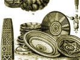

  
[Intangible Textual Heritage](../../index)  [Africa](../index) 
[Index](index)  [Previous](sft06)  [Next](sft08) 

------------------------------------------------------------------------

[Buy this Book on
Kindle](https://www.amazon.com/exec/obidos/ASIN/B003CN6KYW/internetsacredte)

------------------------------------------------------------------------

  
*South-African Folk-Tales*, by James A. Honeÿ, \[1910\], at Intangible
Textual Heritage

------------------------------------------------------------------------

# THE JACKAL AND THE WOLF

ONCE on a time Jackal, who lived on the borders of the colony, saw a
wagon returning from the seaside laden with fish; he tried to get into
the wagon from behind, but he could not; he then ran on before and lay
in the road as if dead. The wagon came up to him, and the leader cried
to the driver, "Here is a fine kaross for your wife!"

"Throw it into the wagon," said the driver, and Jackal was thrown in.

The wagon traveled on, through a moonlight night, and all the while
Jackal was throwing out the flsh into the road; he then jumped out
himself and secured a great prize. But stupid old Wolf (hyena), coming
by, ate more than his share, for which Jackal owed him a grudge, and he
said to him, " You can get plenty of fish, too, if you lie in the way of
a wagon as I did, and keep quite still whatever happens."

"So!" mumbled Wolf.

Accordingly, when the next wagon came from the sea, Wolf stretched
himself out in the road.

"What ugly thing is this?" cried the leader, and kicked Wolf. He then
took a stick and thrashed him within an inch of his life. Wolf,
according to the directions of Jackal, lay quiet as long as he could; he
then got up and bobbled off to tell his misfortune to Jackal, who
pretended to comfort him.

"What a pity," said Wolf, "I have not got such a handsome skin as you
have!"

------------------------------------------------------------------------

[Next: A Jackal And A Wolf](sft08)

