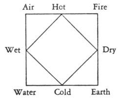

  
[Intangible Textual Heritage](../../index)  [Africa](../index) 
[Egypt](../../egy/index)  [Index](index)  [Previous](stle08) 
[Next](stle10) 

------------------------------------------------------------------------

[Buy this Book at
Amazon.com](https://www.amazon.com/exec/obidos/ASIN/0865433623/internetsacredte)

------------------------------------------------------------------------

  
*Stolen Legacy*, by George G. M. James, \[1954\], at Intangible Textual
Heritage

------------------------------------------------------------------------

p. 54 p. 55

### CHAPTER V:

### The Pre-Socratic Philosophers and the Teachings Ascribed to Them.

N.B.

It is absolutely necessary here in chapters V and VI to mention the
doctrines of the so called Greek philosophers in order to convince my
readers of their Egyptian origin which is shown in the summaries of
conclusions which follow these teachings. It is also necessary to
mention them so as to serve the purpose of reference and to meet the
convenience of readers.

#### I. The Earlier Ionian School.

This Group consisted of (i) Thales (ii) Anaximander and (iii)
Anaximenes.

\(i\) *Thales*, supposed to have lived 620–546 B.C. and a native of
Miletus, is credited by Aristotle, with teaching that—

\(a\) water is the source of all living things.

\(b\) all things are full of God.

Both history and tradition are silent as to how Thales arrived at his
conclusions, except that Aristotle attempts to offer his opinion as a
reason: that is that Thales must have been influenced by the
consideration of the moisture of nutriment, and based his conclusion on
a rationalistic interpretation of the myth of Oceanus. This however is
regarded as mere conjecture on the part of Aristotle. (Turner's History
of Philosophy, p. 34).

\(ii\) *Anaximander*, supposed to have been born 610 B.C. at Miletus, is
credited with the teaching that, the origin of all things is "the
Infinite", or the Unlimited (i.e., apeiron), or the Boundless.

The Apeiron is regarded as equivalent to the modern notion of space, and
the mythological notion of chaos.

p. 56

Both history and tradition are silent as to how Anaximander arrived at
his conclusion: but here again we find Aristotle offering his opinion as
a reason, i.e., that Anaximander must have supposed that change destroys
matter, and that unless the substratum of change is limitless, change
must at sometime cease. This opinion, is of course, mere conjecture, on
the part of Aristotle. (Turners History of Philosophy, p. 3536).

\(iii\) *Anaximenes*, also a native of Miletus, and supposed to have
died in 528 B.C., is credited with the teaching that all things
originated from air.

Both history and tradition are silent as to how Anaximenes arrived at
his conclusion; and all attempts to furnish a reason are regarded as
mere conjecture. (Turner's History of Philosophy, p. 37–38).

#### 2. Pythagoras.

Born in the Aegean Island of Samos, supposedly in 530 B.C.; the
following doctrines have been attributed to Pythagoras:—

\(i\) *Transmigration*, the immortality of the soul and salvation.

This salvation is based upon certain beliefs concerning the soul. True
life is not to be found here on earth, and what men call life is really
death, and the body is the tomb of the soul.

Owing to the contamination caused by the soul's imprisonment in the
body, it is forced to pass through an indefinite series of
re-incarnations: from the body of one animal, to that of another, until
it is purged from such contamination.

Salvation, in this sense, consists of the freedom of the soul from the
"cycle of birth, death and rebirth", which is common to every soul, and
which condition must remain until purification or purgation is
completed.

p. 57

Being liberated from the ten chains of the flesh, and also from
successive re-incarnations, the soul now acquires her pristine
perfection, and the eligibility to join the company of the Gods, with
whom she dwells for ever.

This was the reward which the Pythagorean System offered its initiates.

\(ii\) *The doctrines of* (a) *Opposites*, (b) *the Summum Bonum, or
Supreme Good, and* (c) *the process of purification*.

\(a\) THE UNION OF OPPOSITES creates harmony in the universe. This is
true in the case of musical sounds, such as we find in the lyre: where
the harmony produced is the result of the mean proportional relation
between the length of the two middle strings to that of the two
extremes. This is also true in natural phenomena, which are identified
with number, whose elements consist of the odd and the even. The even is
unlimited, because of its quality of unlimited divisibility, and the odd
indicates limitation; while the product of both is the unit or harmony.

Similarly, do we obtain harmony in the union of positive and negative;
male and female; material and immaterial; body and soul.

\(b\) THE SUMMUM BONUM OR SUPREME GOOD in man, is to become godlike.
This is an attainment, or transformation which is the harmony resulting
from a life of virtue. It consists in a harmonious relationship between
the faculties of man, by means of which his lower nature becomes
subordinated to his higher nature.

\(c\) THE PROCESS OF PURIFICATION

The harmony and purification of the soul is attained, not only by
virtue, but also by other means, the most important among them being the
cultivation

p. 58

of the intellect through the pursuit of scientific knowledge and strict
bodily discipline.

In this process, music also held an important place. The Pythagoreans
believed and taught that just as medicine is used to cure the body, so
music must be used to cure the soul.

Here it might be appropriate to insert the doctrine of the "Three
Lives", since it is also a method and means of purification:—

"Mankind is divided into three classes: Lovers of wealth; lovers of
honour, and lovers of wisdom (i.e. philosophers); this last, being
highest." According to Pythagoras, philosophy determined the
purification, which led to the final salvation of the soul.

\(iii\) *The Cosmological Doctrine*

All things are numbers, that is to say not only every object, but the
entire universe is an arrangement of numbers. This means that the
characteristic of any object is the number by which it is represented.

\(a\) Since the universe consists of ten bodies, namely, the five stars,
the earth and the counter earth, then the universe must be represented
by the perfect number ten.

\(b\) Applied to the space around us, but called by Pythagoreans the
Boundless or Unlimited, it must be taken to mean, the measuring out of
this Boundless, into a balanced and harmonious universe, so that
everything might receive its proper proportion of it. No more, no less.

\(c\) This arrangement seems to suggest the notion of forms capable of
receiving a mathematical expression, i.e., a doctrine which later
appeared in Plato, as the theory of Ideas.

\(d\) In the centre of the universe there is a central fire around which
the heavenly bodies fixed in

p. 59

their spheres, revolve from West to East, while around all there is the
peripheral fire.

This motion of the heavenly bodies is regulated in the velocity, and
produces the harmony of the spheres.

(Roger's Students' History of Philosophy p. 14–22).

(Bakewell's Source Book of Philosophy) (Life and Tenets of Pythagoras).

(Ruddick's History of Philosophy) (Life and Tenets of Pythagoras).

(Fuller's History of Philosophy) (Life and Tenets of Pythagoras).

(Turner's History of Philosophy: p. 40–43).

(History of Ancient Egypt by John Kendrick vol. I p. 401-402)

(Plato's Phaedo, 85E).

(Aristotle's Metaphysics I 5; 985b, 24; and I 5; 986a, 23).

#### 3. The Eleatic Philosophers.

The Eleatic Philosophers include (a) Xenophanes, (b) Parmenides, (c)
Zeno and (d) Melissus. They deal with the problem of change, and are
credited with introducing the notions of Being and Becoming. The term
Eleatic is derived from Elea, a city in Southern Italy, where these men
are said only to have visited.

\(a\) XENOPHANES

Born at Colophon, in Asia Minor, about 370 B.C., Xenophanes is credited
with the following doctrines:—

\(i\) THE UNITY OF GOD

Men err when they ascribe their own characteristics to the gods: for God
is all eye, all ear, and all intellect. Again, since there is no
Becoming, and since Plurality depends upon Becoming, therefore there is
no Plurality. Consequently all is one and one is all.

p. 60

\(ii\) TEMPERANCE

Against the artificial culture of Greece, its luxuries, excess and fops;
Xenophanes is credited with advocating Temperance i.e., plain living,
simplicity, moderation, and pure thinking.

Roger's Students' History of Philosophy: p. 27–28.

Wm. Turner's History of Philosophy: p. 45–46.

Zeller's History of Philosophy: p. 58–60.

\(b\) PARMENIDES

Is said to have been born at Elea 540 B.C. and to have composed a poem
concerning nature: *peri physeos*, which contains his doctrines.

A. THE POEM consists of three parts:—

\(i\) In part one, the Goddess of truth points out that there are two
paths of knowledge: one leading to a knowledge of truth, and the other
to a knowledge of the opinions of men.

\(ii\) In part two, the journey to truth is described and contains a
metaphysical doctrine, and in part three, a cosmology of the apparent.

B. THE DOCTRINES are as follows:—

\(i\) *The Physical Doctrine*.

Though right reason (logos) holds that Being is one and immutable, the
senses and common opinion (doxa) are convinced that plurality and change
exist around us.

\(ii\) *The Doctrine of Truth*.

Truth consists of the knowledge that Being is, and that not-Being is
not: and since not-Being is,not, then Being is one and alone.

Consequently, Being is unproduced and unchangeable. It is impossible for
Being to produce Being; for under such circumstances Being must exist
before it begins to exist.

\(iii\) *The doctrine of the Cosmology of the Apparent*.

p. 61

Here Parmenides simply repeats the Pythagorean doctrine of opposites:—

All things are composed of light or warmth, and of darkness or cold, and
according to Aristotle, the former of these opposites corresponds to
Being, while the latter to not-Being.

These opposites are equivalent to the male and female principles in the
cosmos.

\(iv\) *The Doctrine of the Anthropology of the Apparent:*—The life of
the soul, i.e., perception and reflexion, depends upon the blending of
opposites, i.e., of the light-warm and the dark-cold principles, each of
which stands in a physical relation to a corresponding principle in the
cosmos.

(Zeller's History of Philosophy p. 60–62).

(Roger's Students' History of Philosophy p. 29–30).

(William Turner's History of Philosophy p. 47–48). (B. D. Alexander's
History of Philosophy p. 22–24).

\(c\) ZENO

Supposed to be born 490 B.C. at Elea was a pupil of Parmenides,
according to Plato. (Parmenides 127B).

His doctrines were intended to be a contradiction of (i) Motion and (ii)
Plurality and space.

\(i\) Arguments against motion:—

\(a\) A body, in order to move from one point to another, must move
through an infinite number of spaces since magnitude is divisible ad
infinitum.

\(b\) A body which is in one place is at rest. An arrow in its flight,
is at each successive moment in one place therefore it is at rest.

\(c\) The race between Achilles and the tortoise, is intended to
contradict the concept of motion. In such a race Achilles can never
overtake the tortoise, because he must first reach the point at which
the tortoise started; but in the meantime the tortoise

p. 62

will have gained more ground. Since Achilles must always reach first the
position previously occupied by the tortoise, the tortoise must always
keep ahead, at every point.

\(ii\) Arguments against Plurality and Space:—

\(a\) If a measure of corn produces a sound, then each grain ought to
produce a sound. (This argument is taken from Simplicus: but ascribed to
Zeno.)

\(b\) If Being exists in space, then space itself must exist in space,
and the process will have to go on ad infinitum. (This argument is also
taken from Simplicus.)

\(c\) If magnitude exists, it must be infinitely great and infinitely
small, at one and the same time, since it has an infinitude of parts
which are indivisible. Therefore the idea of the manifold is
contradictory.

(William Turner's History of Philosophy p. 49–50).

(Roger's Students' History of Philosophy p. 31–32).

(Zeller's History of Philosophy p. 63–64).

#### 4. The Later Ionian School: (a) Heraclitus, (b) Anaxagoras, (c) Democritus.

\(a\) HERACLITUS

Believed to have been born B.C. 530, and to have died in 470 B.C.
Heraclitus, a native of Ephesus, in Asia Minor, has been credited with
the following doctrines:—

\(i\) THE DOCTRINE OF UNIVERSAL FLUX

There is no static Being, and no Unchanging element. Change is Lord of
the Universe. The underlying element of the universe is Fire, and all
things are changed for Fire, and Fire for all things.

\(a\) The change is not at random; but uniform, orderly and cyclic. Thus
the heavenly Fires are transmuted successively, into vapour, water and
earth;

p. 63

only to go through a similar process as they ascend again into Fire.

\(b\) It contains the elements both of the old and new, at any given
moment in the process. Consequently, where night ends, there day begins;
where summer begins, there spring ends; and where mortal life ends,
there spiritual life begins.

\(c\) It also consists in the generation which results from the union of
opposites (a doctrine, later to be found in Plato and Socrates).

Hence we observe that the union of male and female produces organic
life; and that sharp [and](errata.htm#2) flat notes produce harmony.

\(ii\) THE THEORY OF KNOWLEDGE

Since sense-knowledge, or knowledge derived from the senses is illusion,
it must be avoided, and true knowledge sought for in the perception of
the underlying unity of the various opposites.

This is possible for man, who is part of the all comprehending Fire,
which underlies the Universe.

But in the doctrine of the upward and downward paths, true knowledge
comes from the upward path which leads to the eternal Fire; whereas
folly and death are the result of following the downward path.

\(iii\) THE DOCTRINE OF THE *LOGOS*

That the hidden harmony of nature ever reproduces concord from
oppositions, that the divine law (*dikē*) or universal reason (*logos*)
rules all things; and that the primitive essence recomposes itself anew
in all things according to fixed laws, and is again restored by them.

(Zeller's History of Philosophy p. 68).

(A. B. Turner's History of Philosophy p. 66–77). (Zeller's History of
Philosophy p. 66–71).

(William Turner's History of Philosophy p. 53–58).

p. 64

\(b\) THE LIFE AND TEACHINGS OF ANAXAGORAS

Anaxagoras, a native of Clazomenae, in Ionia, is supposed to have been
born in 500 B.C. Like all the other philosophers, nothing is known about
his early life and education. He comes into history through a visit to
Athens, where he met and made the friendship of Pericles, and where he
was charged with impiety. He however escaped from prison and fled back
to his home in Ionia where he died in 430 B.C.

His doctrines included the following:—

\(i\) *Nous* i.e., mind alone is self-moved, and is the cause of motion
in everything in the universe, and has supreme power over all things.
(William Turner's History of Philosophy, p. 63); (Zeller's Hist. of
Phil. p. 85; 86).

\(ii\) Sensation is produced by the stimulation of opposites. We
experience the sensation of cold, because of the heat in us, and we
experience a sweet taste because of the sour in us. (Wm. Turner's Hist.
of Phil. p. 64; Theophrastus: de Sensu, Fragment 27: Zeller's Hist. of
Phil. p. 86).

N.B.

These doctrines will be treated elsewhere, as regards their source and
authorship.

\(c\) THE LIFE AND TEACHINGS OF DEMOCRITUS

\(1\) HIS LIFE

Democritus (420–316 B.C.) is said to have been the son of Hegesistratus,
and also a native of Abdera, a city at Miletus, an island in the Aegean.

Both Aristotle and Theophrastus have regarded Leucippus as the founder
of atomism, in spite of the fact that his existence is doubted. Like all
the other Greek philosophers, nothing seems to be known about his early
life and training. However he enters history as a magician and sorcerer.

p. 65

(Burnet, op. cit. p. 350; Wm. Turner's Hist. of Phil. p. 65).

\(2\) HIS DOCTRINES

The name of Democritus has been associated with the following doctrines,
summarized as atomism in his explanation of (i) the nature of the atoms,
and their behavior in relation to the phenomena of (ii) creation (iii)
life and death and (iv) sensation and knowledge

\(i\) *The Description of the Atom*

\(a\) *The world-stuff*. The atom is explained as a colorless,
transparent and homogeneous powder, consisting of an infinite number of
particles.

\(b\) Their Qualities: The atom is described as full or solid,
invisible, indestructible, un-created and capable self-motion. The atoms
differ in shape, order, position, quantity and weight.

\(c\) *The Identity of the Atom with Reality:* Every atom is equivalent
to "that which is (i.e. *To on*); and the void is equivalent to "that
which is not" (i.e., *To mē on*). Reality is the movement of "that which
is," within that-which is not.

\(ii\) The Atom in Creation.

Owing to the difference in size, weight and mobility, and in particular
to necessity, there is a resultant motion, by means of which the atoms
combine themselves for the formation of the organic and inorganic
worlds.

\(iii\) The Atoms in the Phenomena of Life and Death.

p. 66

What we commonly call life and death, are due to a change in the
arrangement of the atoms. When they are arranged in a certain way, life
emerges; but when that arrangement is changed to another way, then death
is the result.

In death, the personality disappears, the senses also disappear; but the
atoms live on for ever. The heavier atoms descend to the earth: but the
soul atoms, which are composed of fire, ascend to the celestial regions,
whence they came.

\(iv\) The Atom in Sensation and Knowledge

\(a\) The Mind or Soul is composed of fire atoms, which are the finest,
the smoothest, and the most mobile. These fire atoms are distributed
throughout the whole universe; and in all animate things, and especially
in the human body, where they are found in the largest numbers.

\(b\) External objects constantly give off emanations or minute images
of themselves. These in turn impress themselves upon our senses, which
set in motion our Soul atoms, and thereby create Sensation and
Knowledge.

(Diogenes Laertius Book IX p. 443–455).

(Wm. Turner's History of Philosophy p. 65–70).

(Roger's Students History of Philosophy p. 40–42).

(Zeller's History of Philosophy p. 76–83).

(B. D. Alexander's History of Philosophy p. 37–41).

#### 5. Summary of Conclusions Concerning the Pre-Socratic Philosophers and the History of the Four Qualities and Four Elements.

I. The early Ionic philosophers have been given the credit

p. 67

of teaching the following doctrines (a) Thales, that all things
originated from water, (b) Anaximander, that all things originated from
Primitive matter, i.e., the boundless (to apeiron), and (c) Anaximenes,
that all things get their life from air. But these ideas were not new at
the time when these men are supposed to have lived, i.e., between the
sixth and fifth centuries B.C. The creation story, found in the book of
Genesis, speaks of the elements of water, air and earth as the cosmic
ingredients of the chaos out of which creation gradually developed. The
date of the Pentateuch is placed at the eighth century B.C.; but the
view of the Mosaic authorship of Genesis takes us still further back
into antiquity, and many centuries before the time of the Ionian
philosophers. We are told not only by the bible, but also by the
historian Philo, that Moses was an Initiate of the Egyptian Mysteries
and became a Hierogrammat; learned in all the wisdom of the Egyptian
people. This was only possible by proper initiation and gradual
advancement, when evidence of fitness was demonstrated by the Neophyte.
The Egyptian name of Moses was given to all candidates at their baptism,
and meant "saved by water".

The Exodus of the Israelites appears to have occurred in the 21st
Egyptian Dynasty, i.e., 1100 B.C. in the reign of Bocchoris under the
leadership of Moses, whose creation story of Genesis is clearly of
Egyptian origin. It is clear that the early Ionic Philosophers drew
their teachings from Egyptian sources.

(Chaeremon: Jos. C. Apion I, 32; Philo; Ancient Mysteries C. H. Vail p.
61; John Kendrick's Ancient Egypt vol. 2 p. 268–270; 303; See also Dr.
Hasting's Bible Dictionary, on authorship and date of Pentateuch).

II\. In the case of the Eleatic philosophers, history regards Zenophanes
as a Satirist, not a philosopher, and Zeno as paradoxical concerning his
treatment of the problems of plurality, space and motion, which
ultimately leads to a reductio ad

p. 68

absurdum. Parmenides introduced no new teaching when he spoke of Being
(*To on*) as that which exists; and Non-Being (*To mē on*) as that which
does not exist. He only reemphasized the doctrine of opposites as a
principle of nature: a doctrine taught not only by the Pythagoreans, but
also the Athenian philosophers, chiefly Socrates. But the doctrine of
opposites owes its origin to the Egyptian Mysteries which take us back
to 4000 B.C. when it was demonstrated not only by double pillars in
front of temples, but also by the pairs of Gods in the Mystery System,
representing male and female, positive and negative principles of
nature. It is also clear that the Eleatic Philosophers drew their
teachings from Egyptian sources.

(Plato Phaedo; Memphite Theology: Intellectual Adventure of Primitive
Man by Frankfort p. 55; 66–67; 51–60. Plutarch: Isis et Osiris, p. 364C;
355A; 371B; 868, Ancient Egypt: John Kendrick vol. I p. 339).

III\. The later Ionic philosophers have been given credit for the
following doctrines:

\(1\) Heraclitus, (a) that the world was produced by fire through a
process of transmutation, and (b) since all things originate from fire,
then Fire is the *Logos:* The Creator.

\(2\) Anaxagoras (a) the *Nous* or mind is the source of motion or life
in the universe and that sensation is produced by the stimulation of
opposites.

\(3\) Democritus (a) that atoms under-lie all material things, and (b)
that the phenomena of life and death are merely changes in the mixture
of the atoms, so that the atoms never die, because they are immortal.

These doctrines were by no means produced by the late Ionic
philosophers, but could be shown to have originated from the Egyptian
Mystery System. The Egyptians were fire worshippers, because they
believed that fire was the creator of the universe, and built their
great pyramids (*pyr* = fire) in order to worship the God of Fire, and
the pyramid age

p. 69

goes back to something like 3300 B.C., several thousands of years before
the Greeks were said to have come into the Mediterranean area.

According to Jamblichus the Egyptian God Ptah was the God of order and
form in creation, an Intellectual Principle. This God was also
recognized as the Divine Artificer who fashioned the universe out of
fire.

Rosellini: mon del sults; John Kendrick's Ancient Egypt vol. I p. 318.

Furthermore, Swinburne Clymer in his Philosophy of Fire p. 18 has made
the following statement "The study of the Mysteries of Isis and Osiris
(Egyptian Goddess and God) quickly proves to the student that it was a
pure Fire Philosophy. Zoroaster carried those mysteries into Greece,
while Orpheus carried them into Thrace. In each of these places, these
Egyptian mysteries assumed the names of different Gods in order to be
adapted to local conditions. Hence in Asia they took the form of Mithra:
in Samothrace, the form of the Mother of the Gods; in Boeotia, the form
of Bacchus; in Crete, the form of Jupiter; in Athens, the forms of Ceres
and Proserpine.

The most noted of these Egyptian imitations were the Orphic, Bacchic,
Eleusinian, Samothracian, and Mithraic. All of these Fire Worshippers,
believed that the universe originated from Fire, and they lived at a
time which antedated the time of the late Ionic philosophers by
thousands of years.

The other doctrines of the later Ionic philosophers together with those
of Socrates, Plato and Aristotle will be treated under Summaries of
Socrates, Plato and Aristotle and in Chapter VIII, and will include (1)
Opposites (2) The nous or mind (3) The Logos, (4) The Atom, (5) The
Theory of Ideas, (6) The Unmoved Mover, (7) Immortality.

IV\. *The Greek Philosophers practised plagiarism*.

The teachings of Pythagoras seem to have been so comprehensive that
nearly all his successors embraced and taught a

p. 70

portion of his doctrine, which we are told he obtained by frequent
visits which he made to Egypt for the purpose of his education. Two
things are at once obvious, (1) that the Greek philosophers practiced
plagiarism and did not teach anything new and (2) the source of their
teachings was the Egyptian Mystery System, either directly through
contact with Egypt, or indirectly through Pythagoras or tradition. These
facts can now be further demonstrated by an outline of the doctrines of
Pythagoras, with the names of philosophers who repeated his doctrines:

1\. *The Doctrine of Opposites:* the unit of number is composed both of
odd and even elements; of the finite and infinite; and of the positive
and negative. In this connection, we find (a) Heraclitus suggesting fire
to be the source of creation, by means of the principle of strife which
separates phenomena; and harmony which restores them to their original
source. (William Turner's History of Philosophy p. 55; Zeller's Hist. of
Phil. p. 67–68). (b) Parmenides, suggesting Being as existent and
Non-Being as non-existent (Zeller's Hist. of Phil. p. 61; Turner's Hist.
of Phil. p. 48). (c) Socrates, attempting to prove the immortality of
the Soul by the doctrine of opposites (Plato Phaedo). (d) Plato,
attempting to explain nature, used the Theory of Ideas which he based
upon the principle of opposites. Consequently the Idea is true reality,
i.e., Being (*To on*); hence the concept is real; but the thing which is
known by the concept is unreal. The noumen is real and perfect; but the
phenomenon is unreal and imperfect (Parmenides 132D; Aristotle Meta 16,
987b9). (e) Aristotle in attempting to establish the existence of God,
describes the divine attributes in terms of opposites. God is the First
Mover that is unmoved (*proton kinoûn akineton*). Hence, we have a
combination of motion and rest, as the attributes of Deity and Nature.
(Aristotle's physics VIII 5, 256a; II 1; 192b 14; II 8, 199; de caelo I
4, 271a; Wm. Turner's Hist. of Phil. p. 141).

p. 71

2\. *The Doctrine of Harmony*, as a union of opposites, after being
expounded by Pythagoras, appears also in the systems of (a) Heraclitus,
who explains the phenomena of nature as passing successively through
their opposites; (b) Socrates, who also defines harmony as the union of
opposites; (c) Plato, who defines the harmony of the soul as the proper
subordination of its parts, i.e., the higher and lower natures.
(Turner's Hist. of Phil. p. 41; 56; Zeller's Hist. of Phil. p. 51; 69;
Plato Phaedo C 15; Plato Republic); also (d) Aristotle, who defines the
soul as a harmony in his de animo I. 2.

3\. *The Central and Peripheral Fires*. Here Pythagoras attempts to show
that fire under-lies creation, and this same notion is expressed by (a)
Heraclitus, who speaks of the origin of the universe through the
transformation of fire. Then we have (b) Anaxagoras (c) Democritus (d)
Socrates and (e) Plato, each using the term mind (*nous*) as responsible
for creation. Anaxagoras and Socrates who speak directly of mind (nous)
as an Intelligence and purpose behind nature; while Democritus and Plato
speak of mind (*nous*) indirectly as the World Soul, but further
describe it as being composed of fire atoms floating throughout space.
Clearly then, Mind (*nous*), no matter what other name or function we
give it, is fire, since it is composed of fire atoms; and fire according
to Pythagoras underlies creation. (Wm. Turner's Hist. of Phil. p. 42,
55, 63, 82; Zeller's Hist. of Phil. p. 53, 67, 76–83; Aristotle:
Metaphysics I, 3, 984b, 17; Diogenes Laertius: Bk. X. p. 443–453;
Xenophon Memorabilia I, 4, 2; Plato Timaeus: 30, 35; Roger's Student
Hist. of Phil. p. 40–42; B. D. Alexander's Hist. of Phil. p. 43).

4\. *Immortality of the Soul*. According to Pythagoras, the doctrine of
the immortality of the Soul is implied in the doctrine of the
Transmigration of the Soul:—

A. Socrates: The purpose of philosophy is the salvation of the Soul,
whereby it feeds upon the truth congenial to its divine nature and thus
escapes from the wheel of rebirth, and

p. 72

finally attains the consummation of unity with God. (Zeller's Hist. of
Phil. p. 50–56; Roger's Hist. of Phil. p. 29 and 60; William Turner's
Hist. of Phil. p. 41 and 48).

B. Plato's doctrines (1) Transmigration and (2) Recollection: (1)
Transmigration: the souls of men go to the place of reward or
punishment, and after one thousand years they are permitted to choose a
new lot of life. He who has thrice chosen the higher life, gains after
three thousand years, the home of the Gods in the kingdom of thought.
Others wander about for thousands of years in various bodies; and many
are destined to pursue their earthly life in lower animal forms. It is
necessary to point out that in this doctrine of Transmigration, Plato
describes the judgement scene in the Egyptian Book of the Dead. (2)
Recollection: although the sense perceived world cannot lead us to a
knowledge of Ideas, yet it reminds us of the Ideas which we saw in a
previous existence.

(The allegory of the Subterranean Cavern; Plato's Republic C. X; The
Allegory of the slave boy; Plato's Meno; Timaeus of Plato: 31B, 33B;
38E; The Phaedo of Plato: C 15; 29; 57; Wm. Turner's Hist. of Phil. P.
105–112; B. D. Alexander's Hist. of Phil. p. 55; 152–153).

5\. *Summum Bonum*

According to Pythagoras, the supreme good in man is to become godlike.
This transformation is to be accomplished by virtue which is a union of
opposites in man's faculties, i.e., the subordination of man's lower
nature to his higher nature. (Zeller's Hist. of Phil. p. 43). But the
precise purpose of the Egyptian Mysteries was to make a man godlike by
the purificatory agencies of education and virtue. Consequently it is
clear that Pythagoras obtained this doctrine directly from the Egyptian
Mysteries. Hence it also follows that philosophers who have taught this
doctrine, must have obtained it, either directly from the Egyptian
Mysteries, or indirectly, through the teachings of Pythagoras.
(According to [Sallust](errata.htm#3), Deification or becoming godlike
was the purpose of the Egyptian Mysteries,

p. 73

and according to C. H. Vail in his Ancient Mysteries, the Egyptian
Summum Bonum consisted of five stages, during which the Neophyte
developed from a good man into a triumphant Master, attaining the
highest spiritual consciousness by means of casting off the ten bodily
fetters and becoming an adept like Horus or Buddha or Christ).

The philosophers, besides Pythagoras, who are given credit with having
taught the doctrine of the Supreme Good, are (a) Socrates, who defined
it as an attainment in which man becomes godlike, through self-denial
and the cultivation of the mind. (Xenophon Memorabilia I, 5, 4,) (b)
Plato who defined it as happiness which is the attainment of the Idea of
the Good, which is God. (Plato: Symposium 204E; Plato: Republic IV, 441,
443; Plato: Phaedo 64 sqq; Plato: Theaetetus 176 A). (c) Aristotle; who
defined it as happiness which is based upon reason and which includes
all the gifts of fortune. It should be noted however that Aristotle's
definition of the Supreme Good marks the first departure from the
concept of the Summum Bonum of the Egyptian Mysteries; and the same
thing is true of the Hedonists, who defined it as pleasure. (Wm.
Turner's Hist. of Phil. p. 153. Aristotle Ethics, Nic I, 6, 1097;
Aristotle Ethics, Nic I, 9, 1099a, 31) The conception of a Supreme Good
is Egyptian, from which source Pythagoras and other philosophers
obtained the doctrine.

V. *SUMMARY OF CONCLUSIONS CONCERNING DEMOCRITUS*

Because of the importance of the doctrine of the atom, and the great
suspicion of his great number of books like that of Aristotle,
Democritus is treated separately, like each of the Athenian
philosophers.

1\. HIS LIFE:

The same thing might be said of Democritus as might be said of any of
the men who were called Greek philosophers: nothing appears to be known
about his early

p. 74

life and training. However he comes into history attracting public
attention, as a sorcerer and magician. (Turner's Hist. of Phil. p. 65).

2\. HIS DOCTRINES AND AUTHORSHIP:

\(i\) *Authorship:* The authorship of the doctrine of the atom is
doubtful, from the standpoint or view of certain modern writers. The
names of the Ionians Leucippus and Democritus have been associated with
this doctrine, which according to the opinion of Aristotle and
Theophrastus, originated through Leucippus, but was developed by
Democritus.

As a matter of fact, the Ionians doubted the existence of Leucippus
because he was unknown to them; and it seems proper that the opinion of
the Ionians should receive credence rather than that of Aristotle and
Theophrastus, who were Athenians, and who were compiling philosophy in
the interest of their movement.

(Burnet op. cit. p. 350; Turner's Hist. of Phil. p. 65).

\(ii\) *The doctrine concerning the Atom is eclectic*.

The doctrine of the atom as explained by Democritus, is eclectic, and
represents one of the many forms in which the ancient doctrine of
opposites has been expressed. The Pythagoreans expressed it by the
elements of number: odd and even.

Parmenides being unfamiliar with the law of generation, denied the
existence of one opposite (not-Being), in order to affirm the existence
of the other (being).

Socrates, being more acquainted with the law of generation than
Parmenides, expressed it in several pairs of opposites, in an effort to
prove the immortality of the soul: hence he spoke of unity and duality;
of division and composition; of life and death.

p. 75

In like manner Democritus expressed the doctrine of opposites, when he
described Reality by the life of the atom, i.e., a movement of "that
which is" (*To on*) within "that which is not" (*To mē on*).

The original source of this doctrine however, is the philosophy of the
Mystery System of Egypt where we find the male and female principles of
nature symbolized by (a) Osiris and Isis: the Egyptian God and Goddess,
and (b) the Gods Homs and Seth, symbolizing a world in static
equilibrium of conflicting forces, as they contend for dominion over
Egypt.

(Memphite Theology; Kingship and the Gods by Frankfort C. 3, p. 25–26;
35; Herodotus I, 6–26; Ancient Egypt by John Kendrick Bk. I p. 339;
Egyptian Religion by Frankfort, p. 64, 73 and 88; Zeller's Hist. of
Phil. p. 61; Wm. Turner's Hist. of Phil. p. 41; Plato Phaedo C. 15, 16,
49).

The doctrine and philosophy of opposites is further demonstrated by the
Egyptian Creation story, in which Order came out of Chaos and which was
represented by four pairs of opposites i.e., male and female gods.

\(a\) Nun and Naunet i.e., primeval Matter and Space.

\(b\) Huk and Hauket i.e., Illimitable and the Boundless.

\(c\) Huh and Hauhet, i.e., Darkness and Obscurity.

\(d\) Amon and Amaunet, i.e., the hidden and concealed ones (the Air,
Wind).

Clearly the doctrine of opposites was a basic philosophy of the
Egyptians, being connected with not only the Gods of their Mystery
dramas, but with their Cosmology, and since this connection makes the
doctrine one of the earliest in the development of Egyptian thought, it
antedates the reign of Menes, and means that the Egyptians were familiar
with it before 3000 B.C.

Under these circumstances and in consequence of these facts, the
Egyptian Mystery System was the source of the doctrines

p. 76

\[paragraph continues\] (a) of the atom
and (b) of opposites. Leucippus and Democritus taught nothing new and
must have obtained their knowledge of the doctrines from the Egyptians,
directly or indirectly.

\(iii\) *The Doctrines of the universal distribution of fire atoms, and
their emanation from external objects are derived from Magic:*—

These doctrines are magical and express the magical principle "that the
qualities of animals or things are distributed throughout all their
parts." (Dr. Frazer's Golden Bough). Consequently within the universe
contact is established between objects through emanations, and in the
case of human beings, the result might be sensation or cognition;
healing or contagion.

This principle is demonstrated not only by the cures such as were
affected by the garment of Christ, and the handkerchiefs of St. Paul:
but also by the modern scientific and medical practice of the preventive
measure of quarantine. It must be remembered that magic was part of the
education of the Egyptian priests: for the religious rites and
ceremonies of the Egyptians were magical; and the priests were the
custodians of the knowledge.

\(iv\) A fourth point is the fact that in the history and compilation of
Greek philosophy by Aristotle and his followers, there are only two men
whose names are associated with the authorship of an extraordinary
number of scientific books; and the names of these men are Democritus
himself and Aristotle.

(Diogenes Laertius Bk. 9 p. 445–461; Bk. 5 p. 465–467).

\(v\) A fifth point which deserves important mention is the fact that in
the history and compilation of

p. 77

\[paragraph continues\] Greek philosophy
by Aristotle and his followers, it has been discovered that wherever
there has been the possession of a large collection of scientific books,
there has also been direct or indirect association with Alexander the
Great.

\(vi\) The association between Democritus and Alexander the Great is
seen through the Democritean Circle; a succession of Teachers and
students, from a common original Teacher:—Democritus (420–316 B.C.) is
said to have taught Metrodorus of Chios, who in turn is said to have
taught Anaxarchus, who is said to have flourished at the time of the
110th Olympiad (340–337 B.C.), and to have accompanied Alexander the
Great on his campaign against Egypt 333 B.C.

Here, it is easy to see the tie between Democritus and Anaxarchus for
these men were all Ionians, and members of the same school and were
alive at the time of Alexander's Conquest of Egypt. (Zeller's Hist. of
Phil. p. 83; Diogenes Laertius Bk. 2, p. 471).

On the other hand, Aristotle's contact with Alexander the Great is well
known, since he was a tutor of the young prince, at the Macedonian
palace. Roger's Student Hist. of Phil. p. 104).

\(vii\) *Circumstantial evidence points to the fact that the books of
Democritus were not written by him, nor did they contain his teachings.
This is so, for the following reasons:*—

\(a\) Leucippus, whom the Ionians did not know, and whose existence has
been questioned, has been given credit by Aristotle for the origin of
the doctrine of the atom. (Zeller's Hist. of Phil. p. 77; Burnet, op.
cit. p. 350) (Wm. Turner's Hist. of Phil. P. 65; Diogenes Bk. X, 13).

p. 78

\(b\) Apart from what was written on the Atom, the name of Democritus
is, associated with a large list of books, dealing with over sixty
different subjects, and covering all the branches of science known to
the ancient world. In addition to this vast field of knowledge, the list
also contains books on Military Science, Law and Magic. Clearly, the
accumulation of such a vast range of knowledge, by a single individual,
written in a single lifetime is impossible both physically and mentally.
The method among the ancients of imparting knowledge was by gradual
stages, followed by evidence of proficiency, which in turn was also
followed by initiations, which marked every step in the progress of the
Neophyte.

The progress of training was slow and no Neophyte could accomplish such
knowledge in his life time as took the Egyptians over five thousand
years to accumulate. These human limitations are as true today as they
were among the ancients; for our great scientists of the Modern World
are specialists only in single subjects.

\(c\) The question now remains: how did Democritus accumulate those
books if he did not write them? We believe we have the answer because it
has been noticed in the history of Greek philosophy that (a) wherever a
Greek philosopher has had association, direct or indirect, with
Alexander the Great, there was also the possession of a large collection
of scientific books, and (b) this is true in the cases of Democritus and
Aristotle. (c) Anaxarchus and Democritus

p. 79

were Ionians, who belonged to the same school and (d) Anaxarchus
accompanied Alexander the Great on his campaign against Egypt. ( The
indirect association between Democritus and Alexander the Great now
becomes obvious.) (e) It follows that since Alexander's conquest of
Egypt had brought the Greeks their long hoped for opportunity, i.e.,
access to the Egyptian Library and Museum, we would naturally expect
Alexander and his friends, and the invading armies to have helped
themselves with the Egyptian books. We would also expect Anaxarchus upon
his return to Ionia, to have sold, at least a portion of his loot, to
Democritus, (nor do we expect Aristotle and Theophrastus to relate these
facts to us), since under the rules of the Mysteries, knowledge (spoken
or written,) could be diffused only by brethren among brethren. This we
believe is the way Democritus came to possess such a large number of
scientific books.

Again it must be stated that Democritus taught nothing new, but simply
what he had learnt from the Egyptians, directly or indirectly.

His doctrine on the universal distribution of fire atoms is based upon a
magical principle: if the atom is an ingredient of the world, then it
would be universally distributed.

Furthermore, Democritus enters history as a magician, and since there is
historical evidence that he visited the Egyptian priests, it is evident
that magic was part of the

p. 80

training which he must have received from them.

(Antisthenes: Treatise on Succession; Herodotus; Origen; Diogenes
Laertius: Bk. 9 p. 443; Zeller's Hist. of Phil. p. 77).

3\. *His Books are doubtful in authorship*.

Several important facts must be noted in connection with the books which
are said to have been written by Democritus:—

\(a\) A large number of books which appears in a list in the 9th Book of
Diogenes, Laertius, does not appear elsewhere in the usual textbooks on
the history of Greek Philosophy; while Zeller asserts that the
genuineness of these books cannot be determined upon the evidence of the
fragments. (Zeller's Hist. of Phil. p. 77). It seems that his list of
publications remains doubtful in authorship.

\(b\) More than 60 different subjects are treated and they include
Ethics, Physics, Astronomy, Botany, Zoology, Poetry, Medicine,
Dialectics, Military Science, and Law; also books on Magic, including
divination.

\(c\) We are informed by Diogenes Laertius that this large list of books
was compiled by Thrasyllus (about 20 A.D.) who was a student of the
school of Plato, and also a member of Aristotle's movement, which had
for its purpose, the compilation of Greek philosophy. (Zeller's Hist. of
Phil. p. 13–14) (Diogenes Laertius Bk. 9 p. 455–461).

VI\. *The Four Qualities and Four Elements*.

 

p. 81

The history of the following ancient theory of "*The Four Qualities and
Four Elements*", provides the world with the evidence of the Egyptian
origin of the doctrines of (a) Opposites or Contraries, (b) Change or
Transmutation and (c) the life and function of the universe is due to
either of four elements: fire, or water, or earth or air.

1\. This ancient theory was expressed by a diagram formed by outer and
inner squares.

2\. The corners of the outer square carried the names of the elements:
fire, water, earth and air.

3\. The corners of the inner square, being at the mid points of the
sides of the outer square, carried the four fundamental qualities, the
hot, the dry, the cold and the wet.

4\. The diagram explains that fire is hot and dry; earth is dry and
cold; water is cold and wet; and air is wet and hot.

5\. Accordingly water is an embodiment of cold and wet qualities, and
when the cold quality is replaced by the hot quality, the element water
is changed into the element air, with the wet and hot qualities.

6\. Consequently, transmutation is definitely implied in the teaching of
this symbol.

7\. It is the oldest teaching of physical science and has been traced to
the Egyptians, as far back as 5000 B.C.

8\. It shows that Plato and Aristotle (who had been credited with the
authorship of this teaching) derived their doctrines or portions of them
from the Egyptians. (Rosicrucian Digest, May 1952, p. 175).

------------------------------------------------------------------------

[Next: Chapter VI: The Athenian Philosophers](stle10)

