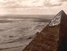

  
[Intangible Textual Heritage](../../index)  [Africa](../index) 
[Egypt](../../egy/index)  [Index](index)  [Previous](stle10) 
[Next](stle12) 

------------------------------------------------------------------------

[Buy this Book at
Amazon.com](https://www.amazon.com/exec/obidos/ASIN/0865433623/internetsacredte)

------------------------------------------------------------------------

  
*Stolen Legacy*, by George G. M. James, \[1954\], at Intangible Textual
Heritage

------------------------------------------------------------------------

p. 131

### CHAPTER VII:

### The Curriculum of the Egyptian Mystery System.

#### 1. The Education of the Egyptian Priests According to Their Orders.

From Diodorus, Herodotus and Clement of Alexandria, we learn that there
were six Orders of Egyptian Priests, and that each Order had to master a
certain number of the books of Hermes. Clement has described a
procession of the Priests, calling them by their Order, and stating
their qualifications, as follows:

First comes the Singer Odus, bearing an instrument of music. He has to
know by heart two of the books of Hermes; one containing the hymns of
the Gods, and the other, the allotment of the king's life. Next comes
the Horoscopus, carrying in his hand a horologium or sun-dial, and a
palm branch; the symbols of [Astronomy](errata.htm#9). He has to know
four of the books of Hermes, which deal with Astronomy.

Next comes the Hierogrammat, with feathers on his head, and a book in
his hand, and a rectangular case with writing materials, i.e., the
writing ink and the reed. He has to know the hieroglyphics, cosmography,
geography, astronomy, the topography of Egypt, the sacred utensils and
measures, the temple furniture and the lands.

Next comes the Stolistes, carrying the cubit of justice, and the
libation vessels. He has to know the books of Hermes that deal with the
slaughter of animals.

Next comes the Prophetes carrying the vessel of water, followed by those
who carry the loaves.

The Prophetes is the President of the temple and has to know the ten
books which are called hieratic, and contain the laws and doctrines
concerning the Gods (secret-theology) and

p. 132

the whole education of the Priests. The books of Hermes are 42 in number
and are absolutely necessary. 36 of them have to be known by the Orders
which precede, and contain the whole philosophy of the Egyptians.

The remaining six books must be known by the Order of Pastophori. These
are medical books and deal with physiology, male and female diseases,
anatomy, drugs and instruments. The books of Hermes were well known to
the ancient world and were known to Clement of Alexandria, who lived at
the beginning of the third century A.D.

In addition to the education contained in the 42 Books of Hermes, the
Priests gained considerable knowledge from the selection and examination
of sacrificial victims, and the strict bodily purity which their
priestly office imposed.

In addition to the Hierogrammat and Horoscopus, who were skilled in
theology and hieroglyphics, a Priest was also a Judge and an interpreter
of the law. This led to a select tribunal, which made the Egyptian
Priest the custodian of every kind of literature. We are also told that
the Science of Statistics was cultivated to the greatest perfection
among the Egyptian Priests.

(Diodorus I, 80; Clement of Alexandria; Stromata 6, 4,

p\. 756; John Kendrick's Ancient Egypt Bk. I, p. 378–379; Bk. II, 85–87;
Aelian, Var. Hist. 14, 34; Clement of Alexandria: Stromata 6, 4, p 758:
John Kendrick's Ancient Egypt Bk. II p. 31–33).

#### 2. The Education of the Egyptian Priests in—A. The Seven Liberal Arts. B. Secret Systems of Languages and Mathematical Symbolism. C. Magic.

A. *The education of the Egyptian Priests in the Seven Liberal Arts*.

As has already been pointed out, in connection with Plato and the
Cardinal Virtues, the Egyptian Mysteries were the centre of organized
culture, and the recognized source of education

p. 133

in the ancient world. Neophytes were graded according to their moral
efficiency and intellectual competence, and had to submit to many years
of tests and ordeals, in order that their eligibility for advancement
might be determined. Their education included the Seven Liberal Arts,
and the virtues. The virtues were not mere abstractions or ethical
sentiments; but positive valours and the virility of the soul. Beyond
these, the Priests entered upon a course of specialization.

B. *The education of the Egyptian Priests consisted also in the
specialization in secret systems of language and mathematical
symbolism*.

\(i\) It would appear that there were two forms of writing in use among
the Egyptians: (a) The demotic, believed to have been introduced by
Pharaoh Psammitichus, for trade and commercial purposes; and (b) The
hieroglyphics of which there were two forms, i.e., the hieroglyphics
proper, and the hieratic a linear form, both of which were used only by
the Priests, in order to conceal the secret and mystical meaning of
their doctrines. (Clement of Alexandria: Stromata Bk. V. c. 4 p. 657;
Plutarch, De Iside et Osiride Bk. II, p. 374; John Kendrick; Ancient
Egypt, Bk. II, p. 84; 119, 336, and 245).

\(ii\) We are also informed that the mystery system of Egypt employed
modes of spoken language which could be understood, only by the
initiated. These consisted not only of myths and parables; but also of a
secret language called Senzar.

(Ancient Mysteries: C. H. Vail, p. 23).

\(iii\) We also understand that the Egyptians attached numerical values
both to letters of words and to geometrical figures, with the same
intention as with their use of hieroglyphics, i.e., to conceal their
teachings. It is further understood that the Egyptian numerical and
geometrical symbolism were contained in the 42 Books of Hermes, whose
system was the oldest and most elaborate repository of mathematical
symbolism. Here

p. 134

again we are reminded of the source of the number philosophy of
Pythagoras.

(Ancient Mysteries: C. H. Vail, p. 22–23; Clement of Alexandria:
Stromata Book V, c. 7 and 9).

C. *The education of the Egyptian Priests consisted also in the
specialization in magic*.

According to Herodotus, the Egyptian Priests possessed super-natural
powers, for they had been trained in the esoteric philosophy of the
Greater Mysteries, and were experts in Magic. They had the power of
controlling the minds of men (hypnosis), the power of predicting the
future (prophecy) and the power over nature, (i.e., the power of Gods)
by giving commands in the name of the Divinity and accomplishing great
deeds. Herodotus also tells us that the most celebrated Oracles of the
ancient world were located in Egypt: Hercules at Canopis; Apollo at
Apollinopolis Magna; Minerva at Sais; Diana at Bubastis; Mars at
Papremis; and Jupiter at Thebes and Ammonium; and that the Greek Oracles
were Egyptian imitations.

Here it might be well to mention that the Egyptian Priests were the
first genuine Priests of history, who exercised control over the laws of
nature. Here it might also be well to mention that the Egyptian Book of
the Dead is a book of magical formulae and instructions, intended to
direct the fate of the departed soul. It was the Prayer Book of the
Mystery System of Egypt, and the Egyptian Priest received training in
post mortem conditions and the methods of their verification. It must
also be noted that Magic was applied religion, or primitive scientific
method.

(The Egyptian Book of the Dead; Herodotus Bk. II 109, 177; Sandford's
Mediterranean World, p. 27; 507; Definition of Magic, Frazier's Golden
Bough).

#### 3. A Comparison of the Curriculum of the Egyptian Mystery System with the Lists of Books Attributed to Aristotle.

p. 135

A. *The Curriculum*

The Curriculum of the Egyptian Mystery System consisted of the following
subjects:

\(i\) *The Seven Liberal Arts*, which formed the foundation training for
all Neophytes and included: grammar, Arithmetic, Rhetoric and Dialectic
(i.e., the Quadrivium) and Geometry, Astronomy and Music (i.e., the
Trivium).

\(ii\) *The Sciences of the 42 Books of Hermes*

In addition to the foundation training prescribed for all Neophytes,
those who sought Holy Orders, had to be versed in the books of Hermes
and according to Clement of Alexandria, their orders and subjects were
as follows:—

\(a\) The Singer or Odus, who must know two books of Hermes dealing with
Music i.e., the hymns of the Gods.

\(b\) The Horoscopus, who must know four books of Hermes dealing with
Astronomy.

\(c\) The Hierogrammat, who must know the hieroglyphics, cosmography,
geography, astronomy and the topography of Egypt and Land Surveying.

\(d\) The Stolistes, who must know the books of Hermes that deal with
slaughter of animals and the process of embalming.

\(e\) The Prophetes, who is the President of the temple, and must know
ten books of Hermes dealing with higher esoteric theology and the whole
education of priests.

\(f\) The Pastophori, who must know six books of Hermes, which are
medical books, dealing with physiology, the diseases of male and female,
anatomy, drugs and instruments.

\(iii\) *The Sciences of the Monuments* (Pyramids, Temples, Libraries,
Obelisks, Phinxes, Idols);—

Architecture, masonry, carpentry, engineering, sculpture, metallurgy,
agriculture, mining and forestry. Art (drawing and painting).

\(iv\) *The Secret Sciences*

Numerical symbolism, geometrical symbolism, magic, the book of the Dead,
myths and parables.

p. 136

\(v\) *The Social Order and Its Protection*

The Priests of Egypt were also Lawyers, Judges, officials of government,
Business Men and Sailors and Captains. Hence, they must have been
trained in Economics, Civics, Law, Government, Statistics,
[census](errata.htm#10) taking, navigation, ship building, military
science, the manufacture of chariots and horse breeding.

If we compare 3A [with](errata.htm#11) 3B which immediately follows, we
would discover that the curriculum of the Egyptian Mystery System
covered a much wider range of scientific subjects than those of
Aristotle's list, which it includes.

N.B.

Note also that The Seven Liberal Arts: The Quadrivium and Trivium
originated from the Egyptian Mysteries.

(The Mechanical Triumphs of the Ancient Egyptians by F. M. Barber).

(The Book of the Foundation of Temples by Moret).

(A short history of Mathematics by W. W. R. Ball).

(The Problem of Obelisks by R. Engelbach).

(The Great Pyramid Its Divine Message by D. Davidson).

(History of Mathematics by Florian Cajori).

B. *Aristotle's list of books, prepared by himself*.

\(1\) Aristotle is said to have prepared a list of books in the
following order (B. D. Alexander's Hist. of Phil. p. 97; Wm. Turner's
Hist. of Phil. p. 129).

\(i\) *Theoretic* whose purpose was truth, and which included (a)
Mathematics (b) Physics and (c) Theology.

\(ii\) *Practical*, whose purpose was usefulness, and which included (a)
Ethics (b) Economics (c) Politics and

\(iii\) *Poetic or Productive*, whose purpose was beauty, and which
included (a) Poetry (b) Art and (c) Rhetoric. An examination and
comparison of 3 A. with 3 B. show that (a) The Curriculum of the
Egyptian Mystery System included all the scientific and philosophic
subjects credited to the authorship of Aristotle. (b) The books
attributed to Aristotle's

p. 137

authorship cannot be dissociated from Egyptian origin, as elsewhere
referred to, both through the plunder of the Royal Library of Alexandria
and through research carried on at the centre by Aristotle himself. As
has been mentioned elsewhere, the writings of Aristotle are disputed by
modern scholarship (Wm. Turner's Hist. of Phil. p. 127) and I feel more
justified in making the comparison between the curriculum of the Mystery
System and the list said to be drawn up by Aristotle himself; rather
than with the notorious list of one thousand books, whose subjects are
nevertheless included under the curriculum of the Egyptian Mystery
System.

(Zeller's Hist. of Phil. p. 173).

------------------------------------------------------------------------

[Next: Chapter VIII: The Memphite Theology is the Basis of all Important
Doctrines in Greek Philosophy](stle12)
