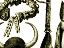

  
[Intangible Textual Heritage](../../index)  [Africa](../index) 
[Index](index)  [Previous](wmp05)  [Next](wmp07) 

------------------------------------------------------------------------

[Buy this Book on
Kindle](https://www.amazon.com/exec/obidos/ASIN/B003C1QZ5I/internetsacredte)

------------------------------------------------------------------------

  
*Woman's Mysteries of a Primitive People*, by D. Amaury Talbot,
\[1915\], at Intangible Textual Heritage

------------------------------------------------------------------------

p. 43

# CHAPTER IV

### AFFINITIES OR "BUSH SOULS"

THE time at which little ones first begin to creep must be an anxious
one to those Ibibio mothers to whom no sign has as yet been vouchsafed
as to the identity of the soul which has entered into their babes. For
should the child be possessed by an "affinity," either animal or
vegetable, the fact begins to manifest itself during the crawling stage.

The term "affinity" is in use among educated natives throughout the West
Coast to express the mysterious link believed to exist between human
beings and the plant or animal into which they are thought, under
certain conditions, to have the power of sending forth their souls.

To white people, at first sight, such ideas seem so strange that it is
almost inconceivable that they could have gained so firm a hold over the
imagination of natives in such far distant parts of the world. When,
however, we remember the belief in were-wolves and other terrible
half-human folk, which persisted till comparatively lately in our own
northern climes, the idea of the so-called Calabar "bush soul" becomes
less incredible.

True it is that at home amid the matter-of-fact surroundings of the
present day it seems, as one of our

p. 44

friends lately remarked, "impossible for human beings to believe that
they actually take upon themselves animal form." Out here, however,
whether camping in the vast dimness of the bush, or sitting, as now, in
a little mud and wattle rest-house beneath which the dark, swift waters
of the Cross River slip soundlessly by, such ideas take on a new aspect.
The silence seems pregnant with mysteries, fascinating but terrible, the
secrets of which, voices--half drowned in rustle of leaves or lap of
water--seem ever about to reveal to the listening ear. For those, who
live close to the heart of nature, there undoubtedly exists a link
between man and the forest creatures, long since lost to dwellers in
cities.

Even white men are, now and again, admitted to a strange intimacy with
the jungle folk, and in some ways the uncanny tie, thought by some
primitive peoples to exist between man and animal, seems hardly more
strange than does the affection lavished by some bush creatures on those
white intruders upon their solitudes into whose power chance may have
caused them to fall. Once, at evening time, for instance, when sitting
before our tents in a little clearing made in the heart of the bush, a
tiny lemur sprang to shelter inside my husband's shirt from the snake or
bush-cat which was chasing him. Months later, when the strange little
beast lay down to die, as a result of a surfeit of coco-nut milk, after
every conceivable remedy had been tried in vain, he cried like a baby on
being abandoned because it was thought more merciful to leave him to die
in peace; but settled down contentedly the moment one of us returned,
and at

p. 45

length passed peacefully away, his tiny black-gloved hand clasped
trustingly round one of our fingers. [1](#fn_13)

Again, there is the case of the splendid lion cub Fort Lamy, sent to us
as a present from Ober-Leutnant von Raben, German Resident at Kusseri in
the North Kamerun, with a letter in which the hope was somewhat quaintly
expressed, "that the little lion might enjoy the ladies!" (presumably a
translation of 'Die Damen erfreuen'). This beautiful creature, who, with
his brother Kusseri, long welcomed visitors at the Zoo, was sent to
England at about the age of six months, up to which time he had been
constantly with us. A year's tour in Southern Nigeria and several months
in England intervened before we were able to visit him. At last, one
Sunday afternoon, we went with a friend. It was just before feeding time
and the lion house was crowded, but Fort Lamy sat indifferent, alone in
his cage, and with his back to the spectators. A single call, and he
sprang to the bars--two great paws thrust through to clutch our hands,
which he proceeded to drag inside, and stuff, with as much arm as he
could manage, into his mouth. Then, still holding on, regardless of
damaged gown or coat sleeve, the great beast flung himself upon his back
and lay lashing the ground with his tail and exhibiting every sign of
joy at meeting us once more. Perhaps natives would explain this
unforgetting affection by saying that in past ages the spirit of the
lion had been mysteriously linked with that of some mortal! Certain it
is that for many years to come, the effort

p. 46

to disabuse the negro of his belief in "affinities" will prove useless.
Hardly does one imagine that a little headway has been made in this
direction than coincidence after coincidence happens to render the
belief more deep-rooted than ever, and convince the black man of the
mental blindness of the white in refusing to own even to the possibility
of this and kindred subjects.

Then, too, the influence of dreams seems hardly to have been allowed
sufficient weight as a factor in this and similar beliefs. In lands,
where the dividing line between the so-called "real" and "unreal"
shrinks to vanishing point; where water-sprites lurk beneath the surface
of every pool or stream, and dryads flit through the shadows, visions of
the night seem as real as the sights of waking hours.

To Primitive man the beasts are not, as to us, inferior creatures, but
often superiors in force and cunning. The mystery and strength of huge,
wise old elephants, the swiftness and force of the lion's spring, made
these jungle folk objects of reverence, to be propitiated and, if
possible, induced to act as patrons and protectors of the less
powerfully built human denizens of the forest. In dreams the beasts play
their part, beneficent or malignant, often, as with ourselves, changing
and shifting shape; and primitive man made no distinction between sights
seen awake or asleep. If he dreamed of a great snake or crocodile laying
itself, bridgewise, across a stream, that he might pass over in safety,
then it seemed to him that some such reptile must surely be the
protector of his family, shielding it from danger as a father

p. 47

shields his children--possibly, therefore, the actual ancestor from
which the tribe had sprung. To such men it must seem only natural to
have the power of assuming the form of the brothers with whom they are
mysteriously linked, and thus disguised sally forth as were-beasts, to
snatch food in times of dearth, or wreak vengeance on an enemy.

A distinct likeness seems to exist between the present day "affinities"
or "bush souls" of the West Coast and the idea which lay at the root of
early Egyptian religion.

"Transmigration from one body to another, indeed, never presented any
difficulty to the Egyptian mind. It could be effected by the magician by
means of his spells; and there were stories, like the folk-tales of
modern Europe, which told how the life and individuality of a man could
pass into the bodies of animals and even into seeds and trees. The
belief is common to most primitive peoples, and is doubtless due to the
dreams in which the sleeper imagines himself possessed of some bodily
form that is not his own.

"Egyptian orthodoxy found a ready way in which to explain the animal
form of its gods. The soul, once freed from its earthly body, could
assume whatever shape it chose, or, rather, could inhabit as long as it
would whatever body it chose to enter. And what was true of the human
soul was equally true of the gods . . . The soul of Ra, which was
practically Ra himself, could appear under the form of a bird if so lie
willed.

"It was only the cultivated classes to whom . . . the sacred animals
were symbols and embodiments

p. 48

of the deity rather than the deity itself. The masses continued to be
fetish worshippers like the earlier inhabitants of the country from whom
most of them drew their descent . . . While the walls of the temple were
covered with pictures in which the gods were represented in human or
semi-human form, the inner shrine which they served to surround and
protect contained merely the beast or bird in which the deity was
believed to be incarnated for the time." [1](#fn_14)

\*    \*    \*    \*    \*

With regard to West Coast "affinities," many are thought to be
hereditary in families, but at times a babe is born to a house, no
member of which has ever before been known to bear the "mark" of any
animal, yet the likeness of some such can be clearly discerned upon the
new-comer.

The explanation for this was somewhat confusedly given me by a woman,
who herself had borne a babe belonging to the baboon totem, although, as
she sadly said, no "monkey soul" had ever before been known in her
family. The endeavour to put into words ideas so mysterious and
deep-rooted seemed to cause a painful mental effort, and even the
greatest care in questioning left the matter still unclear. To those who
have never attempted such a thing, it is hard to realise the difficulty
of putting questions which will elicit the information which one is
seeking without giving any indication which might bias the reply. It is
of the utmost importance to avoid anything in the nature of a leading
question, since native

p. 49

good manners, like those of old Ireland, necessitate a "pleasant
answer," irrespective of veracity, should the least hint be given as to
the tendency of the reply desired. It would appear, however, that the
root idea of "affinities" is closely connected with totemism, but so
near-linked in native thought with the belief in were-animals are both
of these that the people seem incapable of making any clear distinction
between the two.

My informant seemed to hold that the likeness to a baboon, clearly
discernible in her son, though in no other member of the family on
either side, so far as could be traced, was due to the fact that a
"baboon soul" chanced to be awaiting reincarnation in the precincts of
the sacred pool at the time when she went down thither to pray for the
speedy coming of a babe. Under the term "baboon soul" she included both
the ghost of a man who in a former existence had belonged to this totem,
and of one who, during a long series of earth-lives, had been in the
habit of sending out his soul into the form of a baboon "affinity," and
so, by constant wearing of the were-shape his human body had gradually
taken upon itself signs of likeness to its "affinity."

No very young child can send out its "bush soul." Only after about the
age of ten years does the desire to do so begin to assert itself. Should
the "affinity" be hereditary, the parents will be sure to notice signs
of restlessness, and will then explain all that is necessary. Otherwise
the "Drang"--to use a German word which gives the meaning of the Ibibio
expression more nearly than any of our own--grows with the physical

p. 50

growth. First, in dreams, those possessed by animal souls see themselves
wandering in were-form, and after awhile the desire to do so *at will*
becomes so strong as to drive boy or girl to seek out someone to whom
the secrets are known, in order to learn the rites necessary for the
*conscious* taking on of animal shape. Afterwards they practise sending
forth the soul into its were-body with ever increasing success, until
they have at length acquired the power to bring this about at will.

Another way of becoming a member of an animal affinity is by purchase.
This is usually brought about through negotiation with one of the Ekoi
people, or some Kamerun tribe, among whom such strange secrets are said
to have their home. These bought "affinities" will, however, be treated
of in another place.

The most ordinary were-forms are those of leopards, crocodiles, snakes
and fish. The following story was reported to Mr. Eakin of the Kwa Ibo
Mission by one of his schoolboys named Etok Essien of Ikotobo:

"One day, a few years ago," he said, "I was sitting on the veranda of my
house when I heard loud cries proceeding from another compound. I ran
with others to the place whence the cries came, and saw a woman rocking
to and fro, holding her hand to her throat and calling, 'I must die. I
must die, for Akpan Nwan has shot me in the neck.'

"A crowd of people had gathered together, drawn like myself by the
cries. Among them was a native doctor, who, at the woman's entreaty, cut
open the place which she pointed out to him, and there, before

p. 51

us all, a lead bullet fell from it to the ground. When the woman was
asked to explain how it came there, she said:

"'My soul dwells in a leopard, and, when I first cried out, Akpan Nwan
shot this my 'affinity.'

"Enquiries were made, and it was found that the man mentioned had indeed
shot at a leopard, which, at the very hour when the woman cried out,
entered his compound to steal a goat. He: succeeded in hitting it in the
neck, but it managed to escape to the bush."

Countless such stories might be quoted. We ourselves came across many
people who claimed that, against their will, at certain seasons of the
year their spirits went forth to wander in animal guise; but none was
willing to own to consciously sending forth his soul, [1](#fn_15) because such a power is thought to savour
of witchcraft. In every town, however, there are some inhabitants
suspected by their fellows of using this uncanny power in order to wreak
vengeance on enemies, or for the unlawful acquiring of riches. Many such
instances were brought to our notice, and are recorded in another place.

Sometimes there is no outward sign to show that those with whom one
lives in familiar intercourse are capable of projecting their bush souls
in animal form. Such was the case of four children, the story of whom is
thus told by Udaw Owudumo of Ikot Atako.

"There was once a man named Eka Ete, who had three sons and a daughter.

p. 52

"One morning, very early, when the mimbo people [1](#fn_16) were going toward their grove to collect
palm-wine, they saw four pythons hurriedly crossing the road. As usual
the men were walking in single file, and, on seeing the snakes, the
first ran back to his house to fetch a gun; begging his companions to
watch the quarry meanwhile, so that it should not escape.

"On returning, he found that the pythons had only gone a little way into
the bush. He therefore followed the tracks and soon overtook them. At
once he lifted his gun and was about to fire, when the biggest snake
raised his head from the ground and cried, with a man's voice:

"'Do not kill us. We are the children of Eka Ete.'

"The hunter did not fire, but lowered the gun and asked:

"'How is it possible for you to be his child, seeing that you are a
snake?'

"To this the reptile answered, 'Go to our father, and ask for whatever
you may wish of his in exchange for our lives, and he will give it to
you.'

"Then the man left his friends to watch the strange quarry, and himself
went back to the house of Eka Ete and said:

"'Awhile ago I saw four long snakes and wanted to kill them, but as I
was about to do so one of them lifted up his head and said that they
were all children of yours. Can you explain the matter?'

"On hearing this, the old man was very much astonished, and asked to be
led to the place where

p. 53

the reptiles lay; for he had no knowledge of the strange power possessed
by his children. No sooner did he arrive than all four lifted up their
heads and cried to him:

"'Father! Father Save us! We are your children. Last night we came out,
in snake form, and enjoyed ourselves so well that we paid no heed to
time, and did not notice that day was dawning. When the sun rose we
tried to hasten home, but the mimbo men found us while crossing the
road, and since then they have watched us so that we cannot escape. Now
we greatly fear that someone may kill us.'

"Eka Ete was quite confounded by what he had heard, but he called his
people and set a guard about the snakes that none might harm them. Then
he himself went to the Idiong diviner and asked:

"'How is it possible that these snakes can be the children who have
hitherto dwelt with me in the house?'

"To this the priest of Idiong made answer, 'The souls of your three sons
and of your daughter have of a truth gone forth in this form, and,
should the snakes be killed, your children would die also.'

"On hearing this, Eka Ete asked, 'What can I do to make them come back
home?' To which the Idiong man replied:

"'Get goats, fish, and palm oil, and offer these before the Juju Anyang.
Should the spirit accept the offering, the souls of your children will
be able to leave their snake form and come home once more.'

Eka Ete did as he was bidden; then waited

p. 54

anxiously to see what would happen. During all this time his four
children had appeared languid and mazed, as though their spirits were
wandering far away. About a week after the sacrifice had been offered
according to the command of the Idiong priest the snakes crept back home
during the night time: and after this the four children recovered, and
became just as they had been before their souls went forth.

"When the father saw that all was well again. he was very glad and gave
a great 'play' to all the countryside. Afterwards a feast was prepared
with 'chop,' in plenty and much palm-wine, so that all the people
rejoiced with him that the souls of his children had returned."

Another story of a "snake child," the likeness of whose "affinity" was
plainly to be seen, was told us as follows:

"There was once a woman who bore a girl piccan. For many years she
carried the child in her arms, because it could not walk, since it was a
snake soul, and therefore had no strength in its feet. When this woman
wanted to keep anything safe, she had only to set it upon a shelf or
even leave it on the hob, for the child could not stand up to reach it.

"One day, before going to market, the mother cooked 'chop' and placed
it, as usual, on the low mud wall by the fireside, so that it should be
ready for her husband on his return from the bush. That evening when she
came back she asked her daughter, 'Is my husband here?' And the girl
answered No.'

"The mother went to see if the food had grown

p. 55

dry during her absence, but, when she looked, lo, there was nothing but
an empty plate! So she asked:

"If my husband has not come back who can have taken his 'chop '? To this
the girl answered, I do not know.'

"The woman was very angry, and accused other people in the compound of
having stolen what she had so carefully prepared; but could learn
nothing further.

"Another day the same thing happened, and this time she was even more
vexed, and went all round the courtyard crying:

"'Who is it who comes to a person's house and steals the food which she
keeps for her husband?'

"To this an old neighbour replied, 'I believe it is your child who
cannot walk!' To which the mother answered:

"'From her birth my daughter has been unable to stand upon her feet. How
then can she go and take things from the fireplace where I have set
them?' Nevertheless she told her husband:

"'One old woman says perhaps it is our child who is the thief.' To which
the man replied:

'Let us hide ourselves and watch.'

Next day, therefore, the woman bought a fine fish, cooked it very
delicately, and set it in the usual place. Then she told her daughter
that she was going to market. The husband had already gone out, and was
hidden in a little outhouse built against the kitchen wall, through
which a small spy-hole had been made. There his wife joined him.

Not long after they had settled themselves to

p. 56

watch, the girl who could not walk crawled into the veranda, and looked
carefully round to see if anyone were in sight. Then she went all over
the house to make sure that she was indeed alone, and afterwards,
believing herself safe, came back into the kitchen. Suddenly she reared
herself up till her head was high above the hearth, then easily lifted
the 'chop' from the place where it stood, and sat down to enjoy it.

At once the parents ran in and caught her, crying:

'We did not know that it was you who did this thing. When the old woman
told us, we would not believe her; but now we have trapped you
ourselves.'

"Then the father beat his drum to summon the townsfolk, and when they
came told them all that had chanced. In silence they listened to the
story, then said:

"'Such a girl as this is not good to keep in the house.' The father
answered, 'I think so myself. I will go and throw her in the river.' To
which all present replied: 'Yes, that is the best thing to do.'

"So the man put the snake-girl into a canoe, and when they reached
mid-stream threw her overboard. He then paddled back to the bank, where
all the people were waiting, and watched to see what would happen.

"Not long afterwards they saw a very long snake come out of the water
and creep into the bush. The father wanted to go after it and kill it,
but his friends prevented him, saying: 'Do not go. Perhaps some harm
might happen to you.'

p. 57

"From that time onward no one saw either the snake or the girl again."

Beside "animal souls," the bodies of new-born children may be occupied
by spirits of the great trees, such as camwood or cotton trees; or of
climbing palms, lianes and even flowers. Among the Ibibios, however, we
did not find so many, or so beautiful, legends of this nature as among
the Ekoi of the Oban District--such, for instance, as "The Herb
Daughters," "The Son of a Fruit," or "The Flower Child." [1](#fn_17)

As a general rule, only those belonging to the families of powerful
chiefs can join the "affinity" of the great trees. The mother of one of
the principal men of Afa Atai near Eket was thought to embody the
"spirit" of a climbing palm; and at death her soul is said to have gone
to dwell in a splendid specimen of this strange growth, which springs by
a sacred water not far from the town. Thither, each year an offering is
borne by her son, who consults her upon all points of difficulty, and
obtains answers through the rustling of the leaves amid which her soul
dwells.

Beside the power attributed to human beings of thus sending forth their
souls into animal or vegetable form, accident brought to light the
belief that some beasts are also thought capable of assuming another
shape. For instance, when the anthropoid apes called by the natives
"Idiokk" have grown so old and feeble that they know their end is near,
it is asserted that they can renew their youth by sending forth their
spirits into the bodies of new-born

p. 58

baboons, a species of which, for this reason, also bears the name of
"Idiokk."

The discovery of this point, hitherto unknown, I believe, on the West
Coast, illustrates the importance of taking down all available stories
and legends, irrespective of whether or no such may appear interesting
at first sight. It came to our knowledge through Udaw Owudumo, of Ikot
Atako, who one day told us the following tale:

"Once a woman went to fetch vegetables for the evening meal. It was very
near her time to become a mother, and, as she neared the farm, she felt
that the babe was about to be born. She looked round and saw no one who
might help her, so she prayed to her juju, saying, 'Let someone come to
aid me and guide my piccan.' Yet no one came; only, just before the
birth of the child, a very tall 'Idiokk' stepped forth out of the bush
and said:

"'I will help you, and would gladly bear the piccan home for you, but
fear that, should I do so, you would tell someone to kill me!'

"To this the woman answered, 'Only do as you say, and no one shall harm
you.'

"So Idiokk aided her, and afterwards took the babe and they set forth
together. As they drew near the house, Idiokk said:

"'Do not let us go by the front way, lest someone should see us. Rather
let us enter by the back.'

"To this the woman agreed, and the beast went within and tended mother
and babe. Then, when all was finished, he turned to the woman and said:

'If you will name this piccan after me, I will

p. 59

bring you as much "bush meat" as you need.' To which she answered, 'I
agree'; and, on this account, the child was called Akpan Idiokk Ikot
(i.e. Firstborn Baboon of the Bush).

"Morning and evening the ape killed 'beef' which he brought and laid
before the door; then, entering, used to take the child from the arms of
its mother and look sadly upon it. One day, while holding it thus,
Idiokk said, gazing mournfully down:

"'I am sorry for you, because no stranger will cause your death. It is
your father and mother alone who will bring this about!'

"That night, after the ape had gone, the woman's husband came home, and,
finding the 'beef,' thought that it must be the gift of a lover, so
asked jealously, 'Where did you get all this?'

"The wife answered, 'It is a strange beast named Idiokk who brings it.'

"On this the husband asked, 'If the Idiokk comes back again can I get a
chance to kill him?' To which the woman replied:

"'Yes. He comes every morning and evening to bring me "beef."'

"Next morning, when the poor ape came, he took the piccan in his arms as
usual. Then the woman called softly to her husband who was hidden near
by, 'Hist! He is here!' On which the man sprang forth armed with a
cutlass to kill the great beast. At once the ape held out the babe to
its mother that it might not be harmed, but the man slashed at the beast
so cruelly that both ape and child died together."

p. 60

Two or three days later the following story was told us by a native of
Ikot Abia:

"There were many hunters in our town. One day a party of these killed a
young baboon of the kind named Idiokk. This they brought back to the
Egbo house, and sat down to skin it, after which they took some of the
meat and cooked it before the fire. While they were doing this the
Idiokk mother smelled the scent of roasting flesh from the bush and came
out to learn what had befallen her piccan. When she saw what was being
done, she drove all the people before her into the Egbo house, then
snatched the remains of her son from off the fire, picking up meat,
bones and skin, and carrying all away into the bush."

These baboons bear the same name as the great apes, because old men tell
that the spirits of the latter can be born again in the shape of the
former.

This belief seems to be confined to a very few old men in one part of
the district. When Chief Henshaw was questioned on. the subject he
answered that no such idea had reached his ears, and continued:

"Also it seems to me contrary to reason, for, though it is well known
that men have the power to send out their souls into the bodies of
beasts, how can it be possible for animals to do such a thing, seeing
that we are taught by the Bible that these have no souls? It is true
that we see some creatures have the power to change the form of their
bodies, as, for instance, caterpillars become butterflies and tadpoles
frogs; but that great apes should send out their

p. 61

spirits to be reborn as lesser baboons I regard as a mere superstition
of ignorant natives"!

A similar idea as to the power of some animals to transform themselves
into other shapes is said to obtain among Malays, some of whom "refuse
to eat the freshwater fish called Ikan Belidah on the plea that it was
originally a cat. They declare that it squalls like a cat when
harpooned, and that its bones are white and fine like a cat's hairs.
Similarly the Ikan Tumuli is believed to be a human being who has been
drowned in the river and the Ikan Kalul to be a monkey transformed. Some
specially favoured observers have seen monkeys half through the process
of metamorphosis--half monkey and half fish." [1](#fn_18)

------------------------------------------------------------------------

### Footnotes

[45:1](wmp06.htm#fr_13) He proved to be a new
species, and was named *galago talbotti*, by the British Museum
authorities.

[48:1](wmp06.htm#fr_14) The Religion of Ancient
Egypt," pp. 108-9. Sayce.

[51:1](wmp06.htm#fr_15) Among Ibos, however,
whom we are at present studying, no such reluctance appears to be shown.
A man, who believes himself possessed of the power to take on animal
form, appears proud of this uncanny prerogative.

[52:1](wmp06.htm#fr_16) Mimbo = palm wine.

[57:1](wmp06.htm#fr_17) "In the Shadow of the
Bush," pp. 133, 134, 136. P. Amaury Talbot.

[61:1](wmp06.htm#fr_18) Maxwell in *Straits
Branch, Journal of the Royal Asiatic Society*, No. 7, p. 26.

------------------------------------------------------------------------

[Next: Chapter 5: Childhood](wmp07)

