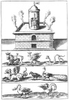

  
[Intangible Textual Heritage](../../index)  [Alchemy](../index) 
[Index](index)  [Next](hm201) 

------------------------------------------------------------------------

[Buy this Book at
Amazon.com](https://www.amazon.com/exec/obidos/ASIN/B001VKXXWK/internetsacredte)

------------------------------------------------------------------------

*The Hermetic Museum, Vol. II*, by Arthur Edward Waite, \[1893\], at
Intangible Textual Heritage

------------------------------------------------------------------------

###### THE

# HERMETIC MUSEUM,

##### RESTORED AND ENLARGED:

### VOLUME II

###### MOST FAITHFULLY INSTRUCTING ALL DISCIPLES OF THE SOPHO-SPAGYRIC ART HOW THAT GREATEST AND TRUEST MEDICINE OF

##### THE PHILOSOPHER'S STONE

###### MAY BE FOUND AND HELD.

###### NOW FIRST DONE INTO ENGLISH FROM THE LATIN ORIGINAL PUBLISHED AT FRANKFORT IN THE YEAR 1678.

Translated by Arthur Edward Waite

## Containing Twenty-two most celebrated Chemical Tracts.

#### London: J. Elliot and Co.

#### \[1893\]

Scanned at Intangible Textual Heritage, May 2007. Proofed and Formatted
by John Bruno Hare. This text is in the public domain in the United
States because it was originally published prior to 1923.

 
[  
Click to enlarge](img/front.jpg)  
Frontispiece  

------------------------------------------------------------------------

[Next: Table of Contents](hm201)
