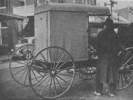

  
[Intangible Textual Heritage](../../index)  [Americana](../index) 
[Index](index)  [Previous](am00)  [Next](am02) 

------------------------------------------------------------------------

[Buy this Book on
Kindle](https://www.amazon.com/exec/obidos/ASIN/B002HRE4BU/internetsacredte)

------------------------------------------------------------------------

  
*The Amish*, by A.M. Aurand, \[1938\], at Intangible Textual Heritage

------------------------------------------------------------------------

### AN AMISHMAN WRITES

(The author is pleased to print a letter which he received from one of
the best informed and best known members of the Amish sect in America.
His letter was unsolicited, and since it bears on a subject which we
discussed in our writings, we thought the reader would like to sense
what our Amish friend has to say after reading the pamphlet. We are glad
to make the note he suggested. If the rest of us lived within our means
as do the Amish, we would appreciate the old song: "Every Little Bit
Added to What You Got, Makes Just a Little Bit More." In other words
we'd always have "tobacco in our old tobacco box."—The Author).

The letter:

Ephrata, R. D., Pa.,     
August 15, 1939.

Ammon Monroe Aurand, Jr.,  
Harrisburg, Pa.

Dear Friend: I received your book, "Little Known Facts About the Amish,"
and note you know a lot about the plain people that may benefit them
when published. . . .

First, I want to tell you, there are no daily baths, where there is no
bathroom equipment. It is being done more in the manner as our
veterinarian expressed himself at one time, thus: "Here we have these
scientific methods of medical treatment, daily baths, etc." He said, "I
know of a man who said he wants to get to be 100 years old; he took a
cold water bath every morning and at the age of 65 he died of cancer in
the stomach. And here we have people who wouldn't take a bath unless
they get caught in a thunderstorm, and not change clothing until they
rot from their backs and they grow up to an old stone age." I don't mean
this latter statement about changing clothing, that our people are doing
same, only the bathing, and I want to say our people are doing a mite
better than the Dr.'s expression. Baths are just taken whenever one
feels they need one, with a common tub or any other convenient article.
And our health is not so much affected as some people might think. . .

Always at your service to promote better understanding between our
people and others.

Yours truly,  
——————,—————.

------------------------------------------------------------------------

[Next: These Odd Folk Called ''Amish''](am02)
