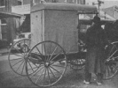

  
[Intangible Textual Heritage](../../index)  [Americana](../index) 
[Index](index)  [Previous](am08)  [Next](am10) 

------------------------------------------------------------------------

[Buy this Book on
Kindle](https://www.amazon.com/exec/obidos/ASIN/B002HRE4BU/internetsacredte)

------------------------------------------------------------------------

  
*The Amish*, by A.M. Aurand, \[1938\], at Intangible Textual Heritage

------------------------------------------------------------------------

### TEMPERANCE AND FRUGALITY ARE TWO OUTSTANDING ATTRIBUTES

**Drunkenness**.—Christianity has taken such hold on these people that
drunkenness is an unheard-of condition among them. None are idle; none
profane the name of their Lord and Saviour; none will bear arms against
his neighbor, nor any other; none are on relief. Drunkenness breeds all
of these-to-be-deplored conditions and vices—even in the face of
Christianity.

**Banned Articles**.—Among some things generally banned to use to some
of the more orthodox may be noted the telephone and top-buggies;
although once married, top buggies generally are permissible, as a

p. 24

covering for the wife perhaps it is more a sign of marriage than a
protection for the wife.

Dash-boards are taboo, although manure-deflectors are in use by common
consent; bicycles, furnaces (few homes have any other stove or heating
method, than the kitchen-stove); window curtains are "out;" rugs are not
to be found, unless perhaps one in the spare room or "parlor;" musical
instruments, "note books," and "store suspenders" are too worldly.

Carpets and other comforts and conveniences, involving extravagance, are
not allowed. Anything of a nature that savours of "vanity" or pride are
discarded and avoided.

The taking and exchanging of photographs, engravings, statuary, etc.,
are not allowed by the Old Amish families, although the Meeting House
Amish are inclined to overlook it.

**Buying for Cash** is the common rule among them, and unless they can
see some real and quick return they will not buy anything. Certainly
they are not the kind to waste. Their women never "own" their husband's
property!

**Never Hurry**.—These people take their time with nearly all
things—they rarely show impatience, except that they are impatient to be
always at work—at doing something. They know that life may reproduce
itself in nine months, and that time goes on. Their place and mission on
earth is a preparatory one, and they must be "about the Father's
business," whatever it be, to be in a happy mood.

It is pretty generally admitted a fact that when these people, or the
average Pennsylvania German does something, it need not be done over
again.

**Home-Folk**.—Not many of the Amish get far from home. At least they
arrange once in a while to get to the county seat, wherever that may be,
if necessary; certainly not just for the trip.

While railroad trains, steam and electric, and the ever-present
automobiles go daily by their door, many of them have the first time to
ride on any of these worldly contraptions.

In a recent trip into the Amish country of the Blue Ball-Morgantown
district, it was noted that all occupants of buggies had their legs
covered up, over their knees, by wool blankets, on one of the hottest

p. 25

days of the year. Since they had no dash-boards we supposed the blankets
to act as manure deflectors.

In this same section, at the one-room school house east of Churchtown,
there were thirty-two pupils—of which number twenty-eight were
"Stultzfoos" children. In this locality one must know exactly which
"Henry" Stoltzfoos he wants to see, for there are about forty such
"Henrys" in the neighborhood!

Here the author spent some time in checking statements made in this
account. Speaking for nearly an hour in Pennsylvania German with one of
the "pillars" in his district, we were pleased to note that few
revisions were necessary in any part of our thesis.

------------------------------------------------------------------------

[Next: Woman's Place Is In the Home and In the Harvest Fields](am10)
