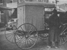

  
[Intangible Textual Heritage](../../index)  [Americana](../index) 
[Index](index)  [Previous](am12)  [Next](am14) 

------------------------------------------------------------------------

[Buy this Book on
Kindle](https://www.amazon.com/exec/obidos/ASIN/B002HRE4BU/internetsacredte)

------------------------------------------------------------------------

  
*The Amish*, by A.M. Aurand, \[1938\], at Intangible Textual Heritage

------------------------------------------------------------------------

### AMISH-MENNONITE STATISTICS

**The Earliest Amish Congregation** in the United States was established
along North Kill Creek, Berks county, Pa., in 1735. The Indians
subsequently crowded them southward, where today they are firmly rooted.

Their church membership is as follows, according to the
"Familien-kalendar fuer das Jahr unseres Herrn 1937," edited by
Mennonite Publishing House, Scottdale, Pa.: Mennonite Church (membership
in U.S.A., 47,253); Amish Mennonites (Conservatives), 1608; Amish
Mennonites (Old Order), 8,600; Church of God in Christ Mennonites,
2,700; Defenceless Mennonites, 1,500; Central Conference of Mennonites,
3,273; Mennonite Brethren Church of North America, 12,500; Krimmer M.
Bruedergemeinde, 1,850.

------------------------------------------------------------------------

[Next: The True ''faith and Practice'' of the Brethren, or
''Dunkers''](am14)
