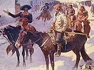

  
[Intangible Textual Heritage](../../index)  [Americana](../index) 
[Index](index)  [Next](cig01) 

------------------------------------------------------------------------

  
*Coffee in the Gourd*, ed. J. Frank Dobie \[1923\], at Intangible
Textual Heritage

------------------------------------------------------------------------

# COFFEE IN THE GOURD

### EDITED BY J. FRANK DOBIE

#### Originally published in 1923

#### TEXAS FOLKLORE SOCIETY: AUSTIN

Scanned and proofed by Eliza Yetter, September 2006. HTML formatting at
Intangible Textual Heritage, by John Bruno Hare. This collection and the
articles in this collection are believed to be in the public domain in
the United States due to lack of timely renewal at the US Copyright
Office.

------------------------------------------------------------------------

[Next: Contents](cig01)

