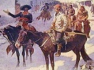

  
[Intangible Textual Heritage](../../index)  [Americana](../index) 
[Index](index)  [Previous](cig11)  [Next](cig13) 

------------------------------------------------------------------------

  
*Coffee in the Gourd*, ed. J. Frank Dobie \[1923\], at Intangible
Textual Heritage

------------------------------------------------------------------------

### THE "BLUES" AS FOLK-SONGS

### BY DOROTHY SCARBOROUGH

    There are fashions in music as in anything else, and folk-song
presents no exception to the rule. For the last several years the most
popular type of Negro song has been that peculiar, barbaric sort of
melody called "blues," with its irregular rhythm, its lagging briskness,
its mournful liveliness of tone. It has a jerky tempo, as of a cripple
dancing because of some irresistible impulse. A "blues" (or does one say
a "blue?"--what is the grammar of the thing?) likes to end its stanza
abruptly, leaving the listener expectant for more, though, of course,
there is no fixed law about it. One could scarcely imagine a convention
of any kind in connection with this negroid free music. It is partial to
the three-line stanza instead of the customary one of four or more, and
it ends with a high note that has the effect of incompleteness. The
close of a stanza comes with a shock like the whip-crack surprise at the
end of an O. Henry story, for instance--a cheap trick, but effective as
a novelty. Blues sing of themes remote from those of the old spirituals,
and their incompleteness of stanza makes the listener gasp, and perhaps
fancy that the censor has deleted the other line.

    Blues, being widely published as sheet music in the North as well as
the South, and sung in vaudeville everywhere, would seem to have little
relation to authentic folk-music of the Negroes. But in studying the
question, I had a feeling that it was more or less connected with Negro
folk-song, and I tried to trace it back to its origin.

    Negroes and white people in the South referred me to W. C. Handy as
the man who had put the bluing in the blues. But how to locate him was a
problem. He had started this indigo music in Memphis, it appeared, but
was there no longer. I heard of him as having been in Chicago, and in
Philadelphia, and at last as being in New York. Inquiries from musicians
brought out the fact that Handy is now manager of a music publishing
company, of which he is part owner, Page and Handy, and so my
collaborator, Ola Gulledge, and I went to see him at his place.

    To my question, "Have blues any relation to Negro folksong?" Handy
replied instantly, "Yes, they are folk-music."

    "Do you mean in the sense that a song is taken up by many singers
who change and adapt it and add to it in accordance with their own
mood?" I asked. "That constitutes communal singing in part, at least."

    "I mean that and more," he responded. "That is true, of course, of
the blues, as I'll illustrate a little later. But blues are folk-songs
in more ways than that. They are essentially racialthe ones that are
genuine (though since they became the fashion many blues have been
written that are not Negro in character), and they have a basis in older
folk-song."

    "A general or a specific basis?" I wished to know.

    "Specific," he answered. "Each one of my blues is based on some old
Negro song of the South, some folk-song that I heard from my mammy when
I was a child. Something that sticks in my mind, that I hum to myself
when I'm not thinking about it. Some old song that is a part of the
memories of my childhood and of my race. I can tell you the exact song I
used as a basis for any one of my blues. Yes, the blues that are genuine
are really folk-songs."

    I expressed an interest to know of some definite instance of what he
meant, and for answer he picked up a sheaf of music from his desk.

    "Here's a thing called Joe Turner Blues," he said. "That is written
around an old Negro song I used to hear and play thirty or more years
ago. In some sections it was called Going Down the River for Long, but
in Tennessee it was always Joe Turner. Joe Turner, the inspiration of
the song, was a brother of Pete Turner, once governor of Tennessee. He
was an officer and he used to come to Memphis and get prisoners to carry
them to Nashville after a kangaroo court. When the Negroes said of any
one, 'Joe Turner's been to town', they meant that the person in question
had been carried off hand-cuffed to be gone no telling how long."

    I recalled a fragment of folk-song from the South which I had never
before understood, but the meaning of which was now clear enough:

"Dey tell me Joe Turner's come to town.  
He's brought along one thousand links of chain,  
He's gwine to have one nigger for each link.  
He's gwine to have dis nigger for one link!"

    Handy said that in writing the Joe Turner Blues he did away with the
prison theme and played up a love element, for in the song Joe Turner
became not the dreaded sheriff but the absent lover.

    Loveless Love, a blues which Handy calls a blues ballad, was, he
said, based on an old song called Careless Love, which narrated the
death of the son of a governor of Kentucky. It had the mythical "hundred
stanzas" and was widely current in the South, especially in Kentucky, a
number of years ago. Handy in his composition gives a general philosophy
of love instead of telling a tragic story as the old song did.

    Long Gone has its foundation in another old Kentucky song, which
tells of the efforts a certain Negro made to escape a Joe Turner who was
pursuing him. Bloodhounds were on his trail and were coming perilously
close, while he was dodging and doubling on his tracks in a desperate
effort to elude them. At last he ran into an empty barrel that chanced
to be lying on its side in his path. He sprang out and away again. When
the blood-hounds a few seconds later trailed him into the barrel, they
were nonplussed for a while, and by the time they had picked up the
scent again, the darkey had escaped.

    The song was printed a a broadside. I reproduce by permission the
words. It is interesting to note that the chorus varies with some
verses, while it remains the same for others.

"LONG GONE"  
Another "Casey Jones" or "Steamboat Bill"

EVERYBODY IS SINGING

"LONG GONE"  
With These Seven Verses

EVENTUALLY you will sing "LONG GONE" with a hundred verses

FIRST VERSE:

Did you ever hear the story of Long John Dean,  
A bold bank robber from Bowling Green,  
Sent to the jailhouse yesterday,  
Late last night he made his getaway.

CHORUS:

He's long gone from Kentucky,  
Long gone, ain't he lucky,  
Long gone and what I mean,  
He's long gone from Bowling Green.

SECOND VERSE:

Long John stood on a railroad tie,  
Waiting for the freight train to come by,  
Freight train come by puffin' and flyin',  
Ought to seen Long John grabbin' the blind.

CHORUS:

He's long gone from Kentucky,  
Long gone, ain't he lucky,  
Long gone and what I mean,  
He's long gone from Bowling Green.

THIRD VERSE:

They offered a reward to bring him back,  
Even put bloodhounds on his track,  
Doggone bloodhounds lost his scent,  
Now nobody knows where Long John went.

CHORUS:

He's long gone from Kentucky,  
Long gone, ain't he lucky,  
Long gone and what I mean,  
He's long gone from Bowling Green.

FOURTH VERSE:

They caught him in Frisco and to seal his fate,  
At San Quentin they jailed him one evening late,  
But out on the ocean John did escape,  
Cause the guard forgot to close the Golden Gate.

CHORUS:

John's long gone from San Quentin,  
Long gone and still sprinting,  
Long gone I'm telling you,  
Shut your mouth and shut mine, too.

FIFTH VERSE:

A gang of men tried to capture Dean,  
So they chased him with a submarine,  
Dean jumped overboard, grabbed the submarine,  
And made that gang catch a flyin' machine.

CHORUS:

Now he's long gone and still a- swimmin',  
Long gone with them mermaid women,  
Long gone just like a fish,  
My, that boy's got some ambish.

SIXTH VERSE:

A vamp thought she had Long John's goat,  
She took his watch and money right from his coat,  
John stole- all she had now she thinks he's a riddle,  
He didn't leave her enough clothes to dust a fiddle.

CHORUS:

He's long gone from Kentucky,  
Long gone that guy is some lucky,  
Long gone from this queen,  
Long gone from Bowling Green.

SEVENTH VERSE:

When pro'bition said I'll lick John Barleycorn,  
I never thought she'd do any harm,  
But she's chased him strong, didn't stop to wait,  
And blacked his eye in every state.

CHORUS:

Now John's gone and he left me weeping,  
Long gone but only sleeping,  
But from the Drug Store we catch his breath,  
Long gone and scared to death.

    Handy said that his blues were folk-songs also in that they are
based on folk-sayings and express the racial life of the Negroes. "For
example," he said, "The Yellow Dog Blues takes its name from the term
the Negroes give the Yazoo Delta Railroad. Clarksville colored people
speak of the Yellow Dog because one day when some one asked a darkey
what the initials Y. D. on a freight train stood for, he scratched his
head reflectively and answered: 'I dunno, less'n it's for Yellow Dog.'"
Another one of his blues came from an old mammy's mournful complaint, "I
wonder whar my good ole used to be is!"

    He says that presently he will write a blues on the idea contained
in a monologue he overheard a negro address to his mule on a Southern
street not long ago. The animal was balky, and the driver expostulated
with him after this fashion:

    "G'wan dere, you mule! You ack lack you am' want to wuck. Well,you
is a mule, an' you got to wuck. Dat's whut you git fo' bein' a mule. Ef
you was a 'ooman, now, I'd be wuckin' fo' you!"

    The St. Louis Blues, according to its author, is a composite, made
up of racial sayings in dialect. For instance, the second stanza has its
origin in a Negro's saying, "I've got to go to see Aunt Ca'line Dye,"
meaning to get his fortune told, for at Newport there was a well-known
fortune teller by that name. "Got to go to Newport to see Aunt Ca'line
Dye" means to consult the colored oracle.

Been to de Gypsy to get mah fortune tole,  
To de Gypsy done got mah fortune tole,  
'Cause I'se wile about mah Jelly Roll.  
Gypsy done tole me, 'Don't you wear no black.'  
Yas, she done tole me, 'Don't you wear no black.  
Go to St. Louis, you can win him back.'

    I asked Handy if the blues were a new musical invention, and he
said, "No. They are essentially of our race and our people have been
singing like that for many years. But they have been publicly developed
and exploited in the last few years. I was the first to publish any of
them or to develop this special type by name." He brought out his
Memphis Blues, his first "blues" song, in 1910, he said.

    The fact that the blues were a form of folk-singing before Handy
published his, is corroborated by various persons who have discussed the
matter with me, and in Texas the Negroes have been fond of them for a
long time. Early Busby, now a musician in New York, says that the shifts
of Negroes working at his father's brickyard in East Texas years ago
used to sing constantly at their tasks and were particularly fond of the
blues.

    Handy commented on several points in connection with the blues-for
instance, the fact that they are, he says, all in one tone, but with
different movements according to the time in which they are written. The
theme of this modern folk-music is, according to Handy, the Negro's
emotional feeling apart from the religious. As is well recognized, the
Negro normally is a person of strong religious impulse, and the
spirituals are famous as expressing his religious moods,--but they do
not reveal all his nature. The Negro has longings, regrets,
despondencies and hopes that affect him strongly, but are not connected
with religion. The blues, therefore, may be said to voice his secular
interests and emotions as sincerely as the spirituals do the religious.
Handy said that the blues express the Negro's two-fold nature, the grave
and the gay, reveal his ability to appear the opposite of what he is.

    "Most white people think that the Negro is always cheerful and
lively," he explained. "But he isn't, though he can be that way
sometimes when he is most troubled in mind. The Negro knows the blues as
a state of mind, and that's why this music has that name."

    Handy said that the blues were unlike conventional, composed music,
but like primitive folk-music in that they have only five tones, like
the folk-songs of slavery times, using the pentatonic scale, omitting
the fourth and seventh tones. He added that while most blues are racial
expressions of Negro life, the form has been imitated nowadays in songs
that are not racial.

    The blues, Handy pointed out, represent a certain stage in Negro
music. "About forty years ago such songs as Golden Slippers were sung.
That was written by a colored man but is not a real folk-song. At about
that time all the songs of the Negro liked to speak of golden streets
and give bright pictures of heaven. Then about twenty years ago the
desire was all for coon songs. Now the tendency is toward blues. They
are not, as I have said, a new thing among the Negroes, for they were
sung in the South before the piano was accessible to the Negroes, though
they were not so well known as now."

    It is not often that a student of folk-songs can have such authentic
information given as to the music in the making, for most of the songs
are studied and their value and interest realized only long after the
ones who started them have died or been forgotten. Rarely can one trace
a movement in folk-song so clearly, and so I am grateful for the chance
of talking with the man most responsible for the blues.

    Even though specific blues may start indeed as sheet music, composed
by identifiable authors, they are quickly caught up by popular fancy and
so changed by oral transmission that one would scarcely recognize the
relation between the originals and the final results-if any results ever
could be considered final. Each singer adds something of his own mood or
emotion or philosophy, till the composite is truly a communal
composition. It will be noted in this connection that the song called
"Long Gone" announces of itself that while it is first published in
seven verses, people will soon be singing it "with one hundred verses."
(Negroes ordinarily speak of a stanza as a verse.) The colored man
appropriates his music as the white person rarely does.

    Blues also may spring up spontaneously, with no known origin in
print, so far as an investigator can tell. They are found everywhere in
the South, expressing Negro reactions to every concept of elemental
life. Each town has its local blues, no aspect of life being without its
expression in song. Here, as in much of the Negro's folk-song, there is
sometimes little connection between the stanzas. The colored mind is not
essentially logical, and the folk-song shows considerable lack of
coherence in thought. Unrelated ideas are likely to be brought together,
and stanzas from one song or from several may be put in with what the
singer starts with, if they chance to have approximately the same number
of syllables to the line. Even that requirement isn't held to, for a
Negro in his singing can crowd several syllables into one note, or
expand one syllable to cover half a dozen notes. The exigencies of
scansion worry him but slightly.

    The Texas Negroes are especially fond of blues, and, as I have said,
were singing them for years before Handy made them popular in print. W.
P. Webb published, in an article in the Journal of American Folk-Lore,
some years ago what he called a sort of epic of the Negro, which the
singer called Railroad Blues, which didn't stick to one subject, even so
popular a one as a railroad, but left the track to discuss many phases
of life. Fragments of blues float in from every side, expressive of all
conceivable aspects of the Negro's existence, economic, social,
domestic, romantic, and so forth.

    Morton Adams Marshall sends an admirable specimen from Little Rock,
Arkansas, which, however, was taken down in Southern Louisiana,
reflecting one black man's bewilderment over the problems of love.

DON'CHER LOOK AT ME, CA'LINE!

Don'cher look at me, Ca'line,  
Don'cher look at me.  
You done busted up many a po' niggah's heart,  
But you ain't a-goin' to bust up mine!  
Oh, it's hahd to love,  
An' it's mighty hahd to leave,  
But it's hahder to make up yo' mi-ind!

    A fragment sent by Mrs. Cammilla Breazeale, of Louisiana, expresses
an extreme case of depression, without assigning any cause for it.

Ah got de blues, Ah got de blues,  
Ah got de blues so doggoned bad,  
But Ah'm too damn mean--I can't cry!

    A good many of these fugitive songs have to do with love, always
excuse enough for metrical melancholy when it is unrequited or
misplaced. Mrs. Tom K. Bartlett, of Marlin, Texas, sends two specimens
having to do with romance of a perilous nature. The first one is brief,
expressing the unhappiness felt by a "creeper," as the colored man who
intrudes into another's home is called.

Baby, I can't sleep, neither can I eat.  
Round your bedside I'm goin' to creep.  
Four o'clock, baby, four o'clock.  
I'll make it in about four o'clock.

    Mrs. Bartlett says of the next: "You will brand me as a shameless
woman when you read this. I wrote it without a blush, however, and say
that I have read as bad or worse in classic verse and fiction."

Late last night  
When the moon shone bright,  
Felt dizzy about my head  
Rapped on my door,  
Heard my baby roar,  
"Honey, I'se gone to bed!"  
"Get up and let me in,  
'Case you know it is a sin.  
Honey, you haven't treated me right.  
I paid your big house-rent  
When you didn't have a cent."  
"Got to hunt a new home tonight!"

CHORUS

"Baby, if you 'low me  
One more chance!  
I've always treated you right.  
Baby, if you 'low me  
One more chance!  
I'm goin' to stay with you tonight!  
Baby, if you 'low me  
One more chance!  
I'll take you to a ball in France.  
One kind favor I ask of you,  
'Low me one more chance!"

Then this coon begin to grin,  
Hand in his pocket,  
Pulls out a ten.  
Then her eyes begin to dance,  
"Baby, I'll 'low you  
One more chance!"

    The central character in a ditty sent by Louise Garwood, of Houston,
advocates adoption of more bellicose methods in dealing with the fair
dark sex. No wheedling or bribing on his part!

Ef yore gal gits mad an' tries to bully you-u-u.  
Ef yore gal gits mad an' tries to bully you,  
Jes' take yore automatic an' shoot her through an' through,  
Jes' take yore automatic an' shoot her through an' through!

    A similar situation of a domestic nature is expressed in a song
given by Gladys Torregano, of Straight College, New Orleans, through the
courtesy of Worth Tuttle Hedden.

A burly coon you know  
Who took his clothes an' go,  
Come back las' night  
But his wife said, "Honey,  
I's done wid coon.  
I'se gwine to pass for white."  
This coon he look sad,  
He was afraid to look mad,  
But his wife said, "Honey,  
I can't take you back.  
You wouldn't work,  
So now you lost your home."

CHORUS

Oh, my little baby,  
Don't you make me go!  
I'll try an' get me a job,  
Ef you'll 'low me a show.  
All crap-shooters I will shun.  
When you buy chicken,  
All I want is the bone;  
When you buy beer,  
I'll be satisfy with the foam.  
I'll work both night and day,  
I'll be careful of what I say,  
Oh, Baby, let me bring my clothes back home!

"Oh, Baby, 'low me a chance!  
You can even wear my pants.  
Don't you give me the sack.  
I'll be quiet as a mouse,  
All round the house.  
If you'll take me back,  
Tell the world I ain't shook,  
I'll even be the cook.  
I won't refuse to go out in the snow,"  
"Don't you tell, my little ink-stand,  
Life's dreaming is over.  
So there's the door,  
And don't you come back no more!"

    Mrs. Bartlett contributes another that describes the woes of
unrequited love, which she says was sung by a colored maid she had some
years ago.

Ships in de oceans,  
Rocks in de sea,  
Blond-headed woman  
Made a fool out of me!  
Oh, tell me how long  
I'll have to wait!  
Oh, tell me, honey,  
Don't hesitate!

I ain't no doctor,  
Nor no doctor's son,  
But I can cool your fever  
Till the doctor comes.  
Oh, tell me how long  
I'll have to wait!  
Oh, tell me, honey,  
Don't hesitate!

I got a woman,  
She's long and tall,  
Sits in her kitchen  
With her feet in the hall!  
Oh, tell me how long  
I'll have to wait!  
Oh, tell me honey,  
Don't hesitate!

    A brief song from Texas uses rather vigorous metaphors in addressing
some one.

You keep a-talkin' till you make me think  
Your daddy was a bull-dog, your mammy was a mink.

    Oh, ho, Baby, take a one on me!

You keep a-talkin' till you make me mad,  
I'll talk about yore mammy mighty scandalous bad.

    Oh, ho, Baby, take a one on me!

Whiffin' cake is mighty bad,  
But that's a habit I never had.

    Oh, ho, Baby, take a one on me!

    A negro lover does not sonnet his sweetheart's eyebrows, but he
addresses other rhymes to her charms, as in the blues reported by
Professor W. H. Thomas, of College Station.

A brown-skinned woman and she's chocolate to the bone.  
A brown-skinned woman and she smells like toilet soap.  
A black-skinned woman and she smells like a billy-goat.  
A brown-skinned woman makes a freight train slip and slide.  
A brown-skinned woman makes an engine stop and blow.  
A brown-skinned woman makes a bull-dog break his chain.  
A brown-skinned woman makes a preacher lay his Bible down.  
I married a woman; she was even tailor-made.

    The colored man in a song sent by Mrs. Buie, of Marlin, obviously
has reason for his lowness of spirits. Po' Lil'l Ella is a favorite in
East Texas saw-mill districts.

I'll tell you something that bothers my mind,  
Po' li'I Ella laid down and died.  
I tell you something that bothers my mind,  
Po' li'l Ella laid down and died.

I wouldn't 'a' minded little Ella dyin',  
But she left three chillun.  
I wouldn't 'a' minded little Ella dyin',  
But she left three chillun.

Judge, you done me wrong,  
Ninety-nine years is sho' too long!  
Judge, oh, Judge, you done me wrong,  
Ninety-nine years is sho' too long!

    Howard Snyder heard one of the workers on his plantation in
Mississippi singing the following song, which could not be called
entirely a paean of praise for life.

I WISH I HAD SOME ONE TO CALL MY OWN

I'm tired of workin', but I can't fly.  
I wish I had some one to take my care.

I wish I had some one to call my own,  
I'm tired of livin' an' I don't want to die;

I'm tired of coffee and I'm tired of tea,  
I'm tired of you, an' you're tired of me.

I'm so tired of livin' I don't know what to do;  
You're tired of me an' I'm tired of you.

I'm tired of eatin' an' I'm tired of sleepin';  
I'm tired of yore beatin' an' I'm tired of yore creepin'.

I'm so tired of livin' I don't know what to do;  
I'm so tired of givin' an' I've done done my do.

I done done my do, an' I can't do no mo';  
I've got no money an' I've got no hoe.

I'm so tired of livin' I don't know what to do;  
You're tired of me an' I'm tired of you.

    Other interests of the colored man's life beside love are shown in
another song from Professor Thomas' monograph. Note the naive confusion
of figures in the first stanza, "a hard card to roll."

JACK O' DIAMONDS

Jack o' Diamonds, Jack o' Diamonds,  
Jack o' Diamonds is a hard card to roll.

Says, Whenever I get in jail,  
Jack o' Diamonds goes my bail;  
And I never, Lord, I never,  
Lord, I never was so hard up before.

You may work me in the winter,  
You may work me in the fall;  
I'll get even, I'll get even,  
I'll get even through that long summer's day.

Jack o' Diamonds took my money,  
And the piker got my clothes;  
And I ne-ever, and I ne-ever,  
Lord, I never was so hard-run before!

Says, whe'ever I gets in jail,  
I'se got a Cap'n goes my bail;  
And a Lu-ula, and a Lu-ula,  
And a Lula that's a hard-working chile!

    And so the blues go on, singing of all conceivable interests of the
Negro, apart from his religion, which is adequately taken care of in his
spirituals and other religious songs. These fleeting informal stanzas,
rhymed or in free verse that might fit in with the most liberate of
verse-libertine schools of poetry, these tunes that are haunting and yet
elusive within bars, have a robust vitality lacking in more
sophisticated metrical movements. One specimen of blues speaks of its
own tune, saying "the devil brought it but the Lord sent it." At least,
it is here and has its own interest, both as music and as a sociological
manifestation. Politicians and statesmen and students of political
economy who discuss the Negro problems in perplexed, authoritative
fashion, would do well to study the folk-music of the colored race as
expressing its feelings and desires, not revealed in direct message to
the whites. Folk-poetry and folk-song express the heart of any people,
and the friends of the Negro see in his various types of racial song
both the best and the worst of his life.

------------------------------------------------------------------------

[Next: Customs Among the German Descendants of Gillespie County, by
Julia Estill](cig13)

