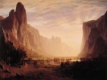

  
[Intangible Textual Heritage](../../index)  [Americana](../index) 
[Index](index)  [Previous](lol097)  [Next](lol099) 

------------------------------------------------------------------------

[Buy this Book at
Amazon.com](https://www.amazon.com/exec/obidos/ASIN/B002ACPKVU/internetsacredte)

------------------------------------------------------------------------

  
*Myths and Legends of our Own Land*, by Charles M. Skinner, \[1896\], at
Intangible Textual Heritage

------------------------------------------------------------------------

### THE BALL GAME BY THE SACO

Water-Goblins from the streams about Katahdin had left their birthplace
and journeyed away to the Agiochooks, making their presence known to the
Indians of that region by thefts and loss of life. When the manitou,
Glooskap, learned that these goblins were eating human flesh and
committing other outrages, he took on their own form, turning half his
body into stone, and went in search of them. The wigwam had been pitched
near the Home of the Water Fairies,—a name absurdly changed by the
people of North Conway to Diana's Bath,—and on entering he was invited
to take meat. The tail of a whale was cooked and offered to him, but
after he had taken it upon his knees one of the goblins exclaimed, "That
is too good for a beggar like you," and snatched it away. Glooskap had
merely to wish the return of the dainty when it flew back into his
platter. Then he took the whale's jaw, and snapped it like a reed; he
filled his pipe and burned the tobacco to ashes in one inhalation; when
his hosts closed the wigwam and smoked vigorously, intending to foul the
air and stupefy him, he enjoyed it, while they grew sick; so they
whispered to each other, "This is a mighty magician, and we must try his
powers in another way."

A game of ball was proposed, and, adjourning to a sandy level at the
bend of the Saco, they began to play, but Glooskap found that the ball
was a hideous skull that rolled and snapped at him and would have torn
his flesh had it not been immortal and immovable from his bones. He
crushed it at a blow, and breaking off the bough of a tree he turned it
by a word into a skull ten times larger than the other that flew after
the wicked people as a wildcat leaps upon a rabbit. Then the god stamped
on the sands and all the springs were opened in the mountains, so that
the Saco came rising through the valley with a roar that made the
nations tremble. The goblins were caught in the flood and swept into the
sea, where Glooskap changed them into fish.

------------------------------------------------------------------------

[Next: The White Mountains](lol099)
