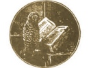

  
[Intangible Textual Heritage](../../index)  [Americana](../index) 
[Index](index)  [Next](pow001) 

------------------------------------------------------------------------

  
*Pow-Wows, or Long Lost Friend*, by John George Hoffman, \[1820\], at
Intangible Textual Heritage

------------------------------------------------------------------------

# JOHN GEORGE HOHMAN'S

## POW-WOWS;

###### OR,

### LONG LOST FRIEND

##### A COLLECTION

###### OF MYSTERIOUS AND INVALUABLE

## ARTS AND REMEDIES,

###### FOR

### MAN AS WELL AS ANIMALS.

##### WITH MANY PROOFS

Of their virtue and efficacy in healing diseases, etc., the greatest
part which was never published until they appeared in print for the
first time in the U.S. in the year 1820.

PRINTED IN U.S.A.

###### Scanned at Intangible Textual Heritage, August 2001.by J.B. Hare. Reformatted August, 2003 and March 2010. This text is in the public domain in the US becauuse it was published prior to 1923.

  [  
Click to enlarge](img/titlepg.jpg)  
Title Page  

------------------------------------------------------------------------

[Next: Preface](pow001)

