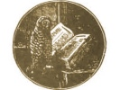

  
[Intangible Textual Heritage](../../index)  [Americana](../index) 
[Index](index)  [Previous](pow130)  [Next](pow132) 

------------------------------------------------------------------------

  
*Pow-Wows, or Long Lost Friend*, by John George Hoffman, \[1820\], at
Intangible Textual Heritage

------------------------------------------------------------------------

ANOTHER WAY TO STILL-BIND THIEVES.

Ye thieves, I conjure you, to be obedient like Jesus Christ, who obeyed
his Heavenly Father unto the cross, and to stand without moving out of
my sight, in the name of the Trinity. I command you by the power of God
and the incarnation of Jesus Christ, not to move out of my sight, + + +
like Jesus Christ was standing on Jordan's stormy banks to be baptized
by John. And furthermore, I conjure you, horse and rider, to stand still
and not to move out of my sight, like Jesus Christ did stand when he was
about to be nailed to the cross to release the fathers of the church
from the bonds of hell.. Ye thieves, I bind you with the same bonds with
which Jesus our Lord has bound hell; and thus ye shall be bound; + + +
and the same words that bind you shall also release you.

TO EFFECT THE SAME IN LESS TIME.

Thou horseman and footman, you are coming under your hats; you are
scattered! With the blood of Jesus Christ, with his five holy wounds,
thy barrel, thy gun,. and thy pistol are bound; sabre, sword, and knife
are enchanted and bound, in the name of God the Father. the Son, and the
Holy Ghost. Amen.

This must be spoken three times.

------------------------------------------------------------------------

[Next: Releasing Spell-Bound Persons](pow132)

