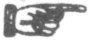

  
[Intangible Textual Heritage](../../index)  [Americana](../index) 
[Index](index)  [Previous](pow154)  [Next](pow156) 

------------------------------------------------------------------------

  
*Pow-Wows, or Long Lost Friend*, by John George Hoffman, \[1820\], at
Intangible Textual Heritage

------------------------------------------------------------------------

p. 63

A CHARM AGAINST POWDER AND BALL.

The heavenly and holy trumpet blow every ball and misfortune away from
me. I seek refuge beneath the tree of life which bears twelvefold
fruits. I stand behind the holy altar of the Christian Church. I commend
myself to the Holy Trinity. I \[name\] hide myself beneath the holy
corpse of Jesus Christ. I commend myself unto the wounds of Jesus
Christ, that the hand of no man might be able to seize me, or to bind
me, or to cut me, or to throw me, or to beat me, or to overcome me in
any way whatever, so help me. \[N.\]

 Whoever carries this
book with him is safe from all his enemies, visible or invisible; and
whoever has this book with him cannot die without the holy corpse of
Jesus Christ, nor drown in any water, nor burn up in any fire, nor can
any unjust sentence be passed upon him. So help me.

------------------------------------------------------------------------

[Next: Unlucky Days](pow156)

