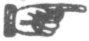

  
[Intangible Textual Heritage](../../index)  [Americana](../index) 
[Index](index)  [Previous](pow169) 

------------------------------------------------------------------------

  
*Pow-Wows, or Long Lost Friend*, by John George Hoffman, \[1820\], at
Intangible Textual Heritage

------------------------------------------------------------------------

p. 84

 Whoever carries this
book with him, is safe from all his enemies, visible or invisible; and
whoever has this book with him cannot die without the holy corpse of
Jesus Christ, nor drowned in any water, nor burn up in any fire, nor can
any unjust sentence be passed upon him. So help me.

\+ + +
