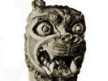

  
[Intangible Textual Heritage](../../index)  [Ancient Near
East](../index)  [Index](index)  [Previous](blc08)  [Next](blc10) 

------------------------------------------------------------------------

  
*The Babylonian Legends of Creation*, by E. A. Wallis Budge, \[1921\],
at Intangible Textual Heritage

------------------------------------------------------------------------

### SECOND TABLET.

1\. Tiâmat made solid that which she had moulded.

2\. She bound the gods her children with \[evil bonds\].

3\. Tiâmat wrought wickedness to avenge Apsu.

4\. When ... had harnessed his chariot he went to meet Ea,

5\. Ea hearkened to his story,

6\. He was sorely afflicted and abode in sorrow,

7\. The days were long, his wrath died down.

8\. He went his way to the dwelling of Anshar, his father,

9\. He went into the presence of Anshar, the father who begat him,

  [![Portion of a tablet
inscribed in Assyrian with a text of the Second Tablet of the Creation
Series. \[No. 40,559.\]](tn/019.png)  
Click to enlarge](img/019.png)  
Portion of a tablet inscribed in Assyrian with a text of the Second
Tablet of the Creation Series. \[No. 40,559.\]  

10\. Whatsoever Tiâmat had devised he repeated unto him,

11\. Mother Tiâmat who gave us birth hath sown these things.

12\. She hath set in order her assembly, she rageth furiously,

13\. All the gods have joined themselves to her.

14\. They march by her side together with those whom ye have created.

15\. They formed a band and went forth to battle to help Tiâmat,

16\. They were exceedingly wroth, they made plots by day and by night
without ceasing,

17\. They offered battle, fuming and raging,

18\. They set the battle in array, they uttered cries of defiance.

19\. Ummu-Khubur, [29](blc17.htm#fn_28) who
fashioned all things,

20\. Set up the unrivalled weapon, she spawned huge serpents

21\. Sharp of tooth, pitiless in attack (?)

22\. She filled their bodies with venom instead of blood,

23\. Grim, monstrous serpents arrayed in terror.

24\. She decked them with brightness, she fashioned them in exalted
forms,

25\. So that fright and horror might overcome him that looked upon them,

26\. So that their bodies might rear up, and no man resist their attack.

27\. She set up the Viper, and the Snake, and the god Lakhamu,

28\. The Whirlwind, the ravening Dog, the Scorpion-man,

29\. The Storm-wind, the Fish-man, the Horned Beast.

30\. They carried the Weapon which spared not, nor flinched from the
battle.

31\. Most mighty were Tiâmat's allies, they could not be resisted.

32\. Thus she caused eleven \[monsters\] of this kind to come into
being.

33\. Among the gods, her first-born son who had collected her company,

34\. That is to say, Kingu, she set on high, she made him the great one
amongst them.

35\. Leader of the hosts in battle, disposer of the troops,

36\. Bearer of the firmly-grasped weapon, attacker in the fight,

37\. He who in the battle is the master of the weapon,

38\. She appointed, she made him to sit down in \[goodly apparel\]

39\. \[Saying\], "I have recited the incantation for thee, I have
magnified thee in the assembly of the gods,

40\. "I have filled his \[*sic*, read 'thy'\] hand with the sovereignty
of the whole company of the gods.

41\. "Mayest thou be magnified, thou who art my only spouse,

42\. "May the Anunnaki make great thy renown over all of them."

43\. She gave him the TABLET OF DESTINIES, she fastened it on his
breast, \[saying\]--

44\. "As for thee, thy command shall not fall empty, what goeth forth
from thy mouth shall be established."

45\. When Kingu was raised on high and had taken the heavens (literally,
"the god Anutum") 46. He fixed the destinies for the gods his sons,
\[saying\],

47\. "Open your mouths, let the Fire-god be quenched,

48\. "He who is glorious in battle and is most mighty shall do great
deeds."

49\. When Anshar heard that Tiâmat was stirred mightily,

50\. ... he bit his lips

51\. ... his mind was not at peace

\[Lines 52-54 too fragmentary for translation.\]

An'shar then addresses Ea and says:--

55\. "Thou hast slain Mummu and Apsu

56\. "But Tiâmat hath exalted Kingu--where is the one who can meet her?

\[Lines 57 and 58 imperfect; lines 59-71 wanting.\]

72\. Anshar spake a word unto his son \[Anu\]:--

73\. "... this is a difficulty, my warrior

74\. "Whose power is exalted, whose attack cannot be stayed,

75\. "Go and stand thou in the presence of Tiâmat,

76\. "That her spirit \[be quieted\], her heart softened.

77\. "But should she not hearken unto thy word,

78\. "Speak thou our word unto her so that she may be abated."

79\. \[Anu\] heard the order of his father Anshar.

80\. He took the straight road to her, and hastened on the way to her.

81\. Anu drew nigh, he searched out the plan of Tiâmat,

82\. He could not prevail against her, he turned back.

Lines 83 and 84 contain Anu's report to Anshar, but they are too
fragmentary to translate; line 85 reads:--

83\. He (Anu) went to his father Anshar who begat him,

84\. He spake unto him a word \[concerning Tiâmat\]

85\. \[She laid\] hands upon me that withered me up."

86\. Anshar was distressed, he looked down upon the ground,

87\. He turned pale; towards Ea he lifted up his head.

88\. All the Anunnaki assembled at their posts.

89\. They shut their mouths, they sat in lamentation.

90\. \[They said\], "Nowhere is there a god who can attack Tiâmat.

91\. "He would not escape from Tiâmat's presence with his life."

92\. The Lord Anshar, the Father of the gods, \[spake\] majestically,

93\. He lifted up his heart, he addressed the Anunnaki, \[saying\]

94\. "He whose \[strength\] is mighty \[shall be\] an avenger for \[us\]

95\. "The ... in the strife, Marduk the Hero."

96\. Ea called Marduk to the place where he gave oracles,

97\. Marduk came and according to his heart he addressed him,

98\. \[Saying\], "O Marduk, hear the counsel and advice of thy father,

99\. "Thou art the son who refresheth his heart,

100\. "Draw nigh and enter the presence of An-shar,

101\. "Stand there \[with joy\], when he looketh upon thee he will be at
rest." [30](blc17.htm#fn_29)

113\. The Lord \[Marduk\] rejoiced at the word of his father,

114\. He approached and took up his place before Anshar.

115\. Anshar looked upon him and his heart was filled with gladness.

116\. He (*i.e.*, Anshar) kissed his (Marduk's) lips, and his (Anshar's)
fear was removed. \[Then Marduk said\]

117\. "My father, let not the opening of thy mouth be closed, [31](blc17.htm#fn_30)

118\. "I will go, I will make to take place all that is in thy heart.

119\. "Anshar, let not the opening of thy mouth be closed,

120\. "I will go, I will make to take place all that is in thy heart."
\[Anshar says to Marduk\]

121\. "What man is the cause of the battle which made thee go forth

122\. "... Tiâmat, who is a woman, pursueth thee with weapons.

123\. "Rejoice our \[hearts\] and make us glad.

124\. "Thou thyself shalt soon trample upon the neck of Tiâmat,

125\. "Rejoice our \[hearts\] and make us glad.

126\. "Thou thyself shalt soon trample upon the neck of Tiâmat.

127\. "My son, who dost comprehend everything,

128\. "Cast deep sleep upon Tiâmat with thy holy spell.

129\. "Betake thyself to thy march with all speed.

130\. "..."

131\. The Lord \[Marduk\] rejoiced at the word of his father,

132\. His heart leaped with joy, to his father he spake, \[saying\],

133\. "O Lord of the gods, Overlord of the Great Gods,

134\. "Should I as your avenger

135\. "Slay Tiâmat and bestow life upon you,

136\. "Summon a meeting, proclaim and magnify my position,

137\. "Sit ye down together in friendly fashion in Upshukkinaku.

138\. "Let me issue decrees by the opening of my mouth even as ye do.

139\. "Whatsoever I bring to pass let it remain unaltered,

140\. "That which my mouth uttereth shall never fail or be brought to
nought."

------------------------------------------------------------------------

[Next: Third Tablet](blc10)
