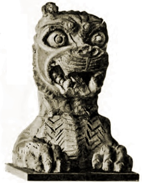

  
[Intangible Textual Heritage](../../index)  [Ancient Near
East](../index) 

------------------------------------------------------------------------

<table width="75%">
<colgroup>
<col style="width: 50%" />
<col style="width: 50%" />
</colgroup>
<tbody>
<tr class="odd">
<td width="50%" data-valign="TOP"></td>
<td width="50%" data-valign="CENTER"><h1 id="the-babylonian-legends-of-creation" data-align="CENTER">The Babylonian Legends of Creation</h1>
<h2 id="by-e.a.-wallis-budge" data-align="CENTER">by E.A. Wallis Budge</h2>
<h4 id="section" data-align="CENTER">[1921]</h4></td>
</tr>
</tbody>
</table>

------------------------------------------------------------------------

[Contents](#contents)    [Start Reading](blc00)    [Text
\[Zipped\]](blc.txt.gz)

------------------------------------------------------------------------

 [Title Page](blc00)  
[Discovery of the Tablets](blc01)  
[Publication of the Creation Tablets](blc02)  
[The Object of the Babylonian Legend of the Creation](blc03)  
[Variant Forms of the Babylonian Legend of the Creation](blc04)  
[The Bilingual Version of the Creation Legend](blc05)  
[The Legend of the Creation According to Berosus and Damascius](blc06)  
[The Seven Tablets of Creation. Description of Their Contents](blc07)  

### The Seven Tablets of Creation

[First Tablet](blc08)  
[Second Tablet](blc09)  
[Third Tablet](blc10)  
[Fourth Tablet](blc11)  
[Fifth Tablet](blc12)  
[Sixth Tablet](blc13)  
[Seventh Tablet](blc14)  
[Epilogue](blc15)  

 

[Notes](blc16)  
[Footnotes](blc17)  
