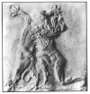

  
[Intangible Textual Heritage](../../index)  [Ancient Near
East](../index)  [Index](index)  [Next](caog01) 

------------------------------------------------------------------------

  
*The Chaldean Account of Genesis*, by George Smith, \[1876\], at
Intangible Textual Heritage

------------------------------------------------------------------------

##### THE

# CHALDEAN ACCOUNT OF GENESIS.

###### CONTAINING

##### THE DESCRIPTION OF THE CREATION, THE FALL OF MAN,

##### THE DELUGE, THE TOWER OF BABEL, THE

##### TIMES OF THE PATRIARCHS,

##### AND NIMROD;

###### BABYLONIAN FABLES, AND LEGENDS OF THE GODS;

###### FROM THE CUNEIFORM INSCRIPTIONS.

## BY GEORGE SMITH,

###### OF THE DEPARTMENT OF ORIENTAL ANTIQUITIES, BRITISH MUSEUM,

###### AUTHOR OF "HISTORY OF ASSURBANIPAL,"

###### "ASSYRIAN DISCOVERIES,"

###### ETC. ETC.

### WITH ILLUSTRATIONS.

#### London: Thomas Scott

#### \[1876\]

Scanned, proofed and formatted at Intangible Textual Heritage, by John
Bruno Hare, December 2009. This text is in the public domain in the US
because it was published prior to 1923.

  [  
Click to enlarge](img/front.jpg)  
FIGHT BETWEEN MERODACH (BEL) AND THE DRAGON.  

 
[  
Click to enlarge](img/front2.jpg)  
Frontispiece  

  [  
Click to enlarge](img/title.jpg)  
Title page  

  [  
Click to enlarge](img/front3.jpg)  
EAGLE-HEADED MAN. FROM NIMROUD SCULPTURE.  

  [  
Click to enlarge](img/front4.jpg)  
IZDUBAR STRANGLING A LION. FROM KHORSABAD SCULPTURE.  

------------------------------------------------------------------------

[Next: Introduction](caog01)

