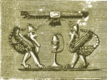
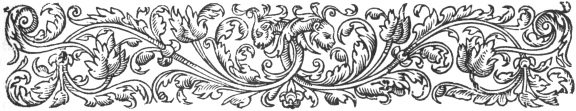
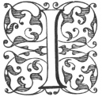

  
[Intangible Textual Heritage](../../index)  [Ancient Near
East](../index)  [Index](index)  [Previous](caog07)  [Next](caog09) 

------------------------------------------------------------------------

  
*The Chaldean Account of Genesis*, by George Smith, \[1876\], at
Intangible Textual Heritage

------------------------------------------------------------------------

p. 61

 

### CHAPTER V.

### BABYLONIAN LEGEND OF THE CREATION.

Mutilated condition of tablets.—List of
subjects.—Description of chaos.—Tiamat.—Generation of
gods.—Damascius.—Comparison with Genesis.—Three great gods.—Doubtful
fragments.—Fifth tablet.—Stars.—Planets.—Moon.—Sun.—Abyss or
chaos.—Creation of moon,—Creation of animals.—Man.—His duties.—Dragon of
sea.—Fall.—Curse for disobedience.—Discussion.—Sacred tree.—Dragon or
serpent.—War with Tiamat.—Weapons.—Merodach.—Destruction of
Tiamat.—Mutilation of documents.—Parallel Biblical account.—Age of
story.

|                    |
|--------------------|
|  |

I HAVE related in the first chapter the history of the discovery of this
legend; the tablets composing it are in mutilated condition, and too
fragmentary to enable a single tablet to be completed, or to give more
than a general view of the whole subject. The story, so far as I can
judge from the fragment, agrees generally with the account of the
Creation in the Book of Genesis, but shows traces of having originally
included very much more matter. The fragments of the story which I have
arranged are as follows:—

p. 62

1\. Part of the first tablet, giving an account of the Chaos and the
generation of the gods.

2\. Fragment of subsequent tablet, perhaps the second on the foundation
of the deep.

3\. Fragment of tablet placed here with great doubt, probably referring
to the creation of land.

4\. Part of the fifth tablet, giving the creation of the heavenly
bodies.

5\. Fragment of seventh? tablet, giving the creation of land animals.

6\. Fragments of three tablets on the creation and fall of man.

7\. Fragments of tablets relating to the war between the gods and evil
spirits.

These fragments indicate that the series included at least twelve
tablets, the writing on each tablet being in one column on the front and
back, and probably including over one hundred lines of text.

The first fragment in the story is the upper part of the first tablet,
giving the description of the void or chaos, and part of the generation
of the gods. The translation is:

1\. When above, were not raised the heavens:

2\. and below on the earth a plant had not grown up;

3\. the abyss also had not broken open their boundaries:

4\. The chaos (or water) Tiamat (the sea) was the producing-mother of
the whole of them.

p. 63

5\. Those waters at the beginning were ordained; but

6\. a tree had not grown, a flower had not unfolded.

7\. When the gods had not sprung up, any one of them;

8\. a plant had not grown, and order did not exist;

9\. Were made also the great gods,

10\. the gods Lahmu and Lahamu they caused to come . . . . .

11\. and they grew . . . . . .

12\. the gods Sar and Kisar were made . . . .

13\. A course of days, and a long time passed . . .

14\. the god Anu . . . . . .

15\. the gods Sar and . . . . . .

16\. . . . . . .

On the reverse of this tablet there are only fragments of the eight
lines of colophon, but the restoration of the passage is easy, it
reads:—

1\. First tablet of "When above" (name of Creation series).

2\. Palace of Assurbanipal king of nations, king of Assyria,

3\. to whom Nebo and Tasmit attentive ears have given:

4\. he sought with diligent eyes the wisdom of the inscribed tablets,

5\. which among the kings who went before me,

6\. none those writings had sought.

7\. The wisdom of Nebo, the impressions? of the god my instructor? all
delightful,

p. 64

8\. on tablets I wrote, I studied, I observed, and

9\. for the inspection of my people within my palace I placed

This colophon will serve to show the value attached to the documents,
and the date of the present copies. The fragment of the obverse, broken
as it is, is precious as giving the description of the chaos or desolate
void before the Creation of the world, and the first movement of
creation. This corresponds to the first two verses of the first chapter
of Genesis.

1\. "In the beginning God created the heaven and the earth.

2\. And the earth was without form and void; and darkness was upon the
face of the deep. And the spirit of God moved upon the face of the
waters."

On comparing the fragment of the first tablet of the Creation with the
extract front Damascius, we do not find any statement as to there being
two principles at first called Tauthe and Apason, and these producing
Moymis, but in the Creation tablet the first existence is called Mummu
Tiamatu, a name meaning the "sea-water" or "sea chaos." The name Mummu
Tiamatu combines the two names Moymis and Tauthe of Damascius. Tiamatu
appears also as Tisallat and agrees with the Thalatth of Berosus, which
we are expressly told was the sea. It is evident that, according to the
notion of the Babylonians, the sea was the origin of all things, and
this also agrees with the statement of Genesis, i. 2. where the chaotic
waters are called ‏תהום‎, "the deep," the same word as

p. 65

the Tiamat of the Creation text and the Tauthe of Damascius.

The Assyrian word *Mummu* is probably connected with the Hebrew ‏מהומה‎,
confusion, and one of its equivalents is *Umun*, equal to the Hebrew
‏המרן‎ noise or tumult. Beside the name of the chaotic deep called ‏תהו‎
in Genesis, which is, as I have said, evidently the Tiamat of the
Creation text, we have in Genesis the word ‏תהו‎, waste, desolate, or
formless, applied to this chaos. This appears to be the tehuta of the
Assyrians—a name of the sea-water ("History of Assurbanipal," p. 59);
this word is closely connected with the word tiamat or tamtu, the sea.
The correspondence between the inscription and Genesis is here complete,
both stating that a watery chaos preceded the creation, and formed, in
fact, the origin and groundwork of the universe. We have here not only
an agreement in sense, but, what is rarer, the same word used in both
narratives as the name of this chaos, and given also in the account of
Damascius. Berosus has certainly the slightly different form Thalatth,
with the same sense however, and it might be suspected that this word
was a corruption of Tiamat, but the Babylonian word is read Tiamtu,
Tiamat, and Tisallat, which last is more probably the origin of the word
Thalatth of Berosus.

Next we have in the inscription the creation of the gods Lahma or Lahmu,
and Lahama or Lahamu; these are male and female personifications of
motion and production, and correspond to the Dache and

p. 66

\[paragraph continues\] Dachus of
Damascius, and the moving ‏רוח‎, wind, or spirit of Genesis. The next
stage in the inscription gives the production of Sar or Ilsar, and
Kisar, representing the upper expanse and the lower expanse, and
corresponding to the Assorus and Kissare of Damascius. The resemblance
in these names is probably closer than here represented, for Sar or
Ilsar is generally read Assur as a deity in later times, being an
ordinary sign for the supreme god of the Assyrians.

Here the cuneiform text becomes so mutilated that little can be made out
from it, but it appears from the fragment of line 14 that the next step
was (as in Damascius) the generation of the three great gods, Anu, Elu,
and Hea, the Anus, Illinus, and Aus of that writer. Anu represents the
heaven, Elu the earth, and Hea the sea, in this new form of the
universe.

It is probable that the inscription went on to relate the generation of
the other gods, and then passed to the successive acts of creation by
which the world was fashioned.

The successive forms Lahma and Lahama, Sar and Kisar, are represented in
some of the god lists as names or manifestations of Anu and Anatu. In
each case there appears to be a male and female principle, which
principles combine in the formation of the universe.

The resemblance between the extract from Damascius and the account in
the Creation tablet as to

p. 67

these successive stages or forms in the Creation, is striking, and
leaves no doubt that there was a connection between the two.

The three next tablets in the Creation series are absent, there being
only two doubtful fragments of this part of the story. Judging from the
analogy of the Book of Genesis, we may conjecture that this part of the
narrative contained the description of the creation of light, of the
atmosphere or firmament, of the dry land, and of plants. One fragment to
which I have alluded as probably belonging to this space is a small
portion of the top of a tablet referring to the fixing of the dry land;
but it may belong to a later part of the story, for it is part of a
speech to one of the gods. This fragment is—

1\. When the foundations of the ground of rock \[thou didst make\]

2\. the foundation of the ground thou didst call . .

3\. thou didst beautify the heaven . . . . . .

4\. to the face of the heaven . . . . . .

5\. thou didst give . . . . . .

6\. . . . . . .

There is a second more doubtful fragment which appears to belong to this
space, and, like the last, seems to relate part of the creation of the
dry land. I give it here under reserve—

1\. The god Sar . . . pan . . . .

2\. When to the god . . . .

3\. Certainly I will cover? . . .

4\. from the day that thou . . . .

p. 68

5\. angry thou didst speak . . . .

6\. Sar (or Assur) his mouth opened and spake, to the god . . . .

7\. Above the sea which is the seat of . . . .

8\. in front of the *esara* (firmament?) which I have made . . . .

9\. below the place I strengthen it . . . .

10\. Let there be made also *e-lu* (earth?) for the dwelling of \[man?\]

11\. Within it his city may he build and . . . .

12\. When from the sea he raised . . . .

13\. the place . . . . lifted up . . . .

14\. above . . . . heaven . . . .

15\. the place . . . . lifted up . . . .

16 . . . . Pal-bi-ki the temples of the great gods. . . .

17 . . . . his father and his . . . . of him

18\. the god . . . . thee and over all which thy hand has made

19 . . . . thee, having, over the earth which thy hand has made

20 . . . . having, Pal-bi-ki which thou hast called its name

21 . . . . made? my hand for ever

22 . . . . may they carry

23\. the place . . . . any one the work which . . .

24\. he rejoiced . . . . to after . . . .

25\. the gods . . . .

26\. which in . . . .

27\. he opened . . .

p. 69

This fragment is both mutilated and obscure; in the eighth line I have
translated firmament with a query, the sound and meaning of the word
being doubtful; and in line 10, I translate earth for a combination of
two characters more obscure still, my translation being a conjecture
grounded on some meanings of the individual monograms. Pal-bi-ki are the
characters of one name of the city of Assur; but I do not understand the
introduction of this name here.

The next recognizable portion of the Creation legends is the upper part
of the fifth tablet, which gives the creation of the heavenly bodies,
and runs parallel to the account of the fourth day of creation in
Genesis.

This tablet opens as follows:—

*Fifth Tablet of Creation Legend*.

Obverse.

1\. It was delightful, all that was fixed by the great gods.

2\. Stars, their appearance \[in figures\] of animals he arranged.

3\. To fix the year through the observation of their constellations,

4\. twelve months (or signs) of stars in three rows he arranged,

5\. from the day when the year commences unto the close.

p. 70

6\. He marked the positions of the wandering stars (planets) to shine in
their courses,

7\. that they may not do injury, and may not trouble any one,

8\. the positions of the gods Bel and Hea he fixed with him.

9\. And he opened the great gates in the darkness shrouded

10\. the fastenings were strong on the left and right.

11\. In its mass (*i.e.* the lower chaos) he made a boiling,

12\. the god Uru (the moon) he caused to rise out, the night he
overshadowed,

13\. to fix it also for the light of the night, until the shining of the
day,

14\. That the month might not be broken, and in its amount be regular.

15\. At the beginning of the month, at the rising of the night,

16\. his horns are breaking through to shine on the heaven.

17\. On the seventh day to a circle he begins to swell,

18\. and stretches towards the dawn further.

19\. When the god Shamas (the sun) in the horizon of heaven, in the
east,

20\. . . . . . formed beautifully and . . . .

21\. . . . . . . to the orbit Shamas was perfected

22\. . . . . . . .the dawn Shamas should change

23\. . . . . . . . . going on its path

p. 71

24\. . . . . . . . . giving judgment

25\. . . . . . . . . to tame

26\. . . . . . . . . a second time

27\. . . . . . . . .

Reverse.

1\. . . . . . . . .

2\. . . . . . he fixed

3\. . . . of the gods on his hearing.

4\. Fifth tablet of "When above" (Creation series).

5\. Country of Assurbanipal king of nations king of Assyria.

This fine fragment is a typical specimen of the style of this series,
and shows a marked stage in the Creation, the appointment of the
heavenly orbs. It parallels the fourth day of Creation in the first
chapter of Genesis, where we read: "And God said, Let there be lights in
the firmament of the heaven to divide the day from the night; and let
them be for signs, and for seasons, and for days, and years:

"15. And let them be for lights in the firmament of the heaven to give
light upon the earth: and it was so.

"16. And God made two great lights; the greater light to rule the day,
and the lesser light to rule the night; he made the stars also.

"17. And God set them in the firmament of the heaven to give light upon
the earth,

"18. And to rule over the day and over the night,

p. 72

and to divide the light from the darkness: and God saw that it was good.

"19. And the evening and the morning were the fourth day."

The fragment of the first tablet of the Creation series showed that that
was rather introductory, and dealt with the generation of the gods more
than the creation of the universe, and the fact that the fifth tablet
contains the Creation given in Genesis, under the fourth day, while a
subsequent tablet, probably the seventh, gives the creation of the
animals which, according to Genesis, took place on the sixth day, leads
to the inference that the events of each of the days of Genesis were
recorded on a separate tablet, and that the numbers of the tablets
generally followed in the same order as the days of Creation in Genesis,
thus:

Genesis, Chap. I.

V. 1 & 2 agree with Tablet 1.

V. 3 to 5 1st day probably with tablet 2.

V. 6 to 8 2nd day probably with tablet 3.

V. 9 to 13 3rd day probably with tablet 4.

V. 14 to 19 4th day agree with tablet 5.

V. 20 to 23 5th day probably with tablet 6.

V. 24 & 25 6th day probably with tablet 7.

V. 26 and following, 6th and 7th day, probably with tablet 8.

The tablet which I think to be the eighth appears to give the Creation
and Fall of Man, and is followed by several other tablets giving
apparently the war

p. 73

between the gods and the powers of evil, but all of these are very
mutilated, and no number can be positively proved beyond the fifth
tablet. There is, however, fair reason to suppose that there was a close
agreement in subjects and order between the text of the Chaldean legend
and Genesis, while there does not appear to be anything like the same
agreement between these inscriptions and the accounts transmitted to us
through Berosus (see pp. [37](caog06.htm#page_37)-50).

The fifth tablet commences with the statement that the previous
creations were "delightful," or satisfactory, agreeing with the
oft-repeated statement of Genesis, after each act of creative power,
that "God saw that it was good." The only difference here is one of
detail. It appears that the Chaldean record contains the review and
expression of satisfaction at the head of each tablet, while the Hebrew
has it at the close of each act.

We then come to the creation of the heavenly orbs, which are described
in the inscription as arranged like animals, while the Bible says they
were set as "lights in the firmament of heaven," and just as the book of
Genesis says they were set for signs and seasons, for days and years, so
the inscription describes that the stars were set in courses to point
out the year. The twelve constellations or signs of the zodiac, and two
other bands of constellations are mentioned, just as two sets of twelve
stars each are mentioned by the Greeks, one north and one south of the
zodiac. I have translated one of these names

p. 74

*nibir*, "wandering stars" or "planets," but this is not the usual word
for planet, and there is a star called *Nibir* near the place where the
sun crossed the boundary between the old and new years, and this star
was one of twelve supposed to be favourable to Babylonia. It is evident,
from the opening of the inscription on the first tablet of the Chaldean
astrology and astronomy, that the functions of the stars were according
to the Babylonians to act not only as regulators of the seasons and the
year, but to be also used as signs, as in Genesis i. 14, for in those
ages it was generally believed that the heavenly bodies gave, by their
appearance and positions, signs of events which were coming on the
earth.

The passage given in the eighth line of the inscription, to the effect
that the God who created the stars fixed places or habitations for Bel
and Hea with himself in the heavens, points to the fact that Anu, god of
the heavens, was considered to be the creator of the heavenly hosts; for
it is he who shares with Bel and Hea the divisions of the face of the
sky.

The ninth line of the tablet opens a curious view as to the
philosophical beliefs of the early Babylonians. They evidently
considered that the world was drawn together out of the waters, and
rested or reposed upon a vast abyss of chaotic ocean which filled the
space below the world. This dark infernal lake was shut in by gigantic
gates and strong fastenings, which prevented the floods from
overwhelming the world. When the deity decided to create the

p. 75

moon, he is represented as drawing aside the gates of this abyss, and
creating a whirling motion like boiling in the dark ocean below; then,
at his bidding, from this turmoil, arose the moon like a giant bubble,
and, passing through the open gates, mounted on its destined way across
the vaults of heaven.

The Babylonian account continues with the regulation of the motions of
the moon to overshadow the night, to regulate and give light until the
dawn of day. The phases of the moon are described: its commencing as a
thin crescent at the evening on the first day of the month, and its
gradually increasing and travelling further into the night. After the
moon the creation of the sun is recorded, its beauty and perfection are
extolled, and the regularity of its orbit, which led to its being
considered the type of a judge, and the regulator of the world.

The Babylonian account of the Creation gives the creation of the moon
before that of the sun, in reverse order to that in Genesis, and
evidently the Babylonians considered the moon the principal body, while
the Book of Genesis makes the sun the greater light. Here it is evident
that Genesis is truer to nature than the Chaldean text.

The details of the creation of the planets and stars, which would have
been very important to us, are unfortunately lost, no further fragment
of this tablet having been recovered.

The colophon at the close of tablet V. gives us, however, part of the
first line of the sixth tablet, but

p. 76

not enough to determine its subject. It is probable that this dealt with
the creation of creatures of the water and fowls of the air, and that
these were the creation of Bel, the companion deity to Anu.

The next tablet, the seventh in the series, is probably represented by a
curious fragment, which I first found in one of the trenches at
Iiouyunjik, and recognized at once as a part of the description of the
Creation.

This fragment is like some of the others, the upper portion of a tablet
much broken, and only valuable from its generally clear meaning. The
translation of this fragment is:

1\. When the gods in their assembly had created . . . . . .

2\. were delightful the strong monsters . . . . . .

3\. they caused to be living creatures . . . . . .

4\. cattle of the field, beasts of the field, and creeping things of the
field . . . . . .

5\. . . . . . . they fixed for the living creatures . . . . . .

6\. . . . . . . cattle and creeping things of the city they fixed . . .
. . .

7\. . . . . . . the assembly of the creeping things the whole which were
created . . . . . .

8\. . . . . . . which in the assembly of my family . . . . . .

9\. . . . . . . and the god Nin-si-ku (the lord of noble face) caused to
be two . . . . . .

10 . . . . . . the assembly of the creeping things he caused to go . . .
. . .

p. 77

11\. . . . . . . flesh beautiful? . . . . . .

12\. . . . . . . pure presence . . . . . .

13\. . . . . . . pure presence . . . . . .

------------------------------------------------------------------------

14\. . . . . . . pure presence in the assembly . . .

15 . . . . . .

This tablet corresponds to the sixth day of Creation (Genesis, i.
24–25): "And God said, Let the earth bring forth the living creature
after his kind, cattle, and creeping thing, and beast of the earth after
his kind: and it was so.

"And God made the beast of the earth after his kind, and cattle after
their kind, and everything that creepeth upon the earth after his kind:
and God saw that it was good."

The Assyrian tablet commences with a statement of the satisfaction a
former creation, apparently that of the monsters or whales, had given;
here referring to Genesis i. 23. It then goes on to relate the creating
of living animals on land, three kinds being distinguished, exactly
agreeing with the Genesis account, and then we have in the ninth line a
curious but broken account of Nin-si-ku (one of the names of Hea),
creating two beings to be with the animals, the wording of the next
fragmentary lines leading to the suspicion that this was the opening of
the account of the creation of man. This, however, is only a suspicion,
for the lines are so mutilated and obscure that nothing can be fairly
proved from them. It is curious here, however, to notice a tablet which
refers

p. 78

to the creation of man. In this tablet, K 63, the creation of the human
race is given to Hea, and all the references in other inscriptions make
this his work.

In considering the next fragments, those which really relate to man,
there is great difficulty; for, in the first fragment to be noticed, on
one side the mutilation of the tablet renders the sense totally
uncertain; in the space lost there may be a string of negatives which
would entirely reverse the meaning. It is probable that the other side
of the fragment is a discourse to the first woman on her duties.

I think it to be the reverse of the tablet which, so far as it can be
translated, appears to give the speech of the deity to the newly created
pair (man and woman) instructing them in their duties.

K 3364 obverse.

(Many lines lost.)

1\. evil . . . .

2\. which is eaten by the stomach . . . .

3\. in growing . . . .

4\. consumed . . . .

5\. extended, heavy, . . . .

6\. firmly thou shalt speak . . . .

7\. and the support of mankind . . . thee

8\. Every day thy god thou shalt approach (or invoke)

9\. sacrifice, prayer of the mouth and instruments . . . . . .

10\. to thy god in reverence thou shalt carry.

p. 79

11\. Whatever shall be suitable for divinity,

12\. supplication, humility, and bowing of the face,

13\. fire? thou shalt give to him, and thou shalt bring tribute,

14\. and in the fear also of god thou shalt be holy.

15\. In thy knowledge and afterwards in the tablets (writing)

16\. worship and goodness . . . shall be raised?

17\. Sacrifice saving . . . .

18\. and worship . . . .

19\. the fear of god thou shalt not leave . . . .

20\. the fear of the angels thou shalt live in . . . .

21\. With friend and enemy? speech thou shalt make? . . . .

22\. under? speech thou shalt make good . . . .

23\. When thou shalt speak also he will give . . . .

24\. When thou shalt trust also thou . . . .

25\. to enemy? also . . . .

26\. . . . thou shalt trust a friend . . . .

27\. . . . thy knowledge also

Reverse.

(Many lines lost.)

1\. Beautiful place also . . . . divide . . . .

2\. in beauty and . . . . thy hand . . . .

3\. and thou to the presence . . . . thou shalt fix . . .

4\. and not thy sentence . . . . thee to the end?

5\. in the presence of beauty and . . . . thou shalt speak

6\. of thy beauty and . . . .

p. 80

7\. beautiful and . . . . to give drink?

8\. circle I fill? his enemies

9\. his rising? he seeks . . . . the man . . . .

10\. with the lord of thy beauty thou shalt be faithful,

11\. to do evil thou shalt not approach him,

12\. at thy illness . . . . to him

13\. at thy distress . . . .

The obverse of this tablet is a fragment of the address from the deity
to the newly created man on his duties to his god, and it is curious
that while, in other parts of the story, various gods are mentioned by
name, here only one god is mentioned, and simply as the "God." The
fragments of this tablet might belong to the purest system of religion;
but it would in this case be wrong to ground an argument on a single
fragment.

The reverse of the tablet appears, so far as the sense can be
ascertained, to be addressed to the woman, the companion of the man,
informing her of her duties towards her partner.

The next fragment is a small one; it is the lower corner of a tablet
with the ends of a few lines. It may possibly belong to the tablet of
the Fall to be mentioned later.

This fragment is of importance, small as it is, because it mentions a
speech of Hea to man, and alludes to the Karkartiamat, or dragon of the
sea, in connection with a revolt against the deity. The fragment is,
however, too mutilated to give more than a general idea of its contents.

p. 81

Obverse.

1\. . . . . seat her

2\. . . . . all the lords

3\. . . . . his might

4\. . . . . the gods, lord lofty?

5\. . . . . kingdom exalted

6\. . . . . in multitudes increase

Reverse.

1\. . . . . Hea called to his man

2\. . . . . height of his greatness

3\. . . . . the rule of any god

4\. . . . . Sartulku knew it

5\. . . . . his noble . . . .

6\. . . . . his fear? Sartulku

7\. . . . . his might

8\. . . . . to them, the dragon of the sea

9\. . . . . against thy father fight

Connected with this fragment is the account of the curse after the Fall,
on the remarkable fragment which I brought over from my first expedition
to Assyria.

This forms about half a tablet, being part of the obverse and reverse,
both in fair preservation; and so far as they go, fairly perfect, but
containing at present many obscurities in the speeches of the gods.
Before the commencement of lines 1, 5, 11, 19, 27, and 29 on the
obverse, there are glosses stating that the divine titles commencing
these lines all apply to the same deity. These explanatory glosses show

p. 82

that even in the Assyrian time there were difficulties in the narrative.

Obverse.

1\. The god Zi . . . . .

2\. which he had fixed . . . . .

3\. their account . . . . .

4\. may not fail in preparing? . . . . .

5\. The god Ziku (Noble life) quickly called; Director of purity,

6\. good kinsman, master of perception and right,

7\. causer to be fruitful and abundant, establisher of fertility,

8\. another to us has come up, and greatly increased,

9\. in thy powerful advance spread over him good,

10\. may he speak, may he glorify, may he exalt his majesty.

11\. The god Mir-ku (noble crown) in concern, raised a protection?

12\. lord of noble lips, saviour from death

13\. of the gods imprisoned, the accomplisher of restoration,

14\. his pleasure he established he fixed upon the gods his enemies,

15\. to fear them he made man,

16\. the breath of life was in him.

17\. May he be established, and may his will not fail,

18\. in the mouth of the dark races which his hand has made.

19\. The god of noble lips with his five fingers sin may he cut off;

p. 83

20\. who with his noble charms removes the evil curse.

21\. The god Libzu wise among the gods, who had chosen his possession,

22\. the doing of evil shall not come out of him,

23\. established in the company of the gods, he rejoices their heart.

24\. Subduer of the unbeliever . . . . .

25\. director of right . . . . .

26\. of corruption and . . . . .

27\. The god Nissi . . . . .

28\. keeper of watch . . . . .

29\. The god Suhhab, swiftly . . . . .

30\. the pourer out to them . . . . .

31\. in . . . . .

32\. like . . .

33 . . . . .

Reverse.

1\. . . . . .

2\. . . . . . the star . . . . .

3\. may he take the tail and head . . . . .

4\. because the dragon Tiamat had . . . . .

5\. his punishment the planets possessing . . . .

6\. by the stars of heaven themselves may they . .

7\. like a sheep may the gods tremble all of them

8\. may he bind Tiamat her prisons may he shut up and surround.

9\. Afterwards the people of remote ages

10\. may she remove, not destroy . . . for ever,

p. 84

11\. to the place he created, he made strong.

12\. Lord of the earth his name called out, the father Elu

13\. in the ranks of the angels pronounced their curse.

14\. The god Hea heard and his liver was angry,

15\. because his man had corrupted his purity.

16\. He like me also Hea may he punish him,

17\. the course of my issue all of them may he remove, and

18\. all my seed may he destroy.

19\. In the language of the fifty great gods

20\. by his fifty names he called, and turned away in anger from him:

21\. May he be conquered, and at once cut off.

22\. Wisdom and knowledge hostilely may they injure him.

23\. May they put at enmity also father and son and may they plunder.

24\. to king, ruler, and governor, may they bend their ear.

25\. May they cause anger also to the lord of the gods Merodach.

26\. His land may it bring forth but he not touch it;

27\. his desire shall be cut off, and his will be unanswered;

28\. the opening of his mouth no god shall take notice of;

29\. his back shall be broken and not be healed;

30\. at his urgent trouble no god shall receive him;

p. 85

31\. his heart shall be poured out, and his mind shall be troubled;

32\. to sin and wrong his face shall come . . . . .

33\. . . . . . front . . . . .

34\. . . . . .

In a second copy which presents several variations lines 14 to 19 are
omitted.

This valuable fragment is unfortunately obscure in some parts,
especially on the obverse, but the general meaning is undoubted, and the
approximate position of the fragment in the story is quite clear. It
evidently follows the fragment giving the creation of the land animals,
and either forms a further portion of the same, or part of the following
tablet.

The obverse gives a series of speeches and statements respecting the
newly created man, who was supposed to be under the especial care of the
deities. It happens in this case that there is no clue to the reason for
these speeches, the key portions of the inscription being lost, but a
point is evidently made of the purity of the man, who is said to be
established in the company of the gods and to rejoice their hearts. The
various divine titles or names, "the god of noble life," "the god of
noble crown," and "the god of noble lips," are all most probably titles
of Hea.

It appears from line 18 that the race of human beings spoken of is the
*zalmat-qaqadi*, or dark race, and in various other fragments of these
legends they

p. 86

are called Admi or Adami, which is exactly the name given to the first
man in Genesis.

The word Adam used in these legends for the first human being is
evidently not a proper name, but is only used as a term for mankind.
Adam appears as a proper name in Genesis, but certainly in some passages
is only used in the same sense as the Assyrian word, and we are told on
the creation of human beings (Genesis, v. 1): "In the day that God
created man, in the likeness of God made he him; male and female created
he them; and blessed them, and called their name Adam, in the day when
they were created."

It has already been pointed out by Sir Henry Rawlinson that the
Babylonians recognized two principal races: the Adamu, or dark race, and
the Sarku, or light race, probably in the same manner that two races are
mentioned in Genesis, the sons of Adam and the sons of God. It appears
incidentally . from the fragments of inscriptions that it was the race
of Adam, or the dark race, which was believed to have fallen, but there
is at present no clue to the position of the other race in their system.
We are informed in Genesis that when the world became corrupt the sons
of God intermarried with the race of Adam, and thus spread the evils
which had commenced with the Adamites (see Genesis, ch. vi.).

The obverse of the tablet giving the creation of man, where it breaks
off leaves him in a state of purity, and where the narrative recommences
on the reverse man has already fallen.

p. 87

Here it is difficult to say how far the narrative of the inscription
agrees with that of the Bible. In this case it is better to review the
Biblical account, which is complete, and compare it with the fragmentary
allusions in the inscriptions.

After the statement of man's innocence, which agrees with the
inscription, the Bible goes on to relate (Genesis, iii. 1), that the
serpent was more subtle than any beast of the field, and that he tempted
the woman to sin. This attributes the origin of sin to the serpent, but
nothing whatever is said as to the origin or history of the serpent. The
fragmentary account of the Fall in the inscriptions mentions the dragon
Tiamat, or the dragon of the sea, evidently in the same relation as the
serpent, being concerned in bringing about the Fall. This dragon is
called the dragon of tiamat or the sea; it is generally conceived of as
a griffin, and is connected with the original chaos, the Thalatth of
Berosus, the female principle which, according to both the inscriptions
and Berosus, existed before the creation of the universe. This was the
original spirit of chaos and disorder, a spirit opposed in principle to
the gods, and, according to the Babylonians, self-existent and eternal,
older even than the gods, for the birth or separation of the deities out
of this chaos was the first step in the creation of the world.

According to Genesis, the serpent addressed the woman (Genesis, iii. 1),
and inquired if God had forbidden them to eat of every tree of the
Garden of

p. 88

\[paragraph continues\] Eden, eliciting
from her the statement that there was a tree in the middle of the
Garden, the fruit of which was forbidden to them. There is nothing in
the present fragments indicating a belief in the Garden of Eden or the
Tree of Knowledge; there is only an obscure allusion in lines 16 and 22
to a thirst for knowledge having been a cause of man's fall, but outside
these inscriptions, from the general body of Assyrian texts, Sir Henry
Rawlinson has pointed out the agreement of the Babylonian region of
Karduniyas or Ganduniyas with the Eden of the Bible. Eden is a fruitful
place, watered by the four rivers, Euphrates, Tigris, Gihon, and Pison,
and Ganduniyas is similar in description, watered by the four rivers,
Euphrates, Tigris, Surappi, and Ukni. The loss of this portion of the
Creation legend is unfortunate, as, however probable it may be that the
Hebrew and Babylonian traditions agree about the Garden and Tree of
Knowledge, we cannot now prove it. There is a second tree, the Tree of
Life, in the Genesis account (ch. iii. 22), which certainly appears to
correspond to the sacred grove of Anu, which a later fragment states was
guarded by a sword turning to all the four points of the compass.

In several other places in the Genesis legends, and especially in the
legends of Izdubar, there are allusions to the tree, grove, or forest of
the gods, and this divine tree or grove is often represented on the
sculptures, both in the Babylonian gem engravings, and on the walls of
the Assyrian palaces and temples. When

p. 89

the representation is complete, the tree is attended by two figures of
cherubims, one on each side of the sacred emblem.

According to Genesis, Adam and Eve, tempted by

  [  
Click to enlarge](img/08900.jpg)  
SACRED TREE, OR GROVE, WITH ATTENDANT CHERUBIM, FROM ASSYRIAN
CYLINDER.  

the serpent, eat of the fruit of the Tree of Knowledge, and so by
disobedience brought sin into the world. These details are also lost in
the cuneiform text, which opens again where the gods are cursing the
dragon and the Adam or man for this transgression, corresponding to the
passage, Genesis, iii. 9 to 19. Throughout this, corresponding passages
may be found which show that the same idea runs through both narratives,
but some passages in the cuneiform account are too mutilated to allow
any certainty to be attached to the translation, and the loss of the
previous parts of the text prevents our knowing what points the
allusions are directed to.

Although so much of the most important part of the text is lost, the
notices in other parts, and the allusions in the mythological scenes on
the Babylonian gems will serve to guide us as to the probable drift of
the missing portion.

p. 90

It is quite clear that the dragon of the sea or dragon of Tiamat is
connected with the Fall like the serpent in the book of Genesis, and in
fact is the equivalent of the serpent. The name of the dragon is not
written phonetically, but by two monograms which probably mean the
"scaly one," or animal covered with scales. This description, of course,
might apply either to a fabulous dragon, a serpent, or a fish.

The only passage where there is any phonetic explanation of the signs is
in "Cuneiform Inscriptions," vol. ii. p. 32, l. 9, where we have
*turbuhtu* for the place or den of the dragon, perhaps connected with
the Hebrew ‏רחב‎, sea-monster. The form of this creature as given on the
gems is that of a griffin or dragon generally with a head like a
carnivorous animal, body covered with scales, legs terminating in claws,
like an eagle, and wings on the back. Our own heraldic griffins are so
strikingly like the sculptures of this creature that we might almost
suspect them to be copies from the Chaldean works. In some cases,
however, the early Babylonian seals, which contained devices taken from
these legends, more closely approached the Genesis story. One striking
and important specimen of early type in the British Museum collection
has two figures sitting one on each side of a tree, holding out their
hands to the fruit, while at the back of one is stretched a serpent. We
know well that in these early sculptures none of these figures were
chance devices, but all represented events

p. 91

or supposed events, and figures in their legends; thus it is evident
that a form of the story of the Fall, similar to that of Genesis, was
known in early times in Babylonia.

The dragon which, in the Chaldean account of the

  [  
Click to enlarge](img/09100.jpg)  
SACRED TREE, SEATED FIGURE ON EACH BIDES AND SERPENT IN BACKGROUND, PROM
AN EARLY BABYLONIAN CYLINDER.  

\[paragraph continues\] Creation, leads
man to sin, is the creature of Tiamat, the living principle of the sea
and of chaos, and he is an embodiment of the spirit of chaos or disorder
which was opposed to the deities at the creation of the world.

It is clear that the dragon is included in the curse for the Fall, and
that the gods invoke on the head of the human race all the evils which
afflict humanity. Wisdom and knowledge shall injure him (line 22), he
shall have family quarrels (line 23), shall submit to tyranny (line 24),
he will anger the gods (line 25), he shall not eat the fruit of his
labour (line 26), he shall be disappointed in his desires (line 27), he
shall pour out useless prayer (lines 28 and 30), he shall have trouble
of mind and body (lines 29 and 31), he shall commit future sin (line
32). No

p. 92

doubt subsequent lines continue these topics, but again our narrative is
broken, and it only reopens where the gods are preparing for war with
the powers of evil, which are led by Tiamat, which war probably arose
from the part played by Tiamat in the fall of man.

My first idea of this part was that the war with the powers of evil
preceded the Creation; I now think it followed the account of the Fall,
but I have no direct proof of this.

Of the subsequent tablets of this series, which include the war between
the gods and powers of evil, and the punishment of the dragon Tiamat,
there are several fragments.

The first of these is K 4832, too mutilated to translate, it contains
speeches of the gods before the war.

The second fragment, K 3473, contains also speeches, and shows the gods
preparing for battle. It is very fragmentary.

1\. . . . . his mouth opened

2\. . . . . his . . a word he spoke

3\. . . . . satisfy my anger

4\. . . . . of thee let me send to thee

5\. . . . . thou ascendest

6\. . . . . thee to thy presence

7\. . . . . their curse

8\. . . . . in a circle may they sit

9\. . . . . let them make the vine?

10\. . . . . of them may they hear the renown

11\. . . . . cover them he set and

p. 93

12\. . . . . thee change to them

13\. . . . . he sent me

14\. . . . . he held me

15\. . . . . he sinned against me

16\. . . . . and angrily . . . .

17\. . . . . the gods all of them

18\. . . . . made her hands . . . .

19\. . . . . and his hand Tiamat coming

20\. . . . . destroyed not night and day

21\. . . . . burning . . .

22\. . . . . they made division

23\. . . . . the end of all hands

24\. . . . . formerly thou . . . great serpents

25\. . . . . unyielding I . . . .

26\. . . . . their bodies fill . . . .

27\. . . . . fear shall cover them

(Several other mutilated lines.)

The third fragment, K 3938, is on the same subject; some lines of this
give the following general meaning:—

1\. great animal . . . .

2\. fear he made to carry . . . .

3\. their sight was very great . . . .

4\. their bodies were powerful and . . . .

5\. . . . . delightful, strong serpent . . . .

6\. Udgallu, Urbat and . . . .

7\. days arranged, five . . . .

8\. carrying weapons unyielding . . . .

9\. her breast, her back . . . .

10\. flowing? and first . . . .

p. 94

11\. among the gods collected . . . .

12\. the god Kingu subdued . . . .

13\. marching in front before . . . .

14\. carrying weapons thou . . . .

15\. upon war . . . .

16\. his hand appointed

There are many more similar broken lines, and on the other side
fragments of a speech by some being who desires Tiamat to make war.

All these fragments are not sufficiently complete to translate with
certainty, or even to ascertain their order.

The fourth fragment, K 3449, relates to the making of weapons to arm the
god who should meet in war the dragon.

This reads with some doubt on account of its mutilation:

1\. heart . . . . .

2\. burning . . . . .

3\. from . . . . .

4\. in the temple . . . . .

5\. may he fix . . . . .

6\. the dwelling of the god . . . . .

7\. the great gods . . . . .

8\. the gods said? . . . . .

9\. the sword that was made the gods saw

10\. and they saw also the bow which was strung . . . . .

11\. the work that was made they placed . . . . .

12\. carried also Anu in the assembly of the gods . . . . .

p. 95

13\. the bow he fitted she . . . . .

14\. and he spake of the bow thus and said

15\. Noble wood who shall first thus draw thee? against?

16\. speed her punishment the star of the bow in heaven . . . . .

17\. and establish the resting place of . . . . .

18\. from the choice of . . . . .

19\. and place his throne . . . . .

20\. . . . . . in heaven . . . . .

21\. . . . . .

The next fragment or collection of fragments gives

  [  
Click to enlarge](img/09500.jpg)  
BEL ENCOUNTERING THE DRAGON; FROM BABYLONIAN CYLINDER.  

the final struggle between Tiamat and Merodach or Bel, and this fragment
appears to distinguish between the dragon of Tiamat or the sea monster,
and Tiamat the female personification of the sea; but I am not sure of
this distinction. The *saparu*, or sickle-shaped sword, is always
represented both in the sculptures and inscriptions as a weapon of Bel
in this war.

Sixth Fragment.

1\. . . . . he fixed . . . .

2\. . . . . to his right hand he distributed

p. 96

3\. . . . . and quiver his hand hurled,

4\. the lightning he sent before him,

5\. . . . . fierceness filled his body.

6\. He made the sword to silence the dragon of the sea,

7\. the seven winds he fixed not to come out of her wound.

8\. On the South, the North, the East, and the West,

9\. his hand the sword he caused to hold before the grove of his father
the god Anu.

10\. He made the evil wind, the hostile wind, the tempest, the storm,

11\. the four winds, the seven winds, the wind of . . . ., the irregular
wind.

12\. He brought out the winds he had created seven-of them,

13\. the dragon of the sea stretched out, came after him,

14\. he carried the thunderbolt his great weapon,

15\. in a chariot . . . unrivalled, driving he rode:

16\. he took her and four fetters on her hands he fastened,

17\. . . . . unyielding, storming . . . . her

18\. . . . . with their sting bringing death

19\. . . . . sweeping away knowledge

20\. . . . . destruction and fighting

21\. . . . . left hand . . . .

22\. . . . . fear . . . .

(Several other fragmentary lines.)

p. 97

Reverse.

1\. . . . . . the god Sar . . . . .

2\. . . . . . dwelling . . . . .

3\. . . . . . before the weapon . . . . .

4\. . . . . . field . . . . .

5\. . . . . . above . . . . .

6\. . . . . . struck to the god . . . . .

7\. . . . . . them . . . . .

8\. . . . . . cut into . . . . .

9\. . . . . . said to his wife . . . . .

10\. . . . . . him to break the god . . . . .

11\. . . . . . evil? thou shalt be delivered and . . . . .

12\. . . . . . thy evil thou shalt subdue,

13\. the tribute to thy maternity shall be forced upon them by thy
weapons,

14\. I will stand by and to thee they shall be made a spoil.

15\. Tiamat on hearing this

16\. at once joined and changed her resolution.

17\. Tiamat called and quickly arose,

18\. strongly and firmly she encircled with her defences,

19\. she took a girdle? and placed . . . . .

20\. and the gods for war prepared for them their weapons.

21\. Tiamat attacked the just prince of the gods Merodach,

22\. the standards they raised in the conflict like a battle.

23\. Bel also drew out his sword and wounded her.

p. 98

24\. The evil wind coming afterwards struck against her face.

25\. Tiamat opened her mouth to swallow him,

26\. the evil wind he caused to enter, before she could shut her lips;

27\. the force of the wind her stomach filled, and

28\. her heart trembled, and her face was distorted,

29\. . . . . . violently seized her stomach,

30\. her inside it broke, and conquered her heart.

31\. He imprisoned her, and her work he ended.

32\. Her allies stood over her astonished,

33\. when Tiamat their leader was conquered.

34\. Her ranks he broke, her assembly was scattered,

35\. and the gods her helpers who went beside her

36\. trembled, feared, and broke up themselves,

37\. the expiring of her life they fled from,

38\. war surrounding they were fleeing not standing?

39\. . . . . . them and their weapons he broke

40\. like a sword cast down, sitting in darkness,

41\. knowing their capture, full of grief,

42\. their strength removed, shut in bonds,

43\. and at once the strength of their work was overcome with terror,

44\. the throwing of stones going . . . .

45\. He cast down the enemy, his hand . . . .

46\. part of the enemy under him . . . .

47\. and the god Kingu again . . . .

48\. . . . . . . . .

Again the main difficulty arises from the fragmentary

p. 99

state of the documents, it being impossible even to decide the order of
the fragments. It appears, however, that the gods have fashioned for
them a sword and a bow to fight the dragon Tiamat, and Anu proclaims
great honour (fourth fragment, lines 15 to 20) to any of the gods who
will engage in battle with her. Bel or Merodach volunteers, and goes
forth armed with these weapons to fight the dragon. Tiamat is encouraged
by one of the gods

  [  
Click to enlarge](img/09900.jpg)  
MERODACH, OR BEL, ARMED FOR THE CONFLICT WITH THE DRAGON; FROM ASSYRIAN
CYLINDER.  

who has become her husband, and meets Merodach in battle. The
description of the fight and the subsequent triumph of the god are very
fine, and remarkably curious in their details, but the connection
between the fragments is so uncertain at present that it is better to
reserve comment upon them until the text is more complete. This war
between the powers of good and evil, chaos and order, is extra to the
Creation, does not correspond with anything in Genesis, but rather finds
its parallel in the war

p. 100

between Michael and the dragon in Revelation, xii. 7 to 9, where the
dragon is called "the great dragon, that old serpent, called the devil
and Satan, which deceiveth the whole world." This description is
strikingly like the impression gathered from the fragments of the
cuneiform story; the dragon Tiamat who fought against the gods and led
man to sin, and whose fate it was to be conquered in a celestial war,
closely corresponds in all essential points to the dragon conquered by
Michael. These fragments of the cuneiform account of the Creation and
Fall agree so far as they are preserved with the Biblical account, and
show that in the period from B.C. 2000 to 1500 the Babylonians believed
in a similar story to that in Genesis.

  [  
Click to enlarge](img/10000.jpg)  
FIGHT BETWEEN BEL AND THE DRAGON, FROM BABYLONIAN CYLINDER.  

------------------------------------------------------------------------

[Next: Chapter IV. Other Babylonian Accounts of the Creation](caog09)

