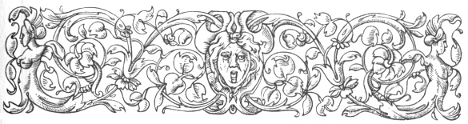
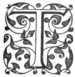

  
[Intangible Textual Heritage](../../index)  [Ancient Near
East](../index)  [Index](index)  [Previous](caog10)  [Next](caog12) 

------------------------------------------------------------------------

  
*The Chaldean Account of Genesis*, by George Smith, \[1876\], at
Intangible Textual Heritage

------------------------------------------------------------------------

p. 123

 

### CHAPTER VIII.

### THE EXPLOITS OF LUBARA.

Lubara.—God of Pestilence.—Itak.—The Plague.—Seven
warrior gods.—Destruction of people.—Anu.—Goddess of Karrak.—Speech of
Elu.—Sin and destruction of Babylonians.—Shamas.—Sin and destruction of
Erech.—Ishtar.—The great god and Duran.—Cutha.—Internal wars.—Itak goes
to Syria.—Power and glory of Lubara.—Song of Lubara.—Blessings on his
worship.—God Ner.—Prayer to arrest the Plague.

|                    |
|--------------------|
|  |

THE tablets recording this story (which I formerly called the "war of
the gods") are five in number, but I have only discovered a few
fragments of them. From the indications presented by these fragments I
believe the first four tablets had each four columns of writing, and the
fifth tablet was a smaller one of two columns to contain the remainder
of the story.

The god whose exploits are principally recorded bears a name which I
read with much hesitation as Lubara or Dabara and whom I conjecture on
some doubtful grounds to be a form of the god Ninip.

p. 124

The passages I have given in my "History of Assurbanipal" and in
"Assyrian Discoveries," pp. 339, 340, 343, serve to show that this deity
was the god of pestilence, or the personification of the plague, and the
passage in the Deluge table ("Assyrian Discoveries," p. 192, l. 20),
shows this name with the same meaning.

My reading Lubara is taken from the passage, "Cuneiform Inscriptions,"
vol. ii. p. 25, l. 13.

Lubara has a companion deity named Itak who marches before him, and
seven gods who follow him in his destructive course.

The point of the story in these tablets appears to be, that the people
of the world had offended Anu god of heaven, and that deity ordered
Lubara to go forth and strike the people with the pest. It is evident
here that exactly the same views prevailed in Babylonia as those among
the Jews, visitations from pestilence or famine being always supposed to
be sent by the deity in punishment for some sin.

The whole of this series of tablets may be described as a poetical
picture of the destruction caused by a plague, sweeping over district
after district, and destroying everything before it.

The fragment which appears to me to come first in the series is a very
mutilated portion of a tablet, containing parts of three columns of
writing. Only a fragment of the first column is perfect enough to
translate, and the characters on this are so worn that the translation
cannot be other than doubtful. It appears to read

p. 125

1\. to capture he was turned . . . .

2\. the fifth time . . . . above and below seeking

3\. seven I? say? strengthened . . . .

4\. the words of the account of the seven gods all of them Anu heard and

5\. he said? to them also to Lubara the warrior of the gods may thy hand
move

6\. like of the people of the nations their pit . . . . he will strike

7\. set thy heart also to make a destruction

8\. the people of the dark races to ruin thou shalt strike with the
desolation of the god Ner

9\. and thy weapon against their swords may thy hand move

10\. slay them and cast down their weapons.

11\. He said to Lubara do thou go and

12\. thy . . . . like an old man, thy son name? afterwards?

13\. like a slaughter in the house, name in the house,

14\. against the seat devised . . . .

15\. like in war not . . . .

This passage appears to describe the forthcoming

destruction, the god Anu commanding the slaughter. The next fragment is
of a different character, but

appears from its style to belong to this series.

1\. . . . . he. . . .

2\. . . spake to him and he . . . .

3\. . . spake to him and he learned? . . .

4\. Anu at the doing of Hea . .

p. 126

5\. the gods of heaven and earth all there were who thus answered

6\. his will which was like the will of Anu who . . .

7\. . . . . extending from the horizon of heaven to the top of heaven

8\. . . . . looked and his fear he saw

9\. . . . . Anu who hand? over him . . . . made

10\. . . . of Hea his calamity made

11\. . . . . strong to later days to . . . .

12\. . . . . sin of mankind

13\. . . . . triumphantly the net . . he broke

14\. . . . . to heaven he ascended, she thus

15\. . . . . 4,021 people he placed

16\. . . . . the illness which was on the body of the people he placed

17\. . . . . the illness the goddess of Karrak made to cease

The next portion of the legend is a considerable part of one of the
tablets, probably the fourth, all four columns of writing being
represented. There are many curious points in this tablet, beside the
special purpose of the legend, such as the peoples enumerated in the
fourth column, the action of the gods of the various cities, &c.

Column I.

1\. . . . . his . . thou dost not sweep away

2\. . . . . thou turnest his troop

3\. . . . . . . . dwelling

p. 127

4\. . . . . thou enterest within it

5\. . . . . thou callest, like a tent

6\. . . . . an appointment has not

7\. . . . . thy . . . he gathers

8\. . . . . he draws out his sword

9\. . . . . he fills his bow

10\. . . . . war is made

11\. . . . . like a bird he flies

12\. . . . . and he seeks

13\. . . . . he destroys

14\. . . . . great curse

15\. . . . . strike their hands

16\. . . . . the fire

17\. . . . . taken

18\. Elu his fierceness? covered? and

19\. in his heart he said:

20\. Lubara is couching at his gate, over the corpses of chiefs and
slaves

21\. thou placest his seat.

22\. The wicked Babylonians watched it and

23\. thou art their curse.

24\. To the floor thou tramplest them and thou didst break through . . .
.

25\. Warrior Lubara.

26\. Thou leavest also the land, thou goest out to another

27\. . . . . thou destroyest the land, thou enterest the palace.

28\. The people see thee and they reach their weapons.

p. 128

29\. The high priest the avenger of Babylon hardens his heart,

30\. like the spoiling of enemies to spoil he sends forth his soldiers.

31\. Before the face of the people they do evil violently.

32\. To that city I send thee, thou man

33\. shalt not fear, do not tremble at a man.

34\. Small and great at once cast down and

35\. . . . . of evil leaving fear? thou dost not save any one.

36\. The collection of the goods of Babylon thou spoilest,

37\. the people the king gathers, and enters the city,

38\. shaking the bow, raising the sword

39\. of the people spoiled who are punished by Anu and Dagon.

40\. Their swords thou takest,

41\. their corpses like the pouring down of rain thou dost cast down in
the vicinity of the city,

42\. and their treasures thou openest, thou dost sweep into the river.

43\. The great lord Merodach saw and angrily spoke,

44\. in his heart he resolved,

45\. on an unsparing curse his face is set,

46\. . . . . of the river fled not . . . .

p. 129

Column II.

Many lines lost.

1\. . . . . of the lord of the earth . . . .

2\. a deluge he did not make . . . .

3\. Against Shamas his tower thou destroyest thou dost cast . . . .

4\. Of Erech the seat of Anu and Ishtar

5\. the city of the ladies, Samhati and Harimati,

6\. of Ishtar. Death they fear they are delivered into thy hands.

7\. The Suti with the Suti are placed in . . . .

8\. slay the house of heaven, the priests, the festival makers,

9\. who to make the people of Ishtar fear, their manhood turn to . . . .

10\. carrying swords, carrying *naklabi*, *dupe*, and *zurri*

11\. who to raise the spirit of Ishtar trust . . . .

12\. the high priest, hardened, bows his face over them day and night?

13\. Their foundations, their countenance turn . . . .

14\. Ishtar is angry and troubled over the city of Erech,

15\. the enemies she strikes and like corn on the waters she scatters.

16\. Dwelling in his . . . . Parra . . . .

17\. he does not lead the expedition?

18\. The enemies whom thou destroyest do not return to . . . .

p. 130

19\. The great god answered the speech

20\. The city of Duran to blood . . . .

21\. the people who are in the midst of it like reeds are trembling

22\. like sick? before the waters their pit . . . .

23\. and of me thou dost not leave me

24\. to the Suti . . . . . . . . .

25\. I in my city Duran judge uprightly

26\. I do not . . . . . . . . .

27\. evil? I do not give and . . . .

28\. the upright people I leave . . . .

29\. a fire is fixed . . . .

Four other broken lines.

Column III.

Many lines lost.

1. . . . . swear and the house . . . .

2\. . . . . country and father . . . .

3\. . . . . foundation and fixed . . . .

4\. . . . . house built now . . . .

5\. this all and the portion . . . .

6\. the day he brought me fate I . . . .

7\. him, his seat also he lays waste?

8\. Afterwards may he waste to another . . . .

9\. The warrior Lubara, the just also of Kutha?

10\. and the unjust also of Kutha,

11\. who sin against thee also in Kutha,

12\. who do not sin against thee also in Kutha,

13\. . . . . of the god of Kutha,

14\. . . . . head of the king of Kutha?

Two other mutilated lines.

p. 131

Column IV.

1\. The planet Jupiter fearing and . . . .

2\. to his might . . . .

3\. not rejoicing . . . .

4\. who the side carried him, destroyed . . . .

5\. to the seat of the king of the gods may he send and . . . .

6\. The warrior Lubara heard also

7\. the words Itak spoke to him then . . . .

8\. and thus spake the warrior Lubara:

9\. The sea coast with the sea coast, Subarta with Subarta, Assyrian
with Assyrian.

10\. Elamite with Elamite

11\. Cossean with Cossean

12\. Sutu with Sutu

13\. Goim with Goim

14\. Lulubu with Lulubu

15\. Country with country, house with house, man with man,

16\. brother with brother, in the country close together, and may they
destroy each other,

17\. and afterwards may the people of Akkad increase, and

18\. the whole of them may they destroy, and fight against them.

19\. The warrior Lubara to Itak who goes before him a word spake:

20\. Go also Itak, in the word thou hast spoken do according to all thy
heart.

21\. Itak to the land of Syria set his face,

p. 132

22\. and the seven warrior gods unequalled

23\. marched after him.

24\. To the country of Syria the warrior went,

25\. his hand he also lifted and destroyed the land,

26\. the land of Syria he took for his country,

27\. the forests of people . . . . he broke through the ranks?

28\. . . . like . . . .

The next fragments of the story are on a mutilated copy of the last
tablet, K 1282. This tablet, as

I have before stated, is only a smaller supplemental one to include the
end of the story, which could not be written on the fourth tablet.

K. 1282.

Obverse.

1\. When Lubara . . . .

2\. the gods all of them . . . .

3\. the angels and spirits all . . . .

4\. Lubara his mouth opened and . . . .

5\. shake also the whole of you . . . .

6\. I am placed? and in the first sin . . . .

7\. my heart is angry and . . . .

8\. like a flock of sheep may . . . .

9\. against the setting up of boundaries . . . .

10\. like spoiling the country right and . . . .

11\. in the mouth of a dog noble?

12\. and the place . . . .

Fifteen lines much broken here.

28\. . . . . the land of Akkad its strength . . . .

p. 133

29\. one of thy seven chiefs like . . . .

30\. his cities to ruins and mounds thou dost reduce . . . .

31\. his great spoil thou dost spoil, to the midst of. . . .

32\. the gods of the country strong thou removest afar off . . . .

33\. the god Ner and . . . .

34\. the productions of the countries . . . .

35\. within it they gather . . . .

Four mutilated lines here.

Reverse.

1\. For years untold the glory of the great lord. . . .

2\. When Lubara was angry also to sweep the countries . . . .

3\. he set . . . . his face

4\. Itak his adviser quieted him and stayed . . . .

6\. collecting his . . . . to the mighty one of the gods, Merodach son
of . . . .

7\. in the commencement of the . night he sent him, and like in the year
. . . .

8\. Not any one . . . .

9\. . . . . and went not down against . . . .

10\. his . . . . also Lubara received and before . . . .

11\. . . . . Itak went before him rejoicing . . . .

12\. . . . . all of them placed with him.

13\. Any one who shall speak of the warrior Lubara

p. 134

14\. and that song shall glorify; in his place, thou wilt guard
continually . . . .

15\. . . . . cover and may he not fall? . . . . .

16\. his name shall be proclaimed over the world.

17\. Whoever my heroism shall recount,

18\. an adversary may he not meet.

19\. The prophet who shall cry it out, shall not die by the
chastisement;

20\. higher than king and prince he shall raise his people.

21\. The tablet writer who studies it and flees from the wicked, shall
be great in the land.

22\. In the places of the people the established places, my name they
proclaim,

23\. their ears I open.

24\. In the house the place where their goods are placed, when Lubara is
angry

25\. may the seven gods turn him aside,

26\. may the chastising sword not touch him whose face thou
establishest.

27\. That song for ever may they establish and may they fix the part . .
. .

28\. the countries all of them may they hear, and glorify my heroism;

29\. the people of all the cities may they see, and exalt my name.

------------------------------------------------------------------------

Fifth tablet of the exploits of . . . .

Here we see a picture of Oriental feeling with reference to natural
phenomenon or disaster to mankind.

p. 135

\[paragraph continues\] It is supposed
that some deity or angel stands with a sword over the devoted people and
sweeps them into eternity.

What these Babylonians had been guilty of the record is not perfect
enough to show. The first fragment shows the anger of Anu at their sin
or supposed sin and his command to Lubara to take his weapon, slay the
people, and desolate the land like the God Ner. This god Ner was a
legendary being believed in at the time of Izdubar, who is mentioned as
having a terrible name and being with Etana a dweller in Hades.

The next fragment exhibits the goddess of Karrak as healing the illness
of some of the people, 4102 being mentioned as struck with disease.

In the next and largest fragment the story becomes a little more
connected, it commences with a description of preparation for battle,
and goes on through speeches and actions to describe the course of
Lubara and his plague over Babylon, where he spares neither chief nor
slave, and enters even the palace. It is supposed in lines 29–31 that
the sin of the Babylonians arose from the chief priest or governor of
the city arming the troops and sending them out to plunder the people.
For this the plague is sent, and its progress is graphically described.
The next city visited belongs to Shamas, being either Larsa, or Sippara,
and then the plague reaches Erech. The character of this city is
described, the Venus worship, the women of pleasure Samhati and
Harimati, the

p. 136

priests and ceremonies, and the progress of the plague over the place.
Then the great god the deity of Duran comes forward and pleads for his
city, calling to mind its uprightness and justice, and praying its
exemption from the plague.

Cutha is next mentioned in the obscure third column, and then the fourth
column describes a prophecy of Lubara that there should be internal war
among the Mesopotamian peoples of the sea-coast, Subarti, Assyrians,
Elamites, Cosseans, Guti, Goim, and Lulubu, from all which troubles
benefit should come to the Akkadians or upper Babylonians.

Then according to his wish Lubara sends Itak his servant, with the seven
warrior gods to destroy Syria, and Itak sweeps over the country and
destroys it.

The last tablet deals in generalities pointing out the action of Lubara
when his praise was neglected, and telling all the glories and good that
should come to those who should spread a song in honour of this deity.
On the spread of a plague it is evident that the Babylonians had no
better means of arresting it than to pray and praise the supposed
terrible deity of the scourge, that he might sheathe his sword of anger.

------------------------------------------------------------------------

[Next: Chapter IX. Babylonian Fables](caog12)

