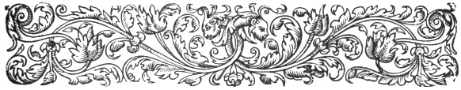
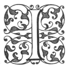

  
[Intangible Textual Heritage](../../index)  [Ancient Near
East](../index)  [Index](index)  [Previous](caog16)  [Next](caog18) 

------------------------------------------------------------------------

  
*The Chaldean Account of Genesis*, by George Smith, \[1876\], at
Intangible Textual Heritage

------------------------------------------------------------------------

p. 217

 

### CHAPTER XIV.

### THE ADVENTURES OF ISHTAR.

Triumph of Izdubar.—Ishtar's love.—Her offer of
marriage.—Her promises.—Izdubar's answer.—Tammuz.—Amours of Ishtar.—His
refusal.—Ishtar's anger.—Ascends to Heaven.—The bull.—Slain by
Izdubar.—Ishtar's curse.—Izdubar's triumph.—The feast.—Ishtar's
despair.—Her descent to Hades.—Description.—The seven gates.—The
curses.—Uddusunamir.—Sphinx.—Release of Ishtar.—Lament for
Tammuz.

|                    |
|--------------------|
|  |

IN this section I have included the sixth and seventh tablets, which
both primarily refer to the doings of Ishtar.

Tablet VI.

The sixth tablet is in better condition than any of the former ones, and
allows of something like a connected translation.

Column I.

1\. . . . . his weapon, he sharpened his weapon,

2\. Like a bull his country he ascended after him.

p. 218

3\. He destroyed him and his memorial was hidden.

4\. The country he wasted, the fastening of the crown he took.

5\. Izdubar his crown put on (the fastening of the crown he took).

6\. For the favour of Izdubar the princess Ishtar lifted her eyes:

7\. I will take thee Izdubar as husband,

8\. thy oath to me shall be thy bond,

9\. thou shalt be husband and I will be thy wife.

10\. Thou shalt drive in a chariot of ukni stone and gold,

11\. of which the body is gold and splendid its pole.

12\. Thou shalt acquire days of great conquests,

13\. to Bitani in the country where the pine trees grow.

14\. May Bitani at thy entrance

15\. to the river Euphrates kiss thy feet,

16\. There shall be under thee kings, lords, and princes.

17\. The tribute of the mountains and plains they shall bring to thee,
taxes

18\. they shall give thee, may thy herds and flocks bring forth twins,

19\. . . . . mules be swift

20\. . . . . in the chariot strong not weak

21\. . . . . in the yoke. A rival may there not be.

------------------------------------------------------------------------

p. 219

22\. Izdubar opened his mouth and spake, and

23\. said to the princess Ishtar:

24\. . . . . to thee thy possession

25\. . . . . body and rottenness

26\. . . . . baldness and famine

27\. . . . . instruments of divinity

28\. . . . . instruments of royalty

29\. . . . . storm

30\. . . . . he poured

31\. . . . . was destroyed

32\. . . . . thy possession

33\. . . . . sent in

34\. . . . after . . . . ended wind and showers

35\. palace . . . . courage

36\. beauty . . . . cover her

37\. he said . . . . carry her

38\. body glorious . . . . carry her

39\. grand . . . . tower of stone

40\. let not be placed . . . . land of the enemy

41\. body . . . . her lord

42\. let them not marry thee . . . . for ever

43\. let not praise thee . . . . he ascended

44\. I take also the torch? destroy thee

Column II.

1\. Which alone . . . . her side

2\. to Dumuzi the husband . . . . of thee,

3\. country after country mourn his love.

4\. The wild eagle also thou didst love and

p. 220

5\. thou didst strike him, and his wings thou didst break;

6\. he stood in the forest and begged for his wings.

7\. Thou didst love also a lion complete in might,

8\. thou didst draw out by sevens his claws.

9\. Thou didst love also a horse glorious in war,

10\. he poured out to the end and extent his love,

11\. After seven kaspu (fourteen hours) his love was not sweet,

12\. shaking and tumultuous was his love.

13\. To his mother Silele he was weeping for love.

14\. Thou didst love also a ruler of the country,

15\. and continually thou didst break his weapons.

16\. Every day he propitiated thee with offerings,

17\. Thou didst strike him and to a leopard thou didst change him,

18\. his own city drove him away, and

19\. his dogs tore his wounds.

20\. Thou didst love also Isullanu the husbandman of thy father,

21\. who continually was subject to thy order,

22\. and every clay delighted in thy portion.

23\. In thy taking him also thou didst turn cruel,

24\. Isullanu thy cruelty resisted,

25\. and thy hand was brought out and thou didst strike? . . . .

26\. Isullanu said to thee:

27\. To me why dost thou come

28\. mother thou wilt not be and I do not eat,

29\. of eaten food for beauty? and charms?

p. 221

30\. trembling and faintness overcome me

31\. Thou hearest this . . . .

32\. thou didst strike him, and to a pillar? thou didst change him,

33\. thou didst place him in the midst of the ground. . . .

34\. he riseth not up, he goeth not . . . .

35\. And me thou dost love, and like to them thou \[wilt serve me\].

------------------------------------------------------------------------

36\. Ishtar on her hearing this,

37\. Ishtar was angry and to heaven she ascended,

38\. and Ishtar went to the presence of Anu her father,

39\. to the presence of Anatu her mother she went and said:

40\. Father, Izdubar hates me, and

Column III.

1\. Izdubar despises my beauty,

2\. my beauty and my charms.

------------------------------------------------------------------------

3\. Anu opened his mouth and spake, and

4\. said to the princess Ishtar:

5\. My daughter thou shalt remove . . . . .

6\. and Izdubar will count thy beauty,

7\. thy beauty and thy charms.

------------------------------------------------------------------------

8\. Ishtar opened her mouth and spake, and

9\. said to Anu her father:

p. 222

10\. My father, create a divine bull and

11\. Izdubar . . . .

12\. when he is filled . . . .

13\. I will strike . . . .

14\. I will join . . . .

15\. . . . . u. . . . .

16\. over . . .

------------------------------------------------------------------------

17\. Anu opened his mouth and spake, and

18\. said to the princess Ishtar:

19\. . . . . thou shalt join . . . .

20\. . . . . of noble names

21\. . . . . *mashi* . . . .

22\. . . . . which is magnified . . . .

------------------------------------------------------------------------

23\. Ishtar opened her mouth and spake, and

24\. said to Anu her father:

25\. . . . . I will strike

26\. . . . . I will break

27\. . . . . of noble names

28\. . . . . reducer

29\. . . . . of foods

30\. . . . . of him

(Some lines lost here.)

Column IV.

(Some lines lost.)

1\. . . . . warriors

2\. . . . . to the midst

3\. . . . . three hundred warriors

p. 223

4\. . . . . to the midst

5\. . . . . slay Heabani

6\. in two divisions he parted in the midst of it

7\. two hundred warriors . . . . made, the divine bull. . .

8\. in the third division . . . . his horns

9\. Heabani struck? his might

10\. and Heabani pierced . . . . joy . . . .

11\. the divine bull by his head he took hold of . . . .

12\. the length of his tail . . . .

------------------------------------------------------------------------

13\. Heabani opened his mouth and spake, and

14\. said to Izdubar:

15\. Friend we will stretch out . . . .

16\. then we will overthrow . . . .

17\. and the might . . . .

18\. may it . . . .

(Three lines lost.)

22\. . . . . hands . . . . to Vul and Nebo

23\. . . . . *tarka* . . . . *um* . . . .

24\. . . . . Heabani took hold . . . . the divine bull

25\. . . . . he . . . . also . . . . by his tail

26\. . . . . Heabani

Column V.

1\. And Izdubar like a . . . .

2\. . . . . might and . . . .

p. 224

3\. in the vicinity of the middle of his horns and. . . .

4\. from the city he destroyed, the heart . . . .

5\. to the presence of Shamas . . . .

6\. he had extended to the presence of Shamas. . . . .

7\. he placed at the side the bulk . . . .

------------------------------------------------------------------------

8\. And Ishtar ascended unto the wall of Erech Suburi,

9\. destroyed the covering and uttered a curse:

10\. I curse Izdubar who dwells here, and the winged bull has slain.

11\. Heabani heard the speech of Ishtar,

12\. and he cut off the member of the divine bull and before her threw
it;

13\. I answer it, I will take thee and as in this

14\. I have heard thee,

15\. the curse I will turn against thy side.

16\. Ishtar gathered her maidens

17\. Samhati and Harimati,

18\. and over the member of the divine bull a. mourning she made.

19\. Izdubar called on the people . . . .

20\. all of them,

21\. and the weight of his horns the young men took,

22\. 30 manas of zamat stone within them,

23\. the sharpness of the points was destroyed,

24\. 6 gurs its mass together.

p. 225

25\. To the ark of his god Sarturda he dedicated it;

26\. he took it in and worshipped at his fire;

27\. in the river Euphrates they washed their hands,

28\. and they took and went

29\. round the city of Erech riding,

30\. and the assembly of' the chiefs of' Erech marked it.

31\. Izdubar to the inhabitants of Erech

32\. . . . . a proclamation made.

Column VI.

1\. "Any one of ability among the chiefs,

2\. Any one noble among men,

3\. Izdubar is able among the chiefs,

------------------------------------------------------------------------

4\. Izdubar is noble among men,

5\. . . . . placed hearing

6\. . . . . vicinity, not of the inhabitants

7\. . . . . him."

8\. Izdubar in his palace made a rejoicing,

9\. the chiefs reclining on couches at night,

10\. Heabani lay down, slept, and a dream he dreamed.

11\. Heabani spake and the dream he explained,

12\. and said to Izdubar.

Tablet VII.

The seventh tablet opens with the words, "Friend why do the gods take
council." I am uncertain if I have found any other portion of this
tablet, but I have provisionally placed here part of a remarkable

p. 226

fragment, with a continuation of the story of Ishtar. It appears that
this goddess, failing in her attempt in heaven to avenge herself on
Izdubar for his slight, resolved to descend to hell, to search out, if
possible, new modes of attacking him.

Columns I. and II. are lost, the fragments recommencing on column III.

Column III.

1\. . . . . people? to destroy his hand approached

2\. . . . . raise in thy presence

3\. . . . . like before

4\. . . . . Zaidu shall accomplish the wish of his heart

5\. with the female Samhat . . . . he takes

6\. . . . . thee, the female Samhat will expel thee

7\. . . . . ends and . . . . good

8\. . . . . kept by the great jailor

9\. . . . . like going down they were angry? let them weep for thee

10\. . . . goods of the house of thy fullness

11\. . . . like death . . . . of thy depression

12\. . . . . for the females

13\. . . . . let them bow

14\. . . . . sink down

15\. . . . . those who are collected

16\. . . . . she

17\. . . . . placed in thy house

18\. . . . . occupy thy seat

p. 227

19\. . . . . thy resting place

20\. . . . . thy feet

21\. . . . . may they destroy

22\. . . . . thee may they invoke

23\. . . . . hey gave

. . . . . . .

After many lines destroyed, the story recommences in the fourth column.

Column IV.

1\. \[To Hades the country unseen\] I turn myself,

2\. I spread like a bird my wings.

3\. I descend, I descend to the house of darkness, to the dwelling of
the god Irkalla:

4\. To the house entering which there is no exit,

5\. to the road the course of which never returns:

6\. To the house in which the dwellers long for light,

7\. the place where dust is their nourishment and their food mud.

8\. Its chiefs also are like birds covered with feathers

9\. and light is never seen, in darkness they dwell.

10\. In the house my friend which I will enter,

11\. for me is treasured up a crown;

12\. with those wearing crowns who from days of old ruled the earth,

13\. to whom the gods Anu and Bel have given terrible names.

14\. The food is made carrion, they drink stagnant water.

p. 228

15\. In the house my friend which I will enter,

16\. dwell the chiefs and unconquered ones,

17\. dwell the bards and great men,

18\. dwell the monsters of the deep of the great gods,

19\. it is the dwelling of Etana, the dwelling of Ner,

20\. . . . . the queen of the lower regions Ninkigal

21\. the mistress of the fields the mother of the queen of the lower
regions before her submits,

22\. and there is not any one that stands against her in her presence.

23\. I will approach her and she will see me

24\. . . . and she will bring me to her

Here the story is again lost, columns V. and VI. being absent. It is
evident that in the third column some one is speaking to Ishtar trying
to persuade her not to descend to Hades, while in the fourth column the
goddess, who is suffering all the pangs of jealousy and hate, revels in
the dark details of the description of the lower regions, and declares
her determination to go there.

There can be no doubt that this part of the legend is closely connected
with the beautiful story of the Descent of Ishtar into Hades on a tablet
which I published in the "Daily Telegraph," in fact I think that tablet
to have been an extract from this part of the Izdubar legends, and it so
closely connects itself with the story here that I give it as part of
the sequel to this tablet.

The descent of Ishtar into Hades from K.

1\. To Hades the land of . . . .

p. 229

2\. Ishtar daughter of Sin (the moon) her ear inclined;

3\. inclined also the daughter of Sin her ear,

4\. to the house of darkness the dwelling of the god Irkalla,

5\. to the house entering which there is no exit,

6\. to the road the course of which never returns,

7\. to the house which on entering it they long for light,

8\. the place where dust is their nourishment and their food mud.

9\. Light is never seen in darkness they dwell,

10\. its chiefs also are like birds covered with feathers,

11\. over the door and bolts is scattered dust.

12\. Ishtar on her arrival at the gate of Hades,

13\. to the keeper of the gate a command she called:

14\. Keeper of the waters open thy gate,

15\. open thy gate that I may enter.

16\. If thou openest not the gate and I am not admitted;

17\. I will strike the door and the door posts I will shatter,

18\. I will strike the hinges and I will burst open the doors;

19\. I will raise up the dead devourers of the living,

20\. over the living the dead shall triumph.

21\. The keeper his mouth opened and spake,

22\. and called to the princess Ishtar:

23\. Stay lady do not do this,

p. 230

24\. let me go and thy speech repeat to the queen Ninkigal.

25\. The keeper entered and called to Ninkigal:

26\. this water thy sister Ishtar . . . .

27 of the great vaults . . . .

28\. Ninkigal on her hearing this

29\. like the cutting off of . . . .

30\. like the bite of an insect it . . . .

31\. Will her heart support it, will her spirit uphold it;

32\. this water I with . . . .

33\. like food eaten like jugs of water drank . . .

34\. Let her mourn for the husbands who forsake their wives.

35\. Let her mourn for the wives who from the bosom of their husbands
depart.

36\. for the children who miscarry let her mourn, who are not born in
their proper time.

37\. Go keeper open thy gate

38\. and enclose her like former visitors.

39\. The keeper went and opened his gate,

40\. on entering lady may the city of Cutha be . .

41\. the palace of Hades is rejoicing at thy presence.

42\. The first gate he passed her through and drew her in, and he took
away the great crown of her head.

43\. Why keeper hast thou taken away the great crown of my head.

44\. On Entering lady, the goddess of the lower regions does thus with
her visitors.

45\. The second gate he passed her through and

p. 231

drew her in, and he took away the earrings of her ears.

46\. Why keeper hast thou taken away the earrings of my ears.

47\. On entering Lady, the goddess of the lower regions does thus with
her visitors.

48\. The third gate he passed her through and drew her in, and he took
away the necklace of her neck.

49\. Why keeper hast thou taken away the necklace of my neck.

50\. On entering Lady, the goddess of the lower regions does thus with
her visitors.

51\. The fourth gate he passed her through and drew her in, and he took
away the ornaments of her breast.

52\. Why keeper hast thou taken away the ornaments of my breast.

53\. On entering Lady, the goddess of the lower regions does thus with
her visitors.

54\. The fifth gate he passed her through and drew her in, and he took
away the binding girdle of her waist.

55\. Why keeper hast thou taken away the binding girdle of my waist.

56\. On entering lady, the goddess of the lower regions does thus with
her visitors.

57\. The sixth gate he passed her through and drew her in, and he took
away the bracelets of her hands and her feet.

p. 232

58\. Why keeper hast thou taken away the bracelets of my hands and my
feet.

59\. On entering lady, the goddess of the lower regions does thus with
her visitors.

60\. The seventh gate he passed her through and drew her in, and he took
away the covering cloak of her body.

61\. Why keeper hast thou taken away the covering cloak of my body.

62\. On entering lady, the goddess of the lower regions does thus with
her visitors.

63\. When a long time Ishtar to Hades had descended;

64\. Ninkigal saw her and at her presence was angry,

65\. Ishtar did not consider and at her she swore.

66\. Ninkigal her mouth opened and spake,

67\. to Simtar her attendant a command she called:

68\. Go Simtar \[take Ishtar from\] me and

69\. take her out to . . . . Ishtar

70\. diseased eyes strike her with,

71\. diseased side strike her with,

72\. diseased feet strike her with,

73\. diseased heart strike her with,

74\. diseased head strike her with,

75\. to her the whole of her \[strike with disease\].

76\. After Ishtar the lady \[to Hades had descended\],

77\. with the cow the bull would not unite, and the ass the female ass
would not approach;

78\. and the female slave would not approach the vicinity of the master.

p. 233

79\. The master ceased in his command,

80\. the female slave ceased in her gift.

Column II.

1\. Papsukul the attendant of the gods, set his face against them

2\. turned . . . . full . . . .

3\. Samas (the sun) went and in the presence of his father he wept,

4\. into the presence of Hea the king he went in tears:

5\. Ishtar to the lower regions has descended, she has not returned.

6\. When a long time Ishtar to Hades had descended,

7\. with the cow the bull would not unite, and the ass the female ass
would not approach;

8\. and the female slave would not approach the vicinity of the master.

9\. The master ceased in his command,

10\. the female slave ceased in her gift.

11\. Hea in the wisdom of his heart considered,

12\. and made Uddusu-namir the sphinx:

13\. Go Uddusu-namir towards the gates of Hades set thy face;

14\. may the seven gates of Hades be opened at thy presence;

15\. may Ninkigal see thee and rejoice at thy arrival.

p. 234

16\. That her heart be satisfied, and her anger be removed;

17\. appease her by the names of the great gods.

18\. Raise thy heads, on the flowing stream set thy mind,

19\. when command over the flowing stream shall be given, the waters in
the midst mayest thou drink.

20\. Ninkigal on her hearing this,

21\. beat her breasts and wrung her hands,

22\. she turned at this and comfort would not take:

23\. go Uddusu-namir may the great jailor keep thee,

24\. May food of the refuse of the city be thy food,

25\. May the drains of the city be thy drink,

26\. May the shadow of the dungeon be thy resting place,

27\. May a slab of stone be thy seat

28\. May bondage and want strike thy refuge

29\. Ninkigal her mouth opened and spake,

30\. to Simtar her attendant a command she called:

31\. Go Simtar strike the palace of judgment,

32\. the stone slab press upon with the pa-stone,

33\. bring out the spirit, and seat it on the golden throne.

34\. Over Ishtar pour the water of life and bring her before me.

35\. Simtar went, he struck the palace of judgment,

36\. the stone slab he pressed upon with the pa-stone,

37\. he brought out the spirit and seated it on the golden throne.

p. 235

38\. On Ishtar he poured the water of life and brought her.

39\. The first gate he passed her out of, and he restored to her the
covering cloak of her body.

40\. The second gate he passed her out of, and he restored to her the
bracelets of her hands and her feet.

41\. The third gate he passed her out of, and he restored to her the
binding girdle of her waist.

42\. The fourth gate he passed her out of, and he restored to her the
ornaments of her breast.

43\. The fifth gate he passed her out of, and he restored to her the
necklace of her neck.

44\. The sixth gate he passed her out of, and he restored to her the
earrings of her ears.

45\. The seventh gate he passed her out of, and he restored to her the
great crown of her head.

46\. When her freedom she would not grant to thee to her also turn,

47\. to Dumuzi the husband of her youth;

48\. beautiful waters pour out beautiful boxes . . . .

49\. in splendid clothing dress him, bracelets? of jewels place . . . .

50\. May Samhat appease her grief,

51\. and Belele give to her comfort.

52\. Precious stones like eyes are not . . . .

53\. her brother was slain? . . . . she struck, Belele gave her comfort.

54\. Precious stones like birds’ eyes are not better than thee,

p. 236

55\. my only brother thou didst never wrong me

56\. In the day that Dumuzi adorned me, with rings of rubies, with
bracelets of emeralds, with him adorned me,

57\. with him adorned me, men mourners and women mourners,

58\. on a bier may they raise, and gashes? may they cut?

This remarkable text shows Ishtar fulfilling her threat and descending
to Hades, but it does not appear that she accomplished her vengeance
against Izdubar yet.

At the opening of the sixth tablet we have the final scene of the
contest with Humbaba. Izdubar, after slaying. Humbaba, takes the crown
from the head of the monarch and places it on his own head, thus
signifying that he assumed the empire. There were, as we are informed in
several places, kings, lords, and princes, merely local rulers, but
these generally submitted to the greatest power; and just as they had
bowed to Humbaba, so they were ready now to submit to Izdubar. The
kingdom promised to Izdubar when he started to encounter Humbaba now
became his by right of superior force, and he entered the halls of the
palace of Erech and feasted with his heroes.

We now come to a curious part of the story, the romance of Izdubar and
Ishtar. One of the strange and dark features of the Babylonian religion
was the Ishtar or Venus worship, which was an adoration of

p. 237

the reproductive power of nature, accompanied by ceremonies which were a
reproach to the country. The city of Erech, originally a seat of the
worship of Anu, was now one of the foremost cities in this Ishtar
worship. Certainly Ishtar is represented in the legends as living at the
time, and as being the widow of Dumuzi, the ruler of Erech, and it is
possible

  [  
Click to enlarge](img/23700.jpg)  
BOWAREYEH MOUND AT WARKA (FREER), SITE OF THE TEMPLE OF ISHTAR.  

there may have been some basis for the story in a tradition of some
dissolute queen whose favour Izdubar refused; but we have to remember
that these Izdubar legends were not intended for history, but for
historical romance, and the whole story of Ishtar may be only introduced
to show the hero's opposition to this worship, or to make an attack upon
the superstition by quoting Izdubar's supposed defiance of the goddess.

p. 238

The thirteenth to sixteenth lines of the first column appear to mark out
the ultimate boundaries of the empire of Izdubar, and the limits mark
somewhere about the extent assigned to the kingdom of Nimrod by
tradition. The northern boundary was Bitani by the Armenian mountains,
the eastern boundary the mountain ranges which separated Assyria and
Babylonia from Media, and the south was the Persian Gulf, beyond which
nothing was known, and the Arabian desert, which also bounded part of
the west. On the western boundary his dominions stretched along the
region of the Euphrates, perhaps to Orfa, a city which has still
traditions of Nimrod.

In the course of the answer Izdubar gives to Ishtar, he calls to mind
the various amours of Ishtar, and I cannot avoid the impression that the
author has here typified the universal power of love, extending over
high and low, men and animals.

The subsequent lines show Ishtar obtaining from her father the creation
of a bull called "the divine bull;" this animal I have supposed to be
the winged bull so often depicted on Assyrian sculpture, but I am now
inclined to think that this bull is represented without wings. The
struggle with a bull, represented on the Babylonian cylinder, figured
here, and numerous similar representations, seem to refer to this
incident. There is no struggle with a winged bull on the Izdubar
cylinders.

It would appear from the broken fragments of column IV. that Heabani
laid hold of the bull by

p. 239

the head and tail while Izdubar killed it, and Heabani in the engraving
is represented holding the bull by its head and tail.

At the close of the sixth tablet the story is again lost, only portions
of the third and fourth columns of the next tablet being preserved, but
light is thrown on this portion of the narrative by the remarkable
tablet describing the descent of Ishtar into Hades. I think it probable
that this tablet was in great part

  [  
Click to enlarge](img/23900.jpg)  
IZDUBAR AND HEABANI IN CONFLICT WITH THE LION AND BULL.  

an extract from the seventh tablet of the Izdubar legends.

The tablet with the descent of Ishtar into Hades was first noticed by
Mr. Fox Talbot in the "Transactions of the Royal Society of Literature,"
but he was entirely abroad as to the meaning of the words. After this I
published a short notice of it in the "North British Review," to clear
up some of the difficulties, and it has been subsequently translated by
Lenormant and Oppert, and re-translated by Mr. Fox Talbot. These
translations and various notices

p. 240

of the Deluge tablets will be found in "Les Premières Civilisations" of
Francois Lenormant, Paris, 1874, a small pamphlet on the Descent of
Ishtar, by Professor Oppert, and various papers on these subjects by Mr.
Fox Talbot, in the "Transactions of the Society of Biblical Archæology,"
vols. i., ii., and iii., and my own translation in the "Daily
Telegraph," August 19, 1873.

The story of the descent of Ishtar into Hades is one of the most
beautiful myths in the Assyrian inscriptions; it has, however, received
so much attention, and been so fully commented upon by various scholars,
that little need be said on the subject here.

It is evident that we are dealing with the same goddess as the Ishtar,
daughter of Anu, in the Izdubar legends, although she is here called
daughter of Sin (the moon god) .

The description of the region of Hades is most graphic, and vividly
portrays the sufferings of the prisoners there; but there are several
difficulties in the story, as there is no indication in some cases as to
who acts or speaks. Uddusu-namir, created by Hea to deliver Ishtar, is
described as a composite animal, half bitch and half man, with more than
one head, and appears to correspond, in some respects, to the Cerberus
of the classics, which had three heads according to some, fifty heads
according to others.

The latter part of the tablet is obscure, and appears to refer to the
custom of lamenting for Dumuzi or Tammuz.

------------------------------------------------------------------------

[Next: Chapter XV. Illness and Wanderings of Izdubar](caog18)

