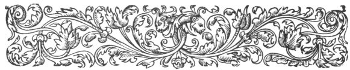

  
[Intangible Textual Heritage](../../index)  [Ancient Near
East](../index)  [Index](index)  [Previous](caog19)  [Next](caog21) 

------------------------------------------------------------------------

  
*The Chaldean Account of Genesis*, by George Smith, \[1876\], at
Intangible Textual Heritage

------------------------------------------------------------------------

p. 295

 

### CHAPTER XVII.

### CONCLUSION.

Notices of Genesis.—Correspondence of
names.—Abram.—Ur of Chaldees.—Ishmael.—Sargon.—His birth.—Concealed in
ark.—Age of Nimrod.—Doubtful theories.—Creation.—Garden of
Eden.—Oannes.—Berosus.—Izdubar legends.—Urukh of Ur.—Babylonian
seals.—Egyptian names.—Assyrian sculptures.

|                    |
|--------------------|
|  |

SCATTERED through various cuneiform inscriptions are other notices,
names, or passages, connected with the Book of Genesis. Although the
names of the Genesis patriarchs are not in the inscriptions giving the
history of the mythical period, the corresponding personages being, as I
have shown ([p. 290](caog19.htm#page_290)), all under different names,
yet some of these Genesis patriarchal names are found detached in the
inscriptions.

The name Adam is in the Creation legends, but only in a general sense as
man, not as a proper name. Several of the other names of antediluvian
patriarchs correspond with Babylonian words and roots, such as Cain with
gina and kinu, to "stand upright," to be

p. 296

\[paragraph continues\] "right," Enoch
with Emuk or Enuk, "wise," and Noah with nuh, "rest," or "satisfaction;"
but beyond these some of the names appear as proper names also in
Babylonia, and among these are Cainan, Lamech, and Tubal Cain.

Cainan is found as the name of a Babylonian town Kan-nan; the meaning
may be "fish canal," its people were- sometimes called Kanunai or
Canaanites, the same name as that of the original inhabitants of
Palestine. In early times tribes often migrated and carried their
geographical names to their new homes; it is possible that there was
some connection of this sort between the two Canaans.

Lamech has already been pointed out by Palmer ("Egyptian Chronicles,"
vol. i. p. 56), in the name of the Deified Phoenician patriarch Diamich;
this name is found in the cuneiform texts as Dumugu and Lamga, two forms
of a name of the moon.

Tubal Cain, the father or instructor of all metal workers, has been
compared with the name of Vulcan, the god of smiths, the two certainly
corresponding both in name and character. The corresponding deity in
Babylonian mythology, the god of fire, melter of metals, &c., has a name
formed of two characters which read Bil-kan.

Some of the names of patriarchs after the Flood are found as names of
towns in Syria, but not in Babylonia; among these are Reu or Ragu,
Serug, and Harran.

The name of Abramu or Abram, called no doubt

p. 297

after the father of the faithful, is found in the Assyrian inscriptions
in the time of Esarhaddon. After the captivity of the ten tribes, some
of the Israelites prospered in Assyria, and rose to positions of trust
in the empire. Abram was one of these, he was sukulu rabu or "great
attendant" of Esarhaddon, and was eponym in Assyria, B.C. 677. Various
other

  [  
Click to enlarge](img/29700.jpg)  
MUGHEIR, THE SITE OF UR OF THE CHALDEES.  

\[paragraph continues\] Hebrew names are
found in Assyria about this time, including Pekah, Hoshea, and several
compounded with the two Divine names Elohim and Jehovah, showing that
both these names were in use among the Israelites. The presence of
proper names founded on the Genesis stories, like Abram, and the use at
this time of these forms of the Divine name, should be taken into
consideration in discussing the evidence of the antiquity of Genesis.

p. 298

It is a curious fact that the rise of the kingdom of Ur (cir. B.C. 2000
to 1850) coincides with the date generally given for the life of
Abraham, who is stated (Genesis xi. 31) to have come out of Ur of the
Chaldees, by which title I have no doubt the Babylonian city of Ur is
meant. There is not the slightest evidence of a northern Ur and a
northern land o the Chaldees at this period.

Some of the other Genesis names are found very much earlier, the first
which appears on a contemporary monument being Ishmael. In the reign of
Hammurabi, king of Babylonia, about B.C. 1550, among the witnesses to
some documents at Larsa in Babylonia, appears a man named "Abuha son of
Ishmael." This period in Babylonia is supposed to have been one of
foreign and Arabian dominion, and other Hittite and Arabian names are
found in the inscriptions of the time.

In the Babylonian records we might expect to find some notice of the
wars of Chedorlaomer, king of Elam, mentioned in Genesis xiv. Now
although evidence has been found confirming the existence of a powerful
monarchy in Elam at this age, and satisfactory proof of the correctness
of the proper names mentioned in this chapter, no direct record of these
conquests has been discovered, but we must remember that our knowledge
of Babylonian history is yet in its infancy, and even the outlines of
the chronology are unknown.

After the time of Abraham the book of Genesis is

p. 299

concerned with the affairs of Palestine, and of the countries in its
immediate vicinity, and it has no connection with Babylonian history and
traditions; there remains, however, one story which has a striking
likeness to that of Moses in the ark, and which, although not within the
period covered by Genesis, is of great interest in connection with the
early history of the Jews.

Sargina or Sargon I. was a Babylonian monarch who reigned at the city of
Akkad about B.C. 1600. The name of Sargon signifies the right, true, or
legitimate king, and may have been assumed on his ascending the throne.
Sargon was probably of obscure origin, and desiring to strengthen his
claim to the throne put out the story given in this tablet to connect
himself with the old line of kings. This curious story is found on
fragments of tablets from Kouyunjik, and reads as follows:

1\. Sargina the powerful king the king of Akkad am I.

2\. My mother was a princess, my father I did not know, a brother of my
father ruled over the country.

3\. In the city of Azupiranu which by the side of the river Euphrates is
situated

4\. my mother the princess conceived me; in difficulty she brought me
forth

5\. She placed me in an ark of rushes, with bitumen my exit she sealed
up.

6\. She launched me on the river which did not drown me.

p. 300

7\. The river carried me, to Akki the water carrier it brought me.

8\. Akki the water carrier in tenderness of bowels lifted me;

9\. Akki the water carrier as his child brought me up,

10\. Akki the water carrier as his husbandman placed me,

11\. and in my husbandry Ishtar prospered me.

12\. 45? years the kingdom I have ruled,

13\. the people of the dark races I governed,

14\. . . . . over rugged countries with chariots of bronze I rode,

15\. I govern the upper countries

16\. I rule? over the chiefs of the lower countries

17\. To the sea coast three times I advanced, Dilmun submitted,

18\. Durankigal bowed, &c. &c.

After this follows an address to any king who should at a later time
notice the inscription.

This story is supposed to have happened about B.C. 1600, rather earlier
than the supposed age of Moses; and, as we know that the fame of Sargon
reached Egypt, it is quite likely that this account had a connection
with the events related in Exodus ii., for every action, when once
performed, has a tendency to be repeated.

In the body of my present work I have given the various fragments of the
Legends describing the Creation, Flood, time of Nimrod, &c.; and I have

p. 301

indicated, as well as I can at present, the grounds for my present
conclusions respecting them, and what are their principal points of
contact with the Bible narrative of Genesis.

I have also put forward some theories to account for various
difficulties in the stories, and to connect together the fragmentary
accounts.

The most hazardous of these theories is the one which makes Izdubar or
Nimrod reign in the middle of the twenty-third century before the
Christian era. I have founded this theory on several plausible, but
probably merely superficial grounds; and if any one accepts my view on
this point, it will be only for similar reasons to those which caused me
to propose it; namely, because, failing this, we have no clue whatever
to the age and position of the most famous hero in Oriental tradition.

I never lose sight myself of the fact, that apart from the more perfect
and main parts of these texts, both in the decipherment of the broken
fragments and in the various theories I have projected respecting them,
I have changed my own opinions many times, and I have no doubt that any
accession of new material would change again my views respecting the
parts affected by it. These theories and conclusions, however, although
not always correct, have, on their way, assisted the inquiry, and have
led to the more accurate knowledge of the texts; for certainly in
cuneiform matters we have often had to advance through error to truth.

p. 302

In my theory for the position of Nimrod, one thing is certainly clear: I
have placed him as low in the chronology as it is possible to make him.

Making the date of Nimrod so recent as B.C. 2250, I have only left from
200 to 250 years between his time and the age of the oldest known
monuments. Looking at the fact that it is highly probable that these
legends were written about B.C. 2000, the intervening period of two
centuries does not appear too great. I think it probable that the
traditions on which these legends were founded arose shortly after the
death of Izdubar; in fact, I think that every tradition which has any
foundation in fact springs up within a generation of the time when the
circumstances happened. With regard to the supernatural element
introduced into the story, it is similar in nature to many such
additions to historical narratives, especially in the East; but I would
not reject those events which may have happened, because in order to
illustrate a current belief; or add to the romance of the story, the
writer has introduced the supernatural.

There is, I think, now too general a tendency to repudiate the earlier
part of history, because of its evident inaccuracies and the marvellous
element generally combined with it. The early poems and stories of
almost every nation are, by some writers, resolved into elaborate
descriptions of natural phenomena; and in some cases, if this were true,
the

p. 303

myth would have taken to create it a genius as great as that of the
philosophers who explain it.

The stories and myths given in the foregoing pages have, probably, very
different values; some are genuine traditions—some compiled to account
for natural phenomena, and some pure romances. At the head of their
history and traditions the Babylonians placed an account of the creation
of the world; and, although different forms of this story were current,
in certain features they all agreed. Beside the account of the present
animals, they related the creation of legions of monster forms which
disappeared before the human epoch, and they accounted for the great
problem of humanity—the presence of evil in the world—by making out that
it proceeded from the original chaos, the spirit of confusion and
darkness, which was the origin of all things, and which was even older
than the gods.

The principal Babylonian story of the Creation, given in Chapter V.,
substantially agrees, as far as it is preserved, with the Biblical
account. According to it, there was a chaos of watery matter before the
Creation, and from this all things were generated.

We have then a considerable blank, the contents of which we can only
conjecture, and after this we come to the creation of the heavenly orbs.

The fifth tablet in the series relates how God created the
constellations of the stars, the signs of the zodiac, the planets or
wandering stars, the moon and tine sun. After another blank we have a
fragment,

p. 304

the first I recognized which relates the creation of wild and domestic
animals; it is curious here that the original taming of domestic animals
was even then so far back that all knowledge of it was lost, and the
"animals of the city," or domestic animals, were considered different
creations to the "animals of the desert," or wild animals.

Our next fragments refer to the creation of mankind, called Adam, as in
the Bible; he is made perfect, and instructed in his various religious
duties, but afterwards he joins with the dragon of the deep, the animal
of Tiamat, the spirit of chaos, and offends against his god, who curses
him, and calls down on his head all the evils and troubles of humanity.

This is followed by a war between the dragon and powers of evil, or
chaos on one side and the gods on the other. The gods have weapons
forged for them, and Merodach undertakes to lead the heavenly host
against the dragon. The war, which is described with spirit, ends of
course in the triumph of the principles of good, and so far as I know
the Creation tablets end here.

In Chapter V. I have given as far as possible translations and comments
on these texts, and to meet the requirements of those who desire to
study them in the cuneiform character I have arranged to publish copies
of the principal fragments of the Creation tablets in the "Transactions
of the Society of Biblical Archæology."

p. 305

The fragments I have selected for this purpose are:—

I. Fragment of the first tablet, describing the chaos at the beginning
of the world.

II\. Fragment of the fifth tablet, describing the creation of the
heavenly bodies.

III\. Obverse and reverse of the tablet, describing the fall of man.

IV\. Obverse and reverse of the principal fragment, describing the
conflict between the gods and the spirit of chaos.

Besides this account of the Creation I have given other fragments
bearing upon the same events, these differing considerably from the
longer account. The principal feature in the second account is the
description of the eagle-headed men with their family of leaders—this
legend clearly showing the origin of the eagle-headed figures
represented on the Assyrian sculptures.

It is probable that some of these Babylonian legends contained detailed
descriptions of the Garden of Eden, which was most likely the district
of Karduniyas, as Sir Henry Rawlinson believes.

There are coincidences in respect to the geography of the region and its
name which render the identification very probable; the four rivers in
each case, two, the Euphrates and Tigris, certainly identical, the known
fertility of the region, its name, sometimes Gan-dunu, so similar to
Gan-eden (the Garden of Eden), and other considerations, all tend

p. 306

towards the view that it is the Paradise of Genesis.

There are evidences of the belief in the tree of life, which is one of
the most common emblems on the seals and larger sculptures, and is even
used as an ornament on dresses; a sacred tree is also several times
mentioned in these legends, but at present there is no direct connection
known between the tree and the Fall, although the gem engravings render
it very probable that there was a legend of this kind like the one in
Genesis.

In the history of Berosus mention is made of a composite being, half
man, half fish, named Oannes, who was supposed to have appeared out of
the sea and to have taught to the Babylonians all their learning. The
Babylonian and Assyrian sculptures have made us familiar with the figure
of Oannes, and have so far given evidence that Berosus has truly
described this mythological figure, but it is a curious fact that the
legend of Oannes, which must have been one of the Babylonian stories of
the Creation, has not yet been recovered.

Besides this, there are evidently many stories of early times still
unknown, or only known by mere fragments or allusions.

The fables which I have given in Chapter IX. form a series now appearing
to be separate from the others, and my only excuse for inserting them
here was my desire to exhibit as clearly and fully as possible the
literature of the great epoch which produced the Genesis tablets.

p. 307

Most of the other stories, so far as I can judge, are fixed to the great
period before the Flood, when celestial visitors came backwards and
forwards to the earth, and the inhabitants of the world were very
clearly divided into the good and bad, but the stories are only fables
with a moral attached, and have little connection with Babylonian
history.

Two of these stories are very curious, and may hereafter turn out of
great importance; one is the story of the sin committed by the god Zu,
and the other the story of Atarpi.

Berosus in his history has given an account of ten Chaldean kings who
reigned before the Flood, and the close of this period is well known
from the descriptions of the Deluge in the Bible, the Deluge tablet, and
the work of Berosus. According to Berosus several of the Babylonian
cities were built before the Flood, and various arts were known,
including writing. The enormous reigns given by Berosus to his ten
kings, making a total of 432,000 years, force us to discard the idea
that the details are historical, although there may be some foundation
for his statement of a civilization before the Deluge. The details given
in the inscriptions describing the Flood leave no doubt that both the
Bible and the Babylonian story describe the same event, and the Flood
becomes the starting point for the modern world in both histories.
According to Berosus 86 kings reigned for 34,080 years after the Flood
down to the Median conquest. If these kings are historical, it is
doubtful if they formed a continuous line, and they could scarcely cover
a longer

p. 308

period than 1,000 years. The Median or Elamite conquest took place about
B.C. 2450, and, if we allow the round number 1,000 years for the
previous period, it will make the Flood fall about B.C. 3500. In a
fragmentary inscription with a list of Babylonian kings, some names are
given which appear to belong to the 86 kings of Berosus, but our
information about this period is so scanty that nothing can be said
about this dynasty, and a suggestion as to the date of the Deluge must
be received with more than the usual grain of salt.

We can see, however, that there was a civilized race in Babylonia before
the Median Conquest, the progress of which must have received a rude
shock when the country was overrun by the uncivilized Eastern borderers.

Among the fragmentary notices of this period is the portion of the
inscription describing the building of the Tower of Babel and the
dispersion, unfortunately too mutilated to make much use of it.

It is probable from the fragments of Berosus that the incursions and
dominion of the Elamites lasted about two hundred years, during which
the country suffered very much from them.

I think it probable that Izdubar, or Nimrod, owed a great portion of his
fame in the first instance to his slaying Humbaba, and that he readily
found the means of uniting the country under one sceptre, as the people
saw the evils of disunion, which weakened them and laid them open to
foreign invasion.

p. 309

The legends of Izdubar or Nimrod commence with a description of the
evils brought upon Babylonia by foreign invasion, the conquest and
sacking of the city of Erech being one of the incidents in the story.
Izdubar, a famous hunter, who claimed descent from a long line of kings,
reaching up to the time of the Flood, now comes forward; he has a dream,
and after much trouble a hermit named Heabani is persuaded by Zaidu, a
hunter, and two females, to come to Erech and interpret the dream of
Izdubar. Heabani, having heard the fame of Izdubar, brings to Erech a
midannu or tiger to test his strength, and Izdubar slays it. After these
things, Izdubar and Heabani become friends, and, having invoked the
gods, they start to attack Humbaba, an Elamite, who tyrannized over
Babylonia. Humbaba dwelt in a thick forest, surrounded by a wall, and
here he was visited by the two friends, who slew him and carried off his
regalia.

Izdubar was now proclaimed king, and extended his authority from the
Persian Gulf to the Armenian mountains, his court and palace being at
Erech. Ishtar, called Nana and Uzur-amatsa, the daughter according to
some authorities of Anu, according to others of Elu or Bel, and
according to others of Sin, the moon god, was widow of Dumuzi, a *rihu*
or ruler. She was queen and goddess of Erech, and fell in love with
Izdubar, offering him her hand and kingdom. He refused, and the goddess,
angry at his answer, ascended to heaven and petitioned her father Anu to
create a bull for her, to be an instrument of her

p. 310

vengeance against Izdubar. Anu complied, and created the bull, on which
Izdubar and Heabani collected a band of warriors and went against it.
Heabani took hold of the animal by its head and tail, while Izdubar slew
it.

Ishtar on this cursed Izdubar, and descended to Hell or Hades to attempt
once more to summon unearthly powers against Izdubar. She descends to
the infernal regions, which are vividly described, and, passing through
its seven gates, is ushered into the presence of the queen of the dead.
The world of love goes wrong in the absence of Ishtar, and on the
petition of the gods she is once more brought to the earth, ultimately
Anatu, her mother, satisfying her vengeance by striking Izdubar with a
loathsome disease.

Heabani, the friend of Izdubar, is now killed, and Izdubar, mourning his
double affliction, abandons his kingdom and wanders into the desert to
seek the advice of Hasisadra his ancestor, who had been translated for
his piety and now dwelt with the gods.

Izdubar now had a dream, and after this wandered to the region where
gigantic composite monsters held and controlled the rising and setting
sun, from these learned the road to the region of the blessed, and,
passing across a great waste of sand, he arrived at a region where
splendid trees were laden with jewels instead of fruit.

Izdubar then met two females, named Siduri and Sabitu, after an
adventure with whom he found a

p. 311

boatman named Ur-hamsi, who undertook to navigate him to the region of
Hasisadra.

Coining near the dwelling of the blessed, he found it surrounded by the
waters of death, which he had to cross in order to reach the region.

On arriving at the other side, Izdubar was met by one Ragmu, who engaged
him in conversation about Heabani, and then Hasisadra, taking up the
conversation, described to him the Deluge. Izdubar was afterwards cured
of his illness and returned with Urhamsi to Erech, where he mourned anew
for his friend Heabani, and on intercession with the gods the ghost of
Heabani arises from the ground where the body had lain.

The details of this story, and especially the accounts of the regions
inhabited by the dead, are very striking, and illustrate, in a wonderful
manner, the religious views of the people.

It is probable that Izdubar was, as I have already stated, Nimrod, and
that he commenced his life as a hunter, afterwards delivering his
country from foreign dominion, and slaying the usurper.

He then extended his empire into Assyria, which he colonized, and
founded Nineveh. The empire founded by Nimrod probably fell to pieces at
his death; but the Assyrian colonies grew into a powerful state, and
after a brief period, Babylonia revived under Urukh, king of Ur, with
whom commenced the monumental era.

Here the legendary and traditional age ends, and

p. 312

about this time the stories appear to have been committed to writing.

It is worth while here to pause, and consider the evidence of the
existence of these legends from this time down to the seventh century
B.C.

We have first the seals: of these there are some hundreds in European
museums, and among the earliest are many specimens carved with scenes
from the Genesis legends; some of these are probably older than B.C.
2000, others may be ranged at various dates down to B.C. 1500.

The specimens engraved in pp. [39](caog06.htm#page_39),
[91](caog08.htm#page_91), [95](caog08.htm#page_95),
[100](caog08.htm#page_100), [158](caog13.htm#page_158),
[159](caog13.htm#page_159), [188](caog14.htm#page_188),
[239](caog17.htm#page_239), [257](caog18.htm#page_257),
[262](caog18.htm#page_262), [283](caog19.htm#page_283) are from
Babylonian seals, while those in pp. [41](caog06.htm#page_41),
[89](caog08.htm#page_89), [99](caog08.htm#page_99) are from Assyrian
seals. One very fine and early example is photographed as the
frontispiece of the present work. The character and style of the
cuneiform legend which accompanies this shows it to be one of the most
ancient specimens; it is engraved on a hard jasper cylinder in bold
style, and is a remarkable example of early Babylonian art. Many other
similar cylinders of the same period are known; the relief on them is
bolder than on the later seals, on which from about B.C. 1600 or 1700, a
change in the inscriptions becomes general.

The numerous illustrations to the present work, which I have collected
from these early Babylonian seals, will serve to show the fact that the
legends were at that time well known, and part of the literature of the
country.

p. 313

There is another curious illustration of the legends of Izdubar in the
tablet printed, p. 46 of "Cuneiform Inscriptions," vol. ii. Our copy of
this tablet is dated in the seventh century B.C.; but the geographical
notices on it show that the original must have been written during the
supremacy of the city of Ur, between B.C. 2000 and 1850. In this tablet
Surippak is called the ark city, and mention is made of the ship of
Izdubar, showing a knowledge of the story of his voyage to find
Hasisadra.

After B.C. 1500, the literature of Babylonia is unknown, and we lose
sight of all evidence of these legends for some centuries. In the
meantime Egypt supplies a few notices bearing on the subject, which
serve to show that knowledge of them was still kept up. Nearly thirteen
hundred years before the Christian era one of the Egyptian poems likens
a hero to the Assyrian chief, Kazartu, a great hunter. Kazartu probably
means a "strong," "powerful," one, and it has already been suggested
that the reference here is to the fame of Nimrod. A little later, in the
period B.C. 1100 to 800, we have in Egypt many persons named after
Nimrod, showing a knowledge of the mighty hunter there.

On the revival of the Assyrian empire, about B.C. 990, we come again to
numerous references to the Genesis legends, and these continue through
almost every reign down to the close of the empire. The Assyrians carved
the sacred tree and cherubims on their walls, they depicted in the
temples the struggle

p. 314

between Merodach and the dragon, the figure of Oannes and the
eagle-headed man, they decorated their portals with figures of Nimrod
strangling a lion, and carved the struggles of Nimrod and Heabani with
the lion and the bull even on their stone vases.

Just as the sculptures of the Greek temples, the paintings on the vases
and the carving on their gems were taken from their myths and legends,
so the series of myths and legends belonging to the valley of the
Euphrates furnished materials for the sculptor, the engraver, and the
painter, among the ancient Babylonians and Assyrians.

In this way we have continued evidence of the existence of these legends
down to the time of Assurbanipal, B.C. 673 to 626, who caused the
present known copies to be made for his library at Nineveh.

Search in Babylonia would, no doubt, yield much earlier copies of all
these works, but that search has not yet been instituted, and for the
present we have to be contented with our Assyrian copies. Looking,
however, at the world-wide interest of the subjects, and at the
important evidence which perfect copies of these works would undoubtedly
give, there can be no doubt that the subject of further search and
discovery will not slumber, and that all I have here written will one
day be superseded by newer texts and fuller and more perfect light.

------------------------------------------------------------------------

[Next: Index](caog21)

