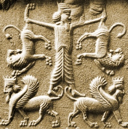

  
[Intangible Textual Heritage](../../index)  [Ancient Near
East](../index) 

------------------------------------------------------------------------

<table width="75%">
<colgroup>
<col style="width: 50%" />
<col style="width: 50%" />
</colgroup>
<tbody>
<tr class="odd">
<td width="50%" data-valign="TOP"></td>
<td width="50%" data-valign="CENTER"><h1 id="the-epic-of-gilgamish" data-align="CENTER">The Epic of Gilgamish</h1>
<h2 id="tr.-by-r.-campbell-thompson" data-align="CENTER">tr. by R. Campbell Thompson</h2>
<h4 id="section" data-align="CENTER">[1928]</h4></td>
</tr>
</tbody>
</table>

------------------------------------------------------------------------

[Contents](#contents)    [Start Reading](eog00)

------------------------------------------------------------------------

This is one of the first essentially complete academic translations of
the epic of Gilgamesh. It includes all of the principal episodes of the
epic: the wild man Enkidu; the battle with Humbaba, the cedar forest
demon; the death of Enkidu, the journey of Gilgamesh to find the secret
of eternal life, in the course of which he encounters the Babylonian
Noah, Uta-Napishtim, and hears the story of the great flood.

Oxford trained Thompson (1876-1941), was an Assyriologist associated
with the British Museum. He was a teacher both of T.E. Lawrence and Max
Mallowan, husband of Agatha Cristie. He excavated at Ur, Ninevah and
Carchemish.

While often cited, this book is almost never seen. This work is long out
of print (in fact it has never been reprinted) and extremely rare, even
in libraries. However, it has a huge significance because it is one of
the baseline translations of Gilgamesh. Because of its date of
publication, under US copyright law it is formally still under
copyright. Since there was no copyright notice in the original, the US
copyright lasts for 70 years following the death of the author (i.e.,
2011). We have attempted to locate the current copyright holder with no
success. If one comes forward and requests that this electronic text be
removed, it will be taken down without notice.

------------------------------------------------------------------------

 [Title Page](eog00)  
[Preface](eog01)  
[Addenda et Corrigenda](eog02)  
[The First Tablet: Of the Tyranny of Gilgamish, and the Creation of
Enkidu](eog03)  
[The Second Tablet: Of the Meeting of Gilgamish and Enkidu](eog04)  
[The Third Tablet: The Expedition to the Forest of Cedars against
Humbaba](eog05)  
[The Fourth Tablet: The Arrival at the Gate of the Forest](eog06)  
[The Fifth Tablet: Of the Fight with Humbaba](eog07)  
[The Sixth Tablet: Of the Goddess Ishtar, Who Fell In Love With the Hero
After His Exploit Against Humbaba](eog08)  
[The Seventh Tablet: The Death of Enkidu](eog09)  
[The Eighth Tablet: Of the Mourning of Gilgamish, and What Came of
It](eog10)  
[The Ninth Tablet: Gilgamish In Terror of Death Seeks Eternal
Life](eog11)  
[The Tenth Tablet: How Gilgamish Reached Uta-Napishtim](eog12)  
[The Eleventh Tablet: The Flood](eog13)  
[The Twelfth Tablet: Gilgamish, In Despair, Enquires of the
Dead](eog14)  
