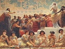

  
[Intangible Textual Heritage](../../index)  [Ancient Near
East](../index)  [Index](index)  [Previous](mba06)  [Next](mba08) 

------------------------------------------------------------------------

[Buy this Book on
Kindle](https://www.amazon.com/exec/obidos/ASIN/B002GYVU7A/internetsacredte)

------------------------------------------------------------------------

  
*Myths of Babylonia and Assyria*, by Donald A. MacKenzie, \[1915\], at
Intangible Textual Heritage

------------------------------------------------------------------------

p. 1 

# MYTHS OF BABYLONIA AND ASSYRIA

### CHAPTER I

### The Races and Early Civilization of Babylonia

Prehistoric Babylonia--The Confederacies of Sumer
and Akkad--Sumerian Racial Affinities--Theories of Mongolian and
Ural-Altaic Origins--Evidence of Russian Turkestan--Beginnings of
Agriculture--Remarkable Proofs from Prehistoric Egyptian
Graves--Sumerians and the Mediterranean Race--Present-day Types in
Western Asia--The Evidence of Crania--Origin of the Akkadians--The
Semitic Blend--Races in Ancient Palestine--Southward Drift of Armenoid
Peoples--The Rephaims of the Bible--Akkadians attain Political Supremacy
in Northern Babylonia--Influence of Sumerian Culture--Beginnings of
Civilization--Progress in the Neolithic Age--Position of Women in Early
Communities--Their Legal Status in Ancient Babylonia--Influence in
Social and Religious Life--The "Woman's Language"--Goddess who inspired
Poets.

BEFORE the dawn of the historical period Ancient Babylonia was divided
into a number of independent city states similar to those which existed
in pre-Dynastic Egypt. Ultimately these were grouped into loose
confederacies. The northern cities were embraced in the territory known
as Akkad, and the southern in the land of Sumer, or Shumer. This
division had a racial as well as a geographical significance. The
Akkadians were

p. 2

\[paragraph continues\] "late corners" who
had achieved political ascendency in the north when the area they
occupied was called Uri, or Kiuri, and Sumer was known as Kengi. They
were a people of Semitic speech with pronounced Semitic affinities. From
the earliest times the sculptors depicted them with abundant locks, long
full beards, and the prominent distinctive noses and full lips, which we
usually associate with the characteristic Jewish type, and also attired
in long, flounced robes, suspended from their left shoulders, and
reaching down to their ankles. In contrast, the Sumerians had
clean-shaven faces and scalps, and noses of Egyptian and Grecian rather
than Semitic type, while they wore short, pleated kilts, and went about
with the upper part of their bodies quite bare like the Egyptian
noblemen of the Old Kingdom period. They spoke a non-Semitic language,
and were the oldest inhabitants of Babylonia of whom we have any
knowledge. Sumerian civilization was rooted in the agricultural mode of
life, and appears to have been well developed before the Semites became
numerous and influential in the land. Cities had been built chiefly of
sun-dried and fire-baked bricks; distinctive pottery was manufactured
with much skill; the people were governed by humanitarian laws, which
formed the nucleus of the Hammurabi code, and had in use a system of
cuneiform writing which was still in process of development from earlier
pictorial characters. The distinctive feature of their agricultural
methods was the engineering skill which was displayed in extending the
cultivatable area by the construction of irrigating canals and ditches.
There are also indications that they possessed some knowledge of
navigation and traded on the Persian Gulf. According to one of their own
traditions Eridu, originally a seaport, was their racial cradle. The
Semitic Akkadians adopted the distinctive culture of

 

  [  
Click to enlarge](img/00200.jpg)  
EXAMPLES OF RACIAL TYPES  
From a drawing by E. Wallcousins  

 

p. 3

these Sumerians after settlement, and exercised an influence on its
subsequent growth.

Much controversy has been waged regarding the original home of the
Sumerians and the particular racial type which they represented. One
theory connects them with the lank-haired and beardless Mongolians, and
it is asserted on the evidence afforded by early sculptural reliefs that
they were similarly oblique-eyed. As they also spoke an agglutinative
language, it is suggested that they were descended from the same parent
stock as the Chinese in an ancient Parthian homeland. If, however, the
oblique eye was not the result of faulty and primitive art, it is
evident that the Mongolian type, which is invariably found to be
remarkably persistent in racial blends, did not survive in the Tigris
and Euphrates valleys, for in the finer and more exact sculpture work of
the later Sumerian period the eyes of the ruling classes are found to be
similar to those of the Ancient Egyptians and southern Europeans. Other
facial characteristics suggest that a Mongolian racial connection is
highly improbable; the prominent Sumerian nose, for instance, is quite
unlike the Chinese, which is diminutive. Nor can far-reaching
conclusions be drawn from the scanty linguistic evidence at our
disposal. Although the languages of the Sumerians and long-headed
Chinese are of the agglutinative variety, so are those also which are
spoken by the broad-headed Turks and Magyars of Hungary, the
broad-headed and long-headed, dark and fair Finns, and the brunet and
short-statured Basques with pear-shaped faces, who are regarded as a
variation of the Mediterranean race with distinctive characteristics
developed in isolation. Languages afford no sure indication of racial
origins or affinities.

Another theory connects the Sumerians with the

p. 4

broad-headed peoples of the Western Asian plains and plateaus, who are
vaguely grouped as Ural-Altaic stock and are represented by the
present-day Turks and the dark variety of Finns. It is assumed that they
migrated southward in remote times in consequence of tribal pressure
caused by changing climatic conditions, and abandoned a purely pastoral
for an agricultural life. The late Sumerian sculpture work again
presents difficulties in this connection, for the faces and bulging
occiputs suggest rather a long-headed than a broad-headed type, and the
theory no longer obtains that new habits of life alter skull forms which
are usually associated with other distinctive traits in the structure of
skeletons. These broad-headed nomadic peoples of the Steppes are allied
to Tatar stock, and distinguished from the pure Mongols by their
abundance of wavy hair and beard. The fact that the Sumerians shaved
their scalps and faces is highly suggestive in this connection. From the
earliest times it has been the habit of most peoples to emphasize their
racial characteristics so as to be able, one may suggest, to distinguish
readily a friend from a foeman. At any rate this fact is generally
recognized by ethnologists. The Basques, for instance, shave their
pointed chins and sometimes grow short side whiskers to increase the
distinctive pear-shape which is given to their faces by their prominent
temples. In contrast, their neighbours, the Andalusians, grow chin
whiskers to broaden their already rounded chins, and to distinguish them
markedly from the Basques. [1](#fn_11) Another
example of similar character is afforded in Asia Minor, where the skulls
of the children of long-headed Kurds are narrowed, and those of the
children of broad-headed Armenians made flatter behind as a result of
systematic pressure applied by using cradle

p. 5

boards. In this way these rival peoples accentuate their contrasting
head forms, which at times may, no doubt, show a tendency towards
variation as a result of the crossment of types. When it is found,
therefore, that the Sumerians, like the Ancient Egyptians, were in the
habit of shaving, their ethnic affinities should be looked for among a
naturally glabrous rather than a heavily-bearded people.

A Central Asiatic source for Sumerian culture has also been urged of
late with much circumstantial detail. It breaks quite fresh and
interesting ground. Recent scientific expeditions in Russian and Chinese
Turkestan have accumulated important archæological data which clearly
establish that vast areas of desert country were at a remote period most
verdurous and fruitful, and thickly populated by organized and
apparently progressive communities. From these ancient centres of
civilization wholesale migrations must have been impelled from time to
time in consequence of the gradual encroachment of wind-distributed sand
and the increasing shortage of water. At Anau in Russian Turkestan,
where excavations were conducted by the Pumpelly expedition, abundant
traces were found of an archaic and forgotten civilization reaching back
to the Late Stone Age. The pottery is decorated with geometric designs,
and resembles somewhat other Neolithic specimens found as far apart as
Susa, the capital of ancient Elam, on the borders of Babylonia, Boghaz
Köi in Asia Minor, the seat of Hittite administration, round the Black
Sea to the north, and at points in the southern regions of the Balkan
Peninsula. It is suggested that these various finds are scattered
evidences of early racial drifts from the Central Asian areas which were
gradually being rendered uninhabitable. Among the Copper Age artifacts
at Anau are clay votive

p. 6

statuettes resembling those which were used in Sumeria for religious
purposes. These, however, cannot be held to prove a racial connection,
but they are important in so far as they afford evidence of early trade
relations in a hitherto unsuspected direction, and the long distances
over which cultural influence extended before the dawn of history.
Further we cannot go. No inscriptions have yet been discovered to render
articulate this mysterious Central Asian civilization, or to suggest the
original source of early Sumerian picture writing. Nor is it possible to
confirm Mr. Pumpelly's view that from the Anau district the Sumerians
and Egyptians first obtained barley and wheat, and some of their
domesticated animals. If, as Professor Elliot Smith believes, copper was
first used by the Ancient Egyptians, it may be, on the other hand, that
a knowledge of this metal reached Anau through Sumeria, and that the
elements of the earlier culture were derived from the same quarter by an
indirect route. The evidence obtainable in Egypt is of interest in this
connection. Large quantities of food have been taken from the stomachs
and intestines of sun-dried bodies which have lain in their pre-Dynastic
graves for over sixty centuries. This material has been carefully
examined, and has yielded, among other things, husks of barley and
millet, and fragments of mammalian bones, including those, no doubt, of
the domesticated sheep and goats and cattle painted on the
pottery. [1](#fn_12) It is therefore apparent
that at an extremely remote period a knowledge of agriculture extended
throughout Egypt, and we have no reason for supposing that it was not
shared by the contemporary inhabitants of Sumer.

The various theories which have been propounded regarding the outside
source of Sumerian culture are

p. 7

based on the assumption that it commenced abruptly and full grown. Its
rude beginnings cannot be traced on the banks of the Tigris and
Euphrates, but although no specimens of the earliest form of picture
writing have been recovered from the ruins of Sumerian and Akkadian
cities, neither have any been found elsewhere. The possibility remains,
therefore, that early Babylonian culture was indigenous. "A great deal
of ingenuity has been displayed by many scholars", says Professor Elliot
Smith, "with the object of bringing these Sumerians from somewhere else
as immigrants into Sumer; but no reasons have been advanced to show that
they had not been settled at the head of the Persian Gulf for long
generations before they first appeared on the stage of history. The
argument that no early remains have been found is futile, not only
because such a country as Sumer is no more favourable to the
preservation of such evidence than is the Delta of the Nile, but also
upon the more general grounds that negative statements of this sort
cannot be assigned a positive evidence for an immigration." [1](#fn_13) This distinguished ethnologist is frankly
of opinion that the Sumerians were the congeners of the pre-Dynastic
Egyptians of the Mediterranean or Brown race, the eastern branch of
which reaches to India and the western to the British Isles and Ireland.
In the same ancient family are included the Arabs, whose physical
characteristics distinguish them from the Semites of Jewish type.

Some light may be thrown on the Sumerian problem by giving consideration
to the present-day racial complexion of Western Asia. The importance of
evidence of this character has been emphasized elsewhere. In Egypt, for
instance, Dr. C. S. Myers has ascertained that the modern peasants have
skull forms which are identical

p. 8

with those of their pre-Dynastic ancestors. Mr. Hawes has also
demonstrated that the ancient inhabitants of Crete are still represented
on that famous island. But even more remarkable is the fact that the
distinctive racial type which occupied the Palæolithic caves of the
Dordogne valley in France continues to survive in their vicinity after
an interval of over twenty thousand years. [1](#fn_14) It is note-worthy, therefore, to find that
in south-western Asia at the present day one particular racial type
predominates over all others. Professor Ripley, who summarizes a
considerable mass of data in this connection, refers to it as the
"Iranian", and says: "It includes the Persians and Kurds, possibly the
Ossetes in the Caucasus, and farther to the east a large number of
Asiatic tribes, from the Afghans to the Hindus. These peoples are all
primarily long-headed and dark brunets. They incline to slenderness of
habit, although varying in stature according to circumstances. In them
we recognize at once undoubted congeners of our Mediterranean race in
Europe. The area of their extension runs off into Africa, through the
Egyptians, who are clearly of the same race. Not only the modern
peoples, but the Ancient Egyptians and the Phœnicians also have been
traced to the same source. By far the largest portion of this part of
Western Asia is inhabited by this eastern branch of the Mediterranean
race." The broad-headed type "occurs sporadically among a few ethnic
remnants in Syria and Mesopotamia". [2](#fn_15)

The exhaustive study of thousands of ancient crania in London and
Cambridge collections has shown that Mediterranean peoples, having alien
traits, the result of early admixture, were distributed between Egypt
and the Punjab. [3](#fn_16) Where blending took
place, the early type,

p. 9

apparently, continued to predominate; and it appears to be reasserting
itself in our own time in Western Asia, as elsewhere. It seems doubtful,
therefore, that the ancient Sumerians differed racially from the
pre-Dynastic inhabitants of Egypt and the Pelasgians and Iberians of
Europe. Indeed, the statuettes from Tello, the site of the Sumerian city
of Lagash, display distinctively Mediterranean skull forms and faces.
Some of the plump figures of the later period suggest, however, "the
particular alien strain" which in Egypt and elsewhere "is always
associated with a tendency to the development of fat", in contrast to
"the lean and sinewy appearance of most representatives of the Brown
race". [1](#fn_17) This change may be accounted
for by the presence of the Semites in northern Babylonia.

Whence, then, came these invading Semitic Akkadians of Jewish type? It
is generally agreed that they were closely associated with one of the
early outpourings of nomadic peoples from Arabia, a country which is
favourable for the production of a larger population than it is able to
maintain permanently, especially when its natural resources are
restricted by a succession of abnormally dry years. In tracing the
Akkadians from Arabia, however, we are confronted at the outset with the
difficulty that its prehistoric, and many of its present-day,
inhabitants are not of the characteristic Semitic type. On the Ancient
Egyptian pottery and monuments the Arabs are depicted as men who closely
resembled the representatives of the Mediterranean race in the Nile
valley and elsewhere. They shaved neither scalps nor faces as did the
historic Sumerians and Egyptians, but grew the slight moustache and
chin-tuft beard like the Libyans on the north and the majority of the
men whose bodies

p. 10

have been preserved in pre-Dynastic graves in the Nile valley. "If",
writes Professor Elliot Smith, "the generally accepted view is true,
that Arabia was the original home of the Semites, the Arab must have
undergone a profound change in his physical characters after he left his
homeland and before he reached Babylonia." This authority is of opinion
that the Arabians first migrated into Palestine and northern Syria,
where they mingled with the southward-migrating Armenoid peoples from
Asia Minor." This blend of Arabs, kinsmen of the proto-Egyptians and
Armenoids, would then form the big-nosed, long-bearded Semites, so
familiar not only on the ancient Babylonian and Egyptian monuments, but
also in the modern Jews." [1](#fn_18) Such a
view is in accord with Dr. Hugo Winckler's contention that the flow of
Arabian migrations was northwards towards Syria ere it swept through
Mesopotamia. It can scarcely be supposed that these invasions of settled
districts did not result in the fusion and crossment of racial types and
the production of a sub-variety with medium skull form and marked facial
characteristics.

Of special interest in this connection is the evidence afforded by
Palestine and Egypt. The former country has ever been subject to
periodic ethnic disturbances and changes. Its racial history has a
remote beginning in the Pleistocene Age. Palæolithic flints of Chellean
and other primitive types have been found in large numbers, and a
valuable collection of these is being preserved in a French museum at
Jerusalem. In a northern cave fragments of rude pottery, belonging to an
early period in the Late Stone Age, have been discovered in association
with the bones of the woolly rhinoceros. To a later period belong the
series of Gezer cave dwellings, which, according to Professor
Macalister, the well-known Palestinian

p. 11

authority, "were occupied by a non-Semitic people of low stature, with
thick skulls and showing evidence of the great muscular strength that is
essential to savage life". [1](#fn_19) These
people are generally supposed to be representatives of the Mediterranean
race, which Sergi has found to have been widely distributed throughout
Syria and a part of Asia Minor. [2](#fn_20) An
interesting problem, however, is raised by the fact that, in one of the
caves, there are evidences that the dead were cremated. This was not a
Mediterranean custom, nor does it appear to have prevailed outside the
Gezer area. If, however, it does not indicate that the kinsmen of the
Ancient Egyptians came into contact with the remnants of an earlier
people, it may be that the dead of a later people were burned there. The
possibility that unidentified types may have contributed to the Semitic
blend, however, remains. The Mediterraneans mingled in Northern Syria
and Asia Minor with the broad-headed Armenoid peoples who are
represented in Europe by the Alpine race. With them they ultimately
formed the great Hittite confederacy. These Armenoids were moving
southwards at the very dawn of Egyptian history, and nothing is known of
their conquests and settlements. Their pioneers, who were probably
traders, appear to have begun to enter the Delta region before the close
of the Late Stone Age. [3](#fn_21) The earliest
outpourings of migrating Arabians may have been in progress about the
same time. This early southward drift of Armenoids might account for the
presence in southern Palestine, early in the Copper Age, of the tall
race referred to in the Bible as the Rephaim or Anakim, "whose power was
broken only by the Hebrew

p. 12

invaders". [1](#fn_22) Joshua drove them out of
Hebron, [2](#fn_23) in the neighbourhood of
which Abraham had purchased a burial cave from Ephron, the
Hittite. [3](#fn_24) Apparently a system of land
laws prevailed in Palestine at this early period. It is of special
interest for us to note that in Abraham's day and afterwards, the landed
proprietors in the country of the Rephaim were identified with the
aliens from Asia Minor--the tall variety in the Hittite confederacy.

Little doubt need remain that the Arabians during their sojourn in
Palestine and Syria met with distinctive types, and if not with pure
Armenoids, at any rate with peoples having Armenoid traits. The
consequent multiplication of tribes, and the gradual pressure exercised
by the constant stream of immigrants from Arabia and Asia Minor, must
have kept this part of Western Asia in a constant state of unrest. Fresh
migrations of the surplus stock were evidently propelled towards Egypt
in one direction, and the valleys of the Tigris and Euphrates in
another. The Semites of Akkad were probably the conquerors of the more
highly civilized Sumerians, who must have previously occupied that area.
It is possible that they owed their success to the possession of
superior weapons. Professor Elliot Smith suggests in this connection
that the Arabians had become familiar with the use of copper as a result
of contact with the Egyptians in Sinai. There is no evidence, however,
that the Sumerians were attacked before they had begun to make metal
weapons. It is more probable that the invading nomads had superior
military organization and considerable experience in waging war against
detached tribal units. They may have also found some of the northern
Sumerian city states at war with one another and taken

 

  [  
Click to enlarge](img/01200.jpg)  
STATUE OF A ROYAL PERSONAGE OR OFFICIAL OF NON-SEMITIC ORIGIN  
(*British Museum*)  
Photo. Mansell  

 

p. 13

advantage of their unpreparedness to resist a common enemy The rough
Dorians who overran Greece and the fierce Goths who shattered the power
of Rome were similarly in a lower state of civilization than the peoples
whom they subdued.

The Sumerians, however, ultimately achieved an intellectual conquest of
their conquerors. Although the leaders of invasion may have formed
military aristocracies in the cities which they occupied, it was
necessary for the great majority of the nomads to engage their
activities in new directions after settlement. The Semitic Akkadians,
therefore, adopted Sumerian habits of life which were best suited for
the needs of the country, and they consequently came under the spell of
Sumerian modes of thought. This is shown by the fact that the native
speech of ancient Sumer continued long after the dawn of history to be
the language of Babylonian religion and culture, like Latin in Europe
during the Middle Ages. For centuries the mingling peoples must have
been bi-lingual, as are many of the inhabitants of Ireland, Wales, and
the Scottish Highlands in the present age, but ultimately the language
of the Semites became the prevailing speech in Sumer and Akkad. This
change was the direct result of the conquests and the political
supremacy achieved by the northern people. A considerable period
elapsed, however, ere this consummation was reached and Ancient
Babylonia became completely Semitized. No doubt its brilliant historical
civilization owed much of its vigour and stability to the organizing
genius of the Semites, but the basis on which it was established had
been laid by the ingenious and imaginative Sumerians who first made the
desert to blossom like the rose.

The culture of Sumer was a product of the Late Stone Age, which should
not be regarded as necessarily

p. 14

an age of barbarism. During its vast periods there were great
discoveries and great inventions in various parts of Asia, Africa, and
Europe. The Neoliths made pottery and bricks; we know that they invented
the art of spinning, for spindle-whorls are found even in the Gezer
caves to which we have referred, while in Egypt the pre-Dynastic dead
were sometimes wrapped in finely woven linen: their deftly chipped flint
implements are eloquent of artistic and mechanical skill, and undoubted
mathematical ability must be credited to the makers of smoothly polished
stone hammers which are so perfectly balanced that they revolve on a
centre of gravity. In Egypt and Babylonia the soil was tilled and its
fertility increased by irrigation. Wherever man waged a struggle with
Nature he made rapid progress, and consequently we find that the
earliest great civilizations were rooted in the little fields of the
Neolithic farmers. Their mode of life necessitated a knowledge of
Nature's laws; they had to take note of the seasons and measure time. So
Egypt gave us the Calendar, and Babylonia the system of dividing the
week into seven days, and the day into twelve double hours.

The agricultural life permitted large communities to live in river
valleys, and these had to be governed by codes of laws; settled
communities required peace and order for their progress and prosperity.
All great civilizations have evolved from the habits and experiences of
settled communities. Law and religion were closely associated, and the
evidence afforded by the remains of stone circles and temples suggests
that in the organization and division of labour the influence of
religious teachers was pre-eminent. Early rulers, indeed, were
priest-kings--incarnations of the deity who owned the land and measured
out the span of human life.

p. 15

We need not assume that Neolithic man led an idyllic existence; his
triumphs were achieved by slow and gradual steps; his legal codes were,
no doubt, written in blood and his institutions welded in the fires of
adversity. But, disciplined by laws, which fostered humanitarian ideals,
Neolithic man, especially of the Mediterranean race, had reached a
comparatively high state of civilization long ages before the earliest
traces of his activities can be obtained. When this type of mankind is
portrayed in Ancient Sumeria, Ancient Egypt, and Ancient Crete we find
that the faces are refined and intellectual and often quite modern in
aspect. The skulls show that in the Late Stone Age the human brain was
fully developed and that the racial types were fixed. In every country
in Europe we still find the direct descendants of the ancient
Mediterranean race, as well as the descendants of the less highly
cultured conquerors who swept westward out of Asia at the dawn of the
Bronze Age; and everywhere there are evidences of crossment of types in
varying degrees. Even the influence of Neolithic intellectual life still
remains. The comparative study of mythology and folk beliefs reveals
that we have inherited certain modes of thought from our remote
ancestors, who were the congeners of the Ancient Sumerians and the
Ancient Egyptians. In this connection it is of interest, therefore, to
refer to the social ideals of the early peoples who met and mingled on
the southern plains of the Tigris and Euphrates, and especially the
position occupied by women, which is engaging so much attention at the
present day.

It would appear that among the Semites and other nomadic peoples woman
was regarded as the helpmate rather than the companion and equal of man.
The birth of a son was hailed with joy; it was "miserable to have

p. 16

a daughter", as a Hindu sage reflected; in various countries it was the
custom to expose female children after birth and leave them to die. A
wife had no rights other than those accorded to her by her husband, who
exercised over her the power of life and death. Sons inherited family
possessions; the daughters had no share allotted to them, and could be
sold by fathers and brothers. Among the peoples who observed "male
right", social life was reflected in the conception of controlling male
deities, accompanied by shadowy goddesses who were often little else
than figures of speech.

The Ancient Sumerians, on the other hand, like the Mediterranean peoples
of Egypt and Crete, reverenced and exalted motherhood in social and
religious life. Women were accorded a legal status and marriage laws
were promulgated by the State. Wives could possess private property in
their own right, as did the Babylonian Sarah, wife of Abraham, who owned
the Egyptian slave Hagar. [1](#fn_25) A woman
received from her parents a marriage dowry, and in the event of
separation from her husband she could claim its full value. Some
spinsters, or wives, were accustomed to enter into business partnerships
with men or members of their own sex, and could sue and be sued in
courts of law. Brothers and sisters were joint heirs of the family
estate. Daughters might possess property over which their fathers
exercised no control: they could also enter into legal agreements with
their parents in business matters, when they had attained to years of
discretion. Young women who took vows of celibacy and lived in religious
institutions could yet make business investments, as surviving records
show. There is only one instance of a Sumerian woman ascending the
throne, like Queen Hatshepsut of Egypt. Women, therefore,

p. 17

were not rigidly excluded from official life. Dungi II, an early
Sumerian king, appointed two of his daughters as rulers of conquered
cities in Syria and Elam. Similarly Shishak, the Egyptian Pharaoh,
handed over the city of Gezer, which he had subdued, to his daughter,
Solomon's wife. [1](#fn_26) In the religious
life of ancient Sumeria the female population exercised an undoubted
influence, and in certain temples there were priestesses. The oldest
hymns give indication of the respect shown to women by making reference
to mixed assemblies as "females and males", just as present-day orators
address themselves to "ladies and gentlemen". In the later Semitic
adaptations of these productions, it is significant to note, this
conventional reference was altered to "male and female". If influences,
however, were at work to restrict the position of women they did not
meet with much success, because when Hammurabi codified existing laws,
the ancient rights of women received marked recognition.

There were two dialects in ancient Sumeria, and the invocatory hymns
were composed in what was known as "the women's language". It must not
be inferred, however, that the ladies of Sumeria had established a
speech which differed from that used by men. The reference would appear
to be to a softer and homelier dialect, perhaps the oldest of the two,
in which poetic emotion found fullest and most beautiful expression. In
these ancient days, as in our own, the ideal of womanhood was the poet's
chief source of inspiration, and among the hymns the highest reach of
poetic art was attained in the invocation of Ishtar, the Babylonian
Venus. The following hymn is addressed to that deity in her
Valkyrie-like character as a goddess of war, but her more feminine
traits are not obscured:--

p. 18

### Hymn to Ishtar

To thee I cry, O lady of the gods,  
Lady of ladies, goddess without peer,  
Ishtar who shapes the lives of all mankind,  
Thou stately world queen, sovran of the sky,  
And lady ruler of the host of heaven--  
Illustrious is thy name . . . O light divine,  
Gleaming in lofty splendour o’er the earth--  
Heroic daughter of the moon, oh! hear;  
Thou dost control our weapons and award  
In battles fierce the victory at will  
O crown'd majestic Fate. Ishtar most high,  
Who art exalted over all the gods,  
Thou bringest lamentation; thou dost urge  
With hostile hearts our brethren to the fray;  
The gift of strength is thine for thou art strong;  
Thy will is urgent, brooking no delay;  
Thy hand is violent, thou queen of war  
Girded with battle and enrobed with fear . . .  
Thou sovran wielder of the wand of Doom,  
The heavens and earth are under thy control.

Adored art thou in every sacred place,  
In temples, holy dwellings, and in shrines,  
Where is thy name not lauded? where thy will  
Unheeded, and thine images not made?  
Where are thy temples not upreared? O, where  
Art thou not mighty, peerless, and supreme?

Anu and Bel and Ea have thee raised  
To rank supreme, in majesty and pow’r,  
They have established thee above the gods  
And all the host of heaven . . . O stately queen,  
At thought of thee the world is filled with fear,  
The gods in heaven quake, and on the earth  
All spirits pause, and all mankind bow down  
With reverence for thy name . . . O Lady Judge, p.
19  
Thy ways are just and holy; thou dost gaze  
On sinners with compassion, and each morn  
Leadest the wayward to the rightful path.

Now linger not, but come! O goddess fair,  
O shepherdess of all, thou drawest nigh  
With feet unwearied . . . Thou dost break the bonds  
Of these thy handmaids . . . When thou stoopest o’er  
The dying with compassion, lo! they live;  
And when the sick behold thee they are healed.

Hear me, thy servant! hearken to my pray’r,  
For I am full of sorrow and I sigh  
In sore distress; weeping, on thee I wait.  
Be merciful, my lady, pity take  
And answer, "’T is enough and be appeased".

How long must my heart sorrow and make moan  
And restless be? How long must my dark home  
Be filled with mourning and my soul with grief?  
O lioness of heaven, bring me peace  
And rest and comfort. Hearken to my pray’r!  
Is anger pity? May thine eyes look down  
With tenderness and blessings, and behold  
Thy servant. Oh! have mercy; hear my cry  
And unbewitch me from the evil spells,  
That I may see thy glory . . . Oh! how long  
Shall these my foes pursue me, working ill,  
And robbing me of joy? . . . Oh! how long  
Shall demons compass me about and cause  
Affliction without end? . . . I thee adore--  
The gift of strength is thine and thou art strong--  
The weakly are made strong, yet I am weak . . .  
O hear me! I am glutted with my grief--  
This flood of grief by evil winds distressed;  
My heart hath fled me like a bird on wings,  
And like the dove I moan. Tears from mine eyes  
Are falling as the rain from heaven falls,  
And I am destitute and full of woe.

     .     .     .     .     .     .     .     .     . p. 20

What have I done that thou hast turned from me?  
Have I neglected homage to my god  
And thee my goddess? O deliver me  
And all my sins forgive, that I may share  
Thy love and be watched over in thy fold;  
And may thy fold be wide, thy pen secure.

     .     .     .     .     .     .     .     .     .

How long wilt thou be angry? Hear my cry,  
And turn again to prosper all my ways--  
O may thy wrath be crumbled and withdrawn  
As by a crumbling stream. Then smite my foes,  
And take away their power to work me ill,  
That I may crush them. Hearken to my pray’r!  
And bless me so that all who me behold  
May laud thee and may magnify thy name,  
While I exalt thy power over all  
Ishtar is highest! Ishtar is the queen!  
Ishtar the peerless daughter of the moon!

 

------------------------------------------------------------------------

### Footnotes

[4:1](mba07.htm#fr_11) *The Races of Europe*, W.
Z. Ripley, p. 203.

[6:1](mba07.htm#fr_12) *The Ancient Egyptians*,
by Elliot Smith, p. 41 *et seq*.

[7:1](mba07.htm#fr_13) *The Ancient Egyptians*,
p. 140.

[8:1](mba07.htm#fr_14) *Crete the Forerunner of
Greece*, C. H. and H. B. Hawes, 1911, p. 23 *et seq*.

[8:2](mba07.htm#fr_15) *The Races of Europe*, W.
Z. Ripley, p. 443 *et seq*.

[8:3](mba07.htm#fr_16) *The Ancient Egyptians*,
pp. 144-5.

[9:1](mba07.htm#fr_17) *The Ancient Egyptians*,
p. 114.

[10:1](mba07.htm#fr_18) *The Ancient Egyptians*,
p. 136.

[11:1](mba07.htm#fr_19) *A History of
Palestine*, R. A. S. Macalister, pp. 8-16.

[11:2](mba07.htm#fr_20) *The Mediterranean Race*
(1901 trans.), G. Sergi, p. 146 *et seq*.

[11:3](mba07.htm#fr_21) *The Ancient Egyptians*,
p. 130.

[12:1](mba07.htm#fr_22) *A History of
Civilization in Palestine*, p. 20 *et seq*.

[12:2](mba07.htm#fr_23) *Joshua*, xi. 21.

[12:3](mba07.htm#fr_24) *Genesis*, xxiii.

[16:1](mba07.htm#fr_25) *Genesis*, xvi. 8, 9.

[17:1](mba07.htm#fr_26) *1 Kings*, xvi. 16.

------------------------------------------------------------------------

[Next: Chapter II. The Land of Rivers and the God of the Deep](mba08)
