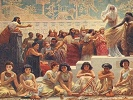

  
[Intangible Textual Heritage](../../index)  [Ancient Near
East](../index)  [Index](index)  [Previous](mba28)  [Next](mba30) 

------------------------------------------------------------------------

[Buy this Book on
Kindle](https://www.amazon.com/exec/obidos/ASIN/B002GYVU7A/internetsacredte)

------------------------------------------------------------------------

  
*Myths of Babylonia and Assyria*, by Donald A. MacKenzie, \[1915\], at
Intangible Textual Heritage

------------------------------------------------------------------------

Hadad, Ramman as, [57](mba09.htm#page_57), [261](mba18.htm#page_261),
[411](mba23.htm#page_411).

Haddon, Dr., Achæan racial affinities, [377](mba22.htm#page_377).

Hades, Ishtar receives water of life in, [44](mba09.htm#page_44); Tammuz
spends winter in, [53](mba09.htm#page_53), [98](mba11.htm#page_98);
Indian "land of fathers", [56](mba09.htm#page_56); land of no return,
[58](mba09.htm#page_58); descent of Ishtar to, [95](mba11.htm#page_95)
*et seq*.; "Island of the Blessed", [180](mba14.htm#page_180) *et seq*.;
Babylonian conception of, [203](mba15.htm#page_203); the Celtic,
[203](mba15.htm#page_203); the Greek, Germanic, Indian, and Egyptian,
[204](mba15.htm#page_204); the grave as, [206](mba15.htm#page_206); the
Japanese, [206](mba15.htm#page_206); the Roman,
[207](mba15.htm#page_207); Babylonian king and queen of. See *Nergal*
and *Eresh-ki-gal*.

Hags, of storm, marsh and mountain as primitive goddesses: the Scottish,
[64](mba10.htm#page_64), [87](mba11.htm#page_87); the Babylonian,
[68](mba10.htm#page_68), [71](mba10.htm#page_71),
[72](mba10.htm#page_72), [73](mba10.htm#page_73),
[185](mba14.htm#page_185); the Germanic, [72](mba10.htm#page_72),
[73](mba10.htm#page_73), [95](mba11.htm#page_95). See *Annie*, *Annis*,
*Beowulf*, *Mothers*, and *Tiamat*.

Hair, evidence from early graves and sculptures, [4](mba07.htm#page_4),
[9](mba07.htm#page_9), [10](mba07.htm#page_10).

Hamath, Hittite city of, [395](mba23.htm#page_395); Israel overcomes,
[449](mba25.htm#page_449); Ilu-bi-di, the smith king of,
[457](mba25.htm#page_457), [458](mba25.htm#page_458).

Hamites, Biblical reference to, [276](mba18.htm#page_276).

Hammurabi (häm´mü-rä´bi), Dagan as creator of, [31](mba08.htm#page_31);
Sin-muballit father of, [133](mba12.htm#page_133); pantheon of,
[134](mba12.htm#page_134), [254](mba17.htm#page_254); the Biblical
Amraphel, [131](mba12.htm#page_131), [246](mba17.htm#page_246),
[247](mba17.htm#page_247); "Khammurabi" and "Ammurapi" forms of,
[247](mba17.htm#page_247), [248](mba17.htm#page_248); Rim Sin, the
Elamite, and, [249](mba17.htm#page_249); character of,
[249](mba17.htm#page_249)-[255](mba17.htm#page_255); god Nebo ignored
by, [303](mba19.htm#page_303); legal code of, [2](mba07.htm#page_2),
[222](mba16.htm#page_222), [223](mba16.htm#page_223) *et seq*.

Hammurabi Dynasty, the, Amorites and, [217](mba16.htm#page_217),
[218](mba16.htm#page_218); early Amorite kings of Sippar,
[241](mba17.htm#page_241), [242](mba17.htm#page_242); schools and
correspondence during, [252](mba17.htm#page_252); Kassites first appear
during, [255](mba17.htm#page_255); Sealand Dynasty in,
[257](mba17.htm#page_257); late kings of, [257](mba17.htm#page_257),
[258](mba17.htm#page_258); Hittite raid at close of,
[258](mba17.htm#page_258)-[260](mba18.htm#page_260); Assyria during,
[279](mba18.htm#page_279), [419](mba24.htm#page_419); astronomy in,
[300](mba19.htm#page_300).

Hanuman (hăn´u-män), the Indian monkey god, Bhima and,
[187](mba14.htm#page_187); like Gilgamesh, [188](mba14.htm#page_188),
[189](mba14.htm#page_189).

Hapi (häpi), Nile god, a bi-sexual deity, [161](mba13.htm#page_161).

Haran, Abraham's migration from Ur to, [131](mba12.htm#page_131),
[245](mba17.htm#page_245); Ashur and Sin worshipped at,
[353](mba20.htm#page_353); Nabonidus's temple to Sin at,
[494](mba26.htm#page_494).

Harper, Professor, [321](mba19.htm#page_321).

Harvest deities, fish forms of, [29](mba08.htm#page_29),
[32](mba08.htm#page_32); river and ocean gods as,
[33](mba08.htm#page_33); the pre-Hellenic, [84](mba11.htm#page_84); the
Egyptian, [85](mba11.htm#page_85).

Harvest moon, the, crops ripened by, [52](mba09.htm#page_52).

Hathor (hät´hor), the fish goddess and, [29](mba08.htm#page_29); Ishtar
and, [57](mba09.htm#page_57), [99](mba11.htm#page_99).

Hathor-Sekhet, the destroyer, [157](mba13.htm#page_157),
[197](mba15.htm#page_197).

Hatshepsut (hat-shep´soot), Queen of Egypt, [16](mba07.htm#page_16);
Sumerian queen earlier than, [115](mba12.htm#page_115).

Hatti (hät´ti), dominant tribe of Hittites, [246](mba17.htm#page_246);
of Armenoid race, [262](mba18.htm#page_262); as Great

p. 516

\[paragraph continues\] Father
worshippers, [260](mba18.htm#page_260); Mitannians and,
[269](mba18.htm#page_269).

Hattusil I (hat-too´sil), King of Hittites, [283](mba18.htm#page_283).

Hattusil II, Hittite king, Egyptian treaty, [366](mba21.htm#page_366);
influence of in Babylonia, [364](mba21.htm#page_364),
[368](mba21.htm#page_368); marriage treaty with Amorite king,
[418](mba24.htm#page_418).

Hawes, Mr., on Cretan chronology, [xxv](mba06.htm#page_xxv); Cretan
racial types, [8](mba07.htm#page_8).

Hawk, demons enter the, [71](mba10.htm#page_71).

Hazael (haz´ā-el), King of Damascus, [410](mba23.htm#page_410);
Shalmaneser III defeats, [411](mba23.htm#page_411); Israel oppressed by,
[412](mba23.htm#page_412).

Heaven, Queen of, Hebrews offer cakes to, [106](mba11.htm#page_106);
women prominent in worship of, [106](mba11.htm#page_106),
[107](mba11.htm#page_107).

Hebrews, in Canaan, [379](mba22.htm#page_379); Philistines as overlords
of, [379](mba22.htm#page_379), [380](mba22.htm#page_380),
[386](mba22.htm#page_386), [387](mba22.htm#page_387); as allies of Egypt
and Tyre, [388](mba22.htm#page_388); under David and Solomon,
[388](mba22.htm#page_388), [389](mba22.htm#page_389); Pharaoh Sheshonk
plunders, [391](mba22.htm#page_391); kingdoms of Judah and Israel,
[401](mba23.htm#page_401) *et seq*.; in late Assyrian period,
[448](mba25.htm#page_448) *et seq*. See *Israel* and *Judah*.

Heimdal (hīm´dal), as patriarch and world guardian,
[93](mba11.htm#page_93); Tammuz and Agni like, [94](mba11.htm#page_94);
Nin-Girsu of Lagash like, [116](mba12.htm#page_116).

Hercules, Gilgamesh and, [41](mba09.htm#page_41),
[164](mba14.htm#page_164), [172](mba14.htm#page_172); as dragon slayer,
[152](mba13.htm#page_152); eagle as soul of, [170](mba14.htm#page_170),
[349](mba20.htm#page_349); burning of, [171](mba14.htm#page_171); of
Cilicia and deities that link with, [261](mba18.htm#page_261); Merodach
and, [316](mba19.htm#page_316); Ashur and, [336](mba20.htm#page_336);
astral arrow of, [337](mba20.htm#page_337); Melkarth and,
[348](mba20.htm#page_348).

Hermes (h*e*r´mēz), Nebo as, [303](mba19.htm#page_303).

Hermod (her´mod), the Germanic Patriarch, [93](mba11.htm#page_93);
Gilgamesh and, [184](mba14.htm#page_184).

Herodotus, on Babylonian harvests, [21](mba08.htm#page_21),
[22](mba08.htm#page_22); on Babylonian burial customs,
[214](mba15.htm#page_214); description of Babylon,
[219](mba16.htm#page_219) *et seq*.; on Babylonian marriage market,
[224](mba16.htm#page_224), [225](mba16.htm#page_225); on doctors and
folk cures, [231](mba16.htm#page_231), [232](mba16.htm#page_232); on
origin of Nineveh, [277](mba18.htm#page_277); on Egyptian Totemism,
[293](mba19.htm#page_293), [432](mba24.htm#page_432); on pre-Hellenic
beliefs, [317](mba19.htm#page_317); on Semiramis legend,
[425](mba24.htm#page_425); on fall of Assyria,
[488](mba26.htm#page_488).

Heth, children of, Hittites as, [246](mba17.htm#page_246).

Hezekiah (hez-e-kī´ah), [21](mba08.htm#page_21),
[340](mba20.htm#page_340); Merodach-Balad conspiracy,
[465](mba25.htm#page_465); destruction of Assyrian army,
[466](mba25.htm#page_466), [467](mba25.htm#page_467); Esarhaddon and,
[471](mba25.htm#page_471), [472](mba25.htm#page_472).

Hierap´olis, Atargatis goddess of, [267](mba18.htm#page_267).

"High Heads", symbols and "world spine", [332](mba20.htm#page_332);
Anshar, Anu, Enlil, Ea, Merodach, Nergal, and Shamash as,
[334](mba20.htm#page_334).

Hindus, Mediterranean race represented among, [8](mba07.htm#page_8).

Hipparchus, the Greek astronomer, discoveries of,
[320](mba19.htm#page_320), [321](mba19.htm#page_321).

Hiram, King of Tyre, as Solomon's ally, [388](mba22.htm#page_388),
[389](mba22.htm#page_389).

Hit, the bitumen wells of, [25](mba08.htm#page_25).

Hittites, the father worshippers among, [xxx](mba06.htm#page_xxx),
[420](mba24.htm#page_420); racial types in confederacy of,
[11](mba07.htm#page_11), [12](mba07.htm#page_12),
[246](mba17.htm#page_246), [265](mba18.htm#page_265),
[266](mba18.htm#page_266); double-headed eagle of,
[168](mba14.htm#page_168); in ethnics of Jerusalem,
[246](mba17.htm#page_246); Hebrews, dealings with,
[246](mba17.htm#page_246), [266](mba18.htm#page_266),
[267](mba18.htm#page_267); earliest references to in Egypt and
Babylonia, [258](mba17.htm#page_258), [259](mba17.htm#page_259),
[264](mba18.htm#page_264); prehistoric culture of,
[263](mba18.htm#page_263); thunder god of and linking deities,
[261](mba18.htm#page_261), [268](mba18.htm#page_268); Merodach carried
off by, [261](mba18.htm#page_261); fusion of god and goddess cults by,
[267](mba18.htm#page_267), [268](mba18.htm#page_268); relations with
Mitannians and Kassites,
[270](mba18.htm#page_270)-[272](mba18.htm#page_272),
[282](mba18.htm#page_282), [358](mba21.htm#page_358); Subbi-luliuma, the
conqueror, [283](mba18.htm#page_283); conquest of Mitanni,
[284](mba18.htm#page_284); Babylonian culture passed to Greece by,
[306](mba19.htm#page_306), [316](mba19.htm#page_316); the winged disk
of, [347](mba20.htm#page_347), [348](mba20.htm#page_348); Ashur cult
and, [355](mba20.htm#page_355); Syria after expansion of,
[363](mba21.htm#page_363); King Mursil, [364](mba21.htm#page_364);
influence of in Egypt and Babylonia, [364](mba21.htm#page_364); wars of
Seti I and Rameses II against, [364](mba21.htm#page_364),
[365](mba21.htm#page_365); alliance with Egypt,
[366](mba21.htm#page_366); early struggle with Assyria,
[367](mba21.htm#page_367), [368](mba21.htm#page_368); Muski as overlords
of, [380](mba22.htm#page_380); Nebuchadrezzar I defeats,
[381](mba22.htm#page_381); late period of Empire of,
[386](mba22.htm#page_386); city-states of Hamath and Carchemish,
[395](mba23.htm#page_395); Shalmaneser III and,
[414](mba23.htm#page_414); "mother right among",
[418](mba24.htm#page_418); connection of with Urartu,
[440](mba24.htm#page_440) *n*.; combination against Sargon II,
[459](mba25.htm#page_459), [460](mba25.htm#page_460); Biblical reference
to Tabal and Meshech, [464](mba25.htm#page_464).

Horse, sea god as a, [33](mba08.htm#page_33); demons enter the,
[71](mba10.htm#page_71); domesticated in Turkestan,
[271](mba18.htm#page_271); introduction of to Babylonia and Egypt,
[270](mba18.htm#page_270), [271](mba18.htm#page_271); sacrificed by
Aryo-Indian and Buriats, [271](mba18.htm#page_271),
[309](mba19.htm#page_309); constellation of, [309](mba19.htm#page_309).

Horus (ho´rus), god of Egypt, creative tears of,
[45](mba09.htm#page_45); as the sun, Saturn, Jupiter, and Mars,
[300](mba19.htm#page_300), [304](mba19.htm#page_304); the "elder" and
"younger", [302](mba19.htm#page_302); as the "opener",
[304](mba19.htm#page_304); "world soul" conception and,
[304](mba19.htm#page_304); has many forms like Tammuz,
[305](mba19.htm#page_305); Ninip and, [316](mba19.htm#page_316);

p. 517

\[paragraph continues\] "winged disk" of,
[336](mba20.htm#page_336); the eagle and, [343](mba20.htm#page_343).

Hoshea (ho-she´a), King of Israel, [453](mba25.htm#page_453),
[454](mba25.htm#page_454).

Host of heaven, [305](mba19.htm#page_305).

Hotherus (hoth´erus), Gilgamesh and, [184](mba14.htm#page_184),
[185](mba14.htm#page_185).

"House of Clay", the grave called, [56](mba09.htm#page_56);
[206](mba15.htm#page_206)-[208](mba15.htm#page_208).

Hraesvelgur (hrā´svel-gur), Icelandic wind demon,
[72](mba10.htm#page_72).

Human sacrifices, the May Day, [50](mba09.htm#page_50). "Husband of his
mother", [xxxii](mba06.htm#page_xxxii); in Sumerian, Indian, and
Egyptian mythologies, [106](mba11.htm#page_106),
[304](mba19.htm#page_304), [305](mba19.htm#page_305); Kingu becomes
lover of Tiamat, [106](mba11.htm#page_106); sun as offspring and spouse
of the moon, [301](mba19.htm#page_301); Adad-nirari IV as,
[420](mba24.htm#page_420). See *Father and son conflict*.

Hydra, as Dragon, [152](mba13.htm#page_152).

Hyksos (hik´sos), Egypt invaded by, [259](mba17.htm#page_259);
Mitannians and, [270](mba18.htm#page_270); horse introduced into Egypt
by, [271](mba18.htm#page_271); theories regarding,
[271](mba18.htm#page_271); trading relations of with Crete and Persia,
[273](mba18.htm#page_273); period of expulsion of,
[275](mba18.htm#page_275).

 

Iberians, the, Sumerians and Egyptians congeners of,
[9](mba07.htm#page_9); goddesses of, [105](mba11.htm#page_105); folk
tales of, [156](mba13.htm#page_156).

Ibis, demons enter the, [71](mba10.htm#page_71).

Iceland, wind hag of, [73](mba10.htm#page_73); Barleycorn a god of,
[170](mba14.htm#page_170) n.

Idols, spirit of god or demon in, [61](mba10.htm#page_61); gods of taken
prisoners, [62](mba10.htm#page_62).

Idun (ee´doon),Germanic goddess, lovers of, [102](mba11.htm#page_102).

Igigi (i´gig-i), spirits of heaven, [34](mba08.htm#page_34),
[149](mba13.htm#page_149).

Ilu-bi´di, smith king of Hamath, [457](mba25.htm#page_457),
[458](mba25.htm#page_458).

Immortality, quest of Gilgamesh, [177](mba14.htm#page_177); Song of the
Sea Lady, [178](mba14.htm#page_178), [179](mba14.htm#page_179); Lay of
the Harper, [179](mba14.htm#page_179); Pir-napishtim and Gilgamesh,
[181](mba14.htm#page_181) *et seq*.; Ea-bani's revelation,
[183](mba14.htm#page_183)-[184](mba14.htm#page_184); no Babylonian
Paradise, [203](mba15.htm#page_203), [210](mba15.htm#page_210),
[211](mba15.htm#page_211); Brahmans ask Alexander the Great for,
[208](mba15.htm#page_208); Egyptian Ra and Osirian doctrines,
[209](mba15.htm#page_209).

India, Sumerian myths in, [xxvi](mba06.htm#page_xxvi),
[xxvii](mba06.htm#page_xxvii); Mediterranean race in,
[7](mba07.htm#page_7); Brahma-Vishnu and Ea, [27](mba08.htm#page_27);
Babylonian flood myth in, [27](mba08.htm#page_27),
[28](mba08.htm#page_28), [196](mba15.htm#page_196); demons of and the
Babylonian, [34](mba08.htm#page_34); mother ghost in,
[69](mba10.htm#page_69); Garuda eagle and Sumerian Zu bird,
[74](mba10.htm#page_74), [75](mba10.htm#page_75),
[165](mba14.htm#page_165)-[169](mba14.htm#page_169),
[330](mba20.htm#page_330); wedding bracelet of and Ishtar's,
[98](mba11.htm#page_98), [98](mba11.htm#page_98) *n*.; eternal "mothers"
and "dying gods" in, [101](mba11.htm#page_101); Ribhus the "elves" of,
[105](mba11.htm#page_105); fairies of, [294](mba19.htm#page_294);
Gilgamesh myth in, [187](mba14.htm#page_187)-[189](mba14.htm#page_189);
Babylonian culture in, [199](mba15.htm#page_199),
[200](mba15.htm#page_200), [313](mba19.htm#page_313); face paint of gods
in, [211](mba15.htm#page_211); jungle-dwellers' conception of "Self
Power", [291](mba19.htm#page_291), [304](mba19.htm#page_304); star myths
of, [296](mba19.htm#page_296); early astronomers of,
[300](mba19.htm#page_300); lunar zodiac of, [309](mba19.htm#page_309);
constellations identified before planets in, [318](mba19.htm#page_318);
horse sacrifice in, [309](mba19.htm#page_309); sun and moon marriages
in, [306](mba19.htm#page_306); doctrine of World's Ages in,
[310](mba19.htm#page_310) *et seq*.; "finger counting" at prayer in,
[311](mba19.htm#page_311) *n*.; deities connected with goat in,
[333](mba20.htm#page_333); "man in the eye" belief,
[335](mba20.htm#page_335), [336](mba20.htm#page_336); cult of "late
invaders" of, [338](mba20.htm#page_338); fire cult in,
[346](mba20.htm#page_346); Solomon's trade with,
[389](mba22.htm#page_389), [390](mba22.htm#page_390); Jehoshaphat's
fleet, [408](mba23.htm#page_408); swans as love messengers in,
[429](mba24.htm#page_429).

"Indo-Europeans", Mitannians as, [269](mba18.htm#page_269),
[270](mba18.htm#page_270).

Indra (ind´ră), god of India, a world artisan like Ea and Ptah,
[30](mba08.htm#page_30); Anu's messengers like Maruts of,
[34](mba08.htm#page_34); Enlil and, [35](mba08.htm#page_35); Ramman,
Hadad, Thor, &c., and, [57](mba09.htm#page_57),
[261](mba18.htm#page_261), [340](mba20.htm#page_340); in Garuda myth,
[74](mba10.htm#page_74), [75](mba10.htm#page_75); dies annually like
Tammuz, [101](mba11.htm#page_101); various forms of,
[101](mba11.htm#page_101); as slayer of father,
[158](mba13.htm#page_158), [302](mba19.htm#page_302); eagle as,
[169](mba14.htm#page_169); Paradise of like Odin's,
[209](mba15.htm#page_209); thunder horn of, [238](mba16.htm#page_238).

Insects, gods as, [296](mba19.htm#page_296).

Inspiration, derived from sacred juice, [45](mba09.htm#page_45); from
drinking blood, [48](mba09.htm#page_48); from incense and breath of Apis
bull, [49](mba09.htm#page_49). Inundation, the Babylonian,
[24](mba08.htm#page_24). Inverness, the "sleeper" and fairy mound of,
[164](mba14.htm#page_164).

Ionians, deported from Cilicia to Nineveh, [464](mba25.htm#page_464).

Iranian sun god, Sumerians and, [55](mba09.htm#page_55),
[56](mba09.htm#page_56).

Ireland, the corn god and river goddess of, [33](mba08.htm#page_33),
[238](mba16.htm#page_238); spitting customs in, [47](mba09.htm#page_47);
"calling back" of souls in, [70](mba10.htm#page_70),
[70](mba10.htm#page_70) *n*.; Anu a wind hag, [73](mba10.htm#page_73);
Tammuz-Diarmid myth in, [85](mba11.htm#page_85),
[87](mba11.htm#page_87); Angus, the love god of,
[90](mba11.htm#page_90), [238](mba16.htm#page_238),
[428](mba24.htm#page_428) *n*.; the eternal goddess of,
[101](mba11.htm#page_101), [102](mba11.htm#page_102),
[268](mba18.htm#page_268); the "morúach" (worm) of,
[151](mba13.htm#page_151); flood legend of, [196](mba15.htm#page_196);
the Hades of, [203](mba15.htm#page_203); pig as devil in,
[293](mba19.htm#page_293); doctrine of world's ages in,
[310](mba19.htm#page_310) *et seq*.; origin of culture of,
[315](mba19.htm#page_315), [316](mba19.htm#page_316); giant gods of,
[317](mba19.htm#page_317); pigeon lore in, [431](mba24.htm#page_431).

p. 518

Iron, in northern Mesopotamia, [25](mba08.htm#page_25); used in folk
cures, [236](mba16.htm#page_236).

Irrigation, in early Sumeria, [23](mba08.htm#page_23),
[39](mba08.htm#page_39).

Isaac, forbids Jacob to marry a Hittite, [266](mba18.htm#page_266).

Isaiah, [2](mba07.htm#page_2),; doom of Babylonia,
[113](mba12.htm#page_113), [499](mba26.htm#page_499); "Worm" of, the
dragon, [151](mba13.htm#page_151); use of Babylonian symbolism by,
[331](mba20.htm#page_331), [341](mba20.htm#page_341); "satyrs" referred
to by, [333](mba20.htm#page_333); on Assyria the Destroyer,
[340](mba20.htm#page_340); on Tophet, [350](mba20.htm#page_350);
reference to Jerusalem's water supply, [451](mba25.htm#page_451); warns
Ahaz, [459](mba25.htm#page_459); destruction of Sennacherib's army,
[466](mba25.htm#page_466); tradition of murder of,
[474](mba25.htm#page_474).

Ishbi-Urra (ish´bi-oor´ra), King of Isin, [132](mba12.htm#page_132).

Ishtar (ish´tar), Isis cult and, [xxxi](mba06.htm#page_xxxi); hymn to,
[18](mba07.htm#page_18)-[20](mba07.htm#page_20); Beltu and,
[36](mba08.htm#page_36); water of life given to,
[44](mba09.htm#page_44); as earth goddess, [53](mba09.htm#page_53);
identical with Hathor, [57](mba09.htm#page_57); in demon war,
[76](mba10.htm#page_76); as "Queen of Heaven", [81](mba11.htm#page_81),
[106](mba11.htm#page_106), [107](mba11.htm#page_107); lamentation of for
Tammuz, [86](mba11.htm#page_86), [88](mba11.htm#page_88),
[98](mba11.htm#page_98); in Sargon of Akkad myth,
[91](mba11.htm#page_91); descent of to Hades poem,
[95](mba11.htm#page_95) *et seq*.; magical ornaments of,
[96](mba11.htm#page_96); punishment of, [96](mba11.htm#page_96),
[97](mba11.htm#page_97); rescue of, [98](mba11.htm#page_98); Belit-sheri
associated with, [98](mba11.htm#page_98); as love goddess,
[99](mba11.htm#page_99); temple women of, [99](mba11.htm#page_99),
[106](mba11.htm#page_106), [107](mba11.htm#page_107); absorbs other
goddesses, [100](mba11.htm#page_100), [117](mba12.htm#page_117),
[277](mba18.htm#page_277), [496](mba26.htm#page_496); as daughter of Ann
and Nannar, [100](mba11.htm#page_100); as mother of Tammuz,
[100](mba11.htm#page_100); the lovers of, [103](mba11.htm#page_103),
[126](mba12.htm#page_126),
[174](mba14.htm#page_174)-[176](mba14.htm#page_176); like Tiamat,
[106](mba11.htm#page_106); under Isin Dynasty,
[132](mba12.htm#page_132); links with Indian and Egyptian goddesses,
[157](mba13.htm#page_157); Damkina and, [160](mba13.htm#page_160); as a
bi-sexual deity, [161](mba13.htm#page_161); in Etana legend,
[166](mba14.htm#page_166); in Gilgamesh legend,
[172](mba14.htm#page_172)-[177](mba14.htm#page_177); in flood legend,
[193](mba15.htm#page_193), [194](mba15.htm#page_194); Frey's bride and,
[204](mba15.htm#page_204); threat to raise dead,
[213](mba15.htm#page_213); fish goddesses and,
[117](mba12.htm#page_117), [277](mba18.htm#page_277); Nineveh image of
sent to Egypt, [280](mba18.htm#page_280); star of,
[295](mba19.htm#page_295); changes star forms with Merodach,
[299](mba19.htm#page_299); month of, [305](mba19.htm#page_305); wheel
symbol of, [347](mba20.htm#page_347); Nineveh temple of destroyed,
[363](mba21.htm#page_363); worshipped by Nebuchadrezzar I,
[382](mba22.htm#page_382); cult of in Assyria,
[420](mba24.htm#page_420); Semiramis and, [425](mba24.htm#page_425); as
a Fate, [433](mba24.htm#page_433); moon god and,
[436](mba24.htm#page_436); Creatrix and, [437](mba24.htm#page_437);
worshipped by Sargon II, [463](mba25.htm#page_463); worshipped by
Esarhaddon, [471](mba25.htm#page_471); Persian goddess and,
[496](mba26.htm#page_496).

Ishtarate (ish-tar-ä´te), "Ishtars", goddesses in general called, too.

Isin, Dynasty of, [131](mba12.htm#page_131); early kings of,
[132](mba12.htm#page_132) *et seq*.; last kings of,
[133](mba12.htm#page_133); sun worship and, [240](mba17.htm#page_240);
Dynasty of Pashe, [380](mba22.htm#page_380).

Isis (ī´sis), goddess of Egypt, Ishtar cult and,
[xxxi](mba06.htm#page_xxxi); fish goddess and, [29](mba08.htm#page_29);
as Nile goddess, [33](mba08.htm#page_33); creative tears of,
[45](mba09.htm#page_45); mourning of for Osiris,
[83](mba11.htm#page_83), [99](mba11.htm#page_99); as daughter, wife,
sister, and mother of Osiris, [99](mba11.htm#page_99); as corn goddess,
[90](mba11.htm#page_90); as serpent goddess, [150](mba13.htm#page_150);
as bi-sexual deity, [161](mba13.htm#page_161); male form of,
[299](mba19.htm#page_299); the star of, [296](mba19.htm#page_296),
[300](mba19.htm#page_300); address of to different forms of Osiris,
[297](mba19.htm#page_297).

"Island of the Blessed", in Gilgamesh epic, [180](mba14.htm#page_180)
*et seq*.; the Greek and Celtic, [203](mba15.htm#page_203).

Israel, first Egyptian reference to, [379](mba22.htm#page_379); subject
to Damascus, [396](mba23.htm#page_396); separation of from Judah,
[401](mba23.htm#page_401) *et seq*.; Abijah's victory over,
[402](mba23.htm#page_402), [403](mba23.htm#page_403); first conflict
with Assyria, [407](mba23.htm#page_407); tribute to Shalmaneser III,
[411](mba23.htm#page_411), [412](mba23.htm#page_412); Assyria as
"saviour" of, [414](mba23.htm#page_414), [438](mba24.htm#page_438),
[439](mba24.htm#page_439); goddess cult in, [421](mba24.htm#page_421);
Aramæans and mother worship in, [434](mba24.htm#page_434); war with
Judah, [448](mba25.htm#page_448); Tiglath-pileser harries,
[453](mba25.htm#page_453); the lost ten tribes,
[455](mba25.htm#page_455), [456](mba25.htm#page_456).

 

"Jack and Jill", the Sumerian lunar, [53](mba09.htm#page_53).

"Jack with a Lantern", the Babylonian, [66](mba10.htm#page_66).

Jacob, personal ornaments as charms to, [211](mba15.htm#page_211);
marriage of, [266](mba18.htm#page_266).

Jah, the Hebrew, Ea as, [31](mba08.htm#page_31); Dagon as,
[31](mba08.htm#page_31); as dragon slayer, [157](mba13.htm#page_157);
monotheism, [160](mba13.htm#page_160).

Japan, the Hades of, [206](mba15.htm#page_206).

Jastrow, Professor, on Ea, [29](mba08.htm#page_29),
[30](mba08.htm#page_30), [435](mba24.htm#page_435); on culture and
racial fusion, [42](mba09.htm#page_42); on fire and water ceremonies,
[51](mba09.htm#page_51); on moon names, [52](mba09.htm#page_52); on
female conservatism, [107](mba11.htm#page_107),
[179](mba14.htm#page_179), [180](mba14.htm#page_180); on burial customs,
[208](mba15.htm#page_208); on Nebo, [303](mba19.htm#page_303),
[435](mba24.htm#page_435); on Greek and Babylonian astrology and
astronomy, [319](mba19.htm#page_319) *et seq*.; on Anshar, Ashir, and
Ashur, [354](mba20.htm#page_354).

Jehoahaz (je-hō´a-haz), King of Judah, [414](mba23.htm#page_414); Necho
deposes, [489](mba26.htm#page_489).

Jehoash (je-hō´ash), King of Israel, [448](mba25.htm#page_448),
[449](mba25.htm#page_449).

Jehoiachin (je-hoi´a-chin), King of Judah, carried to Babylon,
[490](mba26.htm#page_490).

Jehoiakim (je-hoi´a-kim), King of Judah, [489](mba26.htm#page_489),
[490](mba26.htm#page_490), [492](mba26.htm#page_492).

Jehoram (je-hō´ram), King of Judah, no burning at grave of,
[350](mba20.htm#page_350).

p. 519

Jehoshaphat (je-hosh´a-phat), King of Judah, [407](mba23.htm#page_407);
navy of wrecked, [408](mba23.htm#page_408).

Jehu (je´hü), King of Israel, Elisha calls, [409](mba23.htm#page_409),
[410](mba23.htm#page_410); tribute to Shalmaneser III,
[411](mba23.htm#page_411), [412](mba23.htm#page_412); mother worship in
reign of, [421](mba24.htm#page_421), [434](mba24.htm#page_434).

Jeremiah, liver as seat of life, [48](mba09.htm#page_48); on mother
worship, [106](mba11.htm#page_106), [107](mba11.htm#page_107),
[421](mba24.htm#page_421); Pharaoh Necho, [489](mba26.htm#page_489).

Jeremias, Dr. Alfred, on precession of equinoxes,
[320](mba19.htm#page_320) *n*.

Jeroboam (jer-o-bō´am), revolt of, [402](mba23.htm#page_402); Abijah
defeats, [402](mba23.htm#page_402), [403](mba23.htm#page_403); an ally
of Assyria, [449](mba25.htm#page_449).

Jerusalem, the "new", [xvii](mba04.htm#page_xvii); Palæolithic
collection at, [10](mba07.htm#page_10); "dragon well" at,
[152](mba13.htm#page_152); "father" of Amorite, "mother" of Hittite,
[246](mba17.htm#page_246); eclipse record from,
[323](mba19.htm#page_323); "Queen of Heaven" worshipped in,
[421](mba24.htm#page_421); wall of destroyed by Jehoash,
[449](mba25.htm#page_449); new wall and water supply of,
[451](mba25.htm#page_451); siege of by Sennacherib,
[465](mba25.htm#page_465), [466](mba25.htm#page_466); Assyrian
ambassador visits, [471](mba25.htm#page_471), [472](mba25.htm#page_472);
sack of by Nebuchadrezzar II, [490](mba26.htm#page_490),
[491](mba26.htm#page_491); Cyrus and rebuilding of,
[496](mba26.htm#page_496); return of captives to,
[496](mba26.htm#page_496).

Jewellery, the magic, Ishtar's, [96](mba11.htm#page_96),
[98](mba11.htm#page_98).

Jewish type, Akkadians of, [1](mba07.htm#page_1), [2](mba07.htm#page_2);
Arabs not of, [9](mba07.htm#page_9); the racial blend which produced,
[10](mba07.htm#page_10) *et seq*.

Jews, Cyrus welcomed in Babylon by, [495](mba26.htm#page_495); return of
to Jerusalem, [496](mba26.htm#page_496).

Jezebel (jez´e-bel), Queen, [406](mba23.htm#page_406); murder of,
[410](mba23.htm#page_410).

Jinn, the Arabian, [78](mba10.htm#page_78).

Joash (jō´ash), King of Judah, concealment of in childhood,
[413](mba23.htm#page_413); coronation of, [413](mba23.htm#page_413),
[414](mba23.htm#page_414).

Johns, Mr., on Aryans in early Assyria, [278](mba18.htm#page_278),
[279](mba18.htm#page_279).

Joram (jō´ram), King of Israel, [408](mba23.htm#page_408),
[409](mba23.htm#page_409); Jehu murders, [410](mba23.htm#page_410).

Josiah (jō-sī´ah), King of Judah, Necho and, [489](mba26.htm#page_489).

Jotham (jō´tham), King of Judah, [451](mba25.htm#page_451).

Judah, subject to Damascus, [396](mba23.htm#page_396); separation of
from Israel, [401](mba23.htm#page_401) at seq.; Edom revolts against,
[409](mba23.htm#page_409); defeated by Israel,
[448](mba25.htm#page_448); Damascus and Israel plot against,
[451](mba25.htm#page_451); Ahaz appeals to Assyria,
[452](mba25.htm#page_452); Sennacherib deports prisoners from,
[463](mba25.htm#page_463); in Esarhaddon's reign,
[474](mba25.htm#page_474); Pharaoh Necho in, [489](mba26.htm#page_489);
the Captivity, [491](mba26.htm#page_491); return of captives,
[496](mba26.htm#page_496).

Jupiter, the planet, Ramman and Hadad as, [57](mba09.htm#page_57);
Merodach creates, [147](mba13.htm#page_147); Merodach as,
[296](mba19.htm#page_296); Horus as, [300](mba19.htm#page_300),
[302](mba19.htm#page_302); associated with sun and moon,
[301](mba19.htm#page_301); as ghost of sun, [305](mba19.htm#page_305);
as "bull of light", [301](mba19.htm#page_301); Nin- Girsu (Tammuz) as,
[301](mba19.htm#page_301); month of, [305](mba19.htm#page_305); Attis
as, [305](mba19.htm#page_305); as "face voice of light" and "star of
bronze", [314](mba19.htm#page_314), [315](mba19.htm#page_315); in
astrology, [318](mba19.htm#page_318).

Jupiter-Amon, [317](mba19.htm#page_317).

Jupiter-Belus, Merodach as, [221](mba16.htm#page_221),
[317](mba19.htm#page_317).

 

Kadashman-Kharbe (kad-äsh´man-khär´be), King of Babylon, grandson of
Ashur-uballit, [284](mba18.htm#page_284), [285](mba18.htm#page_285);
opens Arabian desert trade route, [360](mba21.htm#page_360); murder of,
[361](mba21.htm#page_361).

Kadesh (kä´desh), goddesses that link with, [268](mba18.htm#page_268).

Kali (kä´lee), the Indian goddess, goat sacrificed to,
[48](mba09.htm#page_48).

Kalkhi (käl´khi), excavations at, [xix](mba04.htm#page_xix),
[xx](mba05.htm#page_xx); capital of Shalmaneser I,
[367](mba21.htm#page_367); head-quarters of Ashur-natsir-pal III,
[398](mba23.htm#page_398); description of, [399](mba23.htm#page_399),
[400](mba23.htm#page_400); library at, [422](mba24.htm#page_422),
[470](mba25.htm#page_470); religious revolt at,
[422](mba24.htm#page_422); Sargon II and, [463](mba25.htm#page_463);
temple to Nebo at, [487](mba26.htm#page_487).

Karduniash (kar-doon´i-ash), Babylonia called,
[273](mba18.htm#page_273).

Karna (kăr´nă), Indian hero: like Sargon of Akkad,
[126](mba12.htm#page_126).

Kässites, Nippur as capital of, [218](mba16.htm#page_218); in Hammurabi
Age, [255](mba17.htm#page_255); as agriculturists,
[256](mba17.htm#page_256); Aryans associated with,
[270](mba18.htm#page_270); Mitannians, Hyksos and,
[270](mba18.htm#page_270), [271](mba18.htm#page_271),
[272](mba18.htm#page_272), [273](mba18.htm#page_273); Babylonia
consolidated by, [274](mba18.htm#page_274), [393](mba22.htm#page_393);
early Assyrian kings and, [279](mba18.htm#page_279); in Tell-el-Amarna
letters, [281](mba18.htm#page_281); and Mesopotamian question,
[358](mba21.htm#page_358); Arabian desert trade route,
[360](mba21.htm#page_360); dynasty of ends, [370](mba21.htm#page_370),
[371](mba21.htm#page_371); Sennacherib and the mountain,
[464](mba25.htm#page_464).

Keats, John, [112](mba12.htm#page_112); "La Belle Dame Sans Merci" and
Ishtar, [174](mba14.htm#page_174).

Kengi (k*e*n´gi), early name of Sumer, [2](mba07.htm#page_2).

Khammurabi (kham-mü-rä´bi), [247](mba17.htm#page_247). See *Hammurabi*.

Khani (khä´ni). See *Mitanni*.

Kharri (khär´ri), Mitannians called; perhaps "Arya",
[269](mba18.htm#page_269).

Khatti. See *Hatti* and *Hittites*.

Kheta. See *Hittites*.

Khnumu (knoo´moo), the Egyptian god, Ea compared to,
[30](mba08.htm#page_30).

p. 520

Khonsu (kon´soo), Tammuz a healer like, [90](mba11.htm#page_90),
[94](mba11.htm#page_94).

Kid, sacrificed to Tammuz, [85](mba11.htm#page_85),
[333](mba20.htm#page_333); star called by Arabs,
[333](mba20.htm#page_333).

King, L. W., Creation tablets, [xxiv](mba06.htm#page_xxiv),
[29](mba08.htm#page_29); [211](mba15.htm#page_211); on "Cuthean Legend
of Creation", [215](mba15.htm#page_215), [216](mba15.htm#page_216); on
seven gods as one, [298](mba19.htm#page_298); on Sennacherib's sack of
Babylon, [469](mba25.htm#page_469).

Kings, worship of, in Hammurabi Age, [242](mba17.htm#page_242),
[257](mba17.htm#page_257), [258](mba17.htm#page_258); burning of,
[350](mba20.htm#page_350), [351](mba20.htm#page_351); Ashur's
association with, [352](mba20.htm#page_352).

Kingu (kin´goo), in Creation Legend, as son and lover of Tiamat,
[106](mba11.htm#page_106); stirs Tiamat to avenge Apsu,
[140](mba13.htm#page_140); exalted by Tiamat, [140](mba13.htm#page_140);
overcome by Merodach, [145](mba13.htm#page_145),
[146](mba13.htm#page_146).

Kish, early dynasty of, [114](mba12.htm#page_114); legendary queen of,
[114](mba12.htm#page_114), [115](mba12.htm#page_115); Entemena's sack
of, [120](mba12.htm#page_120); Sargon and, [125](mba12.htm#page_125),
[126](mba12.htm#page_126); goddess of, [126](mba12.htm#page_126),
[127](mba12.htm#page_127); kings and gods of, [241](mba17.htm#page_241).

Kishar (ke´shär), the god, in group of elder deities,
[37](mba08.htm#page_37), [138](mba13.htm#page_138).

Kneph, the Egyptian air god, [49](mba09.htm#page_49).

*Koran* (kō´rän), Etana eagle myth in, [166](mba14.htm#page_166),
[167](mba14.htm#page_167); Nimrod agricultural myth in,
[170](mba14.htm#page_170); water of life legend in,
[186](mba14.htm#page_186); Abraham and Nimrod's pyre,
[349](mba20.htm#page_349).

Kudur Mabug (kü´dür mab´üg), Elamite King of Sumer,
[242](mba17.htm#page_242), [243](mba17.htm#page_243); the Biblical
Chedor-laomer, [247](mba17.htm#page_247), [248](mba17.htm#page_248).

Kuiri (kü´i-ri), early name of Akkad, [2](mba07.htm#page_2).

Kurds (koords), the, use of cradle board by, [4](mba07.htm#page_4),
[5](mba07.htm#page_5); of Mediterranean race, [8](mba07.htm#page_8);

Mitannians as ancestors of, [270](mba18.htm#page_270),
[283](mba18.htm#page_283).

Kurigalzu II (kü´ri-gäl´zü), King of Babylonia,
[285](mba18.htm#page_285).

Kurigalzu III, Kassite king, wars with Elam and Assyria,
[362](mba21.htm#page_362).

Küta and Küthä. See *Cuthah*.

Kutu (kü´tü), the men of, [128](mba12.htm#page_128),
[264](mba18.htm#page_264). See *Gutium*.

 

Labartu (la-bär´tü), the, a mountain hag, [68](mba10.htm#page_68); as a
luck spirit, [77](mba10.htm#page_77).

Labashi-Marduk (la´ba-shi-mar´dük), King of Babylonia,
[492](mba26.htm#page_492).

"La Belle Dame Sans Merci", Ishtar as, [174](mba14.htm#page_174),
[175](mba14.htm#page_175).

Lachamu (lach-ä´mü), goddess, in Creation legend,
[37](mba08.htm#page_37), [138](mba13.htm#page_138),
[143](mba13.htm#page_143).

Lachmu (lach´mü), god, in Creation legend, [37](mba08.htm#page_37),
[138](mba13.htm#page_138), [143](mba13.htm#page_143).

Lagash (lä´gash), city of, early rulers of, [115](mba12.htm#page_115)
*et seq*.; deities of,
[116](mba12.htm#page_116)-[118](mba12.htm#page_118); relations with
Umma, [118](mba12.htm#page_118)-[120](mba12.htm#page_120); site of at
Tello, [120](mba12.htm#page_120); revolution in,
[120](mba12.htm#page_120); Urukagina, the reformer of,
[121](mba12.htm#page_121)-[124](mba12.htm#page_124); sack of,
[124](mba12.htm#page_124); Gudea, King of, [129](mba12.htm#page_129);
sculptures, buildings, and trade of, [130](mba12.htm#page_130); bearded
god of, [135](mba12.htm#page_135), [136](mba12.htm#page_136); burning of
in Hammurabi Age, [243](mba17.htm#page_243). Also *Shir-pür´lä*.

Lakshmi (lăksh´mee), the Indian eternal mother,
[101](mba11.htm#page_101).

Lamassu (la´mas-sü), the winged bull, [65](mba10.htm#page_65).

Lamb, the sacrificed, inspiration from blood of,
[48](mba09.htm#page_48).

Land laws, in early Sumeria, [26](mba08.htm#page_26); of Babylonia,
[229](mba16.htm#page_229), [230](mba16.htm#page_230).

Lang, Andrew, on Cronos, [64](mba10.htm#page_64); on father and son
myth, [158](mba13.htm#page_158); on Greek star lore,
[319](mba19.htm#page_319).

Langdon, Dr., Sumerian psalms, [98](mba11.htm#page_98) *et seq*.; on
Ninip and Enlil, [158](mba13.htm#page_158); on doves and goddesses,
[428](mba24.htm#page_428).

Language, race and, [3](mba07.htm#page_3); Sumerians-, Chinese, Turks,
Magyars, Finns, and Basques compared, [3](mba07.htm#page_3).

Larsa (lär´sä), sun god chief deity of, [40](mba09.htm#page_40); revolt
against Isin, [132](mba12.htm#page_132); Rim-Sin, king of,
[133](mba12.htm#page_133); rise of sun cult of,
[240](mba17.htm#page_240); Elamite kings of, [242](mba17.htm#page_242);
the Biblical Ellasar, [247](mba17.htm#page_247); Nabonidus and,
[492](mba26.htm#page_492).

Laurin (law´reen), the Germanic elfin lover, [68](mba10.htm#page_68).

Law courts, in Hammurabi Age, [223](mba16.htm#page_223).

Layard, Sir A. H., discoveries of, [xix](mba04.htm#page_xix) *et seq*.;
Ashur symbols, [343](mba20.htm#page_343); description of Kalkhi,
[399](mba23.htm#page_399)-[401](mba23.htm#page_401).

"Lay of the Harper", the Sumerian "Song of the Sea Lady" and,
[178](mba14.htm#page_178), [179](mba14.htm#page_179).

Lead, in northern Mesopotamia, [25](mba08.htm#page_25).

Lebanon, Gudea of Lagash gets timber from, [130](mba12.htm#page_130).

Leicestershire wind hag, [73](mba10.htm#page_73).

Library, Shalmaneser III founded at Kalkhi, [422](mba24.htm#page_422).

Libyans, the, shaving customs of, [9](mba07.htm#page_9).

Life, the water of, [44](mba09.htm#page_44), [45](mba09.htm#page_45);
the plant of, [44](mba09.htm#page_44); blood and sap and,
[45](mba09.htm#page_45); liver as seat of, [48](mba09.htm#page_48);
habits of and modes of thought, [51](mba09.htm#page_51).

Light on head, Merodach's, [145](mba13.htm#page_145).

Li´la or Li´lu, the demon, [67](mba10.htm#page_67).

Li´lith, "Adam's first wife", [67](mba10.htm#page_67); Indian Surpanaka
like, [67](mba10.htm#page_67).

Linen, manufactured in prehistoric Egypt, [14](mba07.htm#page_14).

p. 521

Lion god, Nergal as the, [54](mba09.htm#page_54).

Lions, associated with mother goddess, [120](mba12.htm#page_120).

Liver, the, as seat of life, [48](mba09.htm#page_48); dragon's
vulnerable part, [153](mba13.htm#page_153).

Loftus, W. K., [xx](mba05.htm#page_xx).

Loki, the Germanic god, taunts goddesses regarding lovers,
[102](mba11.htm#page_102), [103](mba11.htm#page_103); god Barleycorn
and, [170](mba14.htm#page_170).

"Long Meg", the English giantess, [155](mba13.htm#page_155),
[156](mba13.htm#page_156); "Long Tom" and, [156](mba13.htm#page_156).
"Long Tom", the giant, guns called, [156](mba13.htm#page_156).

Love charms and love lyrics, [238](mba16.htm#page_238).

Love goddess, Ishtar as, [99](mba11.htm#page_99),
[175](mba14.htm#page_175), [176](mba14.htm#page_176); the inconstancy
of, [99](mba11.htm#page_99) *et seq*., [102](mba11.htm#page_102),
[103](mba11.htm#page_103), [104](mba11.htm#page_104).

Lovers, the demon, [67](mba10.htm#page_67), [68](mba10.htm#page_68).

Lucian (loosh´yan), Semiramis legend, [425](mba24.htm#page_425).

Lucifer, Babylonian king as, [331](mba20.htm#page_331).

Luck, spitting to secure, [46](mba09.htm#page_46) *et seq*.; spirits of,
[77](mba10.htm#page_77).

Lugal-zaggisi (lü´gal-zag´gi-si), King of Umma, sack of Lagash by,
[123](mba12.htm#page_123), [124](mba12.htm#page_124); gods of,
[124](mba12.htm#page_124); Kish captured by, [124](mba12.htm#page_124);
Erech capital of empire of, [124](mba12.htm#page_124),
[125](mba12.htm#page_125); supposed invasion of Syria by,
[125](mba12.htm#page_125).

Lulubu (lül´ü-bü), mountaineers, [128](mba12.htm#page_128).

Lunar chronology, solar chronology preceded by,
[312](mba19.htm#page_312); "Four Quarters", [323](mba19.htm#page_323),
[324](mba19.htm#page_324).

Lunar zodiac, the original, [309](mba19.htm#page_309).

Lycia, god had wife in, [221](mba16.htm#page_221).

Lydia, emissaries from to Ashurbanipal, [483](mba26.htm#page_483); helps
Egypt against Assyria, [486](mba26.htm#page_486); alliance with Egypt
against Cyrus, [494](mba26.htm#page_494).

------------------------------------------------------------------------

[Next: M-R](mba30)
