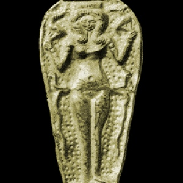

  
[Intangible Textual Heritage](../../index)  [Ancient Near
East](../index) 

------------------------------------------------------------------------

<table width="75%">
<colgroup>
<col style="width: 50%" />
<col style="width: 50%" />
</colgroup>
<tbody>
<tr class="odd">
<td width="50%" data-valign="TOP"></td>
<td width="50%" data-valign="CENTER"><h1 id="the-philistines" data-align="CENTER">The Philistines</h1>
<h4 id="their-history-and-civilization" data-align="CENTER">Their History and Civilization</h4>
<h2 id="by-r.a.s.-macalister" data-align="CENTER">by R.A.S. Macalister</h2>
<h4 id="section" data-align="CENTER">[1913]</h4></td>
</tr>
</tbody>
</table>

------------------------------------------------------------------------

[Contents](#contents)    [Start Reading](phc00)    [Page
Index](pageidx)    [Text \[Zipped\]](phc.txt.gz)

------------------------------------------------------------------------

This short monograph on the Philistines is one of the few on these
mysterious people. The Philistines may have been emmigrants from
Mycenean Greece, part of the 'Sea People' migrations of the 12th century
BCE. The Philistines occupied an area on the Mediterranian coast
approximately corresponding to the current Gaza strip. Note that the
ancient Philistines have no connection with the modern Palestinians: the
Philistines disappeared in the 5th century BCE.

We have no written texts in the original Philistine words except for a
few Hebrew loan-words. There is evidence that Philistine was an
Indo-European language. Later, they adopted Aramaic, a Semitic language.

The Philistines pop up in some of the most dramatic tales of the Bible.
Who can forget Samson tearing down the Philistine temple with his bare
hands? Or the ultimate long-odds battle: young David versus the
Philistine Goliath.

Macalister covers in some detail Philistine religion. The Philistines
fit into an ancient Near Eastern polytheistic religious complex. They
worshipped Canaanite deities such as Baal-zebub ('Lord of the Flies'),
the high Goddess Astarte, and Dagon, a merman fish-god who was also a
culture hero. When the Philistines stole the Ark of the Covenant, they
reputedly stashed it in the temple of Dagon at Ashod.

One of the more controversial parts of Macalister's thesis is that the
mysterious Phaistos disk was of Philistine origin. The provenance of the
disk has been established firmly in the basement of the Hagia Triada
site in southern Crete. Although this would be a tough sell today, it is
nice to have good line-reproductions of both sides of the disk, along
with an attempt to make a simple concordance of each sign. Macalister
does also include source texts for some of the classical mentions of the
Philistines.

J.B. Hare, October 1st, 2009.

------------------------------------------------------------------------

 [Title Page](phc00)  
[Preface](phc01)  
[Contents](phc02)  
[Chapter I. The Origin of the Philistines](phc03)  

### Chapter II. The History of the Philistines

[I. The Adventures of Wen-Amon among them](phc04)  
[II. Their Struggle with the Hebrews](phc05)  
[III. Their Decline and Disappearance](phc06)  

 

[Chapter III: The Land of the Philistines](phc07)  

### Chapter IV. The Culture of the Philistines

[I. Their Language](phc08)  
[II. Their Organization](phc09)  
[III. Their Religion](phc10)  
[IV. Their Place in History and Civilization](phc11)  

 

[Index](phc12)  
[Index of Scriptural References](phc13)  
