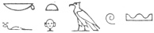
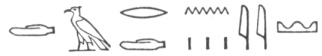

  
[Intangible Textual Heritage](../../index)  [Ancient Near
East](../index)  [Index](index)  [Previous](phc02)  [Next](phc04) 

------------------------------------------------------------------------

  
*The Philistines*, by R.A.S. Macalister, \[1913\], at Intangible Textual
Heritage

------------------------------------------------------------------------

p. 1

# THE PHILISTINES

### THEIR HISTORY AND CIVILIZATION

### CHAPTER I

### THE ORIGIN OF THE PHILISTINES

The Old Testament history is almost
exclusively occupied with Semitic tribes. Babylonians, Assyrians,
Canaanites, Hebrews, Aramaeans—all these, however much they might war
among themselves, were bound by close linguistic and other ties,
bespeaking a common origin in the dim, remote recesses of the past. Even
the Egyptians show evident signs of having been at least crossed with a
Semitic strain at some period early in their long and wonderful history.
One people alone, among those brought conspicuously to our notice in the
Hebrew Scriptures, impresses the reader as offering indications of alien
origin. This is the people whom we call 'Philistines'.

If we had any clear idea of what the word 'Philistine' meant, or to what
language it originally belonged, it might throw such definite light upon
the beginnings of the Philistine people that further investigation would
be unnecessary. The answer to this question is, however, a mere matter
of guess-work. In the Old Testament the word is regularly written
Pelištīm (‏פְּלִשְׁתִּים‎), singular Pelištī
(‏פְּלִשְׁתִּי‎), twice [1](#fn_1)
Pelištīyim (‏פְּלִשְׁתִּיִים‎), The territory which they
inhabited during the time of their struggles with the Hebrews is known
as ’ereṣ Pelištim (‏אֶרֶץ פְּלִשְׁתִּים‎) 'the Land of
Philistines', or in poetical passages, simply Pelešeth (‏פֶּלֶשֶׁת‎)
'Philistia'. Josephus regularly calls them Παλαιστινοί, except once, in
his version of the Table of Nations in Genesis x (*Ant*. I. vi. 2) where
we have the genitive singular Φυλιστίνου.

p. 2

Various conjectures as to the etymology of this name have been put
forward from time to time. One of the oldest, that apparently due to
Fourmont, [1](#fn_2) connects it with the
traditional Greek name Πελασγοί; an equation which, however, does no
more than move the problem of origin one step further back. This theory
was adopted by Hitzig, the author of the first book in modern times on
the Philistines, [2](#fn_3) Who connected the
word with Sanskrit valakṣa 'white', and made other similar comparisons,
as for instance between the name of the deity of Gaza, *Marna*, and the
Indian *Varuna*. On the other hand a Semitic etymology was sought by
Gesenius, [3](#fn_4) Movers, [4](#fn_5) and others, who quoted an Ethiopic verb
*falasa*, 'to wander, roam,' whence comes the substantive *fallási*, 'a
stranger.' In this etymology they were anticipated by the translators of
the Greek Version, who habitually render the name of the Philistines by
the Greek word ἀλλόφυλοι,  [5](#fn_6) even when
it is put into the mouths of Goliath or Achish, when speaking of
themselves. Of course this is merely an etymological speculation op the
part of the translators, and proves nothing more than the existence of a
Hebrew root (otherwise apparently unattested) similar in form and
meaning to the Ethiopic root cited. And quite apart from any questions
of linguistic probability, there is an obvious logical objection to such
an etymology. In the course of the following pages we shall find the
court scribes of Ramessu III, the historians of Israel, and the keepers
of the records of the kings of Assyria, agreeing in applying the same
name to the nation in question. These three groups of writers, belonging
to as many separate nations and epochs of time, no doubt worked
independently of each other—most probably in ignorance of each other's
productions. This being so, it follows almost conclusively that the name
'Philistine' must have been derived from Philistine sources, and in
short must have been the native designation. Now a word meaning
'stranger' or the like, while it might well be applied by foreigners to
a nation deemed by them

p. 3

intruders, would scarcely be adopted by the nation itself, as its chosen
ethnic appellation. This Ethiopic comparison it seems therefore safe to
reject. The fantasy that Redslob [1](#fn_7) puts
forward, namely, that ‏פלשׁת‎ 'Philistia' was an anagram for ‏שׁפלה‎,
the *Shephelah* or foot-hills of Judea, is perhaps best forgotten:
place-names do not as a rule come to be in this mechanical way, and in
any case 'the Shephelah' and 'Philistia' were not geographically
identical.

There is a peculiarity in the designation of the Philistines in Hebrew
which has often been noticed, and which must have a certain
significance. In referring to a tribe or nation the Hebrew writers as a
rule either (*a*) personified an imaginary founder, making his name
stand for the tribe supposed to derive from him—e. g. 'Israel' for the
Israelites; or (*b*) used the tribal name *in the singular*, with the
definite article—a usage sometimes transferred to the Authorized
Version, as in such familiar phrases as 'the Canaanite was then in the
land' (Gen. xii. 6); but more commonly assimilated to the English idiom
which requires a plural, as in 'the iniquity of the Amorite\[s\] is not
yet full' (Gen. xv. 16). But in referring to the Philistines, the
*plural* of the ethnic name is always used, and as a rule the definite
article is omitted. A good example is afforded by the name of the
Philistine territory above mentioned, ’ereṣ Pelištīm,
literally 'the land of Philistines': contrast such an expression as
’ereṣ hak-Kena‘anī, literally 'the land of the Canaanite'. A
few other names, such as that of the *Rephaim*, are similarly
constructed: and so far as the scanty monuments of Classical Hebrew
permit us to judge, it may be said generally that the same usage seems
to be followed when there is question of a people not conforming to the
model of Semitic (or perhaps we should rather say Aramaean) tribal
organization. The Canaanites, Amorites, Jebusites, and the rest, are so
closely bound together by the theory of blood-kinship which even yet
prevails in the Arabian deserts, that each may logically be spoken of as
an *individual* human unit. No such polity was recognized among the
pre-Semitic *Rephaim*, or the intruding Philistines, so that they had to
be referred to as an *aggregate* of human units. This rule, it must be
admitted, does not seem to be rigidly maintained; for instance, the name
of the pre-Semitic *Horites* might have been expected to follow the
exceptional construction. But a hard-and-fast adhesion to so subtle a
distinction, by all the writers who have contributed to the canon of the
Hebrew scriptures and by

p. 4

all the scribes who have transmitted their works, is not to be expected.
Even in the case of the Philistines the rule that the definite article
should be omitted is broken in eleven places. [1](#fn_8)

However, this distinction, which in the case of the Philistines is
carefully observed (with the exceptions cited in the footnote),
indicates at the outset that the Philistines were regarded as something
apart from the ordinary Semitic tribes with whom the Hebrews had to do.

The name of the Philistines, therefore, does not lead us very far in our
examination of the origin of this people. Our next step must be to
inquire what traditions the Hebrews preserved respecting the origin of
their hereditary enemies; though such evidence on a question of
historical truth must obviously even under the most favourable
circumstances be unsatisfactory.

The *locus classicus* is, of course, the table of nations in Genesis x.
Here we read (vv. 6, 13, 14), 'And the sons of Ham: Cush, and Mizraim,
and Put, and Canaan. . . And Mizraim begat Ludim, and ‘Anamim, and
Lehabim, and Naphtuhim, and Pathrusim, and Casluhim (whence went forth
the Philistines) and Caphtorim.' The list of the sons of Ham is assigned
to the Priestly source; that of the sons of Mizraim (distinguished by
the formula 'he begat') to the Yahvistic source. The ethnical names are
almost all problematical, and the part of special interest to us has
been affected, it is supposed, by a disturbance of the text.

So far as the names can be identified at all, the passage means that in
the view of the writer or writers who compiled the table of nations, the
Hamitic or southern group of mankind were Ethiopia, Egypt, 'Put', and
Canaan. Into the disputed question of the identification of the third of
these, this is not the place to enter. Passing over the children
assigned to Cush or Ethiopia, we come to the list of peoples supposed by
the Yahvist to be derived from Egypt. Who or what most of these peoples
were is very uncertain. The *Ludim* are supposed to have been Libyans
(*d* in the name being looked upon as an error for *b*); the *Lehabim*
are also supposed to be Libyans; the *‘Anamim* are unknown, as are also
the *Casluhim;* but the *Naphtuhim* and *Pathrusim* seem to be
reasonably identified with the inhabitants of Lower and Upper Egypt
respectively. [2](#fn_9)

p. 5

There remain the *Caphtorim*, and the interjected note 'whence went
forth the Philistines'. The latter has every appearance of having
originally been a marginal gloss that has crept into the text. And in
the light of other passages, presently to be cited, it would appear that
the gloss referred originally not to the unknown Casluhim, but to the
Caphtorim. It must, however, be said that all the versions, as well as
the first chapter of Chronicles, agree in the reading of the received
text, though emendation would seem obviously called for. This shows us
either that the disturbance of the text is of great antiquity, or else
that the received text is, after all, correct, and that the Casluhim are
to be considered a branch of, or at any rate a tribe nearly related to,
the Caphtorim.

The connexion of the Philistines with a place called Caphtor is
definitely stated in Amos ix. 7: 'Have not I brought up Israel out of
the land of Egypt, *and the Philistines from Caphtor*, and the Syrians
from Kir?' It is repeated in Jeremiah xlvii. 4, where the Philistines
are referred to as 'the remnant of the *’i* of Caphtor'. The word *’i*
is rendered in the Revised Version 'island', with marginal rendering
'sea coast': this alternative well expresses the ambiguity in the
meaning of the word, which does not permit us to assume that Caphtor, as
indicated by Jeremiah, was necessarily one of the islands of the sea.
Indeed, even if the word definitely meant 'island', its use here would
not be altogether conclusive on this point: an isolated headland might
long pass for an island among primitive navigators, and therefore such a
casual mention need not limit our search for Caphtor to an actual
island.

Again, in Deuteronomy ii. 23, certain people called the Caphtorim,
'which came out of Caphtor', are mentioned as having destroyed the
‘Avvim that dwelt in villages as far as Gaza, and established themselves
in their stead. The geographical indication shows that the Caphtorim
must be identified, generally speaking, with the Philistines: the
passage is valuable as a record of the name of the earlier inhabitants,
who, however, were not utterly destroyed: they remained in the south of
the Philistine territory (Joshua xiii. 4).

The question of the identification of Caphtor must, however, be
postponed till we have noted the other ethnic indications which the
Hebrew scriptures preserve. Chief of these is the application of the
word Cerēthi (‏כְּרֵתִי‎) 'Cherēthites' to this people or to
a branch of them.

Thus in 1 Samuel xxx. 14 the young Egyptian servant, describing the
Amalekite raid, said 'we raided the south of the Cherethites and

p. 6

the property of Judah and the south of the Calebites and burnt Ziklag
with fire'. In Ezekiel xxv. 16 the Philistines and the Cherethites with
the 'remnant of the sea-coast' are closely bound together in a common
denunciation, which we find practically repeated in the important
passage Zephaniah ii. 5, where a woe is pronounced on the dwellers by
the sea-coast, the nation of the Cherethites, and on 'Canaan, the land
of the Philistines'; this latter is a noteworthy expression, probably,
however, interpolated in the text. In both these last passages the Greek
version renders this word Κρῆτες 'Cretans '; elsewhere it simply
transliterates (Χελεθί, with many varieties of spelling). [1](#fn_10)

In both places it would appear that the name 'Cherethites' is chosen for
the sake of a paronomasia (‏כרת‎ = 'to cut off'). In the obscure
expression 'children of the land of the covenant' (‏בני אדץ הברית‎ Ezek.
xxx. 5) some commentators [2](#fn_11) see a
corruption of ‏בני הכרתי‎ 'Children of the Cherethites'. But see the
note, p. 123 *post*.

In other places the Cherethites are alluded to as part of the bodyguard
of the early Hebrew kings, and are coupled invariably with the name
‏פְּלֵתִי‎ Pelēthites. This is probably merely a modification of
‏פלשתי‎, the ordinary word for 'Philistine', the letter s being omitted
in order to produce an assonance between the two names. [3](#fn_12) The Semites are fond of such assonances:
they are not infrequent in modern Arab speech, and such a combination as
Shuppīm and Ḫuppīm (1 Chron. vii. 12) shows that they are to be looked
for in older Semitic writings as well. If this old explanation [4](#fn_13) be not accepted, we should have to put the
word 'Pelethites' aside as hopelessly unintelligible. Herodotus's
Philitis, or Philition, a shepherd after whom the Egyptians were alleged
to call the Pyramids, [5](#fn_14) has often been
quoted in connexion with this name, coupled with baseless speculations
as to whether the Philistines could have been the Hyksos.

p. 7

With regard to the syntax of these two names, it is to be noticed that
as a rule they conform to the ordinary Hebrew usage, contrary perhaps to
what we might have expected. But in the two prophetic passages we have
quoted, the name of the Cherethites agrees in construction with that of
the Philistines.

In three passages—2 Samuel xx. 23, 2 Kings xi. 4, 19—the name of the
royal body-guard of 'Cherethites' appears as ‏כָּרִי‎ 'Carians'. If this
happened only once it might be purely accidental, due to the dropping of
a ‏ת‎ by a copyist; but being confirmed by its threefold repetition, it
is a fact that must be noted carefully [1](#fn_15) for future reference.

Here the Hebrew records leave us, and we must seek elsewhere for further
light. Thanks to the discoveries of recent years, our search need not be
prolonged. For in the Egyptian records we find mention of a region whose
name, *Keftiu*, has an arresting similarity to the 'Caphtor' of Hebrew
writers. It is not immediately obvious whence comes the final *r* of the
latter, if the comparison be sound; but waiving this question for a
moment, let us see what is to be made of the Egyptian name, and, above
all, what indications as to its precise situation are to be gleaned from
the Egyptian monuments.

The name k-f-tïw ( )
sometimes written k-f-ty-w (
) first meets us on Egyptian monuments of the
Eighteenth Dynasty. It is apparently an Egyptian word: at least, it is
capable of being rendered behind', and assuming this rendering Mr. H. R.
Hall [2](#fn_16) aptly compares it with our
colloquialism 'the Back of Beyond'. Unless this is to be put aside as a
mere *Volksetymologie*, it clearly would be useless to search the maps
of classical atlases for any name resembling Keftiu. It would simply
indicate that the Egyptians had a sense of remoteness or uncertainty
about the position of the country; and even from this we could derive no
help, for as a rule they manifest a similar vagueness about other
foreign places.

It is specifically under Thutmose III that 'Keftiu' first appears as the
name of a place or a people. On the great stele in the Cairo Museum in
which the king's mighty deeds are summarized, in the form of a Hymn to
Amon, we read 'I came and caused thee to smite the west-land, and the
land of Keftiu and Asi ( )

p. 8

are terrified'. In the Annalistic Inscription on the walls of the Temple
of Karnak the name appears in interesting connexion with *maritime*
enterprise. 'The harbours of the king were supplied with all the good
things which he received in Syria, namely ships of Keftiu, Byblos, and
Sektu \[the last-named place is not identified\], cedar-ships laden with
poles and masts.' 'A silver vessel of Keftiu work' was part of the
tribute paid to Thutmose by a certain chieftain. [1](#fn_17) Keftiu itself does not send any tribute
recorded in the annals; but tribute from the associated land of Asi is
enumerated, in which copper is the most conspicuous item. This in itself
proves nothing, for the copper might in the first instance have been
brought to Asi from somewhere else, before it passed into the coffers of
the all-devouring Pharaoh: but on the Tell el-Amarna tablets a
copper-*producing* country, with the similar name Alašia, is prominent,
and as Cyprus was the chief if not the only source of copper in the
Eastern Mediterranean, the balance of probability seems to be in favour
of equating Asi and Alašia alike to Cyprus. In this case Keftiu would
denote some place, generally speaking, in the neighbourhood of Cyprus.

The next important sources of information are the wall-paintings in the
famous tombs of Sen-mut, architect to Queen Hatshepsut; of Rekhmara,
vizier of Thutmose III; and of Menkheperuseneb, son of the last-named
official, [2](#fn_18) high priest of Amon and
royal treasurer. In these wall-paintings we see processions of persons,
with non-Semitic European-looking faces; attired simply in highly
embroidered loincloths folded round their singularly slender waists, and
in high boots or gaiters; with hair dressed in a distinctly non-Semitic
manner; bearing vessels and other objects of certain definite types. The
tomb of Sen-mut is much injured, but the Cretan ornaments there drawn
are unmistakable. In the tomb of Rekhmara we see the official standing,
with five rows of foreigners carrying their gifts, a scribe recording
the inventory at the head of each row, and an inscription explaining the
scene as the 'Reception by the hereditary prince Rekhmara of the tribute
of the south country, with the

p. 9

tribute of Punt, the tribute of Retenu, the tribute of Keftiu, besides
the booty of all nations brought by the fame of Thutmose III'. In the
tomb of Menkheperuseneb there are again two lines of tribute-bearers,
described as 'the chief of Keftiu, the chief of Kheta, the chief of
Tunip, the chief of Kadesh'; and an inscription asserts that these
various chiefs are praising the ruler of the Two Lands, celebrating his
victories, and bringing on their backs silver, gold, lapis lazuli,
malachite, and all kinds of precious stones.

  [  
Click to enlarge](img/00900.jpg)  
(left) Fig. 1. A. A Keftian from the Tomb of Rekhmara. (right) B. A
Cretan from Knossos.  

Some minor examples, confirming the conclusions to which these three
outstanding tomb-frescoes point, will be found in W. Max Müller's
important paper, *Neue Darstellungen 'mykenischer' Gesandter . . . in
altägyptischen Wandgemälden* (Mitt. vorderas.-Gesell., 1904, No. 2).

Recent investigations in the island of Crete have enabled us to identify
with certainty the sources of the civilization which these messengers
and their gifts represent. Wall-paintings have there been found
representing people with the same facial type, the same costume, the
same methods of dressing the hair; and as it were the originals of the
costly vases they bear have been found in such profusion as to leave no
doubt that they are there on their native soil. The messengers, who are
depicted in the Egyptian frescoes, are introducing into Egypt

p. 10

some of the *chefs-d’œuvre* of Cretan art; specifically, art of the
periods known as Late Minoan I and II, [1](#fn_19) the time of the greatest glory of the
palace of Knossos; and as they are definitely described in the
accompanying hieroglyphs as messengers of Keftiu, it follows that Keftiu
was at least a centre of distribution of the products of Cretan
civilization, and therefore a place under the influence of Crete, if it
was not actually the island of Crete itself. And the clear evidence,
that excavation in Crete has revealed, of a back-wash of Egyptian
influence on Cretan civilization at the time of the coming to Egypt of
the Keftian envoys, turns the probability into as near a certainty as it
is at present possible to attain.

The next document to be noticed is a hieratic school exercise-tablet,
apparently (to judge from the forms of the script) dating from the end
of the Eighteenth Dynasty. It is now preserved in the British Museum,
numbered 5647. [2](#fn_20) On the one side are
some random scribbles, like the meaningless words and phrases with which
one tries a doubtful pen:

'The goddess Ubast—they are small, numerous—of precious things, when—his
majesty was seen, as he turned his face there was—for the feast day, one
jar of wine \[this line repeated\]—Ru-unti—Ru-dadama—Smdt-ty’ \[three
names\].

On the other side is

'To make names of Keftiu:

    Ašaḫurau  
    Nasuy  
    Akašou  
    Adinai  
    Pinaruta  
    Rusa  
    Sen-Nofer \[an Egyptian name, twice repeated\]  
    Akašou

"a hundred of copper, *aknu*-axes" \[reading uncertain\]

    Beneṣasira

\[two illegible names\]

    Sen-nofer  
    Sumrssu \[Egyptian\]'

\[paragraph continues\] Though the reading
of some of the items of this list is not quite certain, it seems clear
that the heading ’irt rn n keftw, 'to make names of Keftiu', indicates
that this tablet is a note of names to be used

p. 11

in some exercise or essay. The presence of the familiar Philistine name
Achish, in the form Akašou, twice over, is suggestive, but otherwise the
tablet does not help forward our present inquiry into the position of
Keftiu and the origin of the Philistine people.

These various discoveries of recent years make it unnecessary to discuss
at any length other theories which have been presented in ancient and
modern times as to the identification of the name of Keftiu or of
Caphtor. The Ptolemaic Jonathan Oldbuck who translated for his master
the *Decree of Canopus* into Hieroglyphics, revived this ancient
geographical name to translate Φοινίκης: a piece of irresponsible
pedantry which has caused nothing but confusion. Even before the
discoveries of the last fifteen or twenty years it was obvious that the
Keftiu of Rekhmara's tomb were as unlike Phoenicians as they could
possibly be; and their gifts were also incompatible with what was known
of Phoenician civilization. Endless trouble was thus given to would-be
harmonists. Another antiquary of the same kind and of the same period,
who drew up the inscription to be cut on the temple at Kom Ombo, has
likewise made illegitimate use of the name in question. A catalogue of
the places conquered by the founder of the temple, after the manner of
the records of achievements of the great kings of the Eighteenth
Dynasty, was *de rigueur:* so the obsequious scribe set down, apparently
at random, a list of any geographical names that happened to come into
his head. Among these is kptar, the final *r* of which seems to denote a
Hebrew source; perhaps he learnt the name from some brother antiquary in
the neighbouring Jewish colony at Aswân.

The Greek translators of the scriptures, the Peshitta, and the Targums,
in Deuteronomy ii. 23, Amos ix. 7, render the name *Cappadocia*. This
seems to be merely a guess, founded on similarity of sound.

In modern times, even before the days of scientific archaeology, the
equation of Caphtor to *Crete* has always been the theory most in
favour. Apart from Jeremiah's description of the place as an
'island'—which as we have already mentioned is not quite conclusive—the
obvious equation Cherethites = Cretans would strike any student.
Calmet [1](#fn_21) gives a good statement of the
arguments for the identification which were available before the age of
excavation.

For completeness’ sake we may refer here to various other theories of
Philistine origin which have been put forward by modern scholars: it is,
however, not necessary to give full references

p. 12

to all the writers who have considered the question. The favourite
hypothesis among those who rejected the Caphtor-Crete identification was
founded on the Greek Version and Josephus: Caphtor was by them
identified with Cappadocia, and Casluhim with the Colchians. Hitzig, as
stated earlier in this chapter, identified them with the Pelasgians, who
came, according to his view, from Crete to North Egypt, identified with
the Casluhim of the Table of Nations: their language he supposed to be
cognate with Sanskrit, and by Sanskrit he interpreted many of the names
of people and places. Quatremère, reviewing Hitzig's book in the
*Journal des Savants* (1846, pp. 257, 411), suggested a rival theory,
deriving them from West Africa, equating Casluhim with Sheluḫ, a sept of
the Berbers. Stark (Gaza, p. 70) assigned them to the Phoenicians,
accepting the South Semitic etymology of the name Pelištim, Caphtor
being the Delta, and Casluhim a name cognate with the Kasios mountain,
denoting a tribe living between Kasios and Pelusium. [1](#fn_22) Köhler [2](#fn_23)
had a complicated theory to reconcile all the various lines of Biblical
evidence: he took Caphtor to be the Delta; the Philistines springing
from there settled in Casluhim (between Casios and Pelusium): 'going
forth' from Casluhim they sailed to Crete, and then returned to
Philistia. Knobel (*Die Völkertafel der Genesis*, p. 215 sqq.) proposed
a double origin for the Philistine people. The main body he took to be
*Semites* who came out (geographically, not racially) from the Casluhim
in North Egypt; and the Caphtorim were a southern tribe of Cretan or
Carian origin. Knobel gave a very careful analysis of the evidence
available at his time, but he overlooked the Medinet Habu sculptures,
and, on the other hand, gave too much weight to the gossip of Herodotus
about Philitis and the Pyramids.

Ebers [3](#fn_24) made an elaborate attempt to
find in the Delta a site for Caphtor; but this can hardly stand against
later discoveries. They are no goods from the Land of Goshen which
Rekhmara's visitors are carrying. W. Max Müller [4](#fn_25) equates Keftiu to Cilicia, mainly on the
ground of the order in which the name occurs in geographical lists: but
though this is not an argument to be lightly set aside, we are
confronted with the difficulty that Cilicia could hardly have been a
centre of distribution of Minoan goods in the time of Rekhmara. [5](#fn_26)

p. 13

Schwally [1](#fn_27) argues thus for the Semitic
origin of the Philistines: that if the Philistines were immigrants, so
were the Phoenicians and Syrians (*teste* Amos): that the identity of
Caphtor and Crete is an unproved assumption: the Greek translation twice
renders 'Cherethites' by 'Cretans', it is true, but not elsewhere,
showing uncertainty on the subject: and the reading 'Crete' in Zephaniah
ii. 6 is wrong. All the personal names, and all the place-names (except
possibly El-tekeh and Ziklag) are Semitic, and there is no trace of any
non-Semitic deity. Stade [2](#fn_28) asserts the
Semitic origin of the people, without giving any very definite proofs;
Tiele [3](#fn_29) claims the Philistines as
Semites on the ground of their Semitic worship. Beecher (in Hastings's
*Dict. of the Bible*, s. v. Philistines) claims the name of the people
as 'probably Semitic', but considers that most likely they were
originally Aryan pirates who had become completely Semitized. The
non-circumcision of the Philistines is a difficulty against assigning to
them a Semitic origin; and the various Semitic elements in their names,
religion, and language can most reasonably be explained by
borrowing—presumably as a result of free intermarriage with Semites or
Semitized aborigines.

On the other hand, it may be said at once that it is perhaps a little
premature to call them Aryans. On the whole, the probability seems to be
against the Philistine being an Aryan tongue—it certainly was not, if
(as is not unlikely) it had affinities with Etruscan.

But these identifications are to a large extent the personal opinions of
those who put them forward. The identification of Caphtor and Keftiu
with Crete is so generally accepted, that there is a danger that some
difficulties in the way should be overlooked. For first of all we are
met with a question of philology: whence came the final *r* in the
Hebrew word? It has been suggested that it might be a nominative suffix
of the Keftian language. It would in any case be more probably a
locative or prepositional suffix: for place-names are apt to get taken
over into foreign languages in one or other of those cases, because they
are generally referred to in contexts that require them; just as Ériu,
the old Irish name of Ireland, has been taken over into English in its
prepositional case, now spelt *Erin*. It might possibly be a plural: Mr.
Alton has suggested to me a comparison with the Etruscan plural ending
*er*, *ar*, *ur*. Letting the question of the exact case pass, however,
as irrelevant, there are two points that must be indicated regarding the
suggestion that *r* is

p. 14

a Keftian case-ending. In the first place, it assumes that Keftiu is,
after all, not the Egyptian word it resembles, but the native 'Keftian'
name for the place in question: it is incompatible with the 'Back of
Beyond' theory of the meaning of the name. In the second place, it is
difficult to understand how the Hebrews should have picked up a
'Keftian' case-ending or any such grammatical formative, rather than the
Egyptians; for the Egyptians were brought into direct contact with
Keftians, while the Hebrews arrived on the scene too late to enjoy that
advantage. Ebers attempted to solve the difficulty by supposing the *r*
to come from the Egyptian adjective *wr*, 'great', tacked on to the
place-name. Max Muller (*Asien und Europa*, p. 390) and Wiedemann
(*Orient. Litteraturzeitung*, xiii, col. 49) point out that there is no
monumental evidence for such an expression, and that in any case 'Great
Keftland' would be Keft-‘ā, not Keft-*wr*. The latter (loc. cit.) has an
ingenious solution: in an astronomical text in the grave of Ramessu VI
occurs a list of places ‘iwmȝr (the land of the Amorites) pb
(unidentified) and   kftḥr
('Upper Kefti'). 'Caphtor', he suggests, may be a corruption of this
latter expression. The hypothesis may be noted in passing, though
perhaps it is not altogether convincing.

Behind this problem lies another, perhaps equally difficult: why did the
Hebrews call the home-land of the Philistines by this name, which even
in Egypt was already obsolete?

To this question the only reasonable answer that seems to present itself
is to the effect that by the time of the Hebrews Crete or Keftiu had,
with its gorgeous palaces, passed into tradition. Like the I Breasail or
Avallon of Celtic tradition, the place which the Hebrew writers called
'Caphtor' was no longer a tangible country, but a dreamland of folklore,
the legends of which had probably filtered into Palestine from Egypt
itself. Whether Caphtor was or was not the same as the island of Crete
was to the ancient Hebrew historian a question of secondary interest
beside the all-important practical fact that the Philistines were
obstinate in their occupation of the most desirable parts of the
Promised Land. When the inspired herdsman of Tekoa spoke of the
Philistines being led from Caphtor, he was probably just as unconscious
of the requirements of the scientific historian as a modern herdsman who
told me that a certain ancient monument on a Palestinian hill-slope
belonged 'to the time of the Rūm'. He no doubt believed what he said:
but who or what the Rūm may have been, or how many years or centuries

p. 15

or geological aeons ago they may have flourished, he neither knew nor
cared.

All, then, that the Hebrews can tell us about their hereditary enemies
is, that they came from a vague traditional place called Caphtor—a place
by the sea, but of which they have nothing more to say. The tradition of
Caphtor seems to be a tradition of the historical glories of Crete, so
far as the Egyptians knew of them, and the name seems to be a tradition
of the name which, for some reason not certainly known, the Egyptians
applied to the source of the desirable treasures of the Cretan
civilization.

Even down to late times the tradition linking Philistia with Crete
persisted in one form or another. Tacitus heard it, though in a
distorted form: in the oft-quoted passage *Hist*. v. 2 he confuses the
Jews with the Philistines, and makes the former the Cretan
refugees. [1](#fn_30) ΜΕΙΝΩ, Minos, is named on
some of the coins of Gaza. This town was called by the name Minoa: and
its god Marna was equated to 'Zeus the Crete-born.' [2](#fn_31)

But did the Philistines come from Crete? That is the question which we
must now consider.

The last generation saw the labours of Schliemann at Troy and elsewhere,
and was startled by the discovery of the splendid pre-Hellenic
civilization of Mycenae. For us has been reserved the yet greater
surprise of finding that this Mycenaean age was but the latest, indeed
the degenerate phase of a vastly older and higher culture. Of this
ancient civilization Crete was the centre and the apex.

The course of civilization in this island, from the end of the Neolithic
period onwards, is divided by Sir Arthur Evans into three periods [3](#fn_32) which he has named Early, Middle, and Late
'Minoan' respectively, after the name of Minos the famous legendary
Cretan king. Each of these three periods is further divided into
subordinate

p. 16

periods, indicated by numbers; thus we have Early Minoan I, II, III, and
so for the others. The general characters of these nine periods may now
be briefly stated, with the approximate dates which Egyptian
synchronisms enable us to assign.

Into the question of the origin of the early inhabitants of Crete we
need not enter. That there was some connexion between Crete and Egypt in
their stone-age beginnings seems on various grounds to be not
improbable. [1](#fn_33) The neolithic Cretan
artists were much like neolithic artists elsewhere. They never succeeded
in attaining a very high position among workers in flint; Crete has so
far produced nothing comparable with the best work of the Egyptians and
the Scandinavians. Their pottery was decorated with incised or pricked
patterns filled in with white powdered gypsum, to make a white pattern
on a black ground.

The *Early Minoan I* period inherited this type of ornament and ware
from its predecessors, but improved it. Coloured decoration now began to
be used, the old incised ornaments being imitated with a wash of paint.
The ornament was restricted to simple geometrical patterns such as
zigzags. The pottery was made without the wheel. In this period short
triangular daggers in copper are found. In *Early Minoan II* the designs
are more free and graceful: simple curves appear, side by side with
straight lines, towards the end of the period. The potter's wheel is
introduced. Rude and primitive idols in marble, alabaster, and steatite
are found. The copper daggers are likewise found, but the use of flint
and obsidian is not yet wholly abandoned. In *Early Minoan III* there is
not much advance in the art of the potter. We now, however, begin to
find seals with a kind of hieroglyphic signs upon them, apparently
imitated (in manner if not in matter) from Egyptian seals. These seem to
give us the germ of the art of writing, as practised later in Crete.
Scholars differ (between 2000 and 3000 B.C.) as to the proper date to
assign to the end of the Early Minoan civilization: for our present
purpose it is not important to discuss the causes of disagreement, or to
attempt to decide between these conflicting theories.

The next period, *Middle Minoan I*, takes a great step forward. We now
begin to find polychrome decoration in pottery, with elaborate
geometrical patterns; we also discover interesting attempts to picture
natural forms, such as goats, beetles, &c. Upon the ruins of this stage
of development, which seems to have been checked by some catastrophe,
are founded the glories of *Middle Minoan II*, the period of the great
palace of Phaestos and of the first palace of

p. 17

\[paragraph continues\] Knossos. To this
period also belongs the magnificent polychrome pottery called Kamáres
ware. Another catastrophe took place: the first palace of Knossos was
ruined, and the great second palace built in its place: and the period
known as *Middle Minoan III* began. It was distinguished by an intense
realism in art, speaking clearly of a rapid deterioration in taste. In
this period we find the pictographic writing clearly developed, with a
hieratic or cursive script derived from it, adapted for writing with pen
and ink. The Middle Minoan period came to an end about 1600 B.C.

*Late Minoan I* shows a continuation of the taste for realism. Its
pottery is distinguished from that of the preceding period by the
convention that its designs as a rule are painted dark on a light
background: in *Middle Minoan III* they are painted light on a dark
background. Linear writing is now developed. The palace of Phaestos is
rebuilt. Fine frescoes and admirable sculptured vases in steatite are
found in this period, to which also belong the oldest remains at
Mycenae, namely the famous gold deposits in the shaft tombs. In *Late
Minoan II* the naturalistic figures become conventionalized, and a
degeneration in art sets in which continues into *Late Minoan III*. The
foreign imports found at Tell el-Amarna and thus of the time of
Ikhnaton, are all of *Late Minoan III;* this affords a valuable hint for
dating this phase of development.

Now while some of the earlier periods shade into one another, like the
colours of a rainbow, so that it is difficult to tell where the one ends
and the next begins, this is not the case of the latest periods, the
changes in which have evidently been produced by violence. The chief
manifestation is the destruction of Knossos, which took place,
apparently as a result of invasion from the mainland, at the very end of
the period known as Late Minoan II: that is to say about 1400 B.C. The
inferior style called Late Minoan III—the style which till recent years
we had been accustomed to call Mycenaean—succeeded at once and without
any intermediate transition to the style of Late Minoan II immediately
after this raid. It was evidently the degraded style that had developed
in the mainland among the successful invaders, founded upon (or, rather,
degenerated from) works of art which had spread by way of trade to the
adjacent lands, in the flourishing days of Cretan civilization.

We have seen that in Egyptian tombs of about 1500 B.C. there are to be
seen paintings of apparently Cretan messengers and merchants, called by
the name of *Keftiu*, bearing Cretan goods: and in addition we find the
actual tangible goods themselves, deposited with the Egyptian dead. In
Palestine and elsewhere occasional scraps of

p. 18

the 'palace' styles come to light. But the early specimens of Cretan art
found in these regions are all exotic, just as (to quote a parallel
often cited in illustration) the specimens of Chinese or Japanese
porcelain exhibited in London drawing-rooms are exotic; and they affect
but little the inferior native arts of the places where they are found.
It is not till we reach the beginning of Late Minoan III, after the sack
of Knossos, that we find Minoan culture actually taking root in the
eastern lands of the Mediterranean, such as Cyprus and the adjacent
coasts of Asia Minor and Syria. We can hardly dissociate this phenomenon
from the sack of Knossos. The very limitations of the area over which
the 'Mycenaean' art has been found are enough to show that its
distribution was not a result of peaceful trade. Thus, the Hittite
domination of Central and Western Asia Minor was still strong enough to
prevent foreign settlers from establishing themselves in those
provinces: in consequence Mycenaean civilization is there absent. The
spread of the debased Cretan culture over Southern Asia Minor, Cyprus,
and North Syria, between 1400 and 1200 B.C. must have been due to the
movements of peoples, one incident in which was the sack of
Knossos [1](#fn_34): and this is true, whether
those who carried the Cretan art were refugees from Crete, or were the
conquerors of Crete seeking yet further lands to spoil.

In short, the sack of Knossos and the breaking of the Cretan power was
an episode—it may be, was the crucial and causative episode—in a general
disturbance which the fourteenth to the twelfth centuries B.C. witnessed
over the whole Eastern Mediterranean basin. The mutual relations of the
different communities were as delicately poised as in modern Europe: any
abnormal motion in one part of the system tended to upset the balance of
the whole. Egypt was internally in a ferment, thanks to the
eccentricities of the crazy dilettante Ikhnaton, and was thus unable to
protect her foreign possessions; the nomads of Arabia, the Sutu and
Habiru, were pressing from the South and East on the Palestinian and
Syrian towns; the dispossessed Cretans were crowding to the neighbouring
lands on the north; the might of the Hittites, themselves destined to
fall to pieces not long afterwards, blocked progress northward: it is
little wonder that disorders of various kinds resulted from the
consequent congestion.

It is just in this time of confusion that we begin to hear, vaguely at
first, of a number of little nationalities—people never definitely

p. 19

assigned to any particular place, but appearing now here, now there,
fighting sometimes with, sometimes against, the Egyptians and their
allies. And what gives these tribelets their surpassing interest is the
greatness of the names they bear. The unsatisfying and contemptuous
allusions of the Egyptian scribes record for us the 'day of small
things' of people destined to revolutionize the world.

We first meet these tribes in the Tell el-Amarna letters. The king of
Alašia (Cyprus) complains that his coasts are being raided by the
*Lukku*, who yearly plunder one small town after another. [1](#fn_35) That indefatigable correspondent,
Rib-Addi, in two letters, complains that one Biḫura has sent people of
the Sutu to his town and slain certain *Sherdan* men—apparently Egyptian
mercenaries in the town guard. [2](#fn_36) In a
mutilated passage in another letter Rib-Addi mentions the *Sherdan*
again, in connexion with an attempt on his own life. Then Abi-Milki
reports [3](#fn_37) that 'the king of *Danuna*
is dead, and his brother has become king after him, and his land is at
peace'. It is almost the only word of peace in the whole dreary Tell
el-Amarna record.

Next we hear of these tribes in their league with the Hittites against
Ramessu II, when he set out to recover the ground lost to Egypt during
the futile reign of Ikhnaton. [4](#fn_38) With
the Hittites were allied people from

|                                                 |                |
|-------------------------------------------------|----------------|
|   | Rk\[w\]        |
|   | Drdnw          |
|   | M\[ȝ\]św       |
|   | Mȝwnw or irwnw |
|   | Pdśw           |
|   | Ḳrḳš           |

This was in 1333 B.C. On the side of Ramessu fought mercenaries called
Šȝrḍȝhȝ ( ) no doubt the

p. 20

\[paragraph continues\] *Sherdan* of whom
we have heard already in the Tell el-Amarna letters. These people were
evidently ready to sell their services to whomsoever paid for them, for
we find them later operating *against* their former Egyptian masters.

About thirty years later, when Merneptah was on the throne, there was a
revolt of the Libyans, and with many allies from the 'Peoples of the
Sea' they proceeded to attack Egypt. Though the Philistines do not
actually appear among the names of the allies, the history of this
invasion is one of the most important in the *origines* of that
remarkable people. The details are recorded in four inscriptions set up
by the king after his victory over the invaders, one of which
inscriptions is the famous 'Israel' stela.

The first inscription is that of the temple of Karnak, a translation of
which will be found in Breasted's *Ancient Records*, vol. iii, p. 241.
This inscription begins with a list of the allied enemies:

|                                                 |            |
|-------------------------------------------------|------------|
|   | ȝkw\[ȝ\]šw |
|   | Tršw       |
|   | Rkw        |
|   | Šrdnw      |
|   | Škršw      |

\[paragraph continues\] The beginning of
the inscription is lost, but the list is probably complete, as in the
sequel, where the allied tribes are referred to more than once, no other
names are mentioned.

Merneptah, after extolling his own valour and the military preparations
he had made, tells us how he had received news that   (Maraiwi or something similar)
'the miserable chief of Libya', with his allies aforesaid, had come with
his family to the western boundary of Egypt. Enraged like a lion, he
assembled his officers and to them expressed his opinion of the invaders
in a way that leaves nothing to the imagination. 'They spend their time
going about and fighting to fill their bellies day by day: they come to
Egypt to seek the needs of their mouths: their chief is like a dog,
without courage . . . .' Some of the vigorous old king's expressions
have been bowdlerised by the hand of Time, which has

p. 21

deprived us of a course of the inscribed masonry of the temple but
notwithstanding we have an admirable description of restless sea-rovers,
engaged in constant plunder and piracy. Then Merneptah, strengthened by
a vision of his patron Ptah which appeared to him in the night, led out
his warriors, defeated the Libyans—whose 'vile fallen chief' justified
Merneptah's opinion of him by fleeing, and, in the words of the official
report of the Egyptian general to his master, 'he passed in safety by
favour of the night . . . all the gods overthrew him for the sake of
Egypt: his boasting is made void: his curses have come to roost: no one
knows if he be alive or dead, and even if he lives he will never rule
again. They have put in his place a brother of his who fights him
whenever he sees him'. The list of slain and captives is much mutilated,
but is of some importance. For the slain were reckoned by cutting off
and counting the phalli of circumcised, the hands of uncircumcised
victims. [1](#fn_39) From the classification we
see that at the time of the victory of Merneptah, the Libyans were
circumcised, while the Shardanu and Shekelesh and Ekwesh, as we may
provisionally vocalize the names, were not circumcised. The inscription
ends with the flamboyant speech of Merneptah to his court, and their
reply, over which we need not linger. Nor do the other inscriptions
relating to the event add anything of importance for our present
purpose.

About a hundred years later we meet some of these tribes again, on the
walls of the great fortified temple of Medinet Habu near Thebes, which
Ramessu III, the last of the great kings of Egypt, built to celebrate
the events of his reign. These events are recorded in sculptured scenes,
interpreted and explained by long hieroglyphic inscriptions. It is
deplorable that the latter are less informing than they might have been:
we grudge bitterly the precious space wasted in grovelling compliments
to the majesty of the victorious monarch, and we would have gladly
dispensed with the obscure and would-be poetical style which the writer
of the inscription affected. [2](#fn_40)

Ramessu III came to the throne about 1200 B.C. [3](#fn_41) Another Libyan invasion menaced the land
in his fifth year, but the energetic monarch, who had already been
careful to organize the military resources of Egypt, was successful in
beating it back. War-galleys

p. 22

from the northern countries, especially the *Purasati* and the
*Zakkala*, accompanied the invading Libyans; but this latter element in
the assault was only a foretaste of the yet more formidable attack which
they were destined to make on Egypt three years later—that is to say,
roughly about 1192 B.C.

The inscription describing this war is engraved on the second pylon of
the temple of Medinet Habu. Omitting a dreary encomium of the Pharaoh,
with which it opens, and a long hymn of triumph with which it ends, we
may confine our attention to the historical events recorded in the
hieroglyphs, and pictured in the representations of battles that
accompany them. The inscription records how the Northerners were
disturbed, and proceeded to move eastward and southward, swamping in
turn the land of the Hittites, Carchemish, Arvad, Cyprus, Syria, and
other places in the sane region. We are thus to picture a great
southward march through Asia Minor, Syria, and Palestine. Or, rather, we
are to imagine a double advance, by land and by sea: the landward march,
which included two-wheeled ox-carts for the women and children, as the
accompanying picture indicates; and a sea expedition, in which no doubt
the spare stores would be carried more easily than on the rough Syrian
roads. Clearly they were tribes accustomed to sea-faring who thus
ventured on the stormy Mediterranean; clearly too, it was no mere
military expedition, but a migration of wanderers accompanied by their
families and seeking a new home. [1](#fn_42)

The principal elements in the great coalition are the following:

|                                                 |                      |
|-------------------------------------------------|----------------------|
|   | Šrdnw                |
|   | Duynw                |
|   | Prśtw                |
|   | Tȝkrw                |
|   | W\[ȝ\]ššw of the Sea |

as well as the Škršȝw, of which we have heard in previous documents.

'With hearts confident and full of plans', as the inscription says, they
advanced by land and by sea to Egypt. But Ramessu was ready to 'trap
them like wild-fowl'. He strengthened his Syrian

p. 23

frontier, and at the same time fortified the harbours or river mouths
'with warships, galleys, and barges'. The actual battles are not
described, though they are pictured in the accompanying cartoons: but
the successful issue of these military preparations is graphically
recorded. 'Those who reached my boundary,' says the king, 'their seed is
not: their heart and their soul are finished for ever and ever. As for
those who had assembled before them on the sea . . . they were dragged,
overturned, and laid low upon the beach: slain and made heaps from end
to end of their galleys, while all their things were cast upon the
water.'

The scenes in which the land and naval engagements are represented are
of great importance, in that they are contemporary records of the
general appearance of the invaders and of their equipment. The naval
battle, the earliest of which any pictorial record remains, is
graphically portrayed. We see the Egyptian archers sweeping the crews of
the invading vessels almost out of existence, and then closing in and
finishing the work with their swords; one of the northerners’ vessels is
capsized and those of its crew who swim to land are taken captive by the
Egyptians waiting on the shore. In later scenes we see the prisoners
paraded before the king, and the tale of the victims—counted by
enumerating the hands chopped off the bodies.

The passage in the great Harris Papyrus, which also contains a record of
the reign of Ramessu III, [1](#fn_43) adds very
little to the information afforded us by the Medinet Habu inscription.
The 'Danaiuna' are there spoken of as islanders. We are told that the
Purasati and the Zakkala were 'made ashes', while the Shekelesh (called
in the Harris Papyrus *Shardani*, who thus once more appear *against*
Egypt) and the Washasha were settled in strongholds and bound. From all
these people the king claims to have levied taxes in clothing and in
grain.

As we have seen, the march of the coalition had been successful until
their arrival in Egypt. The Hittites and North Syrians had been so
crippled by them that Ramessu took the opportunity to extend the
frontier of Egyptian territory northward. We need not follow this
campaign, which does not directly concern us: but it has this indirect
bearing on the subject, that the twofold ravaging of Syria, before and
after the great victory of Ramessu, left it weakened and opened the door
for the colonization of its coast-lands by the beaten remnant of the
invading army.

Ramessu III died in or about 1167 B.C., and the conquered tribes

p. 24

began to recover their lost ground. For that powerful monarch was
succeeded by a series of weak ghost-kings who disgraced the great name
of Ramessu which, one and all, they bore. More and more did they become
puppets in the hands of the priesthood, who cared for nothing but
enriching the treasures of their temples. The frontier of Egypt was
neglected. Less than a hundred years after the crushing defeat of the
coalition, the situation was strangely reversed, as one of the most
remarkable documents that have come down to us from antiquity allows us
to see. This document is the famous Golénischeff papyrus, now at St.
Petersburg. But before we proceed to an examination of its contents we
must review the Egyptian materials, which we have now briefly set forth,
a little more closely.

The names of the tribes, with some doubtful exceptions, are easily
equated to those of peoples living in Asia Minor. We may gather a list
of them out of the various authorities which have been set out above,
adding to the Egyptian consonant-skeleton a provisional vocalization,
and remembering that *r* and *l* are interchangeable in Egyptian:

|      |                        |                |            |                |                |
|------|------------------------|----------------|------------|----------------|----------------|
|      |                        | Tell el-Amarna | Ramessu II | Merneptah      | Ramessu III    |
|      |                        | *c*. 1400 B.C. | 1333 B.C.  | *c*. 1300 B.C. | *c*. 1198 B.C. |
| 1\.  | Lukku                  | X              | X          | X              | \-             |
| 2\.  | Sherdanu               | X              | X          | X              | X              |
| 3\.  | Danunu                 | X              | \-         | \-             | X              |
| 4\.  | Dardanu                | \-             | X          | \-             | \-             |
| 5\.  | Masa                   | \-             | X          | \-             | \-             |
| 6\.  | Mawuna *or* Yaruna (?) | \-             | X          | \-             | \-             |
| 7\.  | Pidasa                 | \-             | X          | \-             | \-             |
| 8\.  | Kelekesh               | \-             | X          | \-             | \-             |
| 9\.  | Ekwesh                 | \-             | \-         | X              | \-             |
| 10\. | Turisha                | \-             | \-         | X              | \-             |
| 11\. | Shekelesh              | \-             | \-         | X              | X              |
| 12\. | Pulasati               | \-             | \-         | \-             | X              |
| 13\. | Zakkala                | \-             | \-         | \-             | X              |
| 14\. | Washasha               | \-             | \-         | \-             | X              |

An X denotes 'present in', a - 'absent from' the lists. The majority of
these fourteen names too closely resemble names known from classical
sources for the resemblance to be accidental. It will be found that
almost every one of these names can be easily identified with the name
of the coast dwellers of Asia Minor; and *vice versa*, with one
significant exception, the coast-land regions of Asia Minor are all to
be found in recognizable forms in the Egyptian lists. The -*sha* or
-*shu* termination is to be neglected as an ethnic formative.

Thus, beginning with the Hellespont, the Troas is represented in the *Turisha*, who have
been correctly identified with the future Tyrrhenians (Tursci) as are the *Pulasati* with
the future Philistines.

p. 25

\[paragraph continues\] Dardanus in the Troad is represented by the
*Dardanu*. They are the carriers of the Trojan traditions to
Italy. [1](#fn_44) Mysia is represented by the *Masa*, Lydia by
the *Sherdanu* from the town of Sardis.
These are the future Sardinians. And the
more inland region of Maeonia is echoed
in the *Mawuna*, if that be the correct reading. We now come to a gap:
the Carians, at the S.V. corner of Asia Minor, do not appear in any
recognizable form in the list, except that the North Carian town of
Pedasus seems to be echoed by the
*Pidasa*. To this hiatus we shall return presently. The Lycians are conspicuous as the *Lukku*.

The name of the sea-coast region of Pamphylia is clearly a later
appellation, expressive of the variety of tribes and nationalities which
has always characterized the Levant coast. The inland Pisidian town of
Sagalassus finds its echo in the
*Shekelesh*. The Cilicians are
represented by the *Kelekesh*, and this brings us to the corner between
Asia Minor and North Syria.

The only names not represented in the foregoing analysis are the
*Danunu*, *Ekwesh*, and the three tribes which first appear in the
Ramessu III invasion, the *Pulasati*, *Zakkala*, and *Washasha*. The
first two of these, it is generally agreed, are to be equated to the
Danaoi and the Achaeans [2](#fn_45)—the first appearance in historic record of
these historic names. The latter do not appear in the Ramessu III lists:
there were no Achaeans in the migration from Asia Minor. The *Pulasati*
are unquestionably to be equated to the future Philistines, north of whom we find later the
*Zakkala* settled on the Palestinian coast. The *Washasha* remain
obscure, both in origin and fate; but a suggestion will be made
presently regarding them. They can hardly have been the ancestors of the
Indo-European Oscans.

The various lines of evidence which have been set forth in the preceding
pages indicate Crete or its neighbourhood as the probable land of origin
of this group of tribes. They may be recapitulated:

\(1\) The Philistines, or a branch of them, are sometimes called
Cherethites or Cretans.

\(2\) They are said to come from Caphtor, a name more like Keftiu than
anything else, which certainly denotes a place where the Cretan
civilization was dominant.

p. 26

\(3\) The hieratic school-tablet mentions 'Akašou' as a Keftian name: it
is also Philistine \[Achish\].

To this may be added the important fact that the Phaestos disk, the
inscription on which will be considered later in this book, shows us
among its signs a head with a plumed head-dress, very similar to that
shown on the Philistine captives represented at Medinet Habu.

We must not, however, forget the fact at which we paused for a moment,
that thrice the Philistine guard of the Hebrew kings are spoken of as
the Carians; and that the Carians are not otherwise represented in the
lists of Egyptian invaders. We are probably not to confine our search
for the origin of the Zakkala-Philistine-Washasha league to Crete alone:
the neighbouring strip of mainland coast probably supplied its
contingent to the sea-pirates. The connexion of Caria with Crete was
traditional to the time of Strabo; 'the most generally received account
is that the Carians, then called Leleges, were governed by Minos, and
occupied the islands; then removing to the continent, they obtained
possession of a large tract of sea-coast and of the interior, by driving
out the former occupiers, who were for the greater part Leleges and
Pelasgi.' [1](#fn_46) Further, he quotes
Alcaeus's expression, 'shaking a Carian crest,' which is suggestive of
the plumed head-dress of the Philistines. Again, speaking of the city
Caunus, on the shore opposite Rhodes, he tells us that its inhabitants
'speak the same language as the Carians, came from Crete, and retained
their own laws and customs' [2](#fn_47)—which,
however, Herodotus [3](#fn_48) contradicts.
Herodotus indeed (*loc. cit.*) gives us the same tradition as Strabo
regarding the origin of the Carians: they

'had come from the islands to the continent. For being subjects of
Minos, and anciently called Leleges, they occupied the islands without
paying any tribute, so far as I can find by inquiring into the remotest
times; but whenever Minos required them, they manned his ships; and as
Minos subdued an extensive territory, and was successful in war, the
Carians were by far the most famous of all nations in those times. They
also introduced three inventions which the Greeks have adopted; *of
fastening crests on helmets*, putting devices on shields, and putting
handles on shields. . . . After a long time the Dorians and Ionians
drove the Carians out of the islands and so they came to the continent.
This is the account that the Cretans give of the Carians, but the
Carians do not admit its correctness, considering themselves to be
autochthonous inhabitants of the continent . . . and in testimony of
this they show an ancient temple of Zeus Carios at Mylasa.'

p. 27

If then by the Pulasati we are to fill in the hiatus in the list of Asia
Minor coast-dwellers, the most reasonable explanation of the name is
after all the old theory that it is to be equated with *Pelasgi*. And if
the worshippers of Zeus Carios settled in Palestine, they might be
expected to bring their god with them and to erect a temple to him. Now
we read in 1 Samuel vii, that the Philistines came up against the
Israelites who were holding a religious ceremony in Mizpah; that they
were beaten back by a thunderstorm, and chased in panic from Mizpah to a
place called Beth-Car (v. 11). We may suppose that the chase stopped at
Beth-Car because it was within Philistine territory; but unfortunately
all the efforts to identify this place, not otherwise known, have proved
futile. Very likely it was not an inhabited town or village at all, but
a sanctuary: it was raised on a conspicuous height (for the chase
stopped *under* Beth-Car): and the name means House of Car, [1](#fn_49) as Beth-Dagon means House or Temple of
Dagon. This obscure incident, therefore, affords one more link to the
chain.

If the Cretans and the Carians together were represented by
Zakkala-Pulasati-Washasha league, we might expect to find some elements
from the two important islands of Rhodes and Carpathos, which lie like
the piers of a bridge between Crete and the Carian mainland. And I think
we may, without comparisons too far-fetched, actually find such
elements. Strabo tells us [2](#fn_50) that a
former name of Rhodes was *Ophiussa:* and we can hardly avoid at least
seeing the similarity between this name and that of the Washasha. [3](#fn_51) And as for *Carpathos*, which Homer calls
Crapathos, is it too bold to hear in this classical name an echo of the
pre-Hellenic word, whatever it may have been, which the Egyptians
corrupted to Keftiu, and the Hebrews to Caphtor? [4](#fn_52)

What then are we to make of the name of the *Zakkala* or *Zakkara?* This
has hitherto proved a crux. Petrie identifies it with Zakro in
Crete [5](#fn_53); but as has several times been
pointed out regarding this identification, we do not know how old the
name Zakro may be. As we have seen that all the other tribes take their
name

p. 28

from the coasts of Asia Minor, it is probable that the Zakkala are the
Cretan contingents to the coalition: and it may be that in their name we
are to see the interpretation of the mysterious *Casluhim* of the Table
of Nations [1](#fn_54) (‏כסלחים‎ being a mistake
for ‏סכל׳‎). The most frequently suggested identification, with the
Teucrians (assigned by Strabo on the
authority of Callinus to a Cretan origin), is perhaps the most
satisfactory as yet put forward; notwithstanding the just criticism of
W. Max Müller [2](#fn_55) that the double *k*
and the vowel of the first syllable are difficulties not to be lightly
evaded. Clerinont-Ganneau [3](#fn_56) would
equate them to a Nabatean Arab tribe, the Δαχαρηνοί, mentioned by
Stephanus of Byzantium; but, as Weill [4](#fn_57) points out, it is highly improbable that
one of the allied tribes should have been Semitic in origin; if the
similarity of names be more than an accident, it is more likely that the
Arabs should have borrowed it.

The conclusion indicated therefore is that the Philistines were a people
composed of several septs, derived from Crete and the southwest corner
of Asia Minor. Their civilization, probably, was derived from Crete, and
though there was a large Carian element in their composition, they may
fairly be said to have been the people who imported with them to
Palestine the memories and traditions of the great days of Minos.

------------------------------------------------------------------------

### Footnotes

[1:1](phc03.htm#fr_1) In Amos ix. 7 and in the
Kethībh of 1 Chron. xiv. 10. The almost uniform rendering of the Greek
version (Φυλιστιείμ) seems rather to favour this orthography. The
spelling of the first syllable, Φυ, shows, however, that the modern
punctuation with the *shva* is of later growth, and that in the time of
the Greek translation the pronunciation still approximated rather to the
form of the name as it appears in Egyptian monuments (Purasati).

[2:1](phc03.htm#fr_2) *Réflexions critiques sur
l’origine, l’histoire et la succession des anciens peuples* (1747), ii.
254.

[2:2](phc03.htm#fr_3) F. Hitzig, *Urgeschichte
and Mythologie der Philister*, Leipzig, 1845.

[2:3](phc03.htm#fr_4) Gesenius, *Thesaurus*,
*s.v.*

[2:4](phc03.htm#fr_5) Movers, *Untersuchungen
über die Religion and die Gottheiten der Phönizier* (1841), vol. i, p.
9.

[2:5](phc03.htm#fr_6) Except (*a*) in the
Hexateuch, where it is always transliterated Φυλιστιείμ, sometimes
Φυλιστιίμ or Φιλιστιείμ; (*b*) in Judges x. 6, 7, 11, xiii. 1, 5, xiv.
2, where again we find the word transliterated: in some important MSS.
however, including Codex Alexandrinus, ἀλλόφυλοι, is used in these
passages; (*c*) in Isa. ix. 11 (English ix. 12, where we find the
curious rendering Ἕλληνας, possibly indicating a variant reading in the
text that lay before the translators.

[3:1](phc03.htm#fr_7) *Die alttest. Namen der
Bevölkerung*, p. 4; adopted by Arnold in *Ersch and Gruber's
Encyclopaedia*, s. v. *Philister*.

[4:1](phc03.htm#fr_8) Namely Joshua xiii. 2; 1
Sam. iv. 7, vii. 12, xiii. 20, xvii. 51, 52; 2 Sam. v. 19, xxi. 12, 17;
1 Chron. xi. 13; 2 Chron. xxi. 16.

[4:2](phc03.htm#fr_9) For fuller particulars see
Skinner's *Commentary on Genesis* (pp. 200–214). Sayce finds *Caphtor
and Kasluhet* on an inscription at Kom Ombo: see Hastings's
*Dictionary*, s. v. Caphtor; and Man, 1903, No. 77. But see also Hall's
criticisms, ib. No. 92.

[6:1](phc03.htm#fr_10) Such are Χαρρι, Χαρεθθι,
Χελθι, Χελθει, Χελβει, Χελβες, Χελεμα, Χελεθθι, Χελλεθι, Χελεθιι,
Χελεθοι, Χελοθθι, Χολθει, Χολλεθι, Χορεθι, Χορεθθει, Χορρι, Χορρει,
Χερεθει, Χερηθει, Χερετ, Χερεθθει, Χερεθιν, Χερεοι, Χωρι, Χερηθη,
Χερηθει, Χετθει, Χεττει, Οχελεθθι, Οχερεπι, Οχελβι, Χκελμι, Οχελεθ,
Ρεθθι. The Pelethites appear under equally strange guises: Φελετι,
Φελτι, Φελτει, Φελετιι, Φελεττει, Φελεθθι, Φελεθθιι, Φελεθθει, Φελετθει,
Φελελεθθι, Ουπετ, Οχετ, Οφελτι, Οφελθι, Οφελεθθιι, Οφελετθει, Ωφελεθθει,
Οπελθι, Οπελεθιν, Οπερετ, Πελεβι, Οθεθιι, Χετταιοις.

[6:2](phc03.htm#fr_11) Cornill, *Das Buch des
Proph. Ezek.* p. 368, followed by Toy, *Ezekiel* (in Sacred Books of O.
T.), p. 88.

[6:3](phc03.htm#fr_12) Possibly the instinct for
triliteralism may also have been instrumental in the evolution of this
form.

[6:4](phc03.htm#fr_13) It is given in
Lakemacher, *Observationes Philologicae* (1729), ii. 38, and revived by
Ewald in his *Kritische Grammatik der hehrläischen Sprache* (1827), p.
297.

[6:5](phc03.htm#fr_14) Hdt. ii. 128.

[7:1](phc03.htm#fr_15) The Greek version has
Χερεθί in the first of these passages, in the others Χορρι with a number
of varieties of spelling, Χορρει, Χοριν, &c., all of them showing *o* as
the first vowel.

[7:2](phc03.htm#fr_16) *Journal of the British
School at Athens*, viii (1901-2), p. 157.

[8:1](phc03.htm#fr_17) The name of this
chieftain's land is mutilated (*tyn’y*). Mr. Hall (*op. cit.* p. 167,
*Oldest Civilisation of Greece*, p. 163) restores *Yantanay*, and
renders 'Cyprus'. W. Max Müller compares with this name the word
*Adinai*, found in the List of Keftian names given on p. 10.

[8:2](phc03.htm#fr_18) For these tombs see Hall,
*British School at Athens*, vol. x (1903–4), p. 154, and *Proc. Soc.
Bib. Arch.* xxxi, Plate XVI \[Sen-mut\]; Wilkinson, *Manners and Customs
of the Ancient Egyptians*, i, Plate II, AḄ. \[Rekhmara\]; Virey,
*Mémoires de la mission en Caire*, v, p. 7 \[Rekhmara\], p. 197 ff
\[Menkheperuseneb\]. In the last-named, Keftiu is translated and indexed
'Phénicie'.

[10:1](phc03.htm#fr_19) See the brief summary of
the various stages of Cretan culture during the Bronze Age, later in the
present chapter.

[10:2](phc03.htm#fr_20) See Spiegelberg,
*Zeitschrift fur Assyriologie* (1893), viii. 385 (where the text is
published incompletely), and W. Max Müller in *Mittheilungen der
vorderasiatischen Gesellschaft*, vol. v, p. 6, where facsimiles will be
found.

[11:1](phc03.htm#fr_21) *Dissertations qui
peuvent servir de prolegomenes de l’écriture sainte* (1720), II. ii, p.
441.

[12:1](phc03.htm#fr_22) A place which, as has
often been noticed, has the same radicals as the name of the
Philistines.

[12:2](phc03.htm#fr_23) *Lehrbuch d. bibl.
Geschichte*, vol. i.

[12:3](phc03.htm#fr_24) *Aegypten and des Buch
Mose*, p. 127 ff.

[12:4](phc03.htm#fr_25) *Asien and Europa*, p.
337.

[12:5](phc03.htm#fr_26) An elaborate refutation
of the Cilician hypothesis will be found in Noordtzij, *De Filistijnen*,
p. 31.

[13:1](phc03.htm#fr_27) *Zeitschr. für
wissensch. Theologie*, xxxiv (1891), p. 103.

[13:2](phc03.htm#fr_28) *Gesch. des Volk. Isr.*
i. 142.

[13:3](phc03.htm#fr_29) *Geschiedenis van den
Godsdienst in de Oudheid*, i. pp. 214, 241.

[15:1](phc03.htm#fr_30) 'Iudaeos Creta Insula
profugos nouissima Libyae insedisse memorant, qua tempestate Saturnus ui
Iouis pulsus cesserit regnis.'

[15:2](phc03.htm#fr_31) Stephanus of Byzantium,
s. v. ….

[15:3](phc03.htm#fr_32) The bare outline
statement, which is all that is necessary here, can be supplemented by
reference to any of the numerous books that have appeared recently on
the special subject of Cretan excavation: such as Professor Burrows's
pleasantly. written work entitled *The Discoveries in Crete* (London,
Murray, 1907), which contains a most useful bibliography.

[16:1](phc03.htm#fr_33) See Hall, *Proc. Soc.
Biblical Archaeology*, xxxi, pp. 144–148.

[18:1](phc03.htm#fr_34) Other causes were at
work producing the same result of restlessness among the peoples. Thus
Mr. Alton suggests to me that the collapse of the island of Thera must
have produced a considerable disturbance of population in the
neighbouring lands.

[19:1](phc03.htm#fr_35) *T.A. Letters*, ed.
Winckler, No. 28; ed. Knudtzon, No. 38.

[19:2](phc03.htm#fr_36) ib. W. 77, K. 123. See
also W. 100.

[19:3](phc03.htm#fr_37) ib. W. 151, K. 151.

[19:4](phc03.htm#fr_38) For an exhaustive study
of the great battle of Kadesh between Ramessu and the united tribes, see
Breasted, The Battle of Kadesh (Univ. of Chicago Decennial Publications,
Ser. I, No. 5.

[21:1](phc03.htm#fr_39) See W. Max Müller's
important note in *Proc. Soc. Bib. Arch.* x, pp. 147–154, where reasons
are given against the exactly opposite interpretation, followed by 1
many authorities (e. g. Breasted, *Ancient Records*). On the other hand
the contrary practice seems to be indicated by 1 Sam. xviii. 25. The
difficulty of rendering lies in the fact that we have to deal with
Egyptian words not found elsewhere.

[21:2](phc03.htm#fr_40) See Breasted, *Ancient
Records*, iv, pp. 1–85.

[21:3](phc03.htm#fr_41) Petrie says 1202,
Breasted 1198.

[22:1](phc03.htm#fr_42) The details of these
sculptures are more fully described later in this book.

[23:1](phc03.htm#fr_43) Breasted, *op. cit.* p.
201.

[25:1](phc03.htm#fr_44) Turisha has also been
identified with the Cilician town of Tarsus.

[25:2](phc03.htm#fr_45) With reservations: see
Weill, *Revue archéologique, sér.* IV, vol. iii, p. 67. And even the
identification of the Danaoi is uncertain. It is at least improbable
that Rib-Addi of Tyre, in the letter quoted above, should report on the
peacefulness of so remote a people as the Danaoi.

[26:1](phc03.htm#fr_46) Strabo, XIV. ii. 17.

[26:2](phc03.htm#fr_47) Strabo, xiv. ii. 3.

[26:3](phc03.htm#fr_48) i. 17–1.

[27:1](phc03.htm#fr_49) Βαιθχόρin the Greek
Version (in some MSS. -κορ). Cf. the first footnote on p. 7.

[27:2](phc03.htm#fr_50) xiv. ii. 7.

[27:3](phc03.htm#fr_51) Hall looks for the
Washasha in Crete, and finds them in the name of the Cretan town Ϝάξος
\[*Oldest Civilization of Greece*, p. 177\]. But if this comparatively
obscure Cretan name were really represented in the Egyptian lists, we
might reasonably look for the more important names to appear also. The
name appears (in the form *Oašašios*) in an inscription from
Halicarnassus: see Weill in *Revue archéologique*, sér. IV, vol. iii, p.
63.

[27:4](phc03.htm#fr_52) Baur, *Amos*, p. 79, has
already suggested this identification.

[27:5](phc03.htm#fr_53) *Proc. Soc. Bib. Arch.*,
1941, p. 41.

[28:1](phc03.htm#fr_54) Gen. x. 14.

[28:2](phc03.htm#fr_55) *Mittheil. der corderas.
Gesellschaft*, v, p. 3. On *Teucer* see Frazer, *Adonis, Allis, Osiris*,
p. 112.

[28:3](phc03.htm#fr_56) *Recueil d’Archéologie
orientale*, iv. 230.

[28:4](phc03.htm#fr_57) *loc. cit.* p. 64.

------------------------------------------------------------------------

[Next: I. The Adventures of Wen-Amon among them](phc04)

