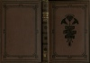

  
[Intangible Textual Heritage](../../../index)  [Ancient Near
East](../../index)  [Records of the Past](../index) 
[Egypt](../../../egy/index)  [Index](index)  [Next](rp20101) 

------------------------------------------------------------------------

  
*Records of the Past, 2nd series, Vol. I*, ed. by A. H. Sayce, \[1888\],
at Intangible Textual Heritage

------------------------------------------------------------------------

# RECORDS OF THE PAST

##### BEING ENGLISH TRANSLATIONS

###### OF THE

##### ANCIENT MONUMENTS OF EGYPT AND WESTERN ASIA

##### NEW SERIES

## EDITED BY A. H. SAYCE.

### VOL. I

#### LONDON

#### SAMUEL BAGSTER AND SONS, LIMITED

#### 15 PATERNOSTER ROW

#### \[1888\]

Scanned, proofed and formatted at Intangible Textual Heritage by John
Bruno Hare, October 2008. This text is in the public domain in the US
because it was published prior to 1923.

 
[  
Click to enlarge](img/cover.jpg)  
Cover  

  [  
Click to enlarge](img/title.jpg)  
Title Page  

------------------------------------------------------------------------

[Next: Preface](rp20101)
